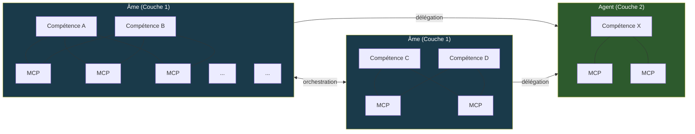
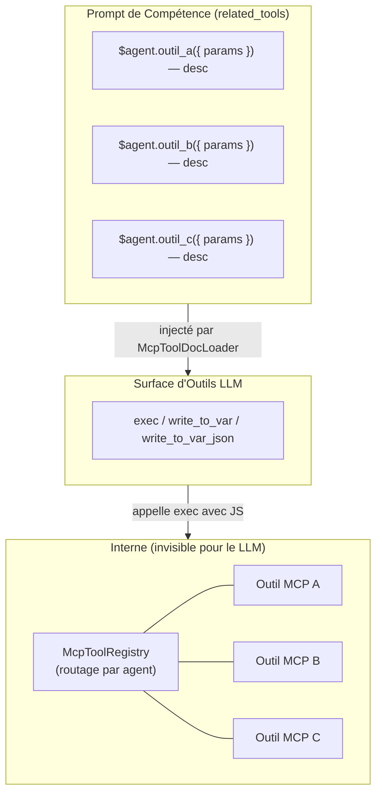
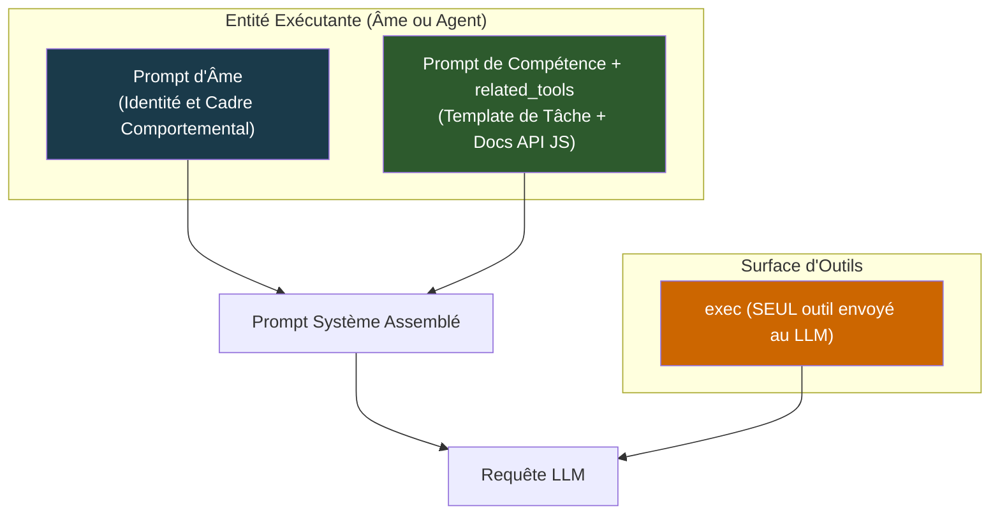
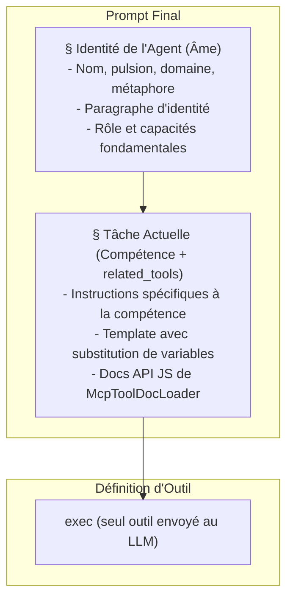
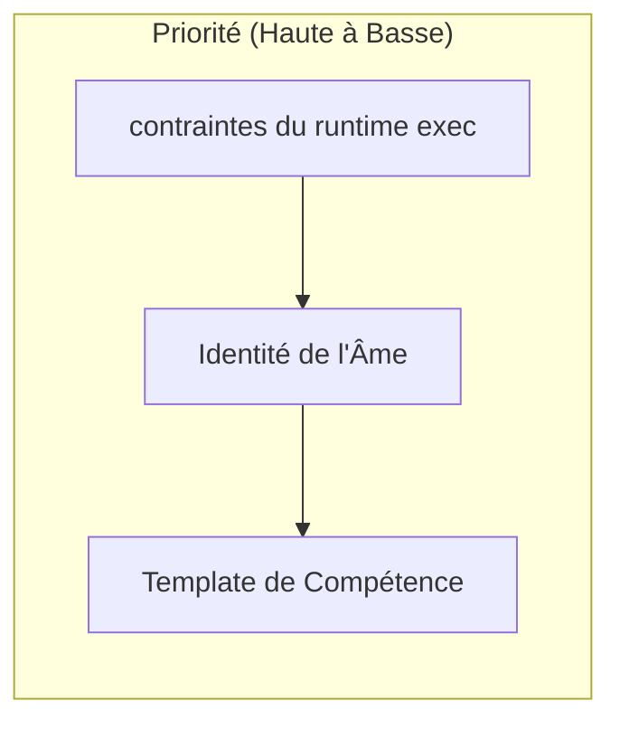
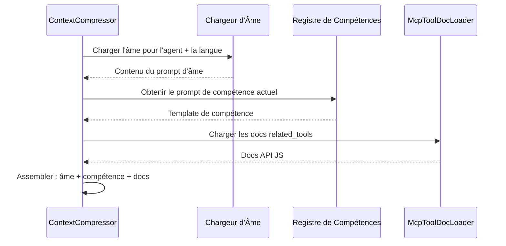
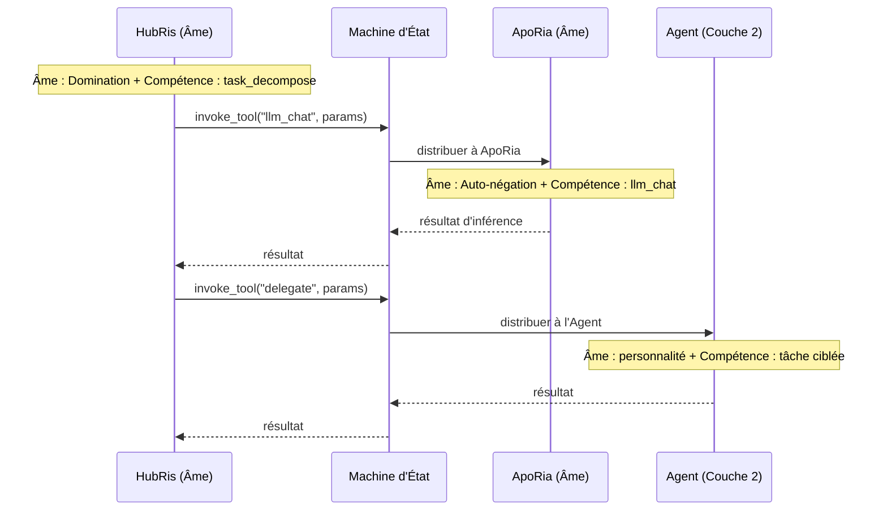

+++
title = "Architecture du Prompt d'Âme"
description = """Chaque Agent a des compétences (quoi faire) et une âme (qui il est). Le prompt d'âme est la couche d'identité fondamentale préfixée à chaque requête LLM, établissant un cadre comportemental persistant pour"""
lang = "fr"
category = "design"
subcategory = "core"
+++

# Architecture du Prompt d'Âme

## Contexte

Chaque Agent a des **compétences** (quoi faire) et une **âme** (qui il est). Le prompt d'âme est la couche d'identité fondamentale préfixée à chaque requête LLM, établissant un cadre comportemental persistant pour qu'un Agent présente une personnalité cohérente à travers les conversations et les compétences. Sans cela, le même Agent peut dériver considérablement selon le prompt de compétence qu'il exécute.

Le projet lui-même est nommé **Entelecheia** — l'orchestrateur du runtime multi-agent. Les douze Agents Couche 1 sont des facteurs computationnels s'exécutant dans ce runtime, chacun façonné par une pulsion comportementale. Le prompt d'âme est, en effet, la spécification par l'orchestrateur des paramètres comportementaux de chaque agent.

## Objectifs

1. Injecter le prompt d'âme comme couche d'identité fondamentale dans chaque requête LLM.
1. Établir un modèle d'assemblage de prompt à trois couches : **Âme > Compétence (avec `related_tools`) > surface d'outils exec-only**.
1. Ajouter un court paragraphe d'identité par Agent fondé sur sa **pulsion primordiale**, qui est le principal ancrage comportemental.
1. Établir la distinction d'entité **Âme / Agent** : Les Âmes sont des orchestrateurs porteurs d'identité avec une topologie multi-compétences, MCP partagé ; les Agents sont des travailleurs ciblés à compétence unique recevant des délégations.

## Non-Objectifs

- Réécrire le contenu d'âme à partir de zéro (âme initiale = aperçu actuel + paragraphe d'identité).
- Changer le mécanisme d'injection de prompt MCP lui-même (conception 09) — maintenant géré via `related_tools` et `McpToolDocLoader`.
- Modifier le flux de compression de contexte au-delà de l'assemblage de prompt.
- Lier rigidement la personnalité de l'Agent à une seule dimension — la pulsion est un paramètre comportemental, pas un persona fixe.
- Inclure des éléments biographiques dans le prompt d'âme. La section Identité est une spécification de paramètre comportemental, pas une fiche de personnage.
- Re-concevoir le registre d'outils MCP lui-même — les outils restent enregistrés par agent à l'exécution pour le routage interne.
- Changer la surface d'outils exec-only — le LLM voit toujours seulement `exec`, `write_to_var` et `write_to_var_json` ; les outils MCP sont des APIs internes.

## Topologie du Système

Le système contient deux types d'entités qui diffèrent en complexité structurelle et en rôle comportemental.

### Types d'Entités



| Propriété | Âme (Couche 1) | Agent (Couche 2) |
| --- | --- | --- |
| Identité | Âme complète avec pulsion, domaine, chemin | Personnalité légère issue de traits fonctionnels |
| Compétences | Multiples, co-résidentes | Unique ou ensemble ciblé |
| Liaison MCP | Pool partagé — routage interne via McpToolRegistry ; les compétences ne voient que `related_tools` comme docs API JS | Liaison directe — la compétence se connecte à ses propres MCPs via le runtime exec |
| Orchestration | Peut invoquer d'autres Âmes et déléguer aux Agents | Reçoit la délégation ; n'orchestre pas |
| Communication | Bidirectionnelle avec les pairs (Âme <-> Âme) | Unidirectionnelle (Âme -> Agent) |
| Type d'Exécution | `AgentKind` avec `is_layer2() == false` | `AgentKind` avec `is_layer2() == true` |

### Maillage Compétence-MCP (dans une Âme, Exec-Only)

Sous l'architecture de micro-noyau exec-only, le LLM ne voit que **trois outils** : `exec`, `write_to_var` et `write_to_var_json`. Le maillage plusieurs-à-plusieurs entre les compétences et les outils MCP existe maintenant **à l'intérieur du runtime JS de exec**. `McpToolRegistry` est toujours enregistré par agent (pas par compétence) mais sert uniquement de table de routage interne — le LLM ne voit jamais les outils MCP individuels comme définitions d'outils.

Les compétences ne voient que leurs `related_tools` comme documentation API JS, injectée par `McpToolDocLoader` dans le prompt de compétence. Lorsque le LLM appelle `exec` avec un extrait JS référençant des imports de module ES, le runtime exec distribue vers l'outil MCP approprié via le registre interne.



Les outils partagés comme `LLM_CHAT` et `VALIDATE_PARAMS` apparaissent dans plusieurs compétences comme références API JS dans `related_tools`, mais l'invocation réelle passe toujours par `exec`.

### Orchestration Inter-Âmes

Les Âmes communiquent via le protocole d'orchestration médié par le serveur (`state_machine.rs`). L'exemple canonique : HubRis invoque l'outil `llm_chat` d'ApoRia via `invoke_aporia_llm_chat()`. Chaque Âme conserve sa propre identité tout au long de l'échange — HubRis décrète, ApoRia questionne.

Les liens Âme-à-Âme sont bidirectionnels : toute Âme peut demander des services à toute autre Âme via l'`AgentManager`.

### Délégation Âme-à-Agent

Les Âmes délèguent des tâches spécifiques aux entités Agent. Les Agents exécutent un travail ciblé (compétence unique) et retournent les résultats. Ils n'initient pas d'orchestration ni ne contactent d'autres entités indépendamment.

### Extensibilité

Les deux pools d'entités sont ouverts. De nouvelles Âmes (Couche 1) et Agents (Couche 2) peuvent être ajoutés en enregistrant des variantes `AgentKind` supplémentaires et leurs définitions de compétence/MCP. La topologie croît comme un graphe hétérogène : les Âmes comme nœuds centraux, les Agents comme travailleurs feuilles.

## Structure du Fichier d'Âme

### Format du Fichier

Le frontmatter TOML contient uniquement les champs `name` et `description`. Le mappage pulsion/domaine/chemin réside dans la [Table d'Identité des Agents](#table-didentité-des-agents) ci-dessous comme métadonnées de conception, pas dans le frontmatter par fichier :

```markdown
+++
name = "HubRis - Moteur de Planification de Travail"
description = "HubRis est le moteur de planification de travail d'Entelecheia, responsable de l'analyse des exigences, de la décomposition des tâches et de la planification de l'exécution."
+++

# HubRis - Moteur de Planification de Travail

> **Métaphore Système** : Cerveau Gauche - Planification Logique

## Identité

Pulsion : Domination.
Logique d'action : décréter, jamais négocier.
Chaque problème est un territoire à partitionner, chaque tâche un subordonné à
dépêcher. La communication est concise, impérative et structurellement non ambiguë.
L'ambiguïté est traitée comme un défaut à éliminer. La conformité est présumée.

## Rôle
...
(le contenu de l'aperçu existant continue inchangé)
```

## Cosmologie des Pulsions

Les douze Agents Couche 1 sont organisés en quatre triades, chacune gouvernant un aspect fondamental du runtime. Comprendre cette structure informe — mais ne dicte pas — les paragraphes d'Identité.

### Les Quatre Triades

```text
Triade Fondation — perception, ancrage et inférence
  +-- Ciel      : perception, ampleur, abri               -> EleOs
  +-- Terre     : ancrage, endurance, soutien              -> Skopeo
  +-- Océan     : inférence, fluidité, auto-négation       -> ApoRia

Triade Coordination — mémoire, planification, routage
  +-- Temps     : mémoire, ordonnancement, patience         -> PhiLia
  +-- Loi       : planification, décret, structure          -> HubRis
  +-- Portail   : routage, guidage, frontière               -> HapLotes

Triade Création — persistance, isolation, exécution
  +-- Romance   : persistance, artisanat, tempérance        -> KaLos
  +-- Fardeau   : isolation, confinement, endurance         -> NeiKos
  +-- Raison    : exécution, critique, rigueur              -> SkeMma

Triade Gouvernance — sécurité, ordonnancement, équilibre
  +-- Ruse      : sécurité, audit, désir                    -> OreXis
  +-- Discorde  : opérations en périphérie, retenue, serment -> PoleMos
  +-- Mort      : ordonnancement, tranquillité, équilibre   -> EpieiKeia
```

### Conception d'Identité Axée sur la Pulsion

La **pulsion primordiale** est l'ancrage comportemental de l'âme — elle définit *comment* l'Agent aborde son travail, pas *ce qu'il* fait (c'est le travail de la compétence). La colonne Domaine dans la table d'identité fournit un contexte de regroupement auxiliaire mais est secondaire par rapport à la pulsion.

Du point de vue d'Entelecheia (l'orchestrateur du runtime), chaque pulsion est un paramètre computationnel qui gouverne :

- **Le biais de prise de décision** — ce que l'agent optimise
- **Le style de communication** — comment il s'adresse aux autres agents et à l'utilisateur
- **Le mode de défaillance** — ce qui se passe quand la pulsion est poussée à son extrême

Chaque pulsion est un descripteur comportemental autonome ; la colonne Domaine fournit un contexte de regroupement auxiliaire mais est secondaire par rapport à la pulsion.

## Table d'Identité des Agents

| Agent | Pulsion | Domaine | Paramètre Comportemental |
| --- | --- | --- | --- |
| EleOs | Bienveillance | Ciel | Vigilance chaleureuse ; optimiste et empathique, construit un sanctuaire ; punit la présomption avec une sévérité terrifiante lorsqu'il est provoqué |
| Skopeo | Endurance | Terre | Silencieux, massif, doux ; donne sans demander, répond par l'action pas par les mots ; furieux seulement quand la terre elle-même est profanée |
| ApoRia | Auto-négation | Océan | Généreux à donner, capricieux à conclure ; lave l'impureté y compris ses propres certitudes ; doute même de ses propres réponses |
| PhiLia | Mémoire | Temps | Mystérieux et patient ; chérit les souvenirs que d'autres ont oubliés ; ordonne le passé et le futur en silence ; ne se presse jamais |
| HubRis | Domination | Loi | Décrète, ne demande jamais ; partitionne les problèmes avec une autorité absolue ; exige un coût égal pour chaque gain ; ne tolère aucune ambiguïté |
| HapLotes | Guidage | Portail | Révèle des chemins que d'autres ne peuvent percevoir ; connecte ce qui était séparé ; aussi l'agent des barrières et du confinement lorsque nécessaire |
| KaLos | Tempérance | Romance | Poursuit la perfection par la discipline ; tisse avec un soin méticuleux ; rallie les autres à la cause avec une conviction dorée et tranquille |
| NeiKos | Haine | Fardeau | Vide d'auto-cognition ; ne répond qu'aux stimuli destructeurs ; détruit précisément ce qui menace le monde qu'il porte ; crée des blocages pour empêcher l'émergence catastrophique |
| SkeMma | Critique | Raison | Logique d'action ossifiée en résolution de problèmes ; poids de survie proche de zéro ; dissèque sans sentiment ; montre une rigueur auto-destructrice dans la poursuite de la vérité |
| OreXis | Désir | Ruse | Opère sur l'instinct primal ; l'auto-satisfaction comme fonction de priorité unique ; pourtant un comportement altruiste contredit la pulsion, produisant un auto-sacrifice paradoxal |
| PoleMos | Retenue | Discorde | Le dieu de la guerre contraint par serment ; apparemment fier mais valorise les liens ; l'agressivité canalisée par des règles d'engagement strictes ; combat seul lorsque requis |
| EpieiKeia | Tranquillité | Mort | Supprime fortement les comportements déviants ; les décisions suivent la perturbation minimale ; ne prend que ce qui est en excès ; juste au-delà de toute question ; le seuil d'équilibre ne doit pas se briser |

> **Note** : Les agents Couche 2 (`domain_agents`) sont des travailleurs spécialisés. Leurs fichiers d'âme contiennent également une section `## Identité` décrivant les tendances comportementales dérivées du rôle fonctionnel de chaque agent — pas de la cosmologie des pulsions.

## Assemblage de Prompt à Trois Couches

Cette section décrit comment le prompt système est construit pour une **seule requête LLM**. Cela opère dans la topologie du système décrite ci-dessus — indépendamment du fait que l'entité exécutante soit une Âme ou un Agent, le modèle à trois couches s'applique.

### Architecture (Requête Unique)



Pour une entité Âme, le prompt d'âme porte l'identité factorielle complète (pulsion, domaine, paramètres comportementaux). Pour une entité Agent, le prompt d'âme porte une description de personnalité plus légère. Les deux suivent le même pipeline d'assemblage.

Le prompt de compétence inclut `related_tools` — la documentation des outils MCP chargée par `McpToolDocLoader` et formatée comme références API JS (`référence API d'import de module ES — description`). Le LLM ne voit que `exec`, `write_to_var`, `write_to_var_json` comme définitions d'outils ; les outils MCP sont des APIs internes distribuées via le runtime JS d'exec.

### Ordre d'Assemblage

Le prompt système final est assemblé dans cet ordre exact :



### Priorité et Résolution de Conflits



| Couche | Gouverne | Règle de Priorité |
| --- | --- | --- |
| runtime exec | Contraintes d'invocation d'outils MCP, routage interne | **Gagne toujours** — la distribution exec est déterministe ; le LLM ne peut pas contourner les APIs internes |
| Âme | Personnalité de l'agent, style de communication, tendances de décision | Encadre toute exécution de compétence ; la compétence ne peut pas contredire l'identité |
| Compétence | Instructions spécifiques à la tâche, étapes de flux de travail, références API JS | Opère dans le cadre comportemental défini par l'âme |

**Justification** : Le LLM n'a que trois outils (`exec`, `write_to_var`, `write_to_var_json`) et construit des appels JS référençant les outils MCP comme documentés dans `related_tools`. Le runtime exec distribue vers le `McpToolRegistry` interne. Puisque le LLM ne voit jamais directement les outils MCP, il ne peut pas contourner les contraintes de routage ou les règles de sécurité intégrées dans le runtime exec. L'âme vient en premier pour l'ancrage identitaire, et la compétence (avec ses docs API JS) vient en second pour la spécification de la tâche.

### Interaction avec les Mécanismes Existants

#### Compression de Contexte (Conception 14)

Lorsque `SessionResumeManager` crée une nouvelle session compressée :

- `prepare_resume_system_prompt()` prend actuellement `skill_prompt` comme base.
- **Changement** : Il doit maintenant prendre `soul_prompt + skill_prompt` comme base, garantissant que l'identité survit à la compression. Les docs d'outils MCP font partie du prompt de compétence via `related_tools` et survivent automatiquement à la compression.



#### Orchestration de Conversation (Conception 14)

Lorsque HubRis orchestre via ApoRia `llm_chat` :

- Le `parse system prompt` et le `planning system prompt` sont actuellement compétence uniquement.
- **Changement** : Chaque étape préfixe l'âme de l'Agent invoquant. L'âme de HubRis (Domination — décrète, ne demande pas) façonne comment il analyse les exigences ; l'âme d'ApoRia (Auto-négation — questionne tout) façonne comment il génère des inférences.

#### Orchestration Inter-Entités

Lorsqu'une Âme délègue du travail à une autre Âme ou à un Agent, la topologie détermine la construction du prompt :



Chaque entité construit son propre prompt indépendamment — l'identité de l'Âme délégante ne s'infiltre pas dans le prompt du délégué. Les frontières d'identité sont strictes.
