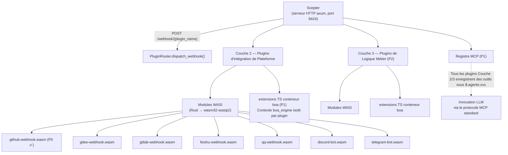
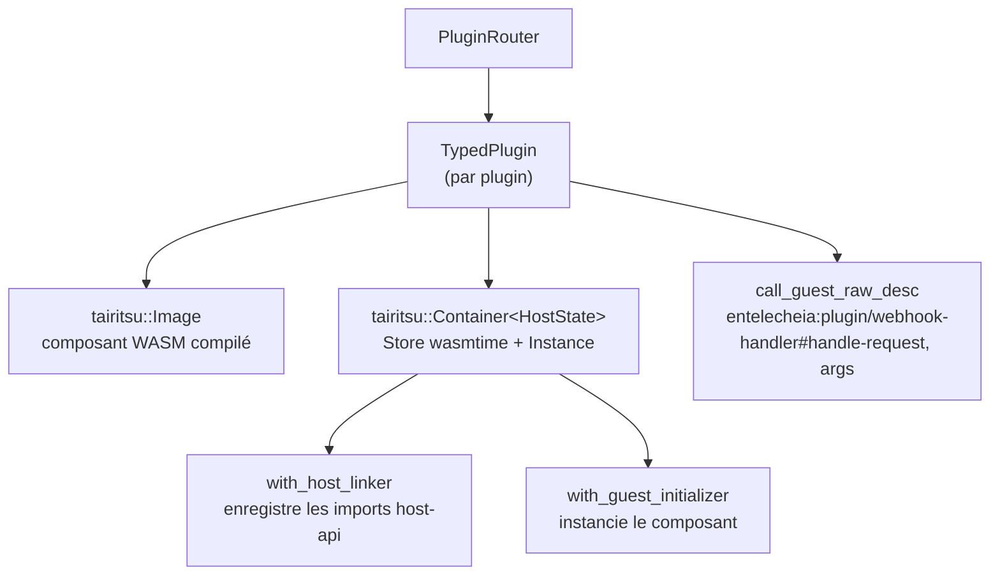

+++
title = "25 — Conception du Système de Plugins WASI"
description = """Le Système de Plugins WASI remplace l'ancien échafaudage de webhooks Python/TypeScript par des plugins de modèle de composants WASM, fournissant des intégrations de plateforme en bac à sable et indé"""
lang = "fr"
category = "design"
subcategory = "core"
+++

# 25 — Conception du Système de Plugins WASI

## Aperçu

Le Système de Plugins WASI remplace l'ancien échafaudage de webhooks Python/TypeScript par des plugins de **modèle de composants WASM**, fournissant des intégrations de plateforme en bac à sable et indépendantes du langage (Couche 2) et des extensions de logique métier (Couche 3). Objectifs de conception clés :

1. **Double mécanisme d'extension** : La Couche 2 (intégration de plateforme) et la Couche 3 (logique métier) prennent toutes deux en charge les modules WASI et les extensions boa TS.
1. **Enregistrement MCP unifié** : Tous les plugins enregistrent des outils sous `$.agents.xxx` indépendamment du langage d'implémentation.
1. **E/S gérées par l'hôte** : L'hôte (serveur axum Scepter) gère le routage HTTP, WebSocket et les connexions persistantes ; les plugins traitent uniquement la logique.
1. **Bac à sable robuste** : Les modules WASM s'exécutent sous wasmtime avec des limites de carburant et une interruption d'époque.

## Architecture



## Définitions d'Interface WIT

Situées dans `packages/shared/plugin_host/wit/plugin.wit` :

```wit
package entelecheia:plugin;

interface host-api {
    http-request:  func(method: string, url: string, headers: string, body: string) -> result<string, string>;
    forward-event: func(event-json: string) -> result<_, string>;
    query-ai:      func(message: string, context: option<string>) -> result<string, string>;
    log:           func(level: string, message: string);
    config-get:    func(key: string) -> option<string>;
    kv-get:        func(key: string) -> option<string>;
    kv-set:        func(key: string, value: string) -> result<_, string>;
    register-mcp-tool: func(tool-name: string, description: string, schema: string) -> result<_, string>;
}

interface webhook-handler {
    name: func() -> string;
    handle-request: func(method: string, path: string, headers: string, body: string) -> result<string, string>;
}

interface bot-handler {
    name: func() -> string;
    on-message: func(platform: string, message: string) -> result<option<string>, string>;
}

world layer2-plugin {
    import host-api;
    export webhook-handler;
}

world layer2-bot {
    import host-api;
    export bot-handler;
}
```

### Enregistrement API Côté Hôte

L'hôte enregistre toutes les fonctions `host-api` en utilisant `component::Linker::func_wrap` de wasmtime avant l'instanciation du composant :

```rust
let mut instance = linker.root().instance("entelecheia:plugin/host-api")?;

instance.func_wrap("http-request",
    |_: StoreContextMut<'_, HostState>,
     (method, url, headers, body): (String, String, String, String)| {
        Ok::<(Result<String, String>,), wasmtime::Error>(
            (api.http_request(method, url, headers, body),)
        )
    }
)?;
```

### Liaisons Côté Invité

Les plugins utilisent `wit_bindgen::generate!()` pour générer des liaisons côté invité :

```rust
wit_bindgen::generate!({
    path: "wit",
    world: "layer2-plugin",
});

struct GithubWebhookPlugin;
impl exports::entelecheia::plugin::webhook_handler::Guest for GithubWebhookPlugin {
    fn name() -> String { "github-webhook".to_string() }
    fn handle_request(method: String, path: String, headers: String, body: String)
        -> Result<String, String> { /* ... */ }
}
export!(GithubWebhookPlugin);
```

## Architecture de l'Hôte de Plugins

### Crate : `_shared_plugin_host` (`packages/shared/plugin_host/`)

| Module | Rôle |
| --- | --- |
| `plugin_state.rs` | `HostFunctions` — implémente toutes les fonctions `host-api` (HTTP, KV, config, événements) |
| `plugin_loader.rs` | `TypedPlugin` — construit les conteneurs wasmtime, enregistre les imports hôtes, appelle les exports invités via `call_guest_raw_desc` dynamique |
| `plugin_router.rs` | `PluginRouter` — gère les plugins chargés, distribue les requêtes webhook/bot, analyse automatiquement le répertoire `plugins/` |
| `host_functions.rs` | Ré-exporte `HostFunctions` et le trait `HostApiProvider` |

### Pile d'Exécution



### Noms d'Export Invité

Étant donné que `wit_bindgen::generate!` côté invité exporte les fonctions sous le nom d'interface WIT, l'hôte utilise des noms pleinement qualifiés pour l'invocation dynamique :

```text
entelecheia:plugin/webhook-handler#name
entelecheia:plugin/webhook-handler#handle-request
entelecheia:plugin/webhook-handler#on-message
```

### Pont Asynchrone

Les fonctions hôtes sont synchrones (exigence wasmtime) mais les implémentations nécessitent l'asynchrone (HTTP, base de données). Le pont utilise `tokio::task::block_in_place` + `Handle::block_on` :

```rust
instance.func_wrap("kv-get",
    move |_: StoreContextMut<'_, HostState>, (key,): (String,)| {
        let result = tokio::task::block_in_place(|| {
            let handle = tokio::runtime::Handle::current();
            handle.block_on(api.kv_get(&key))
        });
        Ok::<(Option<String>,), wasmtime::Error>((result,))
    }
)?;
```

Le gestionnaire webhook de Scepter utilise `tokio::task::spawn_blocking` pour appeler les méthodes WASM synchrones depuis les gestionnaires axum asynchrones.

## Intégration Scepter

### Enregistrement des Routes

`packages/scepter/src/app/setup.rs` — ajouté au routeur axum :

```rust
.merge(crate::api::plugin_webhook::create_plugin_webhook_routes())
```

### Gestionnaire Webhook

`packages/scepter/src/api/plugin_webhook.rs` :

- `POST /webhook/{plugin_name}` — extrait le chemin, les en-têtes, le corps
- Appelle `PluginRouter::dispatch_webhook()` dans `tokio::task::spawn_blocking`
- Retourne la réponse du plugin ou une erreur

### Chargement Automatique des Plugins

Au démarrage, Scepter crée un `PluginRouter` et analyse `plugins/` (ou `$PLUGIN_DIR`) pour les fichiers `.wasm` :

```rust
let plugin_dir = std::path::PathBuf::from(
    std::env::var("PLUGIN_DIR").unwrap_or_else(|_| "plugins".to_string()),
);
router.scan_and_load_dir(&plugin_dir)?;
```

## Guide de Développement de Plugins

### Créer un Plugin WASI

1. Initialiser une nouvelle crate sous `plugins/` :

```toml
# plugins/ma-plateforme/Cargo.toml
[package]
name = "plugin-ma-plateforme"
version = "0.1.0"
edition = "2024"

[lib]
crate-type = ["cdylib", "rlib"]

[dependencies]
wit-bindgen = "0.57"
serde = { version = "1", features = ["derive"] }
serde_json = "1"
```

1. Copier le fichier WIT :

```text
plugins/ma-plateforme/wit/plugin.wit  ← lien symbolique ou copie depuis packages/shared/plugin_host/wit/
```

1. Implémenter le trait `Guest` :

```rust
// plugins/ma-plateforme/src/lib.rs
wit_bindgen::generate!({ path: "wit", world: "layer2-plugin" });

use exports::entelecheia::plugin::webhook_handler::Guest;

struct MaPlateformePlugin;

impl Guest for MaPlateformePlugin {
    fn name() -> String { "ma-plateforme".to_string() }
    fn handle_request(method: String, path: String, headers: String, body: String)
        -> Result<String, String> {
        // Utiliser les fonctions host-api : log(), http-request(), kv-get(), etc.
        log("info", &format!("requête {} reçue", method));
        Ok(r#"{"status":"ok"}"#.to_string())
    }
}

export!(MaPlateformePlugin);
```

1. Configurer `.cargo/config.toml` :

```toml
[target.wasm32-wasip2]
rustflags = ["--cfg=unstable_wasi_extension", "--cfg=unstable_wasi_export_wasi_reactor"]
```

1. Construire :

```bash
cargo build --target wasm32-wasip2 --release -p plugin-ma-plateforme --lib
```

1. Déployer : copier le fichier `.wasm` dans le répertoire `plugins/` (ou définir `PLUGIN_DIR`).

## Référence des Fonctions Hôtes

| Fonction | Signature | Description |
| --- | --- | --- |
| `http-request` | `(method, url, headers, body) → result<string, string>` | Faire des requêtes HTTP (pour répondre aux plateformes externes) |
| `forward-event` | `(event-json) → result<_, string>` | Transférer des événements structurés à Scepter |
| `query-ai` | `(message, context?) → result<string, string>` | Interroger le pipeline IA (pas encore connecté) |
| `log` | `(level, message)` | Émettre un log structuré via le traçage de Scepter |
| `config-get` | `(key) → option<string>` | Lire la configuration du plugin |
| `kv-get` | `(key) → option<string>` | Stockage KV persistant (jetons OAuth, etc.) |
| `kv-set` | `(key, value) → result<_, string>` | Écrire dans le stockage KV persistant |
| `register-mcp-tool` | `(name, description, schema) → result<_, string>` | Enregistrer un outil MCP (P1) |

## Modèle de Sécurité

| Mécanisme | Implémentation |
| --- | --- |
| **Bac à sable** | Bac à sable du modèle de composants wasmtime — pas de système de fichiers, pas d'accès réseau par défaut |
| **Limites de ressources** | Comptage de carburant (comptabilité par instruction) + interruption d'époque (timeout) via le constructeur tairitsu Container |
| **E/S hôte uniquement** | Toutes les E/S passent par les fonctions hôtes ; les plugins ne peuvent pas ouvrir de sockets ou de fichiers |
| **Isolation des plugins** | Chaque plugin est une instance wasmtime séparée avec sa propre mémoire, pas de partage entre plugins |
| **Bac à sable TS (P1)** | Contexte boa_engine avec COMPUTE_TIMEOUT (120s) / ABSOLUTE_CEILING (600s) de skemma |

## État de l'Implémentation

| Phase | Composant | Statut |
| --- | --- | --- |
| **P0** | Plugin WASI webhook GitHub | ✅ Fait |
| **P0** | PluginRouter + Intégration Scepter | ✅ Fait |
| **P0** | HostFunctions (les 8 fonctions host-api) | ✅ Fait |
| **P1** | Infrastructure d'extension boa TS | Non commencé |
| **P1** | Enregistrement d'outils MCP via `$.agents.xxx` | Non commencé |
| **P2** | Plugins de plateforme restants (Gitee, GitLab, Feishu, QQ, Discord, Telegram) | Non commencé |
| **P2** | Plugins de logique métier Couche 3 | Non commencé |

## Fichiers Clés

| Fichier | Objectif |
| --- | --- |
| `packages/shared/plugin_host/Cargo.toml` | wasmtime 43, runtime tairitsu, reqwest |
| `packages/shared/plugin_host/wit/plugin.wit` | Définition d'interface WIT canonique |
| `packages/shared/plugin_host/src/plugin_state.rs` | HostFunctions, trait HostApiProvider |
| `packages/shared/plugin_host/src/plugin_loader.rs` | TypedPlugin, enregistrement des fonctions hôtes |
| `packages/shared/plugin_host/src/plugin_router.rs` | PluginRouter, distribution, scan_and_load_dir |
| `packages/scepter/src/api/plugin_webhook.rs` | Gestionnaire de route webhook Axum |
| `packages/scepter/src/app/setup.rs` | Enregistrement des routes + initialisation PluginRouter |
| `plugins/github-webhook/` | Implémentation de référence |
| `plugins/github-webhook/src/lib.rs` | Plugin webhook GitHub (issues, PR, push, commentaire) |
