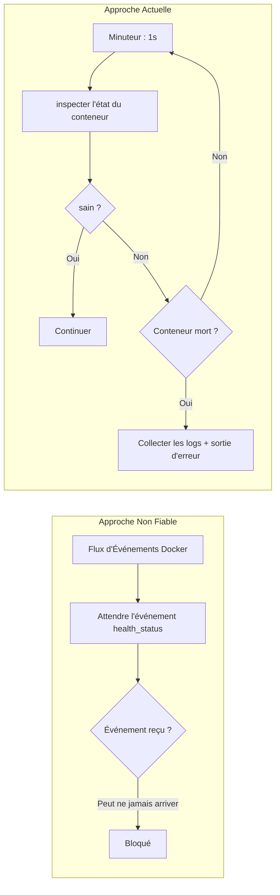

+++
title = "Stratégie de Vérification de Santé PostgreSQL"
description = """Le wrapper CLI doit s'assurer que PostgreSQL est prêt avant de démarrer le conteneur d'application. Ce document définit les décisions de conception derrière la stratégie de sondage passif — rejetant les év"""
lang = "fr"
category = "design"
subcategory = "webui"
+++

# Stratégie de Vérification de Santé PostgreSQL

## Aperçu

Le wrapper CLI doit s'assurer que PostgreSQL est prêt avant de démarrer le conteneur d'application. Ce document définit les décisions de conception derrière la stratégie de vérification de santé par sondage passif — rejetant les événements Docker (peu fiables) et les timeouts fixes (inflexibles).

## Pourquoi pas les Événements Docker



Dans les flux d'événements Docker, le filtre `container` n'est pas fiable pour les événements `health_status` — surtout après un redémarrage de conteneur PG. En pratique, les événements peuvent ne jamais se déclencher, ce qui fait que le CLI attend indéfiniment.

## Stratégie de Sondage

```text
while true:
    sleep 1s
    state = docker.inspect_container(PG)
    if state.health.status == HEALTHY:
        break
    if !state.running:
        bail!(collect_logs(PG))
```

| Paramètre | Valeur | Justification |
| --- | --- | --- |
| Intervalle de sondage | 1s | Assez réactif, pas de surcharge d'inspection |
| Timeout | Aucun | Pas de timeout strict ; PG peut avoir un démarrage à froid |
| Détection de mort | À chaque sondage | Conteneur absent → erreur immédiate et vidage des 50 dernières lignes de logs |

## Configuration de Santé du Conteneur PostgreSQL

```rust
HealthConfig {
    test:        ["CMD-SHELL", "pg_isready -U shittim_chest"],
    interval:    5_000_000_000,   // 5s (nanosecondes)
    timeout:     5_000_000_000,   // 5s
    retries:     10,
    start_period: 30_000_000_000, // 30s période de grâce initiale
}
```

| Paramètre | Valeur | Justification |
| --- | --- | --- |
| `pg_isready` | Niveau utilisateur | Plus fiable que la détection de port TCP ; garantit que PG accepte pleinement les connexions |
| `interval: 5s` | Modéré | Évite les tentatives fréquentes et le bruit dans les logs |
| `retries: 10` | Élevé | La migration et initdb peuvent prendre du temps ; tentatives amples |
| `start_period: 30s` | Long | Le premier démarrage d'initdb pg18 peut être lent |

## Chemin de Montage du Volume de Données

```rust
Mount {
    target: "/var/lib/postgresql",     // nouveau chemin pg18
    source: "shittim-chest-pgdata",
    typ: MountTypeEnum::VOLUME,
}
```

pg18 a changé le répertoire de données de `/var/lib/postgresql/data` à `/var/lib/postgresql`. Utiliser le mauvais chemin empêche PG de trouver les données après le démarrage.

## Tentatives de Migration

Les migrations de base de données ont une logique indépendante de 5 tentatives :

```text
for retry in 0..5:
    execute docker run --rm ... shittim_chest db-migrate
    if success: break
    sleep 2s
```

Même après le retour de `wait_healthy`, les migrations peuvent échouer parce que PG termine encore sa récupération. De courtes tentatives gèrent cette fenêtre critique.

## Collecte de Logs

Lorsqu'un conteneur plante, les 50 dernières lignes de logs sont automatiquement collectées :

```rust
async fn collect_logs(docker: &Docker, name: &str) -> String {
    docker.logs(name, LogsOptions { tail: "50", stdout: true, stderr: true, .. })
}
```

Ceci est crucial pour déboguer les échecs de démarrage PG — les erreurs initdb, problèmes de permissions, conflits de port, etc. ne sont visibles que dans les logs du conteneur.
