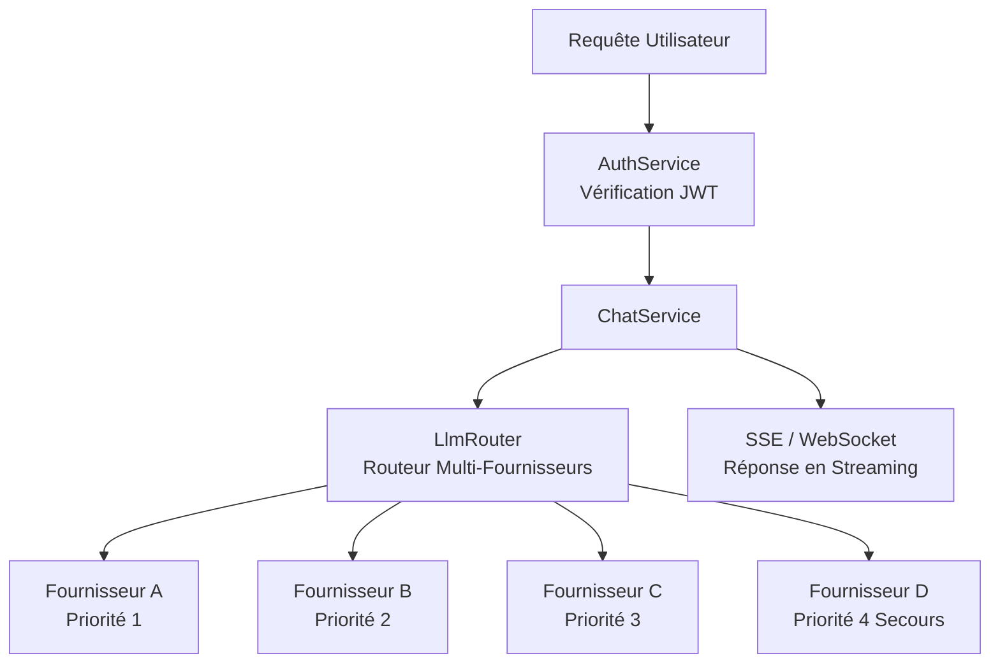
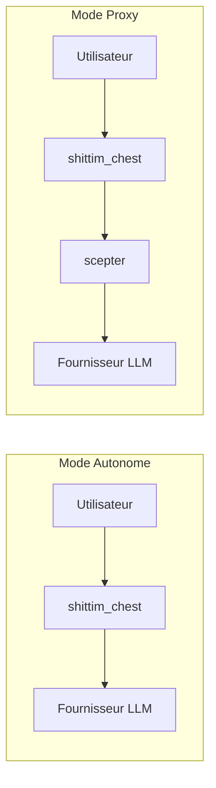

+++
title = "Architecture LLM Indépendante"
description = """shittim-chest possède une couche de routage LLM entièrement indépendante qui ne dépend pas d'entelecheia. Les utilisateurs peuvent configurer plusieurs fournisseurs LLM, et le routeur intégré sélectionne autom"""
lang = "fr"
category = "design"
subcategory = "webui"
+++

# Architecture LLM Indépendante

## Aperçu

shittim-chest possède une couche de routage LLM entièrement indépendante qui ne dépend pas d'entelecheia. Les utilisateurs peuvent configurer plusieurs fournisseurs LLM, et le routeur intégré sélectionne automatiquement en fonction de la priorité et de la disponibilité. C'est la capacité différenciatrice centrale de shittim-chest par rapport à Open WebUI.

## Architecture



## Capacités Centrales

### 1. Routage Prioritaire Multi-Fournisseurs

```text
Chaque fournisseur a un champ de priorité (nombre plus bas = priorité plus élevée).
Les requêtes sont tentées de la priorité la plus élevée à la plus basse :
  → Fournisseur A (priorité=1) disponible → utiliser
  → Indisponible → Fournisseur B (priorité=2) disponible → utiliser
  → Indisponible → ... → retourner une erreur
```

### 2. Basculement Automatique

Lorsqu'un fournisseur de priorité supérieure retourne une erreur (timeout, limite de débit, inaccessible), le routeur bascule automatiquement vers le prochain fournisseur disponible, de manière transparente pour l'utilisateur.

### 3. Stockage Chiffré des Clés API

Toutes les clés API des fournisseurs sont chiffrées statiquement avec AES-256-GCM et stockées dans `shittim_chest_db`. La clé de chiffrement est fournie via la variable d'environnement `ENCRYPTION_KEY`. Même si la base de données est compromise, les clés API restent illisibles.

### 4. Streaming Double Protocole

| Protocole | Point de terminaison | Cas d'usage |
| --- | --- | --- |
| SSE | `/api/chat/stream` | Streaming HTTP simple, compatible proxy, support natif du navigateur |
| WebSocket | `/ws/chat/stream` | Communication bidirectionnelle, prend en charge l'annulation et l'interaction en temps réel |

### 5. Compatibilité OpenAI

Toutes les interfaces de fournisseur suivent le format OpenAI `/v1/chat/completions`, permettant l'intégration avec tout service compatible API OpenAI (DeepSeek, OpenAI, Ollama/LM Studio local, etc.).

## Gestion des Fournisseurs

### Sources de Configuration

| Méthode | Cas d'usage |
| --- | --- |
| Variables d'environnement (`LLM_DEFAULT_PROVIDER_*`) | Démarrage rapide, scénarios à fournisseur unique |
| CRUD base de données (`/api/providers/*`) | Multi-fournisseurs, gestion dynamique |
| Panneau d'administration arona | Gestion graphique |

### Fournisseur d'Amorçage

Au premier démarrage, si les variables d'environnement `LLM_DEFAULT_PROVIDER_*` sont définies, `db-init` crée automatiquement un fournisseur d'amorçage. Des fournisseurs supplémentaires peuvent être ajoutés ultérieurement via le panneau d'administration arona.

## Mode Autonome vs Mode Proxy



| Mode | Condition | Comportement |
| --- | --- | --- |
| Autonome | scepter non configuré (ou `Proxy: disabled`) | Appelle directement le fournisseur LLM |
| Proxy | URL scepter configurée | Transfère via la couche proxy au traitement Agent entelecheia |

Le mode autonome fournit une expérience de chat complète : gestion des conversations, persistance des messages, recherche, exportation. Le mode proxy ajoute des capacités d'orchestration d'Agents.

## Implémentation Technique

- **Routeur** : `packages/shittim_chest/src/llm/router.rs`, prend en charge la sélection par priorité + basculement
- **Client** : `packages/shittim_chest/src/llm/client.rs`, basé sur `reqwest` + `rustls` (pas de dépendance OpenSSL)
- **CRUD Fournisseur** : `packages/shittim_chest/src/api/providers.rs`, points de terminaison REST standards
- **Chiffrement** : crate `aes-gcm`, variable d'environnement `ENCRYPTION_KEY`
