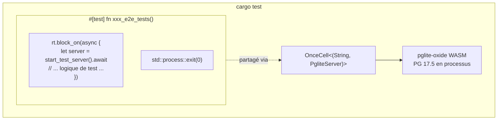

+++
title = "Base de Données de Test Intégrée (pglite-oxide)"
description = """shittim-chest utilise [pglite-oxide](https://crates.io/crates/pglite-oxide) comme PostgreSQL intégré pour tous les tests d'intégration et E2E. Aucun Postgres externe, Docker ou `testcontainers` n'est né"""
lang = "fr"
category = "design"
subcategory = "webui"
+++

# Base de Données de Test Intégrée (pglite-oxide)

## Aperçu

shittim-chest utilise [pglite-oxide](https://crates.io/crates/pglite-oxide) comme PostgreSQL intégré pour tous les tests d'intégration et E2E. Aucun Postgres externe, Docker ou `testcontainers` n'est nécessaire — les tests s'exécutent avec une seule commande `cargo test` sur n'importe quelle machine.

## Motivation de Conception

Auparavant, les tests d'intégration reposaient sur `postgresql_embedded`, qui télécharge un binaire PostgreSQL complet (~100 Mo) au runtime. Cela causait un démarrage lent, des échecs spécifiques à la plateforme et une instabilité CI. pglite-oxide empaquète PostgreSQL 17.5 comme module WASM via le runtime wasmer — en processus, portable et rapide (~96 ms démarrage à froid).

## Architecture



## Décisions Clés

| Décision | Justification |
| --- | --- |
| `pglite-oxide` (WASM) plutôt que `postgresql_embedded` (binaire natif) | Pas de téléchargement ~100 Mo, pas de binaire PG spécifique à la plateforme, démarrage ~96 ms |
| `pglite-oxide` plutôt que `pglite-rust-bindings` | Publié sur crates.io (v0.5.0), démarrage plus rapide, API builder mature avec support d'extensions |
| `tower::ServiceExt::oneshot` plutôt que `reqwest` | Évite le blocage du runtime tokio entre les tâches d'arrière-plan du pool sqlx et le serveur HTTP hyper |
| Runner `#[test]` unique avec `std::process::exit(0)` | sqlx `PgPool` génère des tâches d'arrière-plan persistantes (idle reaper, vérifications de santé) qui maintiennent le runtime tokio en vie. `exit(0)` contourne ce blocage |
| `max_connections=1` | Limitation fondamentale de PGlite — connexion unique uniquement |
| `OnceCell<(String, PgliteServer)>` | Instance PG partagée entre les sous-tests dans la même exécution binaire ; `PgliteServer` doit rester en vie (non dropped) |
| `pglite-oxide` dans `[dev-dependencies]` uniquement | Le runtime wasmer ne doit PAS fuiter dans les builds de production |

## Modèle de Harnais de Test

```rust
// tests/common/mod.rs
static PG: OnceCell<(String, PgliteServer)> = OnceCell::const_new();

async fn ensure_pg_url() -> String {
    PG.get_or_init(|| async {
        let server = PgliteServer::builder()
            .start()
            .expect("Échec du démarrage de pglite-oxide");
        let url = server.database_url();
        // connecter, exécuter les migrations, fermer la connexion initiale
        (url, server)
    }).await.0.clone()
}

pub async fn start_test_server() -> TestServer {
    let db_url = ensure_pg_url().await;
    let db = Database::connect(/* max_connections=1 */).await;
    // construire AppState, Router, retourner TestServer enveloppant tower oneshot
}
```

```rust
// tests/xxx_tests.rs
# [test]
fn xxx_e2e_tests() {
    let rt = tokio::runtime::Runtime::new().unwrap();
    rt.block_on(async {
        let mut server = common::start_test_server().await;
        // ... tous les sous-tests utilisant server.request() ...
    });
    std::process::exit(0);
}
```

## Tables Créées

Les 13 tables sont créées via les migrations SeaORM pendant la configuration du test :

`auth_users`, `sessions`, `api_keys`, `oauth_connections`, `channel_configs`, `channel_messages`, `channel_pairings`, `conversations`, `messages`, `llm_providers`, `remote_devices`, `device_sessions`, `system_settings`, `workspace_sessions`

## Limitations de PGlite

1. **Connexion unique** : `max_connections` doit être 1. Plusieurs pools vers la même instance PGlite bloqueront.
1. **Cast de type strict** : PGlite est plus strict que PostgreSQL standard. Les requêtes comme `uuid_column = text_value` échoueront — toujours caster explicitement.
1. **Pas de runners de test concurrents** : Tous les tests async partageant une instance PGlite doivent s'exécuter séquentiellement dans une seule fonction `#[test]`.
1. **Blocage du pool à la libération** : `sqlx::PgPool::close()` peut bloquer indéfiniment. Utilisez `std::process::exit(0)` pour terminer le processus de test.
