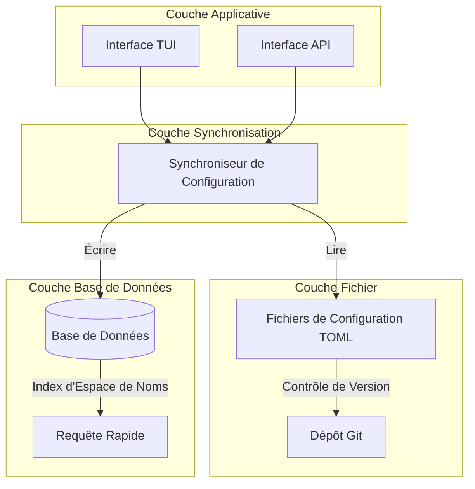
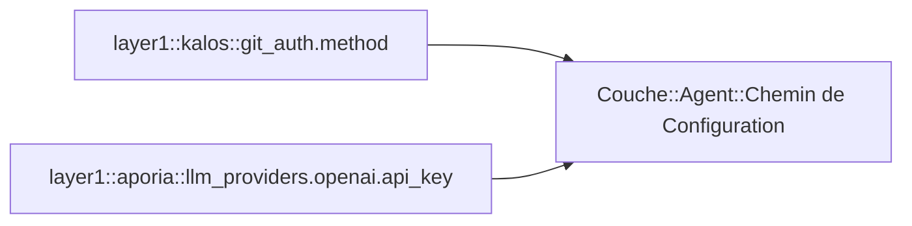
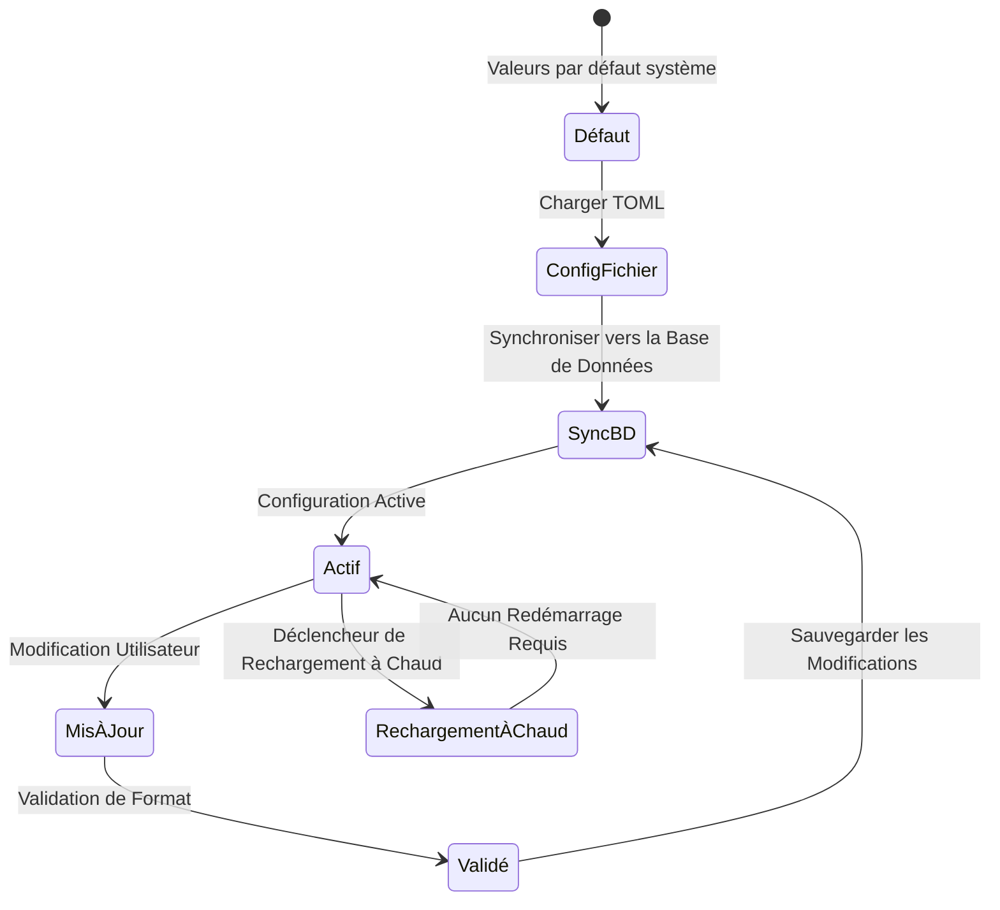
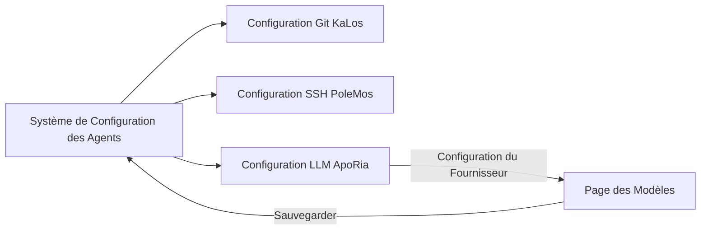

# Conception du Système de Configuration des Agents

## Aperçu

Le Système de Configuration des Agents fournit un mécanisme unifié de gestion de configuration, prenant en charge le stockage en fichier TOML et la persistance en base de données, implémentant la gestion de version de configuration et le rechargement à chaud.

## Principes Fondamentaux

### Architecture de Stockage à Double Couche



### Espace de Noms de Configuration

Adoption d'une conception hiérarchique d'espace de noms :



## Conception de l'Architecture

### Cycle de Vie de la Configuration



### Interface de Configuration TUI

```mermaid
graph TB
    subgraph Module Document Agent
        Onglets[Aperçu | Configuration | MCP | Compétences]
        Onglets --> Contenu[Zone de Contenu]
    end

    subgraph Page de Configuration
        Groupes[Liste des Groupes de Configuration]
        Groupes --> Groupe1[Configuration d'Authentification Git]
        Groupes --> Groupe2[Configuration de Gestion des Sources]
        Groupes --> AjouterGroupe[Ajouter un Nouveau Groupe de Configuration]
    end

    Contenu --> Groupes
```

## Relation avec les Autres Modules



## Considérations de Conception

### Sécurité

- Stockage chiffré des configurations sensibles
- Contrôle d'accès par permissions
- Audit des modifications de configuration

### Extensibilité

- Prise en charge de types de configuration personnalisés
- Règles de validation flexibles
- Gestionnaires de configuration enfichables

### Cohérence

- Synchronisation entre fichier et base de données
- Gestion de version de la configuration
- Détection et résolution de conflits
