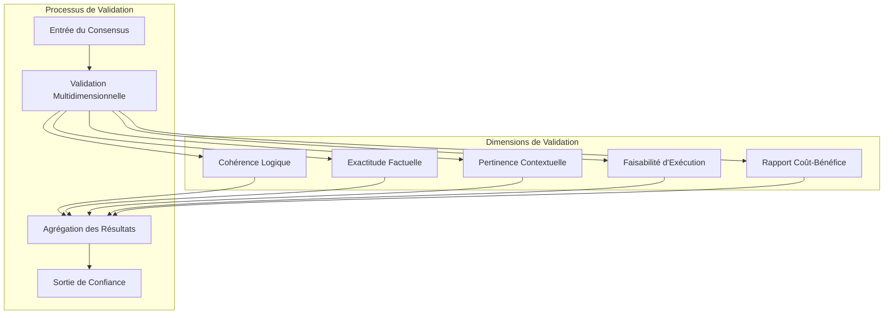
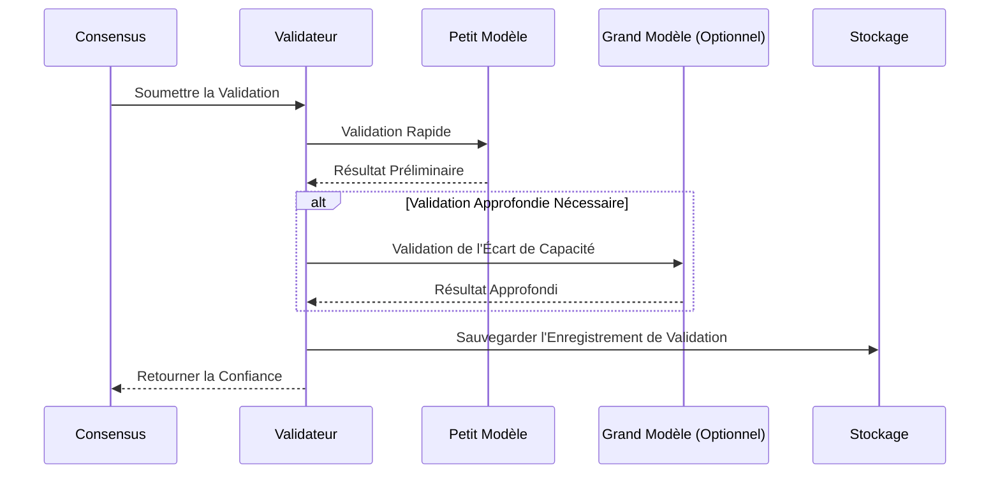
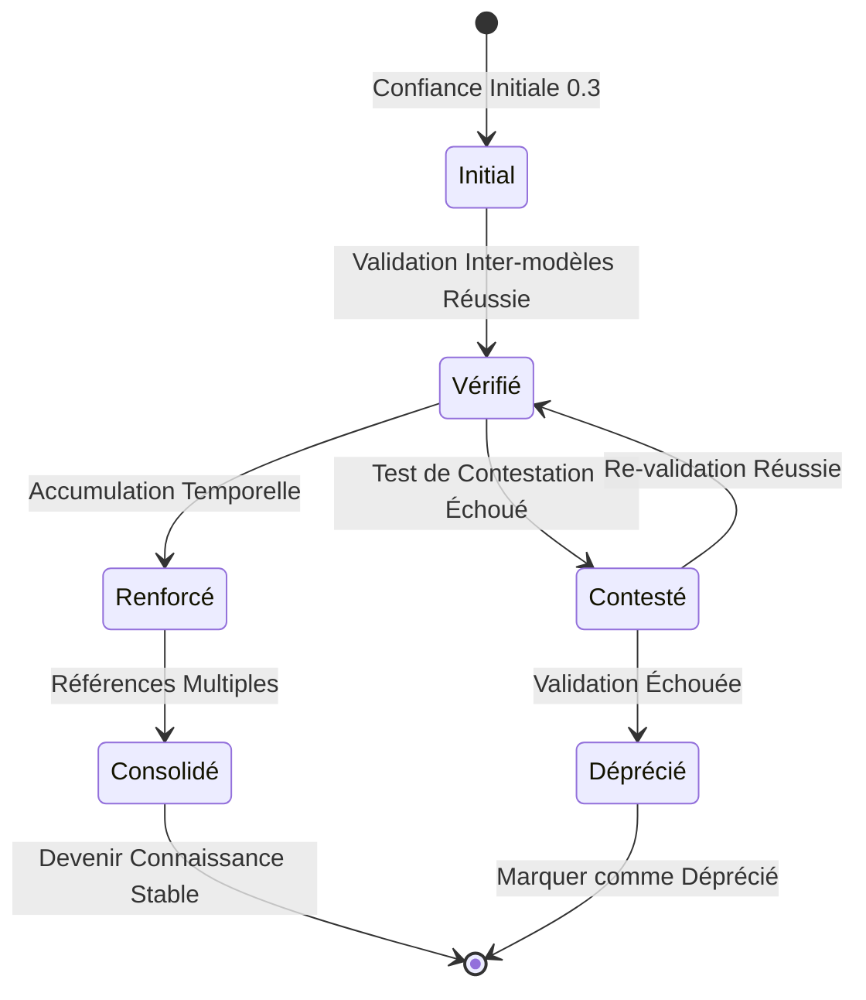
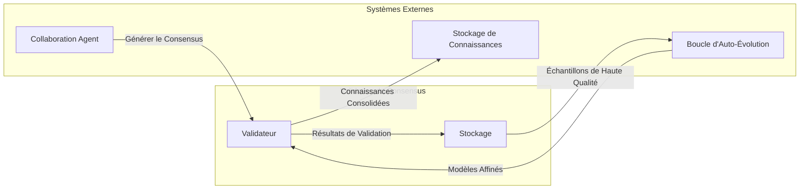

# Mécanisme de Validation du Consensus

## Aperçu

Le Mécanisme de Validation du Consensus est un composant central du système de collaboration multi-Agent, utilisé pour valider et évaluer la fiabilité et la précision du consensus formé par plusieurs Agents, garantissant la qualité de sortie du système.

## Principes Fondamentaux

### Cadre de Validation Multidimensionnelle

Le système effectue une validation complète à travers cinq dimensions :

### Description des Dimensions de Validation

| Dimension | Cible de Validation | Indicateurs Clés |
| --- | --- | --- |
| Cohérence Logique | Le consensus est-il auto-cohérent | Pas de contradictions, raisonnement complet |
| Exactitude Factuelle | Les déclarations factuelles sont-elles correctes | Cohérent avec les connaissances connues |
| Pertinence Contextuelle | Est-ce pertinent pour la tâche actuelle | Score de pertinence |
| Faisabilité d'Exécution | Le plan est-il exécutable | Évaluation de l'opérabilité |
| Rapport Coût-Bénéfice | Le rapport coût-bénéfice est-il raisonnable | Évaluation du retour sur investissement |

## Conception de l'Architecture

### Processus de Validation Progressive

### Mécanisme d'Accumulation de Confiance

## Intégration avec les Autres Systèmes

## Considérations de Conception

### Contrôle des Coûts

- Prioriser les petits modèles pour la validation
- Activer les grands modèles uniquement lorsque nécessaire
- Mise en cache et réutilisation des résultats de validation

### Assurance Qualité

- Validation croisée multidimensionnelle
- L'accumulation temporelle renforce la crédibilité
- Les tests de contestation découvrent les problèmes potentiels

### Traçabilité

- Historique complet des validations
- Prise en charge de l'audit et du retour en arrière
- Support d'analyse statistique
