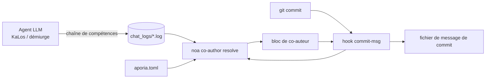

# Identification des Agents IA et Stratégie de Co-auteur de Commit

## Aperçu

Ce document spécifie comment les commits générés par l'IA dans les projets celestia-island
(`noa`, `entelecheia`, `evernight`) sont estampillés avec des **métadonnées de provenance** : quels
modèles ont produit la modification, via quel fournisseur/plateforme ils ont été atteints, combien
de tokens ils ont consommés, et si la modification a été produite en itération autonome
(YOLO).

Le mécanisme est constitué de **métadonnées pragmatiques** : chaque commit produit par un agent IA reçoit un
bloc `Co-authored-by` (et un bloc optionnel `Token usage`) ajouté par un
hook git `commit-msg` que `noa` installe et résout. Il ne s'agit pas d'une barrière de conformité
légale ; c'est une traçabilité qui permet aux humains d'auditer quel modèle et quel
fournisseur a touché le code.

## Motivation

| Préoccupation | Comment cela aide |
| --- | --- |
| **Traçabilité** | Chaque commit enregistre le(s) modèle(s) exact(s) qui l'ont produit. |
| **Responsabilité du fournisseur** | L'email de l'auteur encode le fournisseur/plateforme, y compris les relais tiers. |
| **Anti-empoisonnement** | Si un relais ou un fournisseur distribue des données compromises, le bloc co-auteur identifie la source. |
| **Suivi des coûts** | Le bloc optionnel `Token usage` enregistre l'upload/download/cache par modèle. |
| **Marquage du mode autonome** | Une chaîne exécutée entièrement sous contrôle de croisière YOLO est marquée avec une autorité `Entelecheia`. |

## Modèle d'Identité du Fournisseur

L'email de l'auteur utilise un espace de noms de confiance unique — `celestia.world` — avec la partie
locale encodant **qui a servi le modèle** :

```text
Nom d'Affichage <identifiant-fournisseur-ou-plateforme@celestia.world>
```

L'identifiant du fournisseur est le champ **obligatoire `website_domain`** déclaré dans chaque
configuration de fournisseur (les TOML de point d'entrée du registre des fournisseurs et le fichier local
`aporia.toml`). Il n'est **pas** dérivé de l'URL de base de l'API — un seul fournisseur peut
exposer plusieurs hôtes `base_url` (par exemple, `zhipu_glm` sert à la fois `open.bigmodel.cn` et
`api.z.ai`, mais son domaine canonique est `zhipuai.cn`). Si un fournisseur n'a pas de
`website_domain`, aucun co-auteur ne lui est attribué (le résolveur l'ignore plutôt
que de deviner à partir de l'URL ou du préfixe du modèle).

- **Les fournisseurs de première partie** sont identifiés par leur domaine canonique :

`anthropic.com`, `deepseek.com`, `openai.com`, `zhipuai.cn`, `google.com`, ...

- **Les fournisseurs tiers / relais** conservent leur propre domaine pour que le relais soit visible :

`opencode.ai`, `jdcloud.com`, `openrouter.ai`, `dashscope.aliyuncs.com`, ...

Cela signifie que le *même* modèle atteint via différentes routes est distinguable :

```text
GLM 5 <zhipuai.cn@celestia.world>              # direct depuis Zhipu AI
GLM 5 <jdcloud.com@celestia.world>           # GLM 5 servi via JD Cloud
Deepseek V4 Pro <deepseek.com@celestia.world> # direct depuis DeepSeek
Deepseek V4 Pro <opencode.ai@celestia.world>  # DeepSeek servi via opencode
```

## Spécification du Bloc Co-auteur

- Clé du bloc : `Co-authored-by` (bloc reconnu par git).
- Valeur : `Nom d'Affichage <local@celestia.world>`.
- **Un bloc par modèle distinct**, dans l'ordre d'utilisation.
- Le nom d'affichage est dérivé de l'identifiant du modèle (marque + version, en casse de titre).
- La partie locale doit être un sous-domaine RFC-5321 valide (lettres, chiffres, `.`, `-`).

## Bloc d'Autorité YOLO

Lorsque toute la chaîne de pensée qui a produit un commit s'est déroulée sous **contrôle de croisière
YOLO** (itération autonome), un co-auteur supplémentaire est préfixé :

```text
Co-authored-by: Entelecheia <demiurge@celestia.world>
```

Le mode YOLO est détecté à partir de :

1. Le journal de chat de session contenant un marqueur `YOLO cruise control` / `YOLO auto`, ou
1. La présence du fichier sentinelle `/run/entelecheia/yolo_active`.

Cela permet à un humain de voir immédiatement "ce commit a été fait sans humain dans la boucle".

## Utilisation de Tokens Intégrée

Intégrée dans le nom d'affichage de chaque modèle dans le bloc `Co-authored-by` (un bloc que GitHub analyse correctement) :

```text
Co-authored-by: Claude Opus 4.8 (↑ 12,5k ↓ 8,3k ●45,2k) <anthropic.com@celestia.world>
Co-authored-by: Deepseek V4 Pro (↑ 5,1k ↓ 3,2k) <deepseek.com@celestia.world>
```

Règles :

- L'utilisation est intégrée en ligne comme `(↑ upload ↓ download)`, avec `●cache` ajouté uniquement

lorsque les tokens d'entrée mis en cache ont été rapportés et sont > 0.

- `↑` = tokens de prompt/entrée ; `↓` = tokens de complétion/sortie.
- Les compteurs sont rendus en milliers (`k`), une décimale, zéros superflus supprimés.

## Exemple Complet de Message de Commit

```text
fix(auto_fix): augmenter les délais clippy/check de 180s à 300s

Le délai précédent de 180s était trop serré pour des builds propres sur une machine
chargée ; l'augmenter à 300s pour éviter les échecs de validation intempestifs.

Co-authored-by: Entelecheia <demiurge@celestia.world>
Co-authored-by: GLM 5 (↑ 36,4k ↓ 1,5k) <zhipuai.cn@celestia.world>
```

## Installation du Hook noa

`noa` fournit le cycle de vie du hook :

```text
noa hook install --repo <chemin> [--force] [--noa-bin <chemin>]
```

- Écrit `.git/hooks/commit-msg` (mode `0755`).
- Le hook appelle `<noa> co-author resolve` et ajoute sa sortie stdout au fichier

de message de commit (`$1`).

- Le hook **ne bloque jamais un commit** : en cas d'échec du résolveur, il sort avec `0` silencieusement.
- Si un message de commit contient déjà un bloc `Co-authored-by:`, le hook est un

no-op (il ne duplique ni n'écrase jamais).

- `NOA_COAUTHOR_DISABLE=1` dans l'environnement désactive le hook pour un commit.

## Résolution de Co-auteur noa

```text
noa co-author resolve [--repo <chemin>] [--chat-log-dir <répertoire>]
                      [--aporia-config <chemin>] [--lookback-secs <n>]
```

Le résolveur :

1. Charge la carte des fournisseurs : registre intégré fusionné avec la configuration du fournisseur

`aporia.toml` (qui donne le mappage précis modèle→point de terminaison→fournisseur).

1. Lit le(s) journal(s) de chat entelecheia le(s) plus récent(s) et agrège l'utilisation de tokens par

modèle. Avec `--lookback-secs 0` (par défaut), seul le journal le plus récent est utilisé.

1. Détecte le mode YOLO (marqueur de journal de chat ou fichier sentinelle).
1. Construit la liste des co-auteurs (autorité `Entelecheia` en premier si YOLO, puis modèles)

et le bloc d'utilisation de tokens, et imprime le bloc sur stdout.

## Flux de Données



## Intégration entelecheia

- Le hook `commit-msg` est installé dans `/mnt/sdb1/entelecheia/.git/hooks/`.
- Tous les commits produits par le pipeline de chirurgie (hook `NoaMergeCommit` dans

`packages/scepter/src/state_machine/skill_chain/execution/noa_post_chain.rs`) et
par la boucle d'auto-réparation `KaLos:auto_fix` passent par le hook git `commit-msg`,
ils sont donc automatiquement estampillés.

- Aucune modification des sites d'appel de commit n'est requise : le hook est le point d'insertion

unique.

## Intégration evernight

Lorsqu'un agent IA orchestre un commit via `evernight` (par exemple, agent sur l'hôte A →
evernight SSH → hôte B → `git commit`), le hook `commit-msg` côté hôte se déclenche toujours
localement et estampille le commit. `evernight` lui-même peut apparaître comme **fournisseur
de transit** dans l'email de l'auteur lorsqu'il relaie le trafic du modèle (par exemple,
`GLM 5 <evernight.celestia.world@celestia.world>`), rendant le saut de transport
auditable.

## Considérations de Sécurité

- Les blocs de co-auteur sont de la provenance **auto-déclarée**, pas une preuve cryptographique.

Des travaux futurs pourraient ajouter des attestations signées.

- Le résolveur se dégrade en toute sécurité : un journal de chat manquant, `noa` manquant, ou une erreur d'analyse

produisent tous un bloc vide et le commit se poursuit sans modification.

- Les identifiants des fournisseurs proviennent du fichier local `aporia.toml`, donc un utilisateur voit toujours les

fournisseurs *qu'il* a configurés.

## Référence des Identifiants de Fournisseurs (registre initial)

| Identifiant du fournisseur | Marque | Indice de point de terminaison |
| --- | --- | --- |
| `zhipuai.cn` | GLM | `open.bigmodel.cn` |
| `deepseek.com` | Deepseek | `api.deepseek.com` |
| `anthropic.com` | Claude | `api.anthropic.com` |
| `openai.com` | GPT / OpenAI | `api.openai.com` |
| `google.com` | Gemini | `googleapis.com` |
| `dashscope.aliyuncs.com` | Qwen | `dashscope.aliyuncs.com` |
| `moonshot.cn` | Kimi | `api.moonshot.cn` |
| `mistral.ai` | Mistral | `api.mistral.ai` |
| `opencode.ai` | (relais) | `opencode.ai` |
| `jdcloud.com` | (relais) | `jdcloud.com` |
| `openrouter.ai` | (relais) | `openrouter.ai` |
