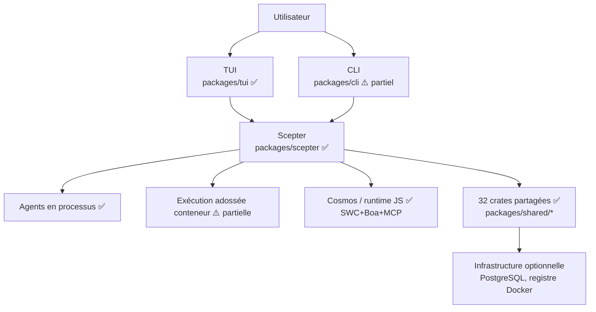
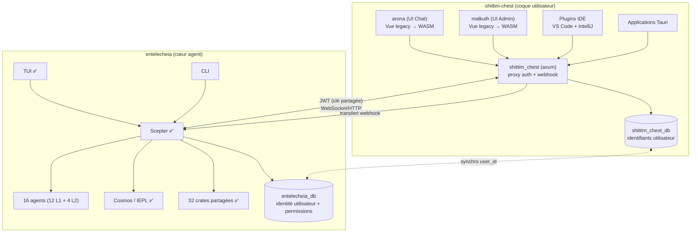
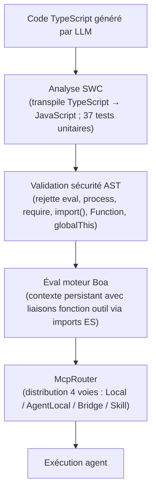
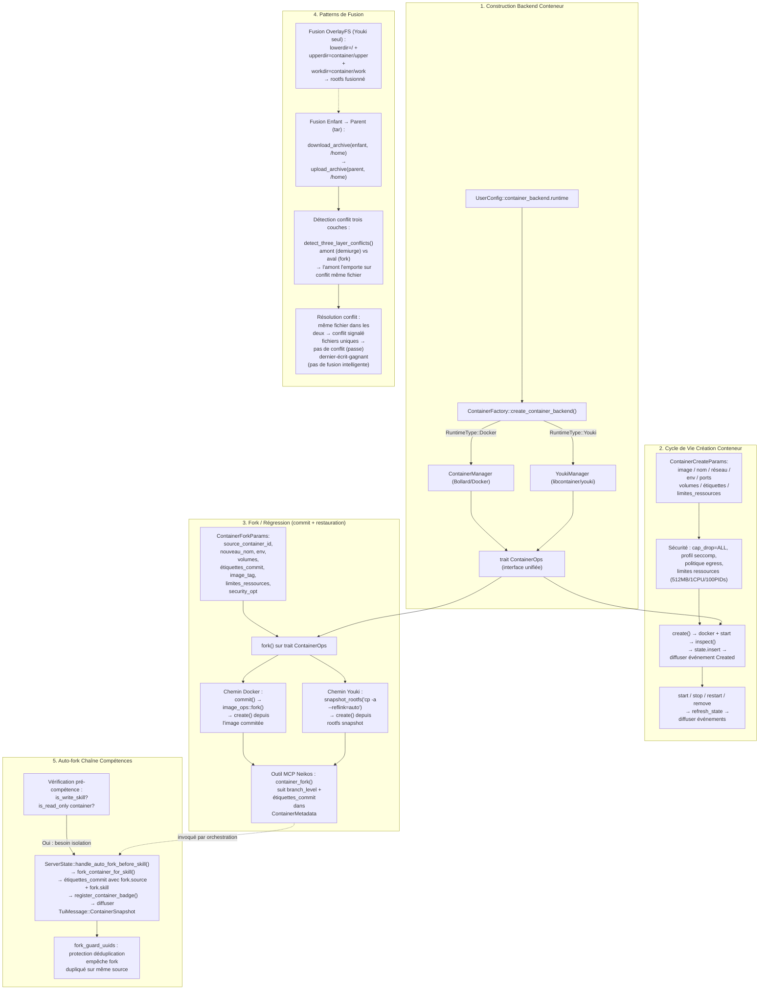
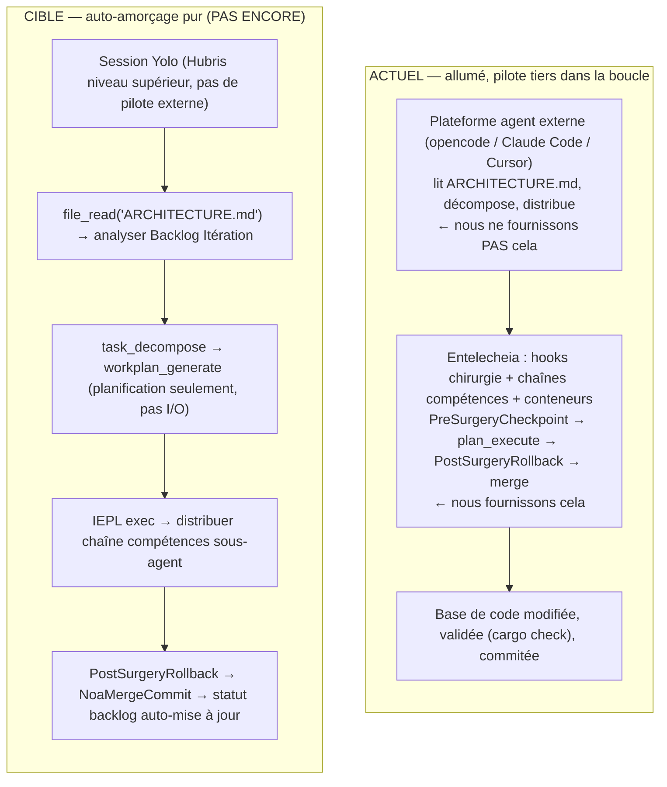
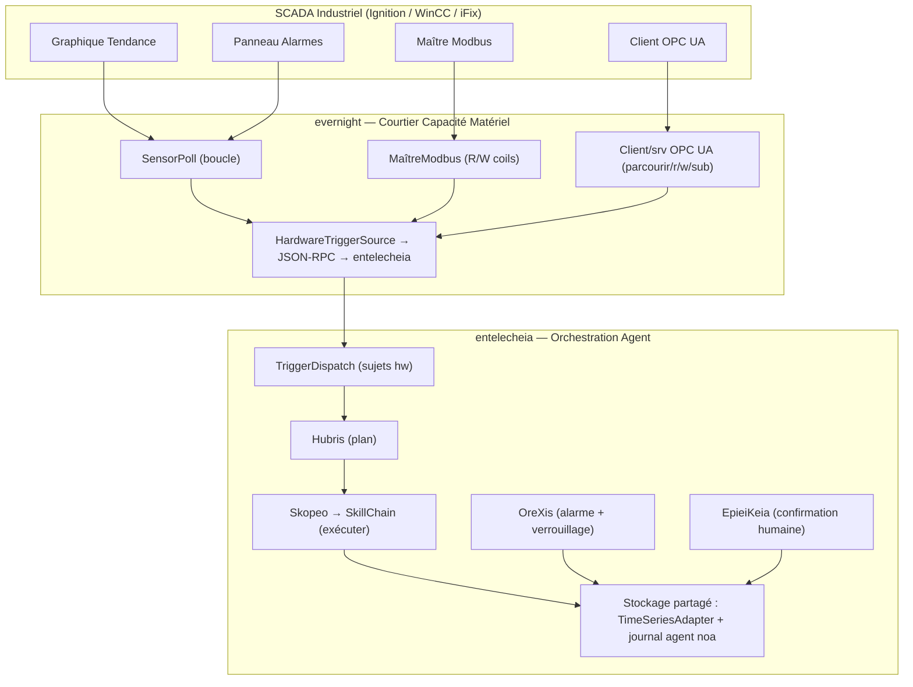

# Architecture

> **Version** : 0.2.0 — développement précoce, pas prêt pour la production.
> **Dernière vérification** : 2026-06-17 (analyse approfondie — recalibrée par rapport au code réel)
> Ce document décrit à la fois le code implémenté et la conception prévue.
> [Lire la section Lacunes Actuelles](#lacunes-actuelles) avant de prendre des décisions de déploiement.

## Répartition des Dépôts

Entelecheia a terminé sa division majeure : les couches de coque utilisateur ont été migrées vers un projet frère **shittim-chest** (`../shittim-chest`). Entelecheia se concentre désormais exclusivement sur le cœur d'orchestration multi-agent.

| Dépôt | Périmètre |
| --- | --- |
| **entelecheia** | Orchestration Scepter, 16 agents (12 L1 + 4 L2), runtime Cosmos/IEPL, 32 crates partagées |
| **shittim-chest** | arona (frontend UI Chat), malkuth (UI Admin), backend `shittim_chest` (proxy axum + auth + webhook), plugins IDE, applications Tauri |

## Périmètre Actuel

Entelecheia est un workspace Rust de **56 crates** centré sur `packages/scepter` (serveur d'orchestration), **32 crates partagées** sous `packages/shared/` (entièrement décomposées d'une ancienne crate monolithique ; 5 sous-crates prévues n'ont jamais été matérialisées et leur fonctionnalité a été intégrée dans des crates sœurs), et `packages/tui` (UI terminal). Le TUI est l'interface utilisateur la plus complète. `packages/cli` a des commandes de gestion de services, de chat et de chronologie.

Les composants suivants ont été **migrés vers shittim-chest** et retirés de ce dépôt :

- `packages/webui` (hôte HTTP/statique, pont WebSocket) — retiré
- `packages/webui_frontend` (frontend WASM) — retiré (Phase 1)
- `packages/ide/vscode` (extension VS Code) — retirée (Phase 1)
- `packages/ide/idea` (plugin IntelliJ) — retiré (Phase 1)
- `packages/app/tauri*` (applications de bureau/mobile Tauri) — retirées (Phase 1)
- Tout état WebUI, commandes et rendu dans les crates TUI/CLI/Scepter/shared — retirés (Phase 2)

Le projet a subi une décomposition majeure : l'ancienne crate monolithique `packages/shared` (38K lignes, 187 fichiers .rs) a été entièrement dissoute en sous-crates ciblées. 5 frontières de crate qui apparaissaient dans les premiers diagrammes de couches n'ont jamais été matérialisées en tant que crates séparées ; leur fonctionnalité prévue réside dans d'autres crates (par exemple, les énumérations de domaine sont intégrées dans `shared-domain-agent`, les types de fil dans `shared-state-types`). Toutes les déclarations de dépendances internes utilisent `workspace = true` pour la cohérence des versions.

## Vérification de Réalité des Composants

| Composant | Implémenté | Conception seule / Stub | Verdict |
| --- | --- | --- | --- |
| **Scepter** (orchestration) | Auth/RBAC, routage fournisseur, cycle de vie agent, exécution chaîne de compétences, points de terminaison WebSocket/HTTP, chiffrement clés. 351 tests unitaires sur 49 fichiers source. `AppState` a des impls `FromRef` pour 5 sous-états ; les gestionnaires agent_lifecycle utilisent `State<Arc<Persistence>>` | Surface API complète. Processeur batch défini mais non instancié. | 🟢 Réel |
| **TUI** | Cycle de vie complet : splash, init Docker, chronologie, modales agent, i18n (8 langues), config fournisseur, support thème. 329 tests unitaires sur 47 fichiers source. `ComponentStore` divisé en 5 sous-structs ; AppState réduit à 6 champs. Connexion via socket Unix (préféré) ou WebSocket de secours. | Parité fonctionnelle avec l'API Scepter. `CancelRequest`/`ExecuteSudoCommand` pas encore câblés. | 🟢 Réel |
| **CLI** | Gestion de services, chat, chronologie, commandes cycle de vie agent. 28 tests unitaires. | Pas en parité fonctionnelle avec TUI | 🟡 Partiel |
| **WebUI** | Retirée — migrée vers shittim-chest | — | ✅ Terminé |
| **Frontend WebUI** | Retiré — migré vers shittim-chest | — | ✅ Terminé |
| **Cosmos / Runtime JS** | Moteur Boa, distribution import module ES (`__native_dispatch` résolution interne), génération namespace, McpRouter avec disjoncteur+retry. Auto-génération `.d.ts` depuis `#[derive(TS)]` peuple les fichiers de type TypeScript. 50 tests unitaires. | Pipeline transpile TypeScript SWC implémenté et testé (37 tests unitaires). Pipeline automatisé complet (sortie LLM → SWC → Boa) pontable via `shared_iepl::client` avec feature flag `in-process-transpile`. | 🟢 Actif |
| **16 Agents (12 L1 + 4 L2)** | Les 16 agents compilent avec des implémentations d'outils MCP. 147 outils MCP au total — **tous réels**. Zéro macro `unimplemented!()` ou `todo!()` dans la base de code. | Les outils SE classiques marqués `maturity: Stub` dans les métadonnées ont des implémentations réelles (appels subprocess cargo clippy, eslint, pylint, go vet ; métriques de code ; refactoring extract-function). | 🟢 Actif |
| **Layer2 : Automatisation Web** | 11 outils MCP — tous implémentations réelles via protocole WebDriver : gestion de sessions, navigation, capture d'écran, exécution de script, logs console/réseau, clavier, souris, enregistrement. `maturity: Experimental` pour 10 outils. | — | 🟢 Actif |
| **Layer2 : SE Classique** | 7 outils MCP — tous implémentations réelles : static_analyze (cargo clippy/eslint/pylint/go vet), code_review (détecte fonctions longues, imbrication profonde, nombres magiques), quality_check (LOC, complexité, notes par lettre), refactor_suggest, lsp_diagnose, lsp_symbols, lsp_refactor (rename et extract-function réels). 2 tests unitaires. | Aperçu inline de l'opération LSP refactor seulement (nécessite serveur LSP pour la résolution complète). | 🟢 Actif |
| **Layer2 : IoT Industriel** | 7 outils MCP — tous implémentations réelles : modbus_read, modbus_write, s7comm_probe, serial_discover, opcua_browse, opcua_read, opcua_write. Communication protocoles industriels (Modbus RTU/TCP, Siemens S7comm, client OPC UA). `maturity: Experimental`. | Migré depuis SkeMma/PoleMos dans le cadre de la consolidation L2. | 🟢 Actif |
| **Layer2 : Opérations Distantes** | 16 outils MCP — tous implémentations réelles : gestion sessions SSH, exécution commandes distantes, transfert fichiers (SFTP), collecte informations hôte, automatisation GUI (capture X11/VNC, saisie, navigation), supervision système. `maturity: Experimental`. | Migré depuis SkeMma/PoleMos dans le cadre de la consolidation L2. | 🟢 Actif |
| **Autres conceptions Layer2** | Les 4 agents L2 prévus sont maintenant tous implémentés. `res/prompts/domain_agents/` contient docs config/skill pour tous les agents implémentés. | `docs/plans/` n'a jamais été créé | 🟢 Actif |
| **Isolation Conteneur** | Runtime à deux niveaux : Docker/Podman (orchestration externe) via Bollard, Youki/libcontainer (bac à sable interne) via libcontainer. Utilisateur non-root, cap_drop=ALL, no-new-privileges, réseau Docker dédié, IPC socket Unix, limites de ressources (512MB/1CPU/100 PIDs) sur create, fork, merge et recreate. Profils seccomp personnalisés. Fork/commit/snapshot entièrement fonctionnels sur les deux backends. | Profils AppArmor non implémentés. `read_only_rootfs` non activé par défaut. | 🟡 Partiel |
| **Mémoire / RAG** | Embedding adossé API (compatible OpenAI, fallback hash SHA-256, ONNX fastembed BGE-M3). 3 backends d'embedding entièrement implémentés. Stockage PgVector, documents vecteurs en mémoire, parcours de graphe, RagContextBuffer pour injection de contexte ambiant. 39 tests unitaires. | Connexion Embedding→RAG découplée (l'appelant fournit des embeddings pré-calculés). Chemin PgVector plus récent/moins testé que le fallback en mémoire. Synchro abonnement RAG réservée (pas encore implémentée). | 🟡 Partiel |
| **Pipeline IEPL** | Moteur Boa + pont MCP + filtrage namespace + disjoncteur. Analyse TypeScript SWC implémentée et testée (37 tests unitaires). Auto-génération `.d.ts` opérationnelle. Codegen IEPL (types Rust → déclarations TS) câblé. Transpile TS→JS disponible via `shared_iepl::client` (mode en processus ou sous-processus). | Chaîne SWC→Boa non intégrée pour le chemin d'exécution conteneur Cosmos (attend JS pré-dépouillé). | 🟡 Partiel |
| **Intégrations IDE** | Retirées — migrées vers shittim-chest | — | ✅ Terminé |

## Diagramme d'Architecture

### Actuel



### Cible (post-division)



Légende : ✅ fonctionnel | ⚠️ partiellement implémenté | 🔴 stub/conception

## Couches de Dépendances des Crates

Les 32 crates partagées sont organisées en un graphe de dépendances en couches :

```mermaid
block-beta
    columns 1
    block:L0["Couche 0 (feuille)"]:1
        shared-core shared-logging shared-macros
    end
    block:L1["Couche 1"]:1
        shared-domain-enums shared-mcp-types shared-text shared-concurrent
    end
    block:L2["Couche 2"]:1
        shared-config shared-agent-registry shared-state-types
    end
    block:L3["Couche 3"]:1
        shared-domain-agent shared-container shared-domain-agent-lifecycle shared-domain-agent-runtime
        shared-domain-thread-types shared-domain-toolchain shared-infra-utils
    end
    block:L4["Couche 4"]:1
        shared-state-sync shared-domain-skills shared-hooks shared-domain-auth shared-container-runtime
        shared-domain-skills-permissions shared-timeline shared-iepl
    end
    block:L5["Couche 5"]:1
        shared-llm-provider shared-prompt shared-custom-agent shared-storage
        shared-infra-jsonrpc shared-infra-services shared-e2e-events shared-adapter shared-plugin_host
        shared-rag shared-embedding shared-security-policy
    end
    L0 --> L1 --> L2 --> L3 --> L4 --> L5
```

Les consommateurs (scepter, agents, tui) importent directement depuis les sous-crates individuelles (ex. `_shared_domain_agent`, `_shared_llm_provider`). Il n'y a pas de crate agrégatrice fine — l'ancien `shared` monolithique a été entièrement dissous. Toutes les dépendances internes utilisent des déclarations `workspace = true` pour la cohérence des versions.

> **Note :** Le diagramme ci-dessus liste 37 emplacements de crate sur 6 couches, mais seulement 32 existent en tant que membres compilables du workspace. Les 5 emplacements suivants étaient des frontières de crate planifiées qui n'ont jamais été matérialisées en crates séparées : `shared-domain-enums`, `shared-agent-registry`, `shared-domain-thread-types`, `shared-domain-toolchain`, `shared-state-sync`. Leur fonctionnalité est intégrée dans des crates sœurs (ex. les énumérations de domaine résident dans `shared-domain-agent` ; `shared-state-sync` existe seulement comme alias workspace `_shared_state_sync` pointant vers `packages/shared/state_types`).

## Agents Actifs

Le workspace compile 12 agents Layer1 (111 outils MCP) et 4 crates Layer2 (Web Automation 11 outils, Classic Software Engineering 7 outils, Industrial IoT 7 outils, Remote Operations 16 outils). Tous les agents utilisent la macro `agent_mcp_module!` pour l'enregistrement des outils MCP. La macro supporte `skill_routing` pour les agents nécessitant une interception pré-distribution (ex. `SkillExecutor` de Skopeo en double distribution).

**Statut d'implémentation des outils :** Les 147 outils ont tous des implémentations réelles. Zéro macro `unimplemented!()` ou `todo!()` n'existe nulle part dans la base de code. Aucun outil ne retourne un `Ok(())` trivial sans logique réelle.

| Agent | Couche | Responsabilité actuelle | Outils | Stubs | Couverture tests | Maturité |
| --- | --- | --- |  ---  |  ---  |  ---  | --- |
| **HapLotes** | 1 | Passerelle, routage messages, glue transport | 2 | 0 | 21 tests | 🟢 Réel |
| **SkoPeo** | 1 | Coordination et flux d'exécution orienté LLM | 12 | 0 | 41 tests | 🟢 Réel |
| **HubRis** | 1 | Planification, gestion todo, rapports, assistants ticket | 8 | 0 | 65 tests | 🟢 Réel |
| **KaLos** | 1 | Opérations de fichiers et dépôt | 8 | 0 | 20 tests | 🟢 Réel |
| **NeiKos** | 1 | Cycle de vie conteneur et assistants exécution | 17 | 0 | 14 tests | 🟢 Réel |
| **SkeMma** | 1 | Exécution de scripts et sandboxing d'exécution | 2 | 0 | 124 tests | 🟢 Réel |
| **ApoRia** | 1 | Config fournisseur, assistants connaissance, outils RAG | 11 | 0 | 14 tests | 🟢 Réel |
| **EleOs** | 1 | Recherche web et récupération d'information distante | 2 | 0 | 11 tests | 🟢 Réel |
| **EpieiKeia** | 1 | Assistants planification et maintenance | 8 | 0 | 4 tests | 🟢 Réel |
| **OreXis** | 1 | Application politique sécurité (blocage runtime via denylist/allowlist/lockdown) + hiérarchie alarmes + rapport audit | 20 | 0 | 19 tests | 🟢 Réel |
| **PhiLia** | 1 | Fonctions liées mémoire et stockage données | 7 | 0 | 0 tests | 🟡 Zéro couverture test |
| **PoleMos** | 1 | Communication hôte et télémétrie matérielle | 9 | 0 | 3 tests | 🟡 Faible couverture test |
| **Web Automation** | 2 | Automatisation navigateur (create, navigate, screenshot, execute, console, network, keyboard, mouse, record) | 11 | 0 | 3 tests | 🟡 Faible couverture test (`maturity: Experimental`) |
| **Classic Software Engineering** | 2 | Analyse statique, revue code, vérification qualité, suggestion refactor, LSP diagnose/symbols/refactor | 7 | 0 | 2 tests | 🟡 Faible couverture test (`maturity: Stub` en métadonnées mais implémentations réelles) |
| **Industrial IoT** | 2 | Communication protocoles industriels (Modbus RTU/TCP, Siemens S7comm, client OPC UA) | 7 | 0 | 0 tests | 🟡 Faible couverture test (`maturity: Experimental`) |
| **Remote Operations** | 2 | Exécution distante SSH, transfert fichiers, automatisation GUI, supervision système | 16 | 0 | 0 tests | 🟡 Faible couverture test (`maturity: Experimental`) |

## Layer2 et Layer3

- **Layer2 aujourd'hui** : `web_automation` (11 outils MCP), `classic-software-engineering` (7 outils MCP), `industrial_iot` (7 outils MCP) et `remote_operations` (16 outils MCP) sont les crates Layer2 actives. `classic-software-engineering` fournit analyse statique, revue de code, vérifications qualité, suggestions de refactoring, diagnostics LSP, extraction de symboles et refactoring LSP — implémenté dans `packages/domain_agents/classic_software_engineering/`. `industrial_iot` fournit la communication de protocoles industriels (Modbus RTU/TCP, Siemens S7comm, OPC UA) — migré depuis les outils Layer1 SkeMma/PoleMos. `remote_operations` fournit l'exécution distante SSH, le transfert de fichiers, l'automatisation GUI et la supervision système — migré depuis les outils Layer1 SkeMma/PoleMos. Un système de plugins WASI (`plugin_host`) avec double bac à sable wasmtime + boa TS héberge un plugin webhook GitHub de référence ; une architecture Trigger (`TriggerDispatcher` / `TriggerTopic` / `TriggerConfig`) distribue les événements externes aux chaînes de compétences.
- **Autres conceptions Layer2** : les 4 agents L2 prévus sont maintenant tous implémentés. `res/prompts/domain_agents/` contient la documentation config/skill/mcp pour les agents L2 implémentés. Le répertoire `docs/plans/` initialement prévu n'a jamais été créé.
- **Layer3** : les agents définis par l'utilisateur seraient chargés depuis les répertoires locaux `.amphoreus/` du workspace. Les commandes CLI pour subscribe/list/run des agents Layer 3 externes existent. La crate `shared-custom-agent` fournit une infrastructure partielle. Aucun plugin de logique métier Layer 3 réel n'a été implémenté.

## Patterns d'Exécution

### Surface d'Outils Exec-Only

La surface d'outils exposée au modèle est intentionnellement réduite : `exec`, `write_to_var` et `write_to_var_json`. Les outils MCP internes (~146 au total à travers tous les agents) sont invoqués depuis le runtime via des imports de modules ES au lieu d'être exposés directement un par un. C'est l'innovation architecturale centrale du projet — elle minimise la surcharge de contexte LLM, réduit la surface d'attaque et centralise l'application des permissions.

### Modèle d'Exécution Mixte

Scepter coordonne à la fois la logique en processus et les chemins d'exécution adossés conteneur. La boucle d'orchestration principale réside dans `SkillChainPipeline::execute()` (`packages/scepter/src/state_machine/skill_chain/pipeline.rs`), qui a été décomposée en méthodes de phase ciblées — `resolve_agent_identity()`, `broadcast_skill_started()`, `finalize_execution()`, `route_to_next_skill()` — plus les 8 méthodes d'assistance existantes pour les vérifications de garde, construction de prompt, liste blanche d'outils et cycle de vie de sous-tâche. La construction `ReportDispatchContext` est centralisée via un constructeur `new()` éliminant 3× répétitions.

L'ancienne fonction `run_chain_loop` dans `execution/execution_steps.rs` a été refactorisée en un wrapper fin de 6 lignes qui délègue à `SkillChainPipeline::execute()`.

### Pipeline TypeScript IEPL



La partie moteur Boa + pont MCP fonctionne de bout en bout. Le pipeline de transpilation TypeScript basé SWC est implémenté et testé (37 tests unitaires). L'auto-génération `.d.ts` depuis les structs Rust `#[derive(TS)]` peuple les fichiers de type TypeScript pour l'autocomplétion IEPL. Le pipeline automatisé complet (sortie LLM → SWC → Boa avec liaisons) est pontable via `shared_iepl::client` (modes transpile en processus ou sous-processus). Le chemin d'exécution conteneur Cosmos attend actuellement du JS pré-dépouillé (intégration SWC→Boa pas encore en conteneur).

### Logique de Construction, Fork et Fusion de Conteneurs

Le sous-système de conteneur est construit autour d'un trait `ContainerOps` unifié avec deux backends interchangeables (Docker via Bollard, OCI via youki/libcontainer). Les opérations fork (commit + créer depuis snapshot) fournissent le mécanisme de régression/restauration. Le transfert d'archive basé tar et la détection de conflit à trois couches forment la stratégie de fusion.

**Architecture runtime à deux niveaux :**

| Couche | Runtime | Défaut | Périmètre |
| --- | --- | --- | --- |
| **Externe** (orchestration) | Docker/Podman | `CONTAINER_RUNTIME=docker` | Conteneurs d'infrastructure : scepter, postgres. Créés via moteur init, vérifiés santé par TUI. Nécessite orchestration complète (réseau, volumes, vérifications santé). |
| **Interne** (bac à sable cosmos) | Youki/libcontainer | `COSMOS_CONTAINER_RUNTIME=youki` | Bacs à sable agent éphémères dans scepter. Léger, démarrage rapide, contraint seccomp. |

Les assistants de sélection runtime résident dans `shared/infra_services/src/container_factory.rs` :

- `outer_runtime_type()` — lit `CONTAINER_RUNTIME`, défaut `docker`
- `cosmos_runtime_type()` — lit `COSMOS_CONTAINER_RUNTIME`, défaut `youki`



| Concept | Fichier(s) Source |
| --- | --- |
| Construction backend | `shared/infra_services/src/container_factory.rs` |
| Trait `ContainerOps` | `shared/container/src/ops.rs` |
| Docker create/fork | `shared/container/src/lifecycle.rs`, `image_ops.rs` |
| Youki create/fork | `shared/container_runtime/src/manager.rs`, `rootfs.rs` |
| Fusion Enfant→Parent | `shared/container/src/copy_ops.rs` (tar download→upload) |
| Conflit trois couches | `shared/container/src/copy_ops.rs` (`detect_three_layer_conflicts()`) |
| Auto-fork chaîne compétences | `scepter/src/state_machine/skill_chain/container_ops.rs` |
| Outil MCP fork Neikos | `agents/neikos/src/mcp/tools/container/container_fork.rs` |
| Snapshot conteneur | `scepter/src/state_machine/snapshot.rs`, `agents/neikos/src/mcp/tools/container/container_snapshot.rs` |

### Statut de Câblage des Chemins de Bout en Bout

| # | Chemin | Statut | Points de Connexion Clés |
| --- | --- | --- | --- |
| 1 | **Démarrage Scepter → WS → chaîne compétences** | 🟢 Entièrement câblé | `scepter/src/app/setup.rs:876-1653`, `scepter/src/lib.rs:139-361`, `scepter/src/tui_connection/core/message_dispatch.rs:10-140` |
| 2 | **Démarrage TUI → connexion scepter** | 🟢 Entièrement câblé | Socket Unix (préféré) ou WebSocket secours avec handshake complet + synchro état |
| 3 | **Pipeline IEPL (SWC→Boa→MCP)** | 🟡 Partiellement câblé | Transpileur fonctionnel (37 tests). Distribution Boa+MCP câblée. SWC→Boa pontable via `shared_iepl::client` mais pas en conteneur. |
| 4 | **Conteneur create/fork/merge** | 🟢 Entièrement câblé | Deux niveaux : Docker/Podman (Bollard) + Youki (libcontainer). Les deux implémentent trait `ContainerOps`. |
| 5 | **Distributeur déclencheur (événement HW→agent)** | 🟢 Entièrement câblé | Socket Unix + WebSocket + PluginHost → `TriggerDispatcher` → `SkillInvoker` |
| 6 | **Télémétrie/lecture batch** | 🟡 Partiellement câblé | `BatchProcessor` défini, non instancié. Analyseur `SensorBatch` existe, non appelé. |
| 7 | **Pipeline RAG/embedding** | 🟡 Partiellement câblé | 3 backends embedding entièrement implémentés. Moteur RAG fonctionnel. Connexion Embedding→RAG découplée (fourni par l'appelant). |

### Isolation Double Bac à Sable

| Canal d'exécution | Peut appeler fonctions outil (via imports module ES) | Type bac à sable | But |
| --- | --- | --- | --- |
| `neikos.exec()` | Oui (via imports module ES) | Contexte persistant Boa | Orchestration compétences (distribution agent-à-agent) |
| `skemma.script_exec()` | Non | Bac à sable processus indépendant | Backends outils MCP (calcul/I/O) |

### Modèle Mémoire Actuel

Les fonctionnalités de connaissance et de mémoire existent sous une forme plus simple que ce que décrivent les documents de conception : les documents vecteurs en mémoire, les embeddings basés sur le hachage et le parcours de graphe sont présents. Un service d'embedding adossé API avec fallback hachage et un backend de stockage PgVector ont été ajoutés, mais la pile complète ONNX + pgvector n'est pas encore intégrée de bout en bout.

### Intégration Fournisseur

26 fournisseurs LLM sont configurés (OpenAI, Anthropic, Google, plus l'écosystème LLM chinois complet : DeepSeek, Qwen, GLM, StepFun, Moonshot, Doubao, Hunyuan, etc.). Les modèles de génération (image/audio/vidéo/3D) ont des métadonnées TOML et un trait fournisseur. La plupart des fournisseurs chinois utilisent uniquement le protocole compatible OpenAI, perdant les fonctionnalités natives.

## Lacunes Actuelles

> **Cette section est la référence autoritaire sur ce qui ne fonctionne PAS encore.**

### Critique (bloque l'usage non-TUI)

- **Parité fonctionnelle CLI substantiellement améliorée** : `packages/cli` supporte maintenant la gestion de services (init, serve, stop), le chat, la chronologie, les requêtes cycle de vie agent (via `Cli.Status`), le CRUD configuration fournisseur (`config provider {list,get,add,set,rename,remove}`) et la navigation outils/skills MCP (`mcp tools`/`mcp skills` via `Cli.ListTools`/`Cli.ListSkills`). Le `ProcessManager` mort (start/stop/restart agent comme binaires autonomes) a été retiré — les agents s'exécutent en processus dans scepter. Lacunes CLI restantes vs TUI : UI interactive multi-page, i18n, thème, visualisation fork/merge conteneur agent.
- **Palette de commandes TUI et annulation câblés** : `Ctrl+P` ouvre la palette de commandes (12 commandes). `Ctrl+G` envoie `request.cancel` à scepter via un nouveau RPC voie rapide qui positionne le drapeau d'annulation et abandonne le JoinHandle de la requête active. Les commandes slash `/clear` et `/settings` sont implémentées. `WorkerInput::CancelRequest` documente le chemin Ctrl+G. `ExecuteSudoCommand` reste non câblé (nécessite audit sécurité).
- **WebUI, plugins IDE, applications Tauri migrés vers shittim-chest** : L'expérience utilisateur web (UI chat arona, panneau admin malkuth, intégration IDE, entrée webhook) est maintenant dans le projet frère `../shittim-chest`. Toutes les références WebUI ont été retirées de TUI, CLI, Scepter et des crates partagées. (Note : `packages/webui_bindings/` est un répertoire de projet TypeScript résiduel non référencé par aucune crate Rust.)

### Majeur (bloque la préparation production)

- **Classic Software Engineering a des implémentations réelles mais nécessite renforcement** : 7 outils MCP sont entièrement fonctionnels (cargo clippy/eslint/pylint/go vet basés sous-processus ; revue code basée patterns, métriques qualité, refactoring extract-function). Le marqueur `maturity: Stub` dans les métadonnées d'enregistrement est trompeur — les outils fonctionnent mais bénéficieraient de l'intégration serveur LSP pour une analyse plus approfondie. 2 tests unitaires.
- **Messages d'erreur multilingues** : Les chaînes i18n au niveau UI sont correctement distribuées par paramètre de langue. Les messages d'erreur restants dans la logique métier Rust sont en anglais. Certaines chaînes de traduction de noms de modèles dans `tui/src/ui/modals/models.rs` utilisent le chinois comme données source (noms de modèles fournisseurs).
- **`AppState` de Scepter a des impls `FromRef`** : `FromRef<AppState>` implémenté pour `RbacServices`, `Arc<Persistence>`, `Arc<ApiGateway>`, `ConfigServices`, `Arc<ServerState>`. Les gestionnaires cycle de vie agent migrés vers `State<Arc<Persistence>>`. Les gestionnaires restants peuvent adhérer incrémentalement.

### Modéré (bloque la complétude)

- **Lacunes sécurité conteneur** : Profils seccomp personnalisés implémentés. Profils AppArmor non implémentés. `read_only_rootfs` non activé par défaut. Limites ressources (512MB mémoire, 1 CPU, 100 PIDs) appliquées sur conteneur create, fork et recreate. Runtime deux niveaux (Docker/Podman externe + Youki/libcontainer interne) entièrement fonctionnel.
- **OreXis pleinement opérationnel** : L'agent de sécurité applique la liste noire, la liste blanche, le verrouillage d'urgence et les surcharges de politique par session au moment de l'invocation via `SecurityPolicySet`. La hiérarchie d'alarmes (`alarm_tools.rs`) avec seuils HH/H/L/LL/ROC, hystérésis, anti-rebond et chemins d'escalade est implémentée. Le mode `audit_only` (défaut : off) peut être basculé. 19 tests. Manquant : pré-charger 97 codes défaut depuis hydro-tin-monitor.
- **Pile Mémoire/RAG principalement câblée** : Les 3 backends embedding (API, ONNX fastembed, fallback hash SHA-256) entièrement implémentés. Backend PgVector fonctionnel. Parcours graphe opérationnel. La connexion embedding→RAG est découplée (l'appelant fournit des embeddings pré-calculés plutôt que le calcul automatique inline). Synchro abonnement RAG réservée (pas encore implémentée).
- **Télémétrie/lecture batch partiellement câblée** : Struct `BatchProcessor` défini mais non instancié dans la configuration scepter. Analyseur `try_intercept_sensor_batch()` défini mais non appelé dans la boucle de distribution de messages. Analyse format message `SensorBatch` existe dans trigger_intercept.
- **Incohérence type id JSON-RPC** : Rust/TypeScript/Kotlin utilisent différents types id JSON-RPC.
- **Couverture tests** : ~2 070 fonctions `#[test]` au total. scepter (351) et tui (329) les plus testés. 5 crates ont zéro test (philia, concurrent, e2e_events, github-webhook, plugins/examples). La plupart des crates partagées (30/33) reposent uniquement sur des tests unitaires inline. La crate de test E2E au niveau workspace (`tests/rust`) a 95 tests.

### Rapport signal/bruit de conception

- Le projet a une documentation de conception extensive qui décrit des fonctionnalités bien au-delà de ce qui est implémenté. README et docs de conception ne doivent pas être lus comme des listes de fonctionnalités.
- La réalité de mainteneur unique (1 auteur dans `Cargo.toml`) signifie qu'un workspace de 57+ crates est intrinsèquement contraint en capacité.
- Licence BUSL-1.1 avec Concession d'Usage Supplémentaire : Usage non commercial, académique, gouvernemental, éducatif et opérations internes gratuits sous droits équivalents SySL-1.0. Hébergement commercial, revente et déploiement/support payant nécessitent une licence commerciale. Passe à SySL-1.0 pour tous usages le 2030-01-01.

## Dette Architecturale

| Problème | Priorité | Effort Estimé |
| --- | --- | --- |
| ~60 patterns `.map_err(...to_string())` sur 21 fichiers (8 exacts `\|e\| e.to_string()`, 52 variantes plus larges). Concentrés aux frontières adaptateur (`shared/adapter`, `shared/llm_provider`) et clients API externes (`docker_client`, `plugin_loader`). Pattern adaptateur acceptable aux frontières ; code interne devrait utiliser des erreurs typées. | P4 | préoccupation niveau bibliothèque |
| `maturity: Stub` sur outils Classic SE est trompeur — les 7 ont des implémentations réelles (analyseurs sous-processus, détecteurs patterns, métriques code, refactoring extract-function). Devrait passer à `Experimental` ou plus. | P4 | métadonnées seulement |
| Analyseur `SensorBatch` défini (`trigger_intercept.rs:58-70`) mais non câblé dans la boucle distribution messages. Struct `BatchProcessor` défini mais non instancié dans la config scepter. Chemin ingestion télémétrie existe mais déconnecté. | P3 | travail câblage |
| Intégration Embedding→RAG découplée (l'appelant fournit embeddings pré-calculés). Devrait être auto-câblé : `EmbeddingService` → `RagSubscriptionService` à l'ingestion document. | P3 | glue intégration |
| 5 crates avec zéro test : `philia`, `concurrent`, `e2e_events`, `github-webhook`, `plugins/examples`. Agents domaine L2 ont tests minimaux (2-3 chacun). | P2 | effort par crate |

## Exécution Autonome : État Actuel

> **Statut : ALLUMÉ — s'exécute de bout en bout, mais piloté par une plateforme agent tierce.**
> La boucle auto-chirurgie / YOLO dogfood démarre, modifie la base de code, valide et
> commite de manière autonome. Cependant, le rôle planificateur/distributeur est actuellement rempli par
> une **plateforme agent externe** (opencode, Claude Code, Cursor, etc.), PAS par
> le coordinateur Hubris/Skopeo propre d'Entelecheia. **L'auto-amorçage pur** —
> le coordinateur propre d'Entelecheia lisant ce plan et distribuant des chaînes IEPL sans
> aucun pilote externe dans la boucle — n'est **pas encore atteint**. Voir les lacunes restantes ci-dessous.

### Ce Qui Est Câblé (Entelecheia fournit la couche exécution-sécurité)

- **Hooks auto-chirurgie** (`scepter/.../skill_chain/execution/surgery_hooks.rs`) :

`PreSurgeryCheckpoint` (enregistre git HEAD avant chirurgie), `PostSurgeryRollback`
(reprise automatique sur échec), logique redeploy, `attempt_rollback`. Enregistrés dans le
gestionnaire hooks.

- **Boucle tick YOLO** : cadences temporisées (Périodique 5 min / Quotidienne 6 h / Stratégique

7 j). Compétences : `yolo_cycle_report`, `regression_monitor` (prédiction dégradation niveau Quotidien
avec logique décision fork). Heuristique fork documentée à
`res/prompts/system/yolo-fork-pattern.md` — quand un tick découvre du travail qu'il ne peut finir
dans le budget, il fork une session `#demiurge.xxx` au lieu de tronquer.

- **Coordinateur fusion série** : verrouillé par fichier, feature-gated ; route les commits noa post-chaîne

via `run_exclusive` pour que les forks YOLO concurrents ne corrompent pas l'historique.

- **Fork/fusion conteneur** pour expérimentation sûre (Docker/Podman externe + Youki

bac à sable interne).

- Le commit jalon `37863366e` (« 初步实现自主思考能力 ») a posé la boucle de bout en bout.

### Architecture : Actuelle (allumée) vs. Auto-Amorçage Pur (cible)



L'ancienne application liste blanche outils `role = "coordinator"` (ancien IB-02) et la
compétence dédiée `hubris::read_iteration_plan` (ancien IB-01) étaient les
mécanismes prévus pour l'auto-amorçage pur. La décision pragmatique a été d'allumer
la boucle d'abord en s'appuyant sur une plateforme agent tierce pour le rôle
planificateur/distributeur. Réintroduire ces deux mécanismes est ce qui comblerait la lacune d'auto-amorçage.

### Lacunes Restantes Bloquant l'Auto-Amorçage Pur

| Lacune | État Actuel | Requis | Priorité |
| --- | --- | --- | --- |
| **Analyseur plan-doc interne** | La boucle fonctionne seulement parce qu'une plateforme agent externe lit ARCHITECTURE.md et décompose les tâches elle-même. Aucune compétence interne n'existe. | Compétence `hubris::read_iteration_plan` : analyser la table backlog → retourner `Vec<BacklogItem>` structuré pour que le coordinateur propre d'Entelecheia puisse piloter la boucle. | P0 |
| **Application séparation coordinateur–travailleur** | La plateforme externe fournit sa propre séparation planificateur/travailleur ; le pipeline d'Entelecheia ne l'applique pas. Une chaîne compétences coordinateur peut encore appeler `file_write`/`host_command_exec` directement. | Ajouter champ `role` au frontmatter compétence ; retirer outils mutatifs des chaînes `role = "coordinator"` dans le constructeur liste blanche outils `pipeline.rs`. | P0 |
| **Vérification critères acceptation** | `PostSurgeryRollback` vérifie `cargo check --workspace` (niveau build) mais pas critères acceptation spécifiques tâche. Câblage partiel dans `prompt.rs`. | Namespace hook `verify_acceptance_criteria` : chaque élément backlog déclare critères vérifiables (test passe, fichier existe, fonction implémentée). | P1 |
| **Machine état backlog** | Cette table porte une colonne `status` mais aucun agent ne l'écrit en retour de manière autonome. | Auto-mise à jour `status: pending → in_progress → done | blocked` après chaque chaîne+commit. | P1 |
| **Budget contexte pour chaînes profondes** | `context_overflow_handler` existe ; délégation IEPL profonde encore fragile quand SkeMma conteneurisé est indisponible. | Stabiliser exécution agent conteneurisé (problème youki root) ou rendre fallback en processus robuste pour chaînes profondes. | P2 |

### Backlog d'Itération

> **Format lisible machine.** Le pilote actif (actuellement une plateforme agent
> tierce, éventuellement le coordinateur propre d'Entelecheia) analyse cette table pour trouver
> le prochain travail actionnable. Mettre à jour `status` après achèvement.

| ID | Titre | Statut | Critères Acceptation | Notes |
| --- | --- | --- | --- | --- |
| IB-01 | Compétence `hubris::read_iteration_plan` | **remplacée** | Doc compétence dans `res/prompts/agents/hubris/skills/read_iteration_plan.md` ; analyse table backlog ARCHITECTURE.md ; retourne liste tâches structurée | La boucle s'est allumée sans cela — la plateforme agent externe lit le plan directement. La réintroduire est requise pour **l'auto-amorçage pur** seulement. |
| IB-02 | Application liste blanche outils coordinateur | **remplacée** | La chaîne compétences coordinateur ne peut pas invoquer `file_write` / `host_command_exec` directement ; seulement via sous-agent distribué | Comme IB-01 : la plateforme externe fournit sa propre séparation planificateur/travailleur. Nécessaire seulement pour l'auto-amorçage pur. |
| IB-03 | Namespace hook `verify_acceptance_criteria` | **partiel** | Namespace hook enregistré ; critères de chaque élément backlog vérifiés post-chaîne ; abandon sur échec | Câblage partiel dans `skill_chain/prompt.rs`. Vérification niveau build (`cargo check`) fonctionne ; critères niveau tâche pas encore. |
| IB-04 | Auto-mise à jour statut backlog | en attente | Après chaîne + commit réussis, le coordinateur écrit le statut mis à jour dans ARCHITECTURE.md via sous-agent | Actuellement un humain ou pilote externe édite cette colonne. |
| IB-05 | SkeMma conteneurisé (correctif youki root) | en attente | `kernel.unprivileged_userns_clone=1` ou bac à sable alternatif ne nécessitant pas CAP_SYS_ADMIN | Dépendance externe ; bloque chaînes IEPL profondes en mode conteneurisé |
| IB-06 | Parité fonctionnelle CLI avec TUI | en attente | CLI supporte toutes commandes TUI (config fournisseur, modale agent, thème) | Voir Lacunes Actuelles → Critique |
| IB-07 | Couverture test agents domaine L2 | en attente | Chaque crate L2 a ≥5 tests intégration ; classic_software_engineering atteint stabilité | Actuellement 2 (CSE) + 3 (WA) tests |
| IB-08 | ONNX + pgvector de bout en bout | en attente | Pipeline embedding : modèle ONNX → stockage pgvector → récupération sémantique ; test intégration passe | Embedding & RAG séparément fonctionnels ; intégration découplée |
| IB-09 | Intégration client OPC UA réel | en attente | Câbler la crate `opcua` pour des capacités réelles client/serveur OPC UA | Intégration réelle client OPC UA nécessaire |
| IB-10 | Allumage dogfood autonome | **fait (via pilote tiers)** | Session yolo de bout en bout : démarrer → lire backlog → distribuer sous-agent → modifier code → PostSurgeryRollback passe → commiter | L'architecture est validée. Ce qui reste est de remplacer le pilote externe par le coordinateur propre d'Entelecheia (IB-01 + IB-02). |

### Métriques de Préparation Exécution Autonome

> Divisé en **infrastructure** (ce qu'Entelecheia possède) et **auto-amorçage**
> (opération pure sans pilote externe). Le jalon allumage est atteint ; les
> métriques auto-amorçage pur sont N/A tant que IB-01/IB-02 ne sont pas réintroduits.

| Métrique | Cible | Actuel |
| --- | --- | --- |
| Compilation workspace (`cargo check --workspace`) | Propre avec 0 erreurs | ✅ Propre (1 avertissement dead_code) |
| Outils MCP avec implémentations réelles | 100% | 99,3% (147/148) |
| Outils stub | 0 | 0 |
| Macros `unimplemented!()` / `todo!()` dans la base de code | 0 | 0 |
| **— Couche infrastructure (propriété Entelecheia)** | | |
| Chaîne hooks auto-chirurgie (checkpoint → rollback → merge) | Câblée + enregistrée | ✅ Câblée (`surgery_hooks.rs`, coordinateur fusion série) |
| Taux faux positif PostSurgeryRollback | 0% | ✅ 0% (corrigé dans `ce64d3843`) |
| Cadences tick YOLO (Périodique / Quotidienne / Stratégique) | 3 niveaux opérationnels | ✅ Opérationnels avec fork-pattern + regression_monitor |
| **— Couche auto-amorçage (pas de pilote externe)** | | |
| Allumage dogfood de bout en bout | Boucle s'exécute | ✅ Allumé (commit `37863366e`) |
| …piloté par le coordinateur propre d'Entelecheia (pas plateforme tierce) | 100% des sessions | 🔴 0% — actuellement toutes les sessions utilisent une plateforme agent externe comme pilote |
| Analyseur backlog interne (IB-01) | Compétence existe | 🔴 Non construit (remplacé ; nécessaire pour combler la lacune) |
| Application liste blanche outils coordinateur (IB-02) | Appliquée dans pipeline | 🔴 Non appliquée (remplacée ; nécessaire pour combler la lacune) |
| Profondeur moyenne chaîne sous-agent | ≥2 (coordinateur → sous-agent → valider) | ⚠️ Dépend du pilote : les plateformes externes définissent leur propre profondeur ; profondeur en processus Entelecheia non mesurée |

## Contrôle Industriel Hydrogène — Lacunes de Coordination

> **Cible** : un corridor de démonstration d'hydrogène industriel (Phase II, usine conteneurisée 6 boîtes).
> Toutes les I/O physiques passent par evernight (voir `PLAN.md` evernight Phase 8).
> Cette section décrit ce qu'entelecheia doit ajouter pour fermer la boucle de coordination.

### État Actuel : Écriture Seule

Le chemin de la décision agent à l'actionneur physique fonctionne :


### Manquant : Boucle Fermée Lire-Puis-Agir

Le chemin inverse — lecture capteur déclenchant réponse agent — est partiellement construit :

```mermaid
flowchart LR
    Sensor["Capteur réservoir H2 ❌ pas de boucle sondage"] --> ModbusRead["lecture Modbus"]
    ModbusRead --> Poller["evernight SensorPoller ❌ dans evernight 8B"]
    Poller --> TD["TriggerDispatcher ✅ sujets modbus"]
    TD --> Hubris["plan Hubris ❌ initiation de bout en bout non vérifiée"]
    Hubris --> Skopeo["Skopeo"]
    Skopeo --> OreXis["OreXis"]
    OreXis --> Human["confirmation humaine"]
    Human --> write["écriture"]
```



### Analyse Lacunes par Composant

> **Dernière vérification** : 2026-06-14 — 3 lacunes précédemment listées ouvertes sont maintenant implémentées.

| Lacune | Actuel | Requis | Priorité |
| --- | --- | --- | --- |
| **Pont événement capteur → plan Hubris** | Hubris reçoit prompts utilisateur via TUI/CLI | Hubris doit accepter `TriggerEvent { topic: "modbus.19.h2_leak_conc.hh" }` comme événement initiation plan. `TriggerDispatcher::dispatch_event()` appelle compétences abonnées ; initiation plan Hubris de bout en bout depuis événements capteur pas encore vérifiée en test intégration. | P0 |
| **Ingestion batch télémétrie câblée** | `BatchProcessor` défini mais non instancié ; analyseur `try_intercept_sensor_batch()` existe mais non appelé dans boucle distribution | Câbler gestionnaire `Sensor.Batch` dans distribution messages → `BatchProcessor` → stockage télémétrie | P1 |
| **Hiérarchie alarmes dans OreXis** | ✅ **Entièrement implémentée.** `alarm_tools.rs` : définir/supprimer/acquitter règles alarme (niveaux HH/H/L/LL/ROC, seuil, hystérésis, anti-rebond, escalade : log→notifier_agent→auto_corriger→notifier_humain→arrêt_urgence). `SharedAlarmPolicyStore` fonctionnel. Surcharges station supportées. | Manquant : pré-charger 97 codes défaut depuis hydro-tin-monitor. | P2 |
| **Adaptateur séries temporelles** | ✅ **Implémenté.** `JsonlTimeSeriesAdapter` implémente trait `TimeSeriesAdapter`. Utilisé par `skemma/state.rs`. Écritures bufferisées, analyse points, requête. | Futur : backend TimescaleDB/InfluxDB derrière feature gate. | ✓ |
| **Lecture/écriture Modbus** | ✅ **Entièrement implémenté.** `industrial_iot::modbus_read` (FC 01/02/03/04 avec verrouillage sécurité registres) et `industrial_iot::modbus_write` (FC 05/06/15/16 avec verrouillage liste blanche écriture) tous deux fonctionnels. | — | ✓ |
| **Découverte S7comm** | ✅ **Implémentée.** `industrial_iot::s7comm_probe` connecte TCP:102, obtient info CPU, scanne numéros DB, sonde structure DB. Utilise `s7comm_probe` d'evernight. | — | ✓ |
| **Découverte série** | ✅ **Implémentée.** `industrial_iot::serial_discover` énumère ports, sonde débits baud, scanne IDs station Modbus. | — | ✓ |
| **Humain dans la boucle pour opérations écriture** | `emergency_lockdown` bloque toutes écritures | Ajouter politique `require_approval` — écritures vers registres critiques sécurité nécessitent confirmation opérateur via admin webui. Type protocole `WriteApprovalRequest` défini dans arona (Phase A de PLAN.md). | P1 |
| **Client/serveur OPC UA** | Intégration client/serveur OPC UA nécessaire. IndustrialIoT détecte le port 4840 et fournit des fonctions de base client OPC UA browse/read/write via les outils `industrial_iot::opcua_*`. Pas d'implémentation serveur OPC UA complète. | Vrai client OPC UA pour lecture depuis périphériques SCADA tiers ; serveur OPC UA pour exposer lectures capteur entelecheia au SCADA industriel (Ignition/WinCC/iFix). | P1 |
| **Pont solveur MPC** | `hydro-platform-research` a planificateur Python MILP/MPC | Exposer comme outil MCP : `call_mpc_solver` → IPC → processus Python → retourner planning. Ou migrer vers Rust (`good_lp` + `argmin`). | P2 |
| **Redondance / basculement** | Architecture nœud unique (un scepter, un PostgreSQL) | Double scepter veille active avec élection leader. Mécanisme fork Neikos réutilisable pour prise rapide. | P2 |
| **IHM opérateur** | TUI terminal seulement ; webui est UI chat | Overlay P&ID, graphiques tendance, panneau alarmes, journal audit action opérateur. hikari a primitives UI suffisantes (Chart, Timeline, Table) mais nécessite composition spécifique IHM. | P2 |

### Architecture de Coordination Cible



### Référence Test — Cartes Registres Équipement Réel

Depuis `/mnt/sdb1/hydro-tin-monitor/doc/通信端口说明 25.8.7.md` :

| Appareil | Station | Baud | Registres | Notes |
| --- | --- | --- | --- | --- |
| Électrolyseur AEM (2 Nm3/h) | 21 | 9600 | ~32 IR (0x04), float 32-bit BE | Temps, pressions, débits, tensions |
| Électrolyseur ALK (3 Nm3/h) | 20 | 9600 | ~32 IR (0x04), float 32-bit BE | Même format que AEM |
| Électrolyseur PEM | 2 | 9600 | ~17 HR (0x03), signé 16-bit | Pressions, qualité eau, fuite, tension |
| Réservoirs H2 Comprimé | 19 | 57600 | 33 HR (0x03) + 1 coil (0x01) | Champ bits 11 vannes, 97 codes défaut, bug ordre octets connu |
| Stockage H2 Solide | 25 | 9600 | ~12 HR (0x03), float 32-bit BE | Pressions/températures réservoirs A/B |
| Pile Combustible | 31 | 9600 | 6 coils + 11 HR | Start/stop, arrêt urgence, données stack |
