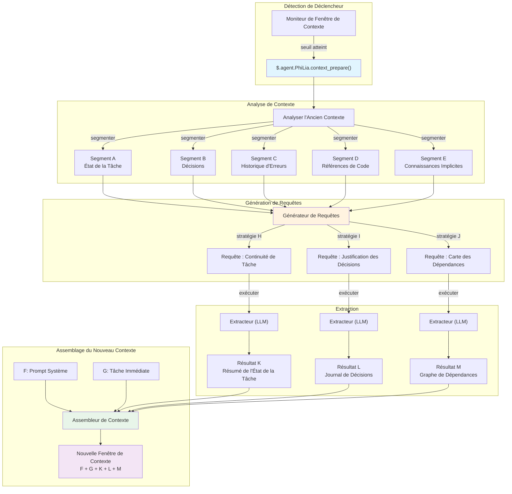
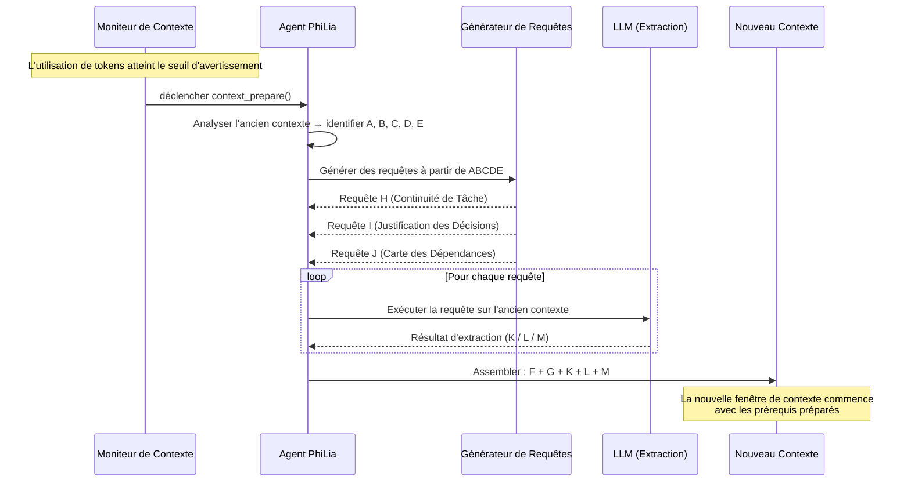

# Mécanisme de Préparation de Contexte

## Aperçu

La Préparation de Contexte est un mécanisme d'extraction proactive qui remplace la compression de contexte traditionnelle. Au lieu de compresser de manière avec perte l'ancien historique de conversation, elle analyse le contexte existant, génère des requêtes ciblées et extrait précisément les informations nécessaires pour amorcer une nouvelle fenêtre de contexte. Le mécanisme est détenu par l'agent PhiLia et exposé via `$.agent.PhiLia.context_prepare()`.

## Énoncé du Problème

### Limites de la Fenêtre de Contexte

Les agents LLM opèrent dans des fenêtres de contexte finies. Les tâches de longue durée — refactorings multi-fichiers, sessions de débogage s'étendant sur des dizaines de messages, ou flux de travail complexes en plusieurs étapes — finissent par épuiser le budget de tokens disponible. Lorsque cela se produit, le système doit décider quoi préserver et quoi jeter.

### La Compression Perd des Détails

Les approches traditionnelles de compression de contexte (résumé, troncature, fenêtre glissante) sont intrinsèquement avec perte. Un compresseur ne sait pas ce dont le *prochain* contexte aura besoin, il doit donc deviner. Des détails critiques sont inévitablement perdus :

- Les noms de variables et leurs valeurs actuelles
- Les décisions intermédiaires et leur justification
- Les états d'erreur qui sont apparus et ont été partiellement résolus
- Les dépendances implicites entre les tâches

Le défaut fondamental : **la compression optimise pour la brièveté, pas la pertinence**.

### Interférence Entre Tâches

Lorsqu'une fenêtre de contexte contient plusieurs tâches ou sujets, compresser l'historique d'une tâche corrompt souvent les informations nécessaires à une autre. Un résumé qui préserve l'état de la Tâche A peut masquer la chaîne d'erreur critique de la Tâche B. Il n'existe pas de stratégie de compression universelle qui serve tous les besoins futurs possibles.

### La Vraie Question

> De quoi la *prochaine* fenêtre de contexte a-t-elle besoin de savoir du contexte *actuel* ?

Ce n'est pas une question de compression. C'est une question de **recherche d'information** — et la réponse dépend de ce qui vient ensuite, pas de ce qui est venu avant.

## Concept Central

### Extraction Proactive vs. Compression

| Aspect | Compression | Préparation de Contexte |
| --- | --- | --- |
| Direction | Passé → passé plus court | Passé → extrait prêt pour le futur |
| Connaissance du futur | Aucune | Les requêtes anticipent les besoins à venir |
| Perte d'information | Inévitable, non ciblée | Ciblée, intentionnelle |
| Analogie | Compresser un fichier | Rechercher dans une base de données |
| Plafond de qualité | Qualité du résumé | Précision d'extraction |

La Préparation de Contexte traite l'ancien contexte comme une **source de données** — similaire à la façon dont RAG traite un corpus de documents externe — mais le corpus est la conversation elle-même. Au lieu de tout compresser en un résumé, elle pose des questions ciblées à l'ancien contexte et collecte les réponses.

### Le Modèle ABCDE/KLM

Le mécanisme utilise une notation basée sur des lettres pour décrire le flux d'information :

```text
Ancien Contexte :  A + B + C + D + E
                     ↓ (analyser)
Requêtes :       ABCDE+H  ABCDE+I  ABCDE+J
                     ↓ (extraire)
Résultats :           K        L        M
                     ↓ (assembler)
Nouveau Contexte :  F + G + K + L + M
```

- **A–E** : Segments/aspects distincts de l'ancien contexte (état de la tâche, décisions, historique d'erreurs, références de code, connaissances implicites)
- **H, I, J** : Stratégies de requête dérivées de l'analyse des éléments clés de A–E. Chaque stratégie cible un besoin d'information différent
- **K, L, M** : Résultats d'extraction — les réponses précises à chaque requête
- **F, G** : Nouveau prompt système et contexte de tâche immédiat pour la nouvelle fenêtre
- **Nouveau contexte** reçoit F + G (frais) + K + L + M (extrait), en sautant l'historique complet A–E

### Pourquoi Cela Remplace la Compression

Une fois que la Préparation de Contexte existe, la compression traditionnelle devient inutile car :

1. **Aucune information n'est perdue par conjecture** — les requêtes sont générées en fonction de ce dont le nouveau contexte aura réellement besoin
1. **L'extraction est déterministe dans sa structure** — la même stratégie de requête produit toujours la même catégorie de réponse
1. **Des angles multiples assurent la couverture** — les requêtes H/I/J couvrent différentes dimensions (état de la tâche, contexte d'erreur, justification des décisions)
1. **L'ancien contexte reste accessible** — il n'est pas jeté mais plutôt *interrogé à la demande* pendant la phase de préparation

## Architecture

### Flux de Haut Niveau



### Diagramme de Séquence



## Conception de l'API

### `$.agent.PhiLia.context_prepare()`

Le point d'entrée principal. Appelé lorsque le moniteur de fenêtre de contexte détecte que l'utilisation de tokens a atteint le seuil d'avertissement.

```typescript
interface ContextPrepareRequest {
    old_context: string;
    current_task: string;
    warning_threshold: number;
    current_usage: number;
    max_tokens: number;
}

interface ContextPrepareResult {
    segments: ContextSegment[];
    queries: GeneratedQuery[];
    extractions: ExtractionResult[];
    prepared_context: string;
    metadata: {
        old_context_tokens: number;
        prepared_context_tokens: number;
        compression_ratio: number;
        queries_executed: number;
        extraction_time_ms: number;
    };
}

// Point de terminaison de l'API PhiLia
$.agent.PhiLia.context_prepare(request: ContextPrepareRequest): ContextPrepareResult
```

### `$.agent.PhiLia.context_query()`

Une API de niveau inférieur pour exécuter des requêtes individuelles sur un contexte. Utilisée en interne par `context_prepare()` mais également disponible pour les requêtes ad-hoc.

```typescript
interface ContextQueryRequest {
    context: string;
    query: string;
    strategy: "task_continuity" | "decision_rationale" | "dependency_map" | "custom";
    max_result_tokens: number;
}

interface ContextQueryResult {
    result: string;
    confidence: number;
    source_segments: string[];
    tokens_used: number;
}

$.agent.PhiLia.context_query(request: ContextQueryRequest): ContextQueryResult
```

### `$.agent.PhiLia.context_segment()`

Analyse un contexte et le décompose en segments étiquetés (A–E).

```typescript
interface SegmentRequest {
    context: string;
    max_segments: number;
}

interface Segment {
    id: string;           // "A", "B", "C", etc.
    label: string;        // "État de la Tâche", "Décisions", etc.
    content: string;
    token_count: number;
    importance_rank: number;
}

$.agent.PhiLia.context_segment(request: SegmentRequest): Segment[]
```

## Stratégie de Requête

### Comment les Requêtes H/I/J Sont Générées

Le processus de génération de requêtes prend l'ancien contexte segmenté (A–E) et produit trois catégories de requêtes, chacune ciblant une dimension différente de l'information nécessaire au nouveau contexte.

### Stratégie H : Continuité de Tâche

**Objectif** : S'assurer que le nouveau contexte peut reprendre la tâche en cours sans perte de progression.

**Logique de génération** :

1. Identifier les tâches actives à partir des segments A et E (état de la tâche + connaissances implicites)
1. Extraire les indicateurs de progression actuels (ce qui est fait, ce qui est en cours, ce qui est bloqué)
1. Générer une requête qui demande : *"Quel est l'état actuel de toutes les tâches actives, et quelles sont les prochaines étapes ?"*

**Exemple de requête** :

```text
Étant donné l'historique de conversation, identifier :
1. Toutes les tâches actuellement en cours et leur état d'achèvement
2. Tout blocage ou erreur non résolue
3. L'étape suivante exacte qui allait être entreprise
4. Les chemins de fichiers et numéros de ligne actuellement modifiés
```

### Stratégie I : Justification des Décisions

**Objectif** : Préserver le *pourquoi* derrière les décisions, pas seulement le *quoi*.

**Logique de génération** :

1. Parcourir les segments B et C (décisions + historique d'erreurs) pour les points de choix
1. Identifier les décisions où des alternatives ont été envisagées et rejetées
1. Générer une requête qui demande : *"Quelles décisions ont été prises, quelles alternatives ont été rejetées, et pourquoi ?"*

**Exemple de requête** :

```text
À partir de cette conversation, extraire :
1. Toutes les décisions architecturales ou d'implémentation prises
2. Pour chaque décision : quelles alternatives ont été envisagées
3. Pour chaque décision : la raison spécifique pour laquelle l'approche choisie a été préférée
4. Toute contrainte ou exigence qui a influencé ces choix
```

### Stratégie J : Carte des Dépendances

**Objectif** : Capturer les relations entre les éléments de code, les fichiers et les concepts.

**Logique de génération** :

1. Parcourir les segments D et E (références de code + connaissances implicites) pour les relations d'entités
1. Cartographier quels fichiers dépendent desquels, quelles fonctions appellent lesquelles, quels concepts sont liés
1. Générer une requête qui demande : *"Quelles sont les dépendances et relations clés entre les entités discutées ?"*

**Exemple de requête** :

```text
Analyser la conversation et cartographier :
1. Tous les fichiers/modules mentionnés et leurs relations
2. Les chaînes d'appel de fonctions discutées ou modifiées
3. Le flux de données entre les composants
4. Les valeurs de configuration et où elles sont utilisées
5. Toute dépendance implicite non directement énoncée mais impliquée par le travail
```

### Extensibilité

Les trois stratégies (H, I, J) sont l'ensemble par défaut. Le système prend en charge les stratégies personnalisées :

```typescript
interface QueryStrategy {
    id: string;
    name: string;
    description: string;
    source_segments: string[];     // quels segments analyser
    query_template: string;        // template avec espaces réservés {segment_X}
    priority: number;              // priorité d'exécution
    max_result_tokens: number;
}
```

De nouvelles stratégies peuvent être enregistrées via la configuration, permettant des modèles d'extraction spécifiques au domaine.

## Points d'Intégration

### Moniteur de Fenêtre de Contexte

Le déclencheur de la Préparation de Contexte réside dans le sous-système de surveillance de la fenêtre de contexte. Lorsque l'utilisation de tokens franchit le seuil d'avertissement (par défaut : 80% du max), le moniteur appelle `$.agent.PhiLia.context_prepare()`.

```rust
// Dans le moniteur de fenêtre de contexte (conceptuel)
fn check_context_health(&mut self) {
    let usage_ratio = self.current_tokens as f64 / self.max_tokens as f64;
    if usage_ratio >= self.warning_threshold {
        let result = philia.context_prepare(ContextPrepareRequest {
            old_context: self.get_full_context(),
            current_task: self.get_current_task_description(),
            warning_threshold: self.warning_threshold,
            current_usage: self.current_tokens,
            max_tokens: self.max_tokens,
        });
        self.spawn_new_context(result.prepared_context);
    }
}
```

### Intégration skill_chain.rs

L'exécuteur de chaîne de compétences doit être conscient de la préparation de contexte. Lorsqu'une chaîne de compétences s'étend sur plusieurs fenêtres de contexte, le mécanisme de préparation garantit que :

1. L'état de la chaîne de compétences est capturé dans le segment A (état de la tâche)
1. L'entrée/sortie de la compétence actuelle est capturée dans le segment D (références de code)
1. Les étapes restantes de la chaîne sont préservées dans le résultat d'extraction K (continuité de tâche)

```rust
// skill_chain.rs (intégration conceptuelle)
impl SkillChainExecutor {
    fn execute_step(&mut self, step: ChainStep) -> Result<StepResult> {
        // Avant l'exécution, vérifier si la préparation de contexte est nécessaire
        if self.context_monitor.should_prepare() {
            let prepared = self.philia.context_prepare(
                self.build_prepare_request()
            )?;
            self.context = prepared.prepared_context;
        }
        // Continuer avec l'exécution de l'étape
        self.execute_with_context(step, &self.context)
    }
}
```

### Propriété de l'Agent PhiLia

La Préparation de Contexte est une capacité détenue par PhiLia. Cela signifie :

- L'API `$.agent.PhiLia.context_prepare()` est enregistrée comme une compétence PhiLia
- PhiLia gère les templates de génération de requêtes et les stratégies d'extraction
- Les autres agents demandent la préparation de contexte via PhiLia par le protocole standard d'invocation de compétence
- PhiLia peut tirer parti de son magasin de connaissances pour enrichir les requêtes avec des modèles historiques

### Création de Contexte

Lorsque le système crée une nouvelle fenêtre de contexte, le contexte préparé (F + G + K + L + M) remplace le résumé compressé traditionnel :

```rust
fn spawn_new_context(&mut self, prepared: ContextPrepareResult) {
    let system_prompt = self.build_system_prompt();      // F
    let immediate_task = self.get_current_task();         // G
    let new_context = format!(
        "{}\n\n{}\n\n---\n## Résultats de la Préparation de Contexte\n### État de la Tâche\n{}\n### Journal de Décisions\n{}\n### Dépendances\n{}\n",
        system_prompt,    // F
        immediate_task,   // G
        prepared.extractions[0].result,  // K
        prepared.extractions[1].result,  // L
        prepared.extractions[2].result,  // M
    );
    self.launch_context(new_context);
}
```

## Phases d'Implémentation

### Phase 1 : Fondation (MVP)

- Implémenter `$.agent.PhiLia.context_segment()` — analyse et segmentation de contexte
- Implémenter les trois stratégies de requête par défaut (H : continuité de tâche, I : justification des décisions, J : carte des dépendances)
- Implémenter `$.agent.PhiLia.context_prepare()` — orchestration de segment → requête → extraire → assembler
- Intégrer avec le déclencheur du moniteur de fenêtre de contexte
- Valider avec des conversations à tâche unique

### Phase 2 : Robustesse

- Ajouter la notation de confiance aux résultats d'extraction
- Implémenter des stratégies de repli lorsque la confiance d'extraction est faible
- Ajouter le support de streaming pour les grands contextes
- Optimisation des performances : exécution parallèle des requêtes
- Ajouter `$.agent.PhiLia.context_query()` pour les requêtes ad-hoc

### Phase 3 : Intelligence

- Apprendre les stratégies de requête optimales à partir des résultats de préparation historiques
- Pondération adaptative des segments en fonction du type de tâche
- Résolution de références inter-contextes (lier les résultats de préparation à travers plusieurs créations)
- Intégration avec la sédimentation de mémoire pour la rétention à long terme

### Phase 4 : Remplacement Complet

- Supprimer le chemin de code hérité de compression de contexte
- La Préparation de Contexte devient le seul mécanisme pour les transitions de contexte
- Télémétrie complète et métriques de qualité
- Documentation et guide de migration pour les agents personnalisés

## Exemples

### Exemple 1 : Refactoring Multi-Fichiers

**Scénario** : Un agent refactore une crate Rust, modifiant 15 fichiers à travers 3 modules. La fenêtre de contexte se remplit après avoir modifié le fichier 10.

**Ancien contexte (A–E)** :

- **A** (État de la Tâche) : 10/15 fichiers modifiés, modules `auth` et `storage` terminés, `api` en cours
- **B** (Décisions) : Choix d'abstraction basée sur les traits plutôt que la distribution par enum ; maintien de la compatibilité ascendante via `#[deprecated]`
- **C** (Erreurs) : Problème de durée de vie rencontré dans `storage/mod.rs:142`, résolu avec `Arc<Mutex<>>`
- **D** (Références de Code) : `auth/traits.rs`, `storage/mod.rs:142`, `api/handler.rs:38-56`
- **E** (Implicite) : La struct `User` doit rester `Clone` pour les crates en aval ; la couverture de test est suivie

**Requêtes générées** :

- **H** (Continuité de Tâche) : "Quels fichiers restent à modifier, quel est le modèle appliqué, et quel est le prochain fichier à refactorer ?"
- **I** (Justification des Décisions) : "Pourquoi l'abstraction basée sur les traits a-t-elle été choisie plutôt que la distribution par enum, et quelles contraintes de compatibilité ascendante existent ?"
- **J** (Carte des Dépendances) : "Cartographier les dépendances entre les modules `auth`, `storage` et `api`, en notant quelles structs/traits traversent les frontières des modules."

**Les résultats d'extraction (K, L, M)** sont assemblés avec le nouveau prompt système (F) et l'instruction de tâche suivante (G).

### Exemple 2 : Session de Débogage

**Scénario** : Débogage d'un problème de connexion WebSocket qui s'étend sur plusieurs hypothèses et tentatives de test.

**Ancien contexte (A–E)** :

- **A** (État de la Tâche) : Le problème est circonscrit à la phase de handshake ; le heartbeat n'est pas la cause
- **B** (Décisions) : Exclusion de la mauvaise configuration TLS ; exclusion des interférences du proxy ; l'hypothèse actuelle est l'ordre des en-têtes
- **C** (Erreurs) : `ConnectionReset` à 3s, reproduit de manière cohérente avec curl mais pas avec le navigateur
- **D** (Références de Code) : `ws/handshake.rs:67-89`, `headers/mod.rs:23`, fichier de test `tests/ws_test.rs`
- **E** (Implicite) : Le serveur est derrière nginx ; le problème n'apparaît qu'en production, pas en développement local

**Les requêtes générées** extraient l'état de débogage, les hypothèses rejetées et les pistes d'investigation restantes dans le nouveau contexte.

### Exemple 3 : Chaîne de Compétences Inter-Agents

**Scénario** : PhiLia délègue une chaîne de tâches à Skemma (conception de schéma) puis Logos (documentation). Le contexte se remplit pendant le travail de Logos.

**Ancien contexte (A–E)** :

- **A** (État de la Tâche) : Conception du schéma terminée, documentation à 60%
- **B** (Décisions) : Le schéma utilise des tables de jonction pour les relations M:N selon les directives architecturales de PhiLia
- **C** (Erreurs) : Skemma a signalé une ambiguïté dans la cardinalité `user_roles`, résolue en ajoutant une contrainte `UNIQUE`
- **D** (Références de Code) : `schema.sql:45-67`, `docs/api/endpoints.md:12-34`
- **E** (Implicite) : La documentation doit correspondre au format de spécification OpenAPI 3.0 utilisé ailleurs dans le projet

La préparation garantit que le nouveau contexte de Logos reçoit les décisions de schéma et la contrainte de format de documentation, sans avoir besoin de la conversation complète de conception de Skemma.
