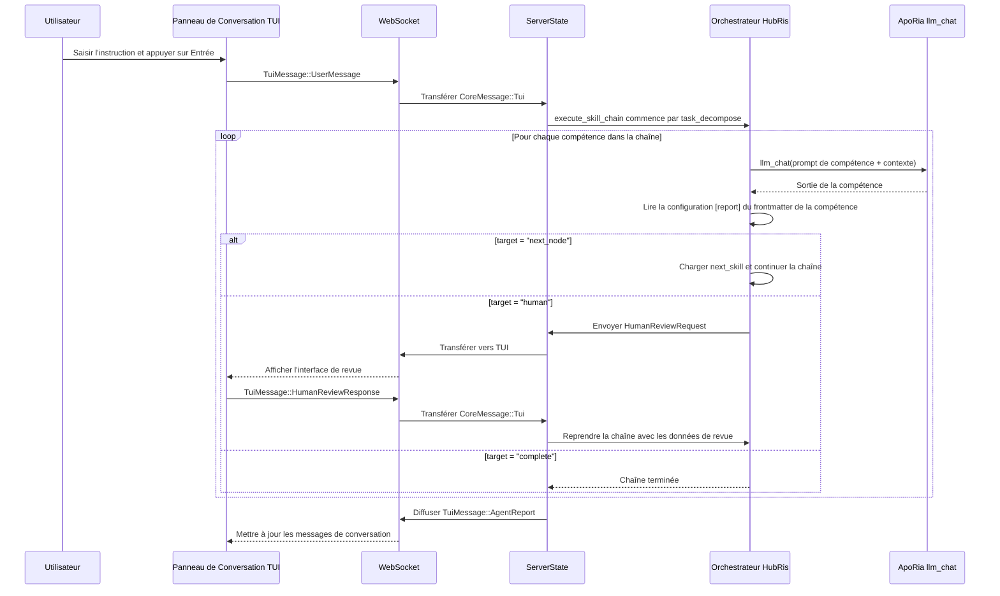

# Conception de l'Orchestration de Conversation (HubRis + ApoRia)

## Contexte

HubRis est un "Agent de Compétence Pure" — toutes les capacités sont des compétences de prompt uniquement
invoquées via ApoRia `llm_chat`. Après l'implémentation de la couche de routage de rapport,
les compétences déclarent leur comportement de routage dans le frontmatter TOML via une
section `[report]`, remplaçant la logique d'orchestration codée en dur.

## Objectifs

1. Les compétences déclarent le comportement de routage dans le frontmatter (pas codé en dur).
1. Un exécuteur de chaîne de compétences générique remplace le pipeline à 2 étapes codé en dur.
1. La revue humaine est une cible de routage de première classe.
1. Nettoyage du langage des prompts : les fichiers plats de compétence/MCP sont en anglais uniquement.

## Configuration de Rapport de Compétence (Frontmatter TOML)

```toml
[report]
target = "next_node"              # "next_node" | "parent" | "human" | "complete"
next_skill = "workplan_generate"  # requis si target = "next_node"
```

## Chaîne de Compétences HubRis

```text
task_decompose → workplan_generate → operator → workplan_execute → submit_report → human
```

## Flux de Bout en Bout



## Cibles de Routage de Rapport

| Cible       | Comportement                                                        |
| --- | --- |
| `next_node`  | L'exécuteur charge la compétence nommée dans `next_skill` et l'exécute.     |
| `parent`     | Rend le contrôle à l'orchestrateur parent (réservé pour les chaînes imbriquées). |
| `human`      | Met en pause la chaîne, envoie `HumanReviewRequest` à TUI, reprend sur `HumanReviewResponse`. |
| `complete`   | Termine la chaîne et retourne le `AgentReport` accumulé.  |

## Structure de Fichiers (Phase 1)

```text
res/prompts/agents/hubris/skills/
  task_decompose.md
  workplan_generate.md
  operator.md
  workplan_execute.md
  submit_report.md
```

Chaque fichier est un document Markdown plat, en anglais uniquement, avec un frontmatter TOML
contenant la section `[report]` et toute autre métadonnée de compétence.

## Configuration de Langue Humaine

La configuration d'exécution de l'agent inclut un champ `human_language` utilisant des noms de langue natifs
(par exemple `"中文"`, `"English"`, `"日本語"`). Cela contrôle la langue
de toute sortie destinée à l'utilisateur sans affecter les fichiers de prompt de compétence en anglais uniquement.

## Politique de Modèle par Défaut

Le démarrage utilise `glm-4.7-flash` comme modèle par défaut de l'environnement normalisé.
ApoRia `llm_chat` utilise ce modèle par défaut pour maintenir les coûts de développement et
de test bas.

## Politique de Repli en Cas d'Échec

1. Si une compétence échoue : retourner un message d'échec et terminer la chaîne actuelle.
1. Si ApoRia est hors ligne : retourner le message `Agent non prêt`.
1. Si la revue humaine expire : retourner un avis de délai sans bloquer

les conversations suivantes.
