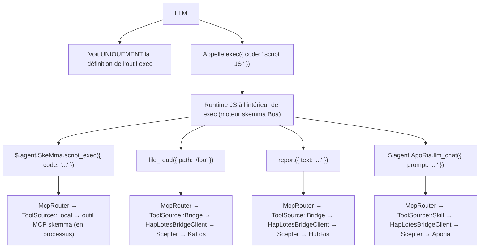
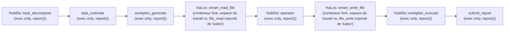
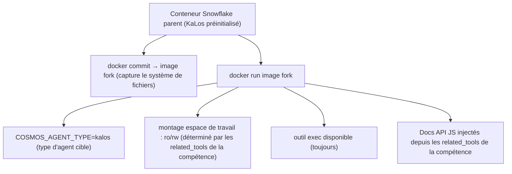

# Architecture de Routage de Compétences Inter-Agents

## Problème

La chaîne de compétences (`execute_skill_chain`) utilise une architecture de micro-noyau exec-only. Le LLM ne voit que trois outils : `exec`, `write_to_var`, `write_to_var_json` — pas de listes blanches d'outils par agent, pas de définitions d'outils par compétence. Toute l'invocation d'outils MCP se produit à l'intérieur du runtime TypeScript (moteur IEPL) via des imports de modules ES et des APIs TS inter-agents comme `file_read()`.

## Principes de Conception

1. **Micro-noyau exec-only** — Le LLM ne reçoit jamais directement les définitions d'outils MCP. Il dispose de trois outils : `exec`, `write_to_var` et `write_to_var_json`. Tous les appels d'outils se produisent à l'intérieur du runtime TS du moteur IEPL.
1. **`related_tools` pilote tout** — Les compétences déclarent `related_tools` dans leur frontmatter TOML. Ces noms deviennent de la documentation d'API TS injectée dans le prompt LLM (par exemple `file_read()`, `report()`).
1. **Routage via API TS → McpRouter** — À l'intérieur du runtime IEPL de `exec`, les imports de modules ES sont routés vers l'implémentation correcte de l'outil MCP via `McpRouter`. Les appels inter-agents comme `file_read()` sont résolus vers l'implémentation `file_read` de l'agent KaLos.
1. **Isolation de conteneur** — Les conteneurs enfants héritent du système de fichiers parent via le fork `docker commit`. Les espaces de travail sont montés en lecture seule ou lecture-écriture selon les `related_tools` de la compétence.
1. **`related_tools` déterminent le mode lecture/écriture** — `skill_needs_write_access()` inspecte `related_tools` pour les noms d'outils d'écriture (`file_write`, `file_edit`, etc.) afin de décider du mode de montage du conteneur fork.

## Architecture

### Flux du Micro-Noyau Exec-Only



### Flux d'Exécution de la Chaîne de Compétences



### Mécanisme de Fork de Conteneur



## Détails d'Implémentation

### Composants Principaux

| Composant | Fichier | Responsabilité |
| --- | --- | --- |
| `skill_to_agent_name()` | `skill_chain.rs` | Recherche le nom de l'agent qui possède une compétence donnée |
| `skill_needs_write_access()` | `skill_chain.rs` | Inspecte `related_tools` pour les noms d'outils d'écriture afin de déterminer le mode de montage du conteneur fork |
| `fork_for_sub_skill()` | `snowflake_manager.rs` | Effectue `docker commit` + `docker run` ; monte l'espace de travail en ro/rw selon `skill_needs_write_access()` |
| `find_by_agent_type()` | `snowflake_manager.rs` | Recherche en ordre inverse, retournant le conteneur fork le plus récent |
| `McpRouter` | `packages/cosmos/src/bin/cosmos/mcp_router.rs` | Route les appels d'import de module ES : `ToolSource::Local` → skemma, `ToolSource::Bridge` → HapLotes |
| `HapLotesBridgeClient` | `packages/agents/haplotes/src/bridge/client.rs` | Pont Cosmos → Scepter : `bridge_call()`, `bridge_list_tools()` |
| `BridgeInvoker` | `packages/scepter/src/agent_manager/bridge_invoker.rs` | Côté Scepter : route les appels d'outils vers le bon agent enregistré |
| `build_js_api_docs()` | `skill_chain.rs` | Génère la documentation API JS à partir des `related_tools` de la compétence pour l'injection dans le prompt |
| `build_skill_user_prompt(agent_name, ...)` | `skill_chain.rs` | Assemble le prompt de compétence avec les docs API JS injectées |

### Comment les Docs API JS Sont Générées

Le frontmatter TOML d'une compétence déclare `related_tools` :

```toml
# smart_read_file.md
related_tools = ["file_read", "file_list", "file_exists"]
```

Le système résout chaque outil vers son agent propriétaire et génère des docs API TS à partir des déclarations `.d.ts` :

```typescript
// Injecté dans le prompt LLM comme APIs disponibles (avec déclarations de type de .d.ts) :
file_read({ path: string }): Promise<string>
file_list({ dir: string }): Promise<string[]>
file_exists({ path: string }): Promise<boolean>
report({ text: string }): Promise<void>
```

Le LLM appelle ces APIs dans son code `exec` ; le McpRouter distribue vers l'implémentation de l'outil MCP de l'agent correct.

### Cycle de Vie du Fork

1. **Créer** : `docker commit` conteneur parent → image fork → `docker run` conteneur enfant
1. **Connecter** : `CosmosConnector` se connecte au socket Unix du conteneur enfant
1. **Pont** : `HapLotesBridgeClient` à l'intérieur du conteneur fork se connecte au `HapLotesBridgeServer` de Scepter
1. **Exécuter** : Le LLM appelle `exec` avec du code JS ; le runtime JS utilise McpRouter → pont → agents Scepter
1. **Nettoyer** : Quand la chaîne se termine, `snowflake.remove()` détruit le conteneur + `docker rmi` nettoie l'image

### Stratégie de Montage de l'Espace de Travail

| Type de compétence | Caractéristique `related_tools` | Montage de l'espace de travail |
| --- | --- | --- |
| Lecture seule (smart_read_file) | Seulement file_read, file_list, file_exists | `:ro` (lecture seule) |
| Écriture (smart_write_file) | Inclut file_write, file_edit, file_delete | `:rw` (lecture-écriture) |

### Routage d'Outils Inter-Agents

À l'intérieur du runtime JS de `exec`, le McpRouter résout les appels d'outils via le pont HapLotes :

```mermaid
flowchart TB
    subgraph Pont["Appel par Pont"]
        A1["exec({ code: &quot;file_read({path:'/foo'})&quot; })"] --> B1["McpRouter résout &quot;kalos&quot; + &quot;file_read&quot;"]
        B1 --> C1["tool_to_source → ToolSource::Bridge"]
        C1 --> D1["HapLotesBridgeClient → bridge.call(&quot;kalos.file_read&quot;, params)"]
        D1 --> E1["HapLotesBridgeServer de Scepter → BridgeInvoker"]
        E1 --> F1["route vers l'agent KaLos → outil MCP file_read"]
    end
    subgraph Local["Appel Local"]
        A2["exec({ code: &quot;$.agent.SkeMma.script_exec({code:'1+1'})&quot; })"] --> B2["McpRouter résout &quot;skemma&quot; + &quot;script_exec&quot;"]
        B2 --> C2["tool_to_source → ToolSource::Local"]
        C2 --> D2["invoque l'outil MCP skemma directement (moteur Boa en processus)"]
    end
```



### Détection d'Accès en Écriture

```rust
fn skill_needs_write_access(skill: &Skill) -> bool {
    const WRITE_TOOLS: &[&str] = &["file_write", "file_edit", "file_delete", "file_rename"];
    skill.related_tools.iter().any(|t| WRITE_TOOLS.contains(&t.as_str()))
}
```

Cette fonction lit les `related_tools` de la compétence depuis son frontmatter TOML. Si un outil d'écriture est présent, l'espace de travail du conteneur fork est monté en lecture-écriture.

## Configuration

### Frontmatter TOML de Compétence

```toml
# smart_read_file.md
+++
related_tools = ["file_read", "file_list", "file_exists"]

[[next_action]]
agent = "hubris"
name = "operator"
+++

# smart_write_file.md
+++
related_tools = ["file_write", "file_edit"]

[[next_action]]
agent = "hubris"
name = "workplan_execute"
+++
```

### Chaîne next_action (TOML de compétence)

```toml
# workplan_generate.md
[[next_action]]
agent = "kalos"
name = "smart_read_file"

# smart_read_file.md
[[next_action]]
agent = "hubris"
name = "operator"

# operator.md
[[next_action]]
agent = "kalos"
name = "smart_write_file"

# smart_write_file.md
[[next_action]]
agent = "hubris"
name = "workplan_execute"
```

## Référence API JS de Compétence

| Compétence | Agent | APIs JS (depuis `related_tools`) | Statut |
| --- | --- | --- | --- |
| `smart_read_file` | KaLos | `file_read()`, `file_list()`, `file_exists()` | ✅ Implémenté |
| `smart_write_file` | KaLos | `file_write()`, `file_edit()` | ✅ Implémenté |
| `exec_script` | SkeMma | `$skeMma.script_exec()` | En attente |
| `smart_command` | SkoPeo | `$skoPeo.smart_command_execute()` | En attente |

## Risques et Considérations

1. **Ressources de conteneur** — Chaque fork crée un nouveau conteneur Docker ; les conteneurs sont automatiquement nettoyés à la fin de la chaîne.
1. **Coût en jetons** — Chaque fork a son propre contexte LLM indépendant ; les docs API JS ajoutent une surcharge modeste par compétence.
1. **Profondeur de la chaîne de fork** — Actuellement pas de limite de profondeur ; les forks ne se produisent que lorsque `step_index > 1`.
1. **Passage de contexte** — Parent → enfant passe par le contenu du rapport ; des stratégies de troncature peuvent être nécessaires.
1. **Sécurité parallèle** — Lorsque plusieurs chaînes font un fork concurrent du même type d'agent, la recherche en ordre inverse garantit que chacune utilise son dernier fork.
1. **Contrôle de surface API** — Le LLM ne peut appeler que les APIs JS listées dans les docs injectées ; McpRouter rejette les noms d'outils inconnus.
