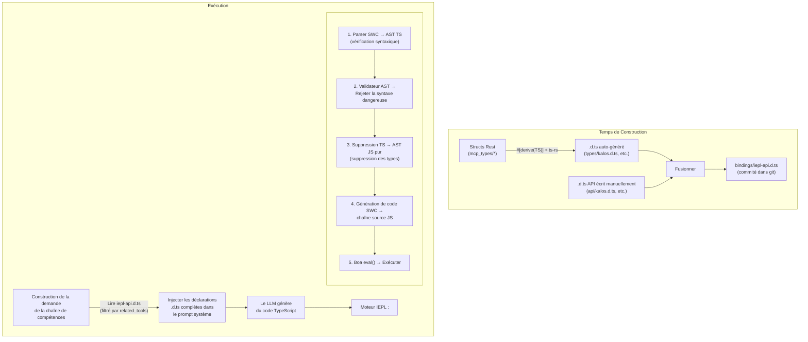

# 22 — Conception du Moteur d'Exécution TypeScript IEPL

## Aperçu

IEPL (In-Execution Prompt Language) est une mise à niveau architecturale du runtime JS Cosmos/SkeMma existant, faisant évoluer le code d'exécution généré par LLM de JavaScript à TypeScript. Les modifications principales incluent :

1. **Crate SWC intégrée** : Vérification stricte de la syntaxe, suppression des types et transpilation du TypeScript généré par LLM
1. **Génération de types Rust derive → TypeScript** : Export automatique des structs Rust vers des fichiers de déclaration `.d.ts` via `ts-rs`
1. **Prompt de Compétence Type-safe** : Injection des déclarations `.d.ts` complètes au lieu de listes de fonctions codées en dur, améliorant significativement la robustesse

## État Actuel et Problèmes

### Flux d'Exécution Actuel


### Problèmes Existants

| Problème | Description |
| --- | --- |
| **Aucune contrainte de type** | Le code JS généré par LLM n'a aucune information de type statique ; les fautes de frappe de paramètres ne sont détectées qu'à l'exécution |
| **Descriptions d'interface fragiles** | `build_report_tool_instruction()` code en dur des listes de texte comme `- file_read (importé de 'kalos')`, incapable d'exprimer les types de paramètres ou les structures de valeur de retour |
| **Aucune pré-validation** | Le code LLM va directement dans `eval()` de Boa ; les erreurs de syntaxe ne sont découvertes qu'au moment de l'exécution |
| **Schéma et prompt découplés** | `McpSchemaWriter` génère des fichiers de schéma JSON mais ils ne sont jamais utilisés pour l'injection de prompt |
| **Paramètres d'outils non typés** | Les paramètres d'outils actuels sont passés comme `serde_json::Value`, extraits manuellement via `get("field")`, sans garantie de sécurité de type |

### Fichiers Clés Concernés

| Fichier | Responsabilité Actuelle |
| --- | --- |
| `packages/agents/skemma/src/js_runtime/runtime.rs` | Runtime JS Boa, `exec()` appelle directement `eval()` |
| `packages/agents/skemma/src/mcp/tools/script_exec.rs` | Accepte uniquement le langage `"javascript"` |
| `packages/cosmos/src/bin/cosmos/js_repl/js_commands.rs` | Génère dynamiquement `globalThis.$agent.tool = (...) => ...` |
| `packages/scepter/src/state_machine/skill_chain/prompt.rs:51` | `build_report_tool_instruction()` code en dur la liste API |
| `packages/shared/src/mcp_types/*.rs` | Toutes les définitions de type de résultat d'outil MCP (serde uniquement, pas d'export TS) |
| `packages/shared/src/mcp_types/schema.rs` | `McpSchemaWriter` génère un schéma JSON (non utilisé par le prompt) |

## Architecture Cible



## Sélection Technologique

### 1. Génération de Types Rust → TypeScript : `ts-rs`

| Attribut | Valeur |
| --- | --- |
| Crate | `ts-rs` (Aleph-Alpha/ts-rs) |
| Version | ≥ 12.0 |
| Étoiles | 1 772 |
| Téléchargements | ~7,3M |
| Licence | MIT |

**Justification :**

- Profondément compatible avec l'écosystème `serde` existant du projet (la fonctionnalité `serde-compat` reconnaît automatiquement `rename`/`rename_all`/`skip`, etc.)
- `#[derive(TS)]` est non intrusif, ne modifie pas les définitions de struct existantes
- Prend en charge `#[ts(export)]` pour l'export automatique vers le répertoire `bindings/` pendant `cargo test`
- Génère des alias `type` TypeScript standard, directement utilisables dans `.d.ts`
- Prend en charge les imports inter-fichiers, les génériques, les types union
- Intégration riche de l'écosystème : `chrono-impl`, `uuid-impl`, `serde-json-impl`

**Alternatives Exclues :**

| Crate | Raison de l'Exclusion |
| --- | --- |
| `specta` | Biaisé vers l'écosystème Tauri/rspc ; l'export de type de fonction n'est pas nécessaire dans ce scénario |
| `typeshare` | Piloté par CLI, peu pratique pour l'intégration CI ; génère `interface` au lieu de `type` (pas de différence pratique pour les prompts LLM) |
| `tsify` | Lié à `wasm-bindgen` ; ce projet n'est pas un flux de travail WASM |

### 2. Analyse et Transpilation TypeScript : SWC

| Crate | Objectif |
| --- | --- |
| `swc_core` (fonctionnalité : `ecma_parser`) | Analyser la source TS en AST |
| `swc_core` (fonctionnalité : `ecma_ast`) | Types de nœuds AST |
| `swc_core` (fonctionnalité : `ecma_visit`) | Parcours/transformation AST |
| `swc_core` (fonctionnalité : `ecma_transforms_typescript`) | Suppression des types TS → JS |
| `swc_core` (fonctionnalité : `ecma_codegen`) | Génération de code AST → source |

**Capacités Clés :**

- Support complet de la syntaxe TypeScript (génériques, types conditionnels, types mappés, décorateurs, etc.)
- Implémentation Rust native haute performance (20–70x plus rapide que tsc)
- La suppression de type (`strip`) convertit l'AST TS en AST JS
- Rapport d'erreurs au niveau syntaxique (crochets non fermés, jetons invalides, etc.)

**Limitations :**

- SWC **n'effectue pas de vérification complète des types** (pas d'équivalent de `tsc --noEmit`). Cela signifie qu'il ne peut pas détecter les erreurs sémantiques comme "appeler une propriété inexistante"
- Pour ce scénario, c'est acceptable : le code généré par LLM a principalement besoin de garanties de correction syntaxique ; le moteur Boa fournit une sécurité de type dynamique à l'exécution
- Si une vérification complète des types est nécessaire à l'avenir, une validation personnalisée au niveau AST peut être introduite (voir "Validateur AST" ci-dessous)

## Conception Détaillée

### Phase 1 : Infrastructure d'Export de Types ts-rs

#### 1.1 Nouvelle Dépendance d'Espace de Travail

```toml
# Cargo.toml (espace de travail)
[workspace.dependencies]
ts-rs = { version = "12", features = ["serde-compat", "format"] }
```

#### 1.2 Ajouter `#[derive(TS)]` aux Types MCP

Tous les structs sous `packages/shared/src/mcp_types/` reçoivent la dérivation `ts-rs` :

```rust
// packages/shared/src/mcp_types/kalos.rs
use ts_rs::TS;

# [derive(Debug, Clone, Serialize, Deserialize, TS)]
# [ts(export)]
pub struct FileReadResult {
    pub path: String,
    pub size_bytes: u64,
    pub content: String,
}

# [derive(Debug, Clone, Serialize, Deserialize, TS)]
# [ts(export)]
pub struct FileListResult {
    pub path: String,
    pub total_count: usize,
    pub entries: Vec<FileEntry>,
}

// ... autres types de manière similaire
```

Les enums nécessitent une adaptation de la macro `str_enum!` :

```rust
// packages/shared/src/mcp_types/enums.rs
// Les enums générées par la macro str_enum! existante nécessitent une dérivation TS supplémentaire

# [derive(Debug, Clone, Copy, PartialEq, Eq, Serialize, Deserialize, TS)]
pub enum FileType {
    File,
    Directory,
}
// Note : la macro str_enum! doit être étendue pour dériver également TS
// ou ajouter individuellement #[derive(TS)] aux enums générées par macro existantes
```

#### 1.3 Disposition des Fichiers `.d.ts`

```text
bindings/                  # répertoire d'export par défaut ts-rs
├── types/                 # types auto-générés
│   ├── kalos.d.ts
│   ├── neikos.d.ts
│   ├── orexis.d.ts
│   ├── polemos.d.ts
│   ├── epieikeia.d.ts
│   ├── philia.d.ts
│   ├── hubris.d.ts
│   ├── skopeo.d.ts
│   ├── aporia.d.ts
│   ├── eleos.d.ts
│   ├── skemma.d.ts
│   └── enums.d.ts
├── api/                   # APIs écrites à la main
│   ├── kalos.d.ts
│   ├── neikos.d.ts
│   ├── orexis.d.ts
│   ├── hubris.d.ts
│   └── ...
└── iepl-api.d.ts          # Déclaration complète fusionnée (auto-générée)
```

#### 1.4 Exemple d'API `.d.ts` Écrite Manuellement

```typescript
// bindings/api/kalos.d.ts

import type {
  FileReadResult,
  FileListResult,
  FileWriteResult,
  FileEditResult,
  FileDeleteResult,
  FileExistsResult,
  MkDirResult,
  FileInfoResult,
} from "../types/kalos";

export interface KalosApi {
  /**
   * Lire le contenu d'un fichier
   * @param params.path - Chemin du fichier (chemin absolu)
   */
  file_read(params: { path: string }): Promise<FileReadResult>;

  /**
   * Écrire dans un fichier
   * @param params.path - Chemin du fichier
   * @param params.content - Contenu du fichier
   */
  file_write(params: { path: string; content: string }): Promise<FileWriteResult>;

  /**
   * Modifier un fichier (rechercher et remplacer)
   * @param params.path - Chemin du fichier
   * @param params.old_string - Chaîne originale à remplacer
   * @param params.new_string - Chaîne de remplacement
   */
  file_edit(params: {
    path: string;
    old_string: string;
    new_string: string;
  }): Promise<FileEditResult>;

  file_delete(params: { path: string }): Promise<FileDeleteResult>;
  file_exists(params: { path: string }): Promise<FileExistsResult>;
  file_list(params: { path: string }): Promise<FileListResult>;
  file_get_info(params: { path: string }): Promise<FileInfoResult>;
  file_create_dir(params: { path: string }): Promise<MkDirResult>;
}
```

#### 1.5 Script de Fusion au Moment de la Construction

Dans `packages/shared/build.rs` ou un `xtask` autonome :

```rust
// xtask/src/bin/iepl_codegen.rs
// 1. Exécuter cargo test pour déclencher l'export ts-rs
// 2. Lire bindings/types/*.d.ts + bindings/api/*.d.ts
// 3. Regrouper et fusionner par agent, générer le iepl-api.d.ts final
// 4. Sortie vers bindings/iepl-api.d.ts
```

Ou plus simplement, ajouter un module `iepl_codegen` dans `packages/shared/src/mcp_types/` qui déclenche l'export et la fusion pendant les tests.

**Principe clé : Une fois générés, les fichiers `.d.ts` sont commités dans git et deviennent une partie permanente de l'arborescence source.** Les modifications ultérieures des types Rust régénèrent et commitent les mises à jour.

### Phase 2 : Moteur d'Exécution IEPL

#### 2.1 Nouvelles Dépendances SWC

```toml
# Cargo.toml (espace de travail)
[workspace.dependencies]
swc_core = { version = "65", features = [
    "ecma_parser",
    "ecma_ast",
    "ecma_visit",
    "ecma_transforms_base",
    "ecma_transforms_typescript",
    "ecma_codegen",
    "common",
] }
```

#### 2.2 Cœur du Moteur IEPL

Nouveau module `iepl/` sous `packages/agents/skemma/src/` :

```text
packages/agents/skemma/src/iepl/
├── mod.rs            # Point d'entrée du module
├── engine.rs         # Moteur central IEPL (analyser → valider → supprimer les types → générer le code)
├── ast_validator.rs  # Validateur de sécurité AST
└── type_index.rs     # Index de types (construit à partir de .d.ts)
```

##### engine.rs — Flux de Transpilation Central

```rust
use anyhow::{anyhow, Result};
use swc_core::{
    common::{errors::ColorConfig, SourceFile, SourceMap, GLOBALS},
    ecma::{
        ast::Program,
        codegen::{text_writer::JsWriter, Emitter},
        parser::{lexer::Lexer, Parser, StringInput, Syntax, TsSyntax},
        transforms::{
            base::fixer::fixer,
            typescript::strip,
        },
        visit::FoldWith,
    },
};

pub struct IeplEngine {
    cm: Arc<SourceMap>,
}

pub struct TranspileResult {
    pub js_code: String,
    pub parse_errors: Vec<String>,
}

impl IeplEngine {
    pub fn new() -> Self {
        Self {
            cm: Arc::new(SourceMap::default()),
        }
    }

    /// Transpiler le code TypeScript en JavaScript
    pub fn transpile(&self, ts_code: &str) -> Result<TranspileResult> {
        let fm = self.cm.new_source_file(
            swc_core::common::FileName::Custom("iepl-input".into()),
            ts_code.into(),
        );

        // 1. Analyser TS → AST
        let mut parse_errors = Vec::new();
        let module = self.parse_ts(&fm, &mut parse_errors)?;

        if !parse_errors.is_empty() {
            return Err(anyhow!("Erreurs d'analyse TypeScript :\n{}", parse_errors.join("\n")));
        }

        // 2. Validation de sécurité AST
        let validator = AstValidator::new();
        validator.validate(&module)?;

        // 3. Suppression des types TS → JS
        let mut transforms = swc_core::common::pass::Optional::new(
            strip::strip_typescript(swc_core::common::comments::NoComments),
            true,
        );
        let program = module.fold_with(&mut transforms);

        // 4. AST → source JS
        let js_code = self.emit(program)?;

        Ok(TranspileResult {
            js_code,
            parse_errors,
        })
    }

    fn parse_ts(
        &self,
        fm: &SourceFile,
        errors: &mut Vec<String>,
    ) -> Result<Program> {
        let lexer = Lexer::new(
            Syntax::Typescript(TsSyntax {
                tsx: false,
                decorators: true,
                dts: false,
                no_early_errors: false,
                disallowAmbiguousJSXLike: true,
            }),
            Default::default(),
            StringInput::from(fm),
            None,
        );
        let mut parser = Parser::new_from(lexer);
        match parser.parse_program() {
            Ok(program) => Ok(program),
            Err(e) => {
                errors.push(format!("{:?}", e));
                Err(anyhow!("Échec de l'analyse TypeScript"))
            }
        }
    }

    fn emit(&self, program: Program) -> Result<String> {
        let mut buf = Vec::new();
        let writer = JsWriter::new(self.cm.clone(), "\n", &mut buf, None);
        let mut emitter = Emitter {
            cfg: Default::default(),
            cm: self.cm.clone(),
            comments: None,
            wr: writer,
        };
        emitter.emit_program(&program)?;
        Ok(String::from_utf8(buf)?)
    }
}
```

##### ast_validator.rs — Validateur de Sécurité

```rust
use anyhow::{anyhow, Result};
use swc_core::ecma::ast::{Module, Program};
use swc_core::ecma::visit::{Visit, VisitWith};

/// Valide que l'AST ne contient aucun motif dangereux
pub struct AstValidator {
    violations: Vec<String>,
}

impl AstValidator {
    pub fn new() -> Self {
        Self {
            violations: Vec::new(),
        }
    }

    pub fn validate(&self, program: &Program) -> Result<()> {
        // Implémenter la détection de motifs dangereux
        // - Interdire les appels eval() / Function()
        // - Interdire l'import dynamique import()
        // - Interdire l'accès à __proto__ / constructor
        // - Interdire les instructions with
        // - Optionnel : interdire l'accès aux variables globales non listées
        if self.violations.is_empty() {
            Ok(())
        } else {
            Err(anyhow!("Violations de validation AST :\n{}", self.violations.join("\n")))
        }
    }
}
```

#### 2.3 Intégration dans script_exec

Modifier `packages/agents/skemma/src/mcp/tools/script_exec.rs` :

```rust
// Avant (ligne 53) :
if !matches!(language.as_str(), "javascript" | "js" | "node") {
    return McpToolResult::failure(format!(
        "Langage non pris en charge : '{}'. Seul JavaScript est pris en charge.", language
    ));
}

// Après :
let executable_code = match language.as_str() {
    "typescript" | "ts" => {
        let engine = crate::iepl::IeplEngine::new();
        match engine.transpile(code) {
            Ok(result) => result.js_code,
            Err(e) => return McpToolResult::failure(format!("Erreur de transpilation TS : {}", e)),
        }
    }
    "javascript" | "js" | "node" => code.to_string(),
    _ => {
        return McpToolResult::failure(format!(
            "Langage non pris en charge : '{}'. Seuls TypeScript et JavaScript sont pris en charge.",
            language
        ));
    }
};
```

#### 2.4 Intégration dans le REPL JS Cosmos

Modifier le chemin d'exécution dans `packages/cosmos/src/bin/cosmos/js_repl/mod.rs` pour ajouter l'étape de transpilation IEPL avant d'appeler `runtime.exec()`.

### Phase 3 : Injection de Type dans le Prompt de Compétence

#### 3.1 Construction Actuelle du Prompt

`build_report_tool_instruction()` de `prompt.rs:51` :

```rust
// Actuel : liste API codée en dur
let items: Vec<String> = available_apis
    .iter()
    .map(|a| format!("- ${}", a))
    .collect();
parts.push(format!("\nAPIs JS disponibles :\n{}", items.join("\n")));
```

Cela génère :

```text
APIs JS disponibles :
- file_read (importé de 'kalos')
- file_write (importé de 'kalos')
- report()
```

#### 3.2 Nouvelle Construction du Prompt

```rust
pub(super) fn build_report_tool_instruction(
    next_targets: &[String],
    related_tools: &[RelatedTool],  // Changé pour accepter les infos RelatedTool complètes
) -> String {
    let mut parts = Vec::new();

    // Charger les .d.ts regroupés par agent depuis bindings/
    let type_declarations = load_iepl_type_declarations(related_tools);
    if !type_declarations.is_empty() {
        parts.push(format!(
            "Vous écrivez du code TypeScript. Déclarations de type API disponibles :\n\n\
             ```typescript\n{}\n```",
            type_declarations
        ));
    }

    // ... next_targets et mcp_conv restent inchangés
}
```

Exemple de contenu injecté dans le prompt :

```typescript
Vous écrivez du code TypeScript. Déclarations de type API disponibles :

```

// === Types (auto-générés depuis Rust) ===
type `FileReadResult` = { path: string; `size_bytes`: number; content: string };
type `FileListResult` = { path: string; `total_count`: number; entries: Array<{ name: string; `file_type`: "file" | "directory" }> };
type `FileWriteResult` = { path: string; `size_bytes`: number; status: "created" | "deleted" | "edited" | "written" };

// === API (écrites à la main) ===
interface KalosApi {
`file_read`(params: { path: string }): Promise<`FileReadResult`>;
`file_write`(params: { path: string; content: string }): Promise<`FileWriteResult`>;
`file_list`(params: { path: string }): Promise<`FileListResult`>;
// ...
}

declare const $kalos: KalosApi;

```text

#### 3.3 Chargeur .d.ts

```

// packages/shared/src/iepl/decl_loader.rs

use `include_dir`::{Dir, `include_dir`};

static IEPL_BINDINGS: Dir = `include_dir`!("$CARGO_MANIFEST_DIR/../../../bindings");

pub struct `IeplDeclLoader`;

impl `IeplDeclLoader` {
/// Charger les déclarations .d.ts requises filtrées par `related_tools`
pub fn `load_for_tools`(`related_tools`: &[`RelatedTool`]) -> String {
let mut declarations = Vec::new();

// Collecter l'ensemble des agents concernés
let agents: std::collections::HashSet<&str> = `related_tools`
.iter()
.map(|t| t.agent_name.as_str())
.collect();

for agent in &agents {
// Charger les déclarations de type auto-générées
if let Some(`types_file`) = IEPL_BINDINGS.get_file(format!("types/{}.d.ts", agent)) {
if let Ok(content) = std::str::`from_utf8`(types_file.contents()) {
declarations.push(content.to_string());
}
}

// Charger les déclarations API écrites à la main
if let Some(`api_file`) = IEPL_BINDINGS.get_file(format!("api/{}.d.ts", agent)) {
if let Ok(content) = std::str::`from_utf8`(api_file.contents()) {
declarations.push(content.to_string());
}
}
}

declarations.join("\n\n")
}
}

```text

#### 3.4 Mise à Niveau du Constructeur d'Espace de Noms JS

`build_tool_namespace_js()` de `js_commands.rs` continue de générer des wrappers de fonctions JavaScript inchangés (le moteur Boa n'exécute que du JS), mais les descriptions d'interface côté prompt sont fournies par `.d.ts` au lieu d'être codées en dur.

## Comparaison du Flux de Données

### Actuel (JavaScript)

```mermaid

flowchart TD
Meta["Métadonnées de Compétence\`nrelated_tools`:\n- kalos.file_read\n- kalos.file_write"]
Meta --> Build["`build_report_tool_instruction`\n→ '- `file_read` (importé)'\n→ '- `file_write` (importé)'\n(texte codé en dur)"]
Build -->|"injecté dans\nle prompt système"| LLM1["Le LLM génère du JavaScript\`nfile_read`({path:'x'})\n(aucune vérification de type)"]
LLM1 --> Boa1["Exécution directe Boa eval()\n(aucune pré-validation)"]

```text

### Cible (TypeScript + IEPL)

```mermaid

flowchart TD
Meta2["Métadonnées de Compétence\`nrelated_tools`:\n- kalos.file_read\n- kalos.file_write"]
Meta2 --> Loader["`IeplDeclLoader`\n→ types/kalos.d.ts\n→ api/kalos.d.ts\n(déclarations de type complètes)"]
Loader -->|"injecté dans\nle prompt système"| LLM2["Le LLM génère du TypeScript\nconst r: `FileReadResult` =\n  await `file_read`(\n    {path: 'x'}\n  );\n(contraint par les types)"]
LLM2 --> IEPL["Moteur IEPL\n1. Analyse SWC → AST (vérif syntaxique)\n2. Validateur AST (vérif sécurité)\n3. Suppression des types → JS\n4. Génération de code → chaîne JS"]
IEPL --> Boa2["Exécution Boa eval()"]

```text

## Analyse d'Amélioration de la Robustesse

### Comparaison : Actuel vs IEPL

| Dimension | Actuel (JS + liste codée en dur) | IEPL (TS + .d.ts) |
|-----------|------------------------------|-------------------|
| **Compréhension des interfaces par le LLM** | Voit `- file_read (importé de 'kalos')` | Voit `file_read(params: {path: string}): Promise<FileReadResult>` complet |
| **Erreurs de paramètres** | Le LLM devine les noms de paramètres | Le LLM connaît les types exacts des paramètres |
| **Utilisation des valeurs de retour** | Ne sait pas quels champs sont retournés | Connaît la structure complète de `FileReadResult` |
| **Erreurs de syntaxe** | Découvertes uniquement à l'exécution | Rejetées par SWC avant la transpilation |
| **Modifications d'interface** | Nécessite une mise à jour manuelle du texte codé en dur | Modifier le struct Rust → régénérer .d.ts → automatiquement reflété dans le prompt |
| **Intégration de nouveaux outils** | Modifier la logique de prompt.rs | Ajouter la dérivation ts-rs + api .d.ts écrite à la main |
| **Maintenance de l'export de types** | Aucune | .d.ts dans git avec des diffs traçables |

### Amélioration de la Qualité du Prompt LLM

Fragment de prompt actuel que le LLM voit :

```

APIs JS disponibles :

- `file_read` (importé de 'kalos')
- `file_write` (importé de 'kalos')
- report()

```text

Fragment de prompt que le LLM voit sous IEPL :

```

declare const $kalos: {
`file_read`(params: { path: string }): Promise<{ path: string; `size_bytes`: number; content: string }>;
`file_write`(params: { path: string; content: string }): Promise<{ path: string; `size_bytes`: number; status: "created" | "deleted" | "edited" | "written" }>;
`file_list`(params: { path: string }): Promise<{ path: string; `total_count`: number; entries: Array<{ name: string; `file_type`: "file" | "directory" }> }>;
};
// outils hubris disponibles via l'import de module ES : import { report } from 'hubris'
report(params: { summary: string }): Promise<{ summary: string }>;
};

```text

Ce dernier fournit :
- Des noms et types de paramètres précis
- Une structure complète de valeur de retour
- Des littéraux de type union (par exemple, `"file" | "directory"`)
- `Promise<>` natif TypeScript exprimant la sémantique asynchrone

## Résumé des Nouvelles Dépendances d'Espace de Travail

```

# Nouvelles

ts-rs = { version = "12", features = ["serde-compat", "format"] }
`swc_core` = { version = "65", features = [
"`ecma_parser`",
"`ecma_ast`",
"`ecma_visit`",
"`ecma_transforms_base`",
"`ecma_transforms_typescript`",
"`ecma_codegen`",
"common",
] }

```text

## Nouvelle Structure de Crate

```

packages/agents/skemma/src/iepl/
├── mod.rs                   # pub mod engine; pub mod `ast_validator`;
├── engine.rs                # IeplEngine: transpile(`ts_code`) -> Result<`TranspileResult`>
├── ast_validator.rs         # `AstValidator`: détection de motifs de sécurité
packages/shared/src/iepl/
├── mod.rs                   # pub mod `decl_loader`;
└── decl_loader.rs           # `IeplDeclLoader`: charger .d.ts filtré par `related_tools`
bindings/                    # Artefacts générés, suivis dans git
├── types/                   # Export automatique ts-rs
│   ├── kalos.d.ts
│   ├── neikos.d.ts
│   └── ...
├── api/                     # Écrits à la main et maintenus
│   ├── kalos.d.ts
│   ├── neikos.d.ts
│   └── ...
└── iepl-api.d.ts            # Artefact fusionné (optionnel)

```text
```

## Chemin d'Implémentation

### Phase 1 : Infrastructure ts-rs (~2–3 jours)

1. Ajouter la dépendance d'espace de travail `ts-rs`
2. Ajouter `#[derive(TS)]` à tous les structs `mcp_types/*.rs`
3. Étendre la macro `str_enum!` pour être compatible avec la dérivation `ts-rs`
4. Exécuter `cargo test` pour générer `bindings/types/*.d.ts`
5. Écrire manuellement `bindings/api/*.d.ts` (un fichier par agent)
6. Écrire le script de fusion pour générer `bindings/iepl-api.d.ts`
7. Commiter tous les `.d.ts` dans git

### Phase 2 : Moteur d'Exécution IEPL (~3–5 jours)

1. Ajouter la dépendance d'espace de travail `swc_core`
2. Implémenter `iepl/engine.rs` : analyser → supprimer les types → générer le code
3. Implémenter `iepl/ast_validator.rs` : détection de motifs dangereux
4. Modifier `script_exec.rs` pour prendre en charge le langage TypeScript
5. Intégrer dans le chemin d'exécution du REPL JS Cosmos
6. Test de bout en bout : code TS → SWC → JS → Boa

### Phase 3 : Injection de Type dans le Prompt (~2–3 jours)

1. Implémenter `IeplDeclLoader`
2. Modifier `build_report_tool_instruction()` pour utiliser .d.ts
3. Mettre à jour la logique de construction du prompt système dans `execution_steps.rs`
4. Vérifier l'amélioration de la qualité du code TS généré par LLM

### Phase 4 : Nettoyage et Optimisation (~1–2 jours)

1. Supprimer ou déprécier `McpSchemaWriter` (remplacé par le système .d.ts)
2. Ajouter une étape CI : après `cargo test`, vérifier les modifications non commitées dans `bindings/`
3. Mises à jour de la documentation

## Risques et Atténuations

| Risque | Atténuation |
|------|-----------|
| Augmentation du temps de compilation SWC | Fonctionnalités `swc_core` à la demande, minimiser les imports |
| Conflits de la macro `str_enum!` avec `ts-rs` | Extension de macro ou implémenter le trait `TS` pour les enums individuellement |
| `.d.ts` trop volumineux, dépassant la limite de jetons du prompt | Filtrage précis par `related_tools`, injecter uniquement les types nécessaires à la compétence actuelle |
| Boa ne prend pas en charge `async/await` | SWC peut être configuré pour rétrograder en style callback (ou support de version future de Boa) |
| Version ts-rs incompatible avec la version serde | Verrouiller les versions de l'espace de travail, vérification CI |

## Possibilités d'Extension

1. **Vérification de type au niveau AST** : Implémenter une vérification de type légère sur l'AST SWC (vérifier que les appels d'import de module ES utilisent des paramètres déclarés)
2. **Gestion de version .d.ts** : Ajouter des numéros de version aux en-têtes de fichiers .d.ts, inclure les informations de version dans les prompts LLM
3. **Mises à jour incrémentielles** : Lorsque les types Rust changent, la CI détecte automatiquement les diffs `bindings/` et alerte pour les mises à jour
4. **Exécution multi-langage** : Le framework IEPL est extensible pour prendre en charge d'autres langages (Python via RustPython, etc.)
5. **Validation de type à l'exécution** : Ajouter la validation serde avant/après l'exécution Boa pour garantir que les paramètres et valeurs de retour utilisés par le LLM sont conformes aux définitions de type
