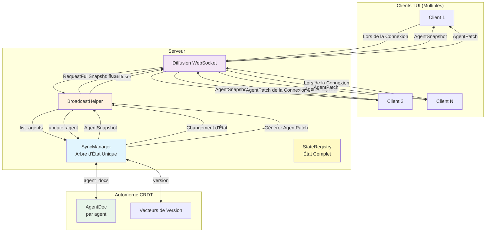
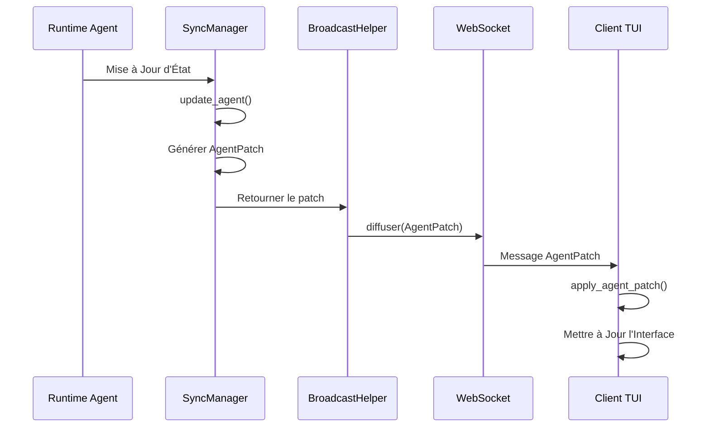
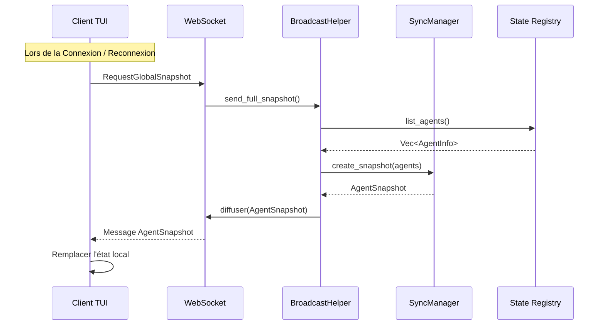
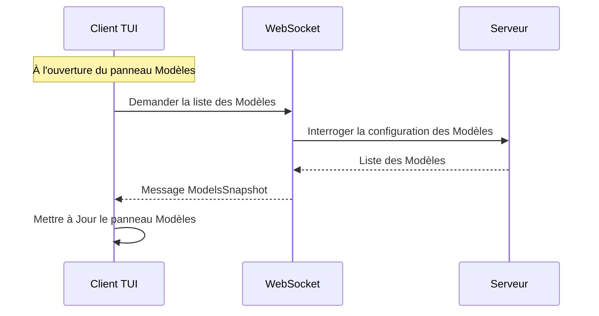
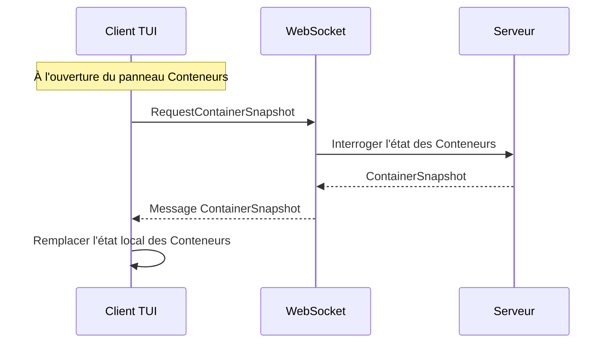
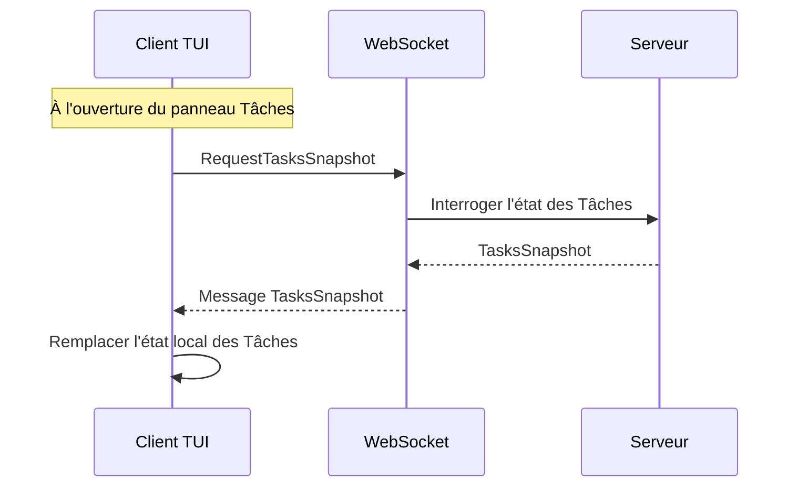

# Architecture de Synchronisation Incrémentielle

## Aperçu

Un mécanisme de synchronisation incrémentielle d'état multi-client basé sur Automerge CRDT, prenant en charge les mises à jour incrémentielles en temps réel et la synchronisation complète lors de la connexion/reconnexion, couvrant tous les panneaux TUI.

## Diagramme d'Architecture



## Matrice de Stratégie de Synchronisation

| Panneau | Méthode de Sync | Déclencheur | Fréquence | Types de Messages |
| --- | --- | --- | --- | --- |
| **Chronologie des Agents** | Incrémentielle + Complète | Sync à la Connexion + Push en Temps Réel | À la Connexion / Temps Réel | `AgentPatch` / `GlobalSnapshot` |
| **Conteneurs** | Incrémentielle + Complète | Sync à la Connexion + Push en Temps Réel | À la Connexion / Temps Réel | `ContainerPatch` / `GlobalSnapshot` |
| **Tâches** | Incrémentielle + Complète | Sync à la Connexion + Push en Temps Réel | À la Connexion / Temps Réel | `TaskPatch` / `GlobalSnapshot` |
| **Liste des Modèles** | Complète | Requête Active du Client | À l'Ouverture du Panneau | `ModelsSnapshot` |
| **Configuration des Fournisseurs** | Complète | Requête Active du Client | À l'Ouverture du Panneau | `ProvidersSnapshot` |

## Flux de Messages

### Flux de Mise à Jour Incrémentielle (Agents)



### Flux de Synchronisation Complète



### Flux de Synchronisation de la Liste des Modèles



### Flux de Synchronisation Complète des Conteneurs



### Flux de Synchronisation Complète des Tâches



## Structures de Données

### AgentPatch (Mise à Jour Incrémentielle)

```rust
pub struct AgentPatch {
    pub agent_id: String,
    pub version: u64,
    pub llm_working_changed: Option<bool>,
    pub work_status: Option<String>,
    pub current_model: Option<String>,
    pub token_usage_delta: Option<(u32, u32)>,
    pub token_usage_absolute: Option<(u32, u32)>,
    pub request_state: Option<RequestState>,
    pub cpu_usage: Option<f64>,
    pub memory_mb: Option<u64>,
}
```

### AgentSnapshot (Instantané Complet)

```rust
pub struct AgentSnapshot {
    pub version: u64,
    pub timestamp: i64,
    pub agents: Vec<TuiAgentInfo>,
}
```

### GlobalSnapshot (Instantané Global)

```rust
pub struct GlobalSnapshot {
    pub version: u64,
    pub timestamp: i64,
    pub agents: Vec<TuiAgentInfo>,
    pub models: Vec<ModelInfo>,
    pub providers: Vec<ProviderInfo>,
    pub active_tasks: Vec<TaskInfo>,
}
```

### ModelsSnapshot (Liste des Modèles)

```rust
pub struct ModelsSnapshot {
    pub models: Vec<ModelInfo>,
}
```

### ContainerPatch (État de Conteneur Incrémentiel)

```rust
pub struct ContainerPatch {
    pub container_id: String,
    pub version: u64,
    pub status_changed: Option<String>,
    pub cpu_usage_changed: Option<f64>,
    pub memory_usage_changed: Option<u64>,
}
```

### ContainerSnapshot (État de Conteneur Complet)

```rust
pub struct ContainerSnapshot {
    pub version: u64,
    pub timestamp: i64,
    pub containers: Vec<ContainerInfo>,
}
```

### TaskPatch (État de Tâche Incrémentiel)

```rust
pub struct TaskPatch {
    pub task_id: Uuid,
    pub version: u64,
    pub status_changed: Option<String>,
    pub progress_changed: Option<u8>,
}
```

### TasksSnapshot (État des Tâches Complet)

```rust
pub struct TasksSnapshot {
    pub version: u64,
    pub timestamp: i64,
    pub tasks: Vec<TaskInfo>,
}
```

## Stratégie de Synchronisation

| Type | Direction | Déclencheur | Fréquence |
| --- | --- | --- | --- |
| Mise à Jour Incrémentielle Agent | Serveur → Client | Changement d'État | Temps Réel |
| Synchronisation Complète Agent | Serveur → Client | À la Connexion | À la Connexion / Reconnexion |
| Mise à Jour Incrémentielle Conteneurs | Serveur → Client | Changement d'État | Temps Réel |
| Synchronisation Complète Conteneurs | Serveur → Client | À la Connexion | À la Connexion / Reconnexion |
| Mise à Jour Incrémentielle Tâches | Serveur → Client | Changement d'État | Temps Réel |
| Synchronisation Complète Tâches | Serveur → Client | À la Connexion | À la Connexion / Reconnexion |
| Liste des Modèles | Client → Serveur | Requête Active | À l'ouverture du panneau |
| Configuration des Fournisseurs | Client → Serveur | Requête Active | À l'ouverture du panneau |

## Fonctionnalités Clés

- **Arbre d'État Unique** : Le serveur maintient un `SyncManager`, tous les clients reçoivent les mêmes mises à jour d'état
- **Résolution de Conflits CRDT** : Résolution automatique des conflits basée sur Automerge
- **Mises à Jour Incrémentielles** : Transmettre uniquement les champs modifiés pour réduire le trafic réseau
- **Cohérence Éventuelle** : La synchronisation complète à la connexion garantit la cohérence éventuelle
- **Pull à la Demande** : Les Modèles et Fournisseurs sont demandés à la demande à l'ouverture de leurs panneaux pour éviter une transmission réseau inutile
- **Synchronisation de la Page d'Accueil** : Les Agents, Conteneurs et Tâches sont synchronisés à la connexion car ils sont visibles sur la page d'accueil

## État de l'Implémentation

- ✅ Synchronisation incrémentielle/complète des Agents
- ✅ Synchronisation de la liste des Modèles
- ✅ Synchronisation de la configuration des Fournisseurs
- ✅ Synchronisation incrémentielle/complète des Conteneurs
- ✅ Synchronisation incrémentielle/complète des Tâches
- ✅ Persistance d'état (stockage /tmp, rechargement au redémarrage)
