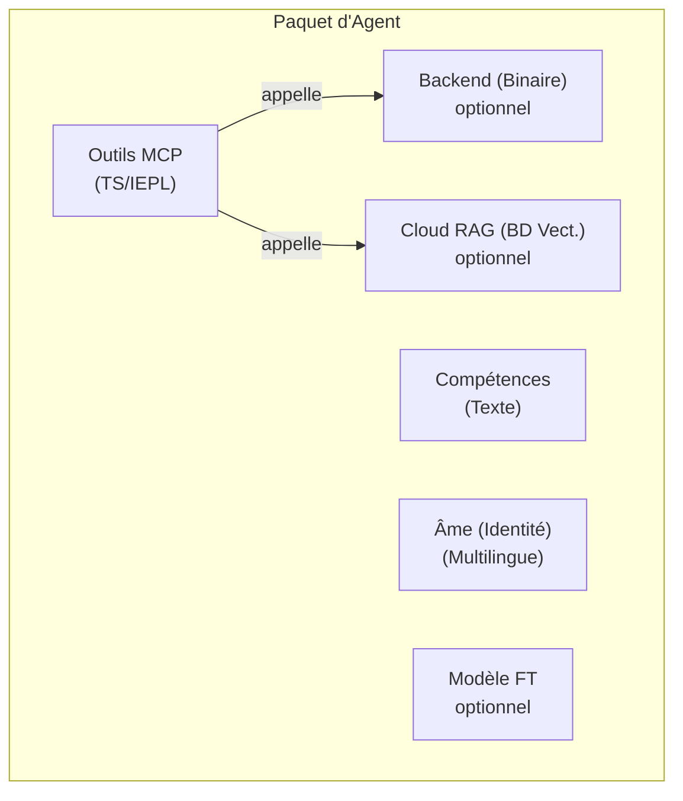

# Spécification du Paquet d'Agent Couche 2/3

> **Statut** : Brouillon v1 — 2026-06-26
> **Portée** : Définit le format de paquet autonome pour les agents de Couche 2 et Couche 3.

## Aperçu

Un agent de Couche 2/3 est un **paquet autonome** composé de jusqu'à cinq
composants. Le paquet est l'unité de distribution — il peut être installé,
mis à jour et supprimé indépendamment.



## Cinq Composants

### 1. Outils MCP (TypeScript IEPL)

L'interface d'outil principale. Écrite en source TypeScript qui s'exécute dans le
bac à sable IEPL (runtime Boa JS). Chaque fichier d'outil exporte une fonction :

```typescript
// mcp/memory_store.ts
import type { McpResult } from '@entecheia/sdk';

export async function memory_store(params: {
  text: string;
  node_type: string;
  entity_type?: string;
  properties?: Record<string, string>;
}): Promise<McpResult> {
  // Logique de l'outil — peut appeler des primitives backend, composer d'autres outils,
  // ou faire des requêtes HTTP vers des services cloud.
  const result = await backend.memory_store(params);
  return { ok: true, data: result };
}
```

Les outils peuvent être :

- **TS pur** : Logique uniquement, compose d'autres outils ou transforme des données
- **Soutenu par le backend** : Appelle une primitive fournie par le Backend MCP
- **Soutenu par le cloud** : Appelle une API distante (RAG, modèle, service externe)

La source TypeScript est du texte pur — elle peut être versionnée,
révisée et distribuée sans compilation. Une fonction d'empaquetage en libre-service
peut optionnellement regrouper plusieurs fichiers `.ts` en un seul
`bundle.js` pour un chargement efficace.

### 2. Backend MCP (Binaire Optionnel)

Certains outils nécessitent des capacités au-delà du bac à sable IEPL (E/S fichier, accès
matériel, connexions base de données). Celles-ci sont fournies par un **backend binaire** —
un binaire Rust qui s'exécute aux côtés du processus scepter.

- Le backend est compilé dans l'image Docker et transporté dans la

"poche" de scepter (le répertoire `/workspace-base/target/`).

- À l'exécution, scepter passe dynamiquement le chemin du binaire à l'environnement

IEPL via un import de module `backend`.

- Le backend expose des opérations primitives ; toute la composition et l'orchestration

se font dans la couche TS.

Exemple d'interface backend (auto-générée depuis Rust) :

```typescript
// Auto-généré depuis le backend Rust
declare module 'backend' {
  export function memory_store_raw(params: {...}): Promise<McpResult>;
  export function memory_query_raw(query: string): Promise<McpResult>;
}
```

### 3. Compétences (Texte Pur)

Les prompts de compétence sont des fichiers markdown avec frontmatter TOML. Ils définissent
**comment** l'agent exécute les tâches — le prompt système, la liste blanche d'outils,
le mode d'exécution et la structure du pipeline.

```markdown
+++
name = "memory_consolidate"
agent = "philia"
related_tools = ["memory_consolidate", "memory_query"]
location = "scepter"
execution_mode = "read"

[features]
tier = "worker"
+++

# memory_consolidate

Consolider les nœuds de mémoire en un épisode pour un rappel structuré...
```

Les compétences sont indépendantes de la langue (le corps `#` est le template de prompt).
Elles sont du texte pur — pas de compilation, pas de binaire.

### 4. Base de Données RAG (Optionnelle, Hébergée dans le Cloud)

Une base de connaissances vectorielle qui fournit des connaissances spécifiques au domaine à
l'agent. Hébergée sur l'infrastructure cloud d'Entelecheia.

- Optionnelle : un agent peut fonctionner sans RAG (capacité réduite).
- Limitée en requêtes : lorsque le quota est épuisé, les requêtes retournent vides — l'agent

se dégrade gracieusement.

- Référencée par URL + clé API dans le manifeste, non regroupée dans le paquet.

### 5. Modèle Affiné (Optionnel, Hébergé dans le Cloud)

Un modèle affiné pour le domaine spécifique de l'agent. Également hébergé dans le cloud.

- Optionnel : les agents utilisent par défaut le modèle général de la plateforme (par exemple, GLM-5).
- Peut être à poids ouverts à l'avenir pour l'auto-hébergement.
- Référencé par l'ID du modèle dans le manifeste.

## Structure de Répertoire du Paquet

```text
packages/agents/{nom_agent}/
├── manifest.toml           # Métadonnées et configuration du paquet
├── mcp/
│   ├── *.ts                # Implémentations d'outils TypeScript (IEPL)
│   └── *.md                # Documentation des outils (paramètres, retours)
├── backend/                # Backend Rust optionnel
│   ├── Cargo.toml
│   └── src/
│       └── lib.rs
├── skills/
│   └── *.md                # Prompts de compétence
├── soul/
│   └── {langue}.md         # Personnalité de l'agent par langue
├── rag.toml                # Optionnel : référence de la base de données RAG
└── model.toml              # Optionnel : référence du modèle affiné
```

## Format manifest.toml

```toml
[package]
name = "philia"              # Doit correspondre au nom du répertoire
version = "0.2.0"
description = "Système de mémoire cognitive — stockage, requête, consolidation"
layer = 2                    # 2 = agent plateforme, 3 = extension
category = "complex_tool"    # simple_tool | complex_tool | coordinator

[dependencies]
# Autres paquets d'agent dont les outils sont appelés par cet agent
aporia = "0.2.0"

[backend]
# Omettre entièrement pour les agents TS pur
type = "rust"
binary = "philia"            # Nom du binaire dans /workspace-base/target/debug/
provides = [                 # Primitives exposées à la couche TS
  "memory_store_raw",
  "memory_query_raw",
  "memory_consolidate_raw",
]

[rag]
# Omettre si le RAG cloud n'est pas utilisé
provider = "entelecheia-cloud"
database_id = "philia-knowledge-v1"
endpoint = "https://rag.entelecheia.ai/v1"

[model]
# Omettre si le modèle de plateforme par défaut est utilisé
provider = "entelecheia-cloud"
model_id = "philia-ft-v1"
endpoint = "https://model.entelecheia.ai/v1"
```

## SDK TS (`@entecheia/sdk`)

Le SDK fournit des types et des utilitaires pour les auteurs d'outils :

```typescript
// @entecheia/sdk — types
export interface McpResult {
  ok: boolean;
  data?: unknown;
  error?: string;
}

export interface McpToolParams {
  [key: string]: unknown;
}

// @entecheia/sdk — utilitaires
export function rag_search(query: string): string;        // Recherche RAG (sync, en cache)
export function llm_chat(prompt: string): Promise<string>; // Appel LLM
export function vars_get(key: string): unknown;           // État inter-compétences
export function vars_set(key: string, value: unknown): void;
```

Le module `backend` est auto-généré par agent à partir de la liste `[backend].provides`
dans le manifeste. Il fournit des wrappers typés autour des primitives binaires.

## Architecture en Couches

| Couche | Agents | Distribué Comment | Paquet ? | Conteneur ? |
| --- | --- | --- | --- | --- |
| L1 | SkeMma, HapLotes, HubRis, KaLos, NeiKos, ApoRia, EleOs, EpieiKeia, OreXis, PhiLia, PoleMos, SkoPeo | Intégré à l'image | Backend uniquement (crates Rust) | Non (en processus) |
| L2 | ClassicSoftwareEngineering, WebAutomation, WebUiPanel, IndustrialIoT | Intégré à l'image | **Paquet complet** (TS + compétences + âme) | Oui (e-skemma) |
| L3 | Extensions installées par l'utilisateur | Installation dynamique | **Paquet complet** | Oui (e-skemma) |

- **Couche 1** (12 agents) : Agents plateforme centraux. Leurs crates Rust fournissent

les opérations primitives (E/S fichier, mémoire, conteneurs, matériel, etc.).
Ils ne sont PAS des paquets — ils SONT la plateforme. Leurs outils sont exposés
comme modules importables (par exemple, `import { file_write } from 'kalos'`).

- **Couche 2** (4 agents) : Les premiers vrais paquets. Ils n'ont **pas de backend

binaire** — ce sont des compositions TS/IEPL pures de primitives Couche 1.
Ils sont livrés avec l'image comme exemples du format de paquet.

- **Couche 3** : Paquets installés par l'utilisateur. Même format que L2, mais chargés

dynamiquement. Peuvent optionnellement déclarer un backend binaire (compilé par
l'utilisateur, injecté via scepter).

## Chemin de Migration

Les crates d'agent Rust existantes (`packages/agents/*/src/`) deviennent des **backends**.
Leurs docs d'outils MCP (`res/prompts/agents/*/mcp/*.md`) sont déplacées dans le paquet.
Les prompts de compétence (`res/prompts/agents/*/skills/*.md`) sont déplacés dans le paquet.
Les fichiers d'âme (`res/prompts/soul/`) sont déplacés dans le paquet.

L'ancien `shared/plugin_host` (basé sur wasm) est remplacé par le runtime IEPL TS
déjà présent dans `shared/iepl`. Aucune compilation wasm nécessaire.
