# Conception du Système de Configuration TOML des Fournisseurs

## Aperçu

Le Système de Configuration TOML des Fournisseurs migre toute la configuration des Fournisseurs LLM de valeurs codées en dur vers des fichiers de configuration TOML, réalisant la séparation de la configuration et du code, améliorant la maintenabilité et l'extensibilité.

## Objectifs Fondamentaux

| Objectif | Description |
| --- | --- |
| Maintenabilité | Configuration séparée du code, pas de recompilation nécessaire pour les modifications |
| Extensibilité | L'ajout d'un nouveau Fournisseur ne nécessite que l'ajout d'un fichier TOML |
| Lisibilité | Les fichiers de configuration sont clairs et faciles à comprendre |
| Réutilisabilité | La configuration peut être partagée entre différents environnements |

## Conception de l'Architecture

### Processus de Chargement de Configuration

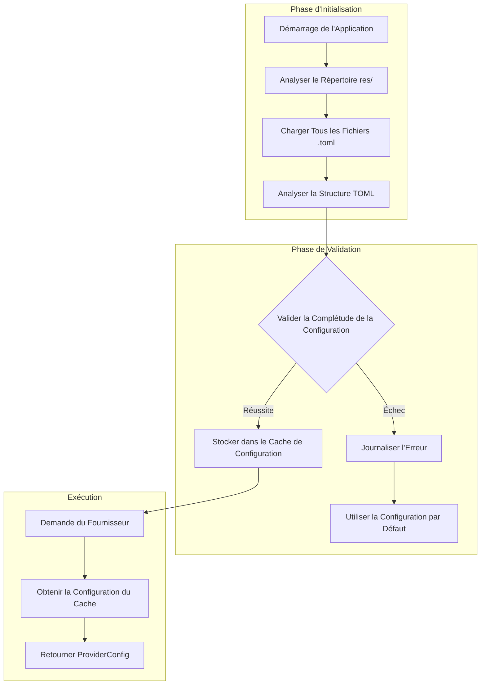

### Hiérarchie de Configuration

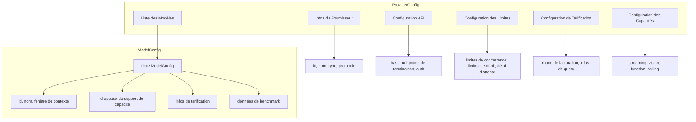

## Priorité de Configuration

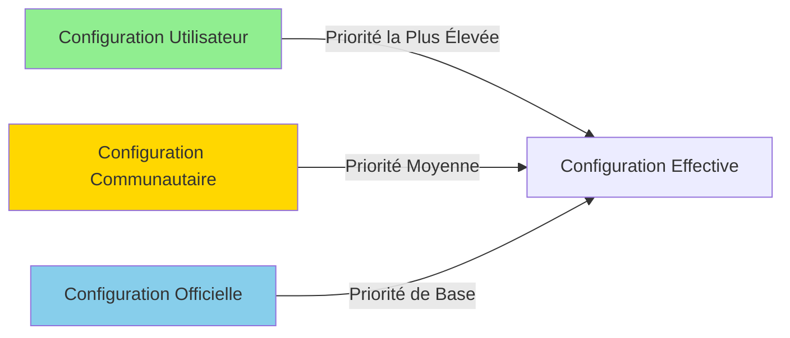

### Règles de Fusion de Priorité

| Couche | Source | Description |
| --- | --- | --- |
| 1 | Configuration Officielle | Données de documentation officielle du fournisseur, comme valeurs par défaut de base |
| 2 | Configuration Communautaire | Configuration optimisée contribuée par la communauté, remplace les données officielles |
| 3 | Configuration Utilisateur | Configuration définie par l'utilisateur, priorité la plus élevée |

## Modèles de Tarification

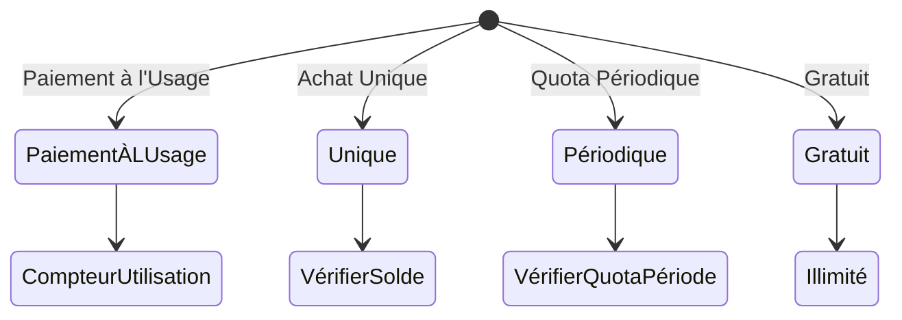

### Comparaison des Modèles de Tarification

| Modèle | Scénarios Applicables | Caractéristiques |
| --- | --- | --- |
| PaiementÀLUsage | OpenAI, Anthropic | Paiement par jeton, déduction en temps réel |
| Unique | Forfaits prépayés | Pré-achat de quota, utilisation jusqu'à épuisement |
| Périodique | GLM Chine, etc. | Réinitialisation périodique du quota |
| Gratuit | Modèles locaux Ollama | Aucune limite de coût |

## Classification des Types de Fournisseurs

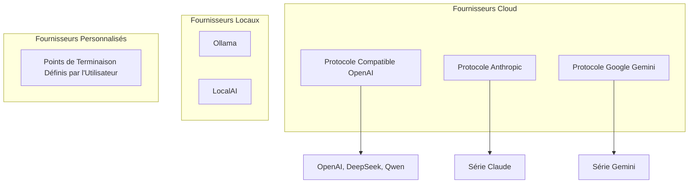

## Mécanisme de Rechargement à Chaud

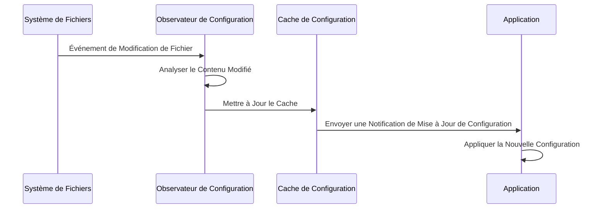

## Stratégie de Gestion des Erreurs

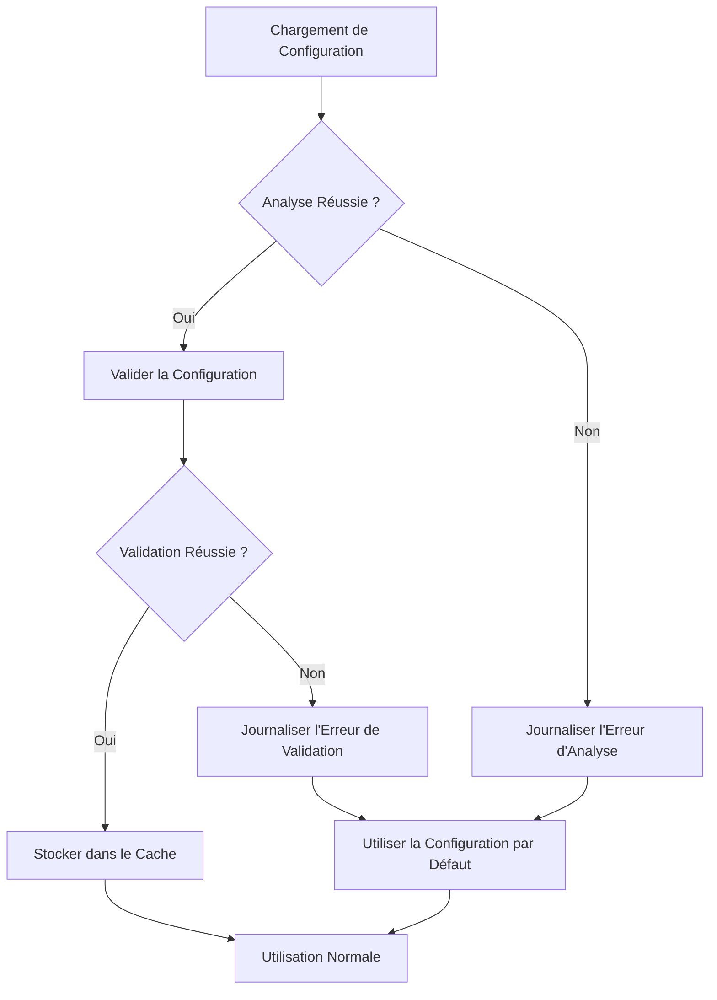

## Conception d'Extensibilité

### Ajout d'un Nouveau Fournisseur

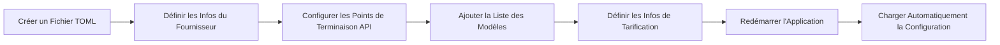

### Règles de Validation de Configuration

| Champ | Règle de Validation | Gestion d'Erreur |
| --- | --- | --- |
| provider.id | Non vide, unique | Rejeter le chargement, journaliser l'erreur |
| api.base_url | Format URL valide | Utiliser la valeur par défaut |
| models[].id | Non vide | Ignorer ce modèle |
| pricing.model | Vérification de valeur enum | Par défaut PayAsYouGo |

## Considérations de Sécurité

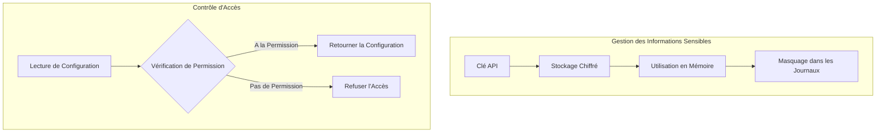

## Extensions Futures

| Fonctionnalité | Description | Priorité |
| --- | --- | --- |
| Rechargement à Chaud de Configuration | Charger les fichiers de configuration externes à l'exécution | Haute |
| Validation de Configuration | Valider la complétude de la configuration au démarrage | Haute |
| Fusion de Configuration | La configuration utilisateur remplace la configuration par défaut | Moyenne |
| Import/Export de Configuration | Prendre en charge l'import/export de fichiers de configuration | Moyenne |
| Mise à Jour d'Agent | Mettre à jour automatiquement la configuration depuis les docs officielles | Basse |

# Conception de la Gestion des Métadonnées des Fournisseurs

## Aperçu

Le système de Gestion des Métadonnées des Fournisseurs est responsable de la récupération dynamique des informations de configuration depuis la documentation officielle des Fournisseurs LLM, permettant des mises à jour automatisées et la validation des données de configuration.

## Problème Central

L'implémentation actuelle contient des statistiques d'utilisation codées en dur et manque de support dynamique des données des fournisseurs. Un mécanisme automatisé d'acquisition et de gestion des métadonnées doit être établi.

## Conception de l'Architecture

### Architecture de Flux de Données

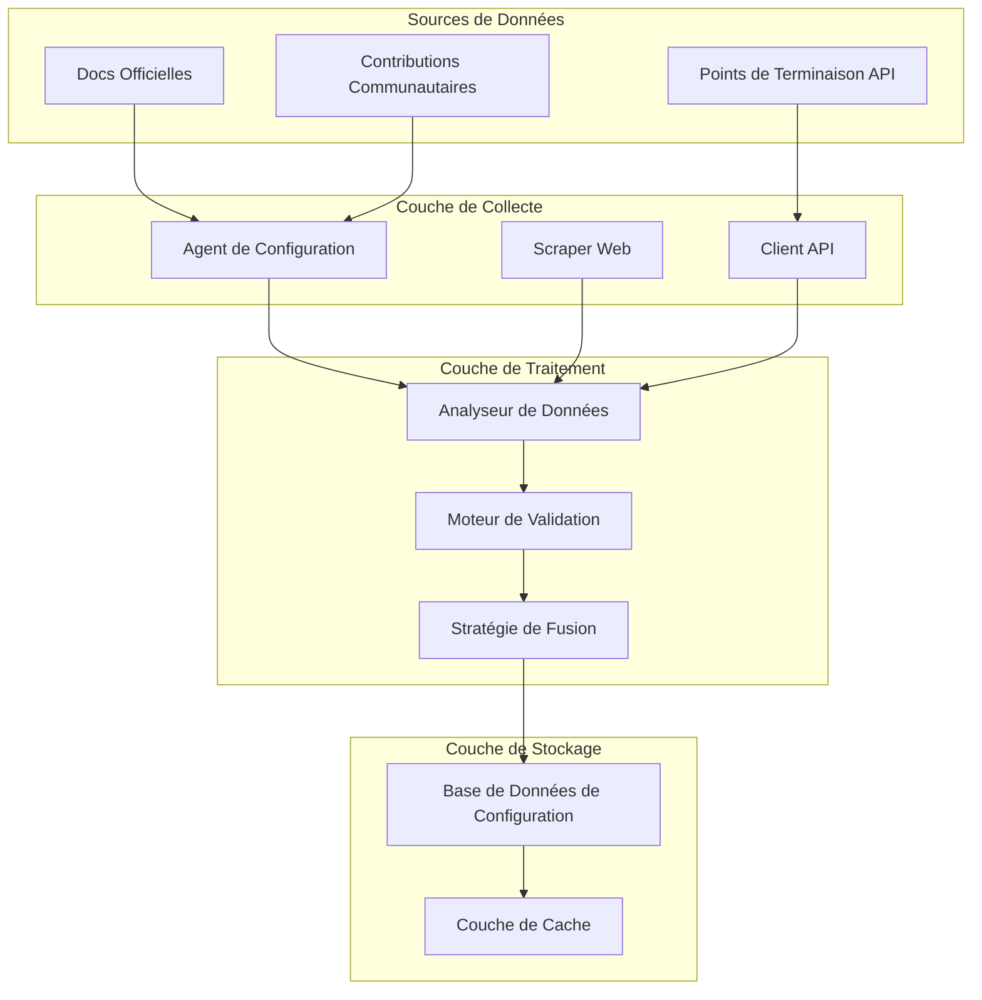

### Modèle de Priorité de Configuration

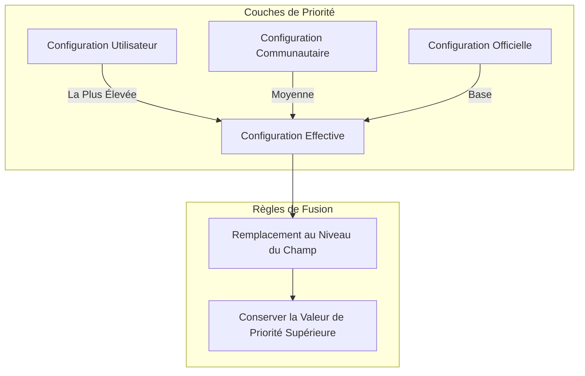

## Structure des Métadonnées

### Hiérarchie de Configuration du Fournisseur

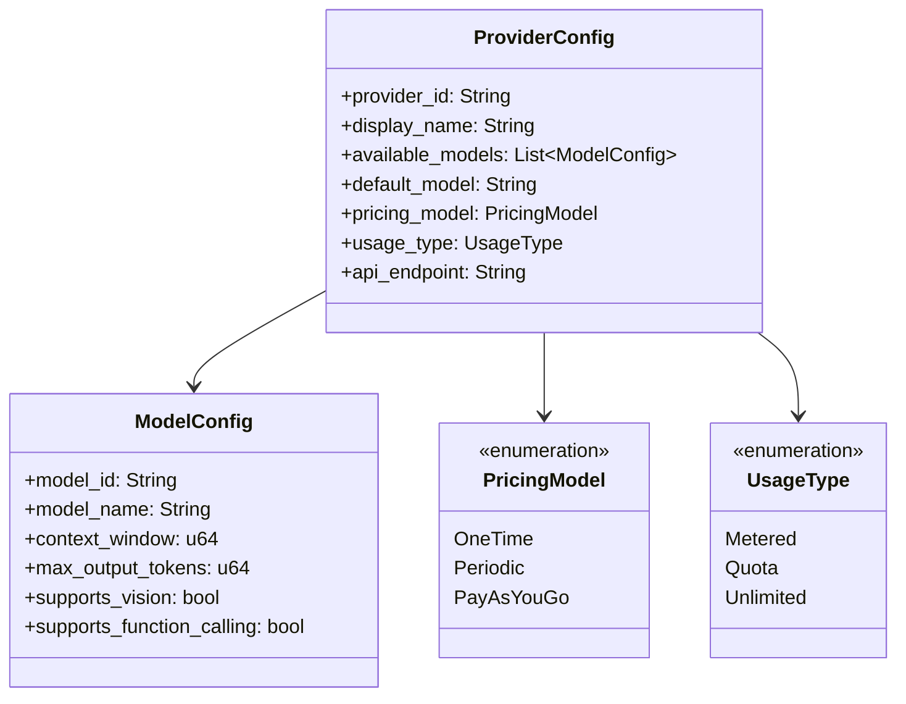

### Classification des Sources de Configuration

| Type de Source | Description | Fiabilité | Fréquence de Mise à Jour |
| --- | --- | --- | --- |
| Officielle | Documentation officielle du fournisseur | Haute | Périodique automatique |
| Communautaire | Données contribuées par la communauté | Moyenne | Mise à jour manuelle |
| Utilisateur | Personnalisée par l'utilisateur | La plus élevée | Temps réel |

## Système de Collecte par Agent

### Processus de Collecte

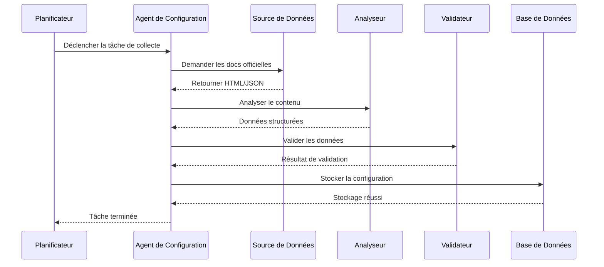

### Responsabilités des Agents Fournisseurs

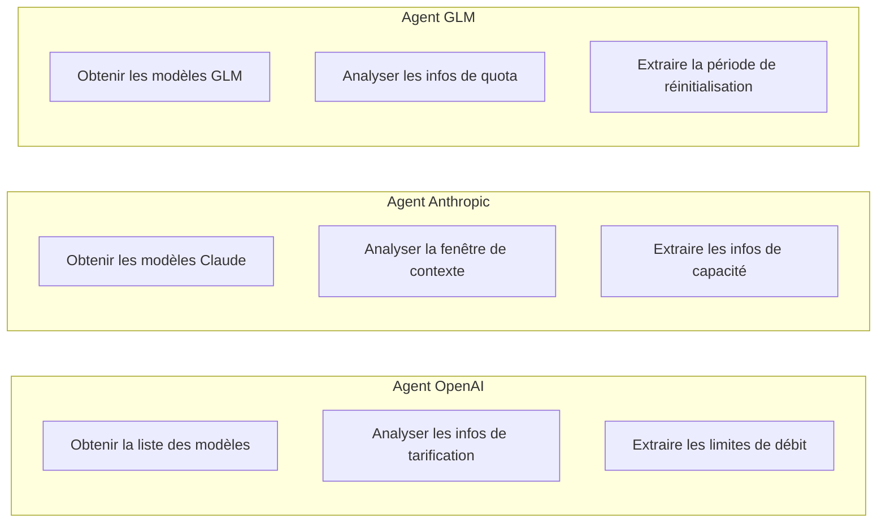

## Mécanisme de Validation des Données

### Processus de Validation

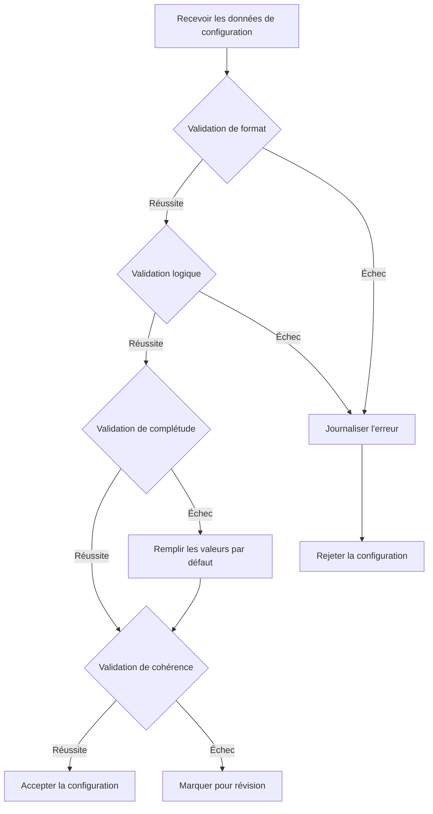

### Règles de Validation

| Type de Validation | Contenu Vérifié | Gestion d'Échec |
| --- | --- | --- |
| Validation de format | Types de données, formats de champ | Rejeter et journaliser |
| Validation logique | Plages de valeurs, valeurs enum | Utiliser les valeurs par défaut |
| Validation de complétude | Champs requis existent | Remplir les valeurs par défaut |
| Validation de cohérence | Relations inter-champs correctes | Marquer pour révision |

## Stratégie de Fusion de Configuration

### Fusion au Niveau du Champ

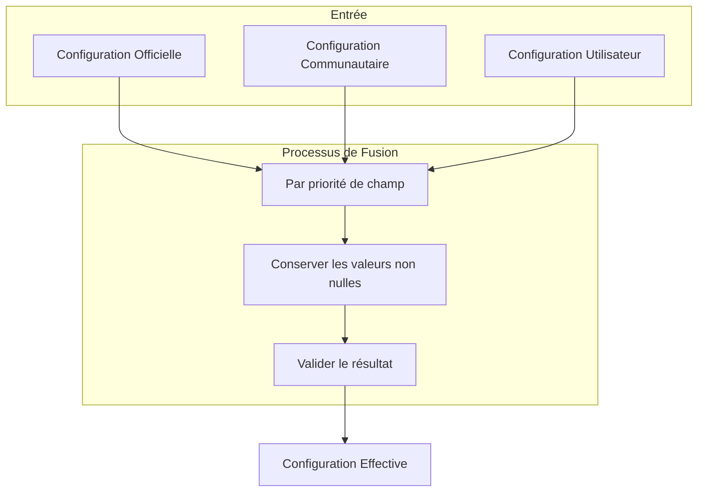

### Exemple de Fusion

| Champ | Valeur Officielle | Valeur Communautaire | Valeur Utilisateur | Valeur Finale |
| --- | --- | --- | --- | --- |
| context_window | 128000 | - | 64000 | 64000 |
| max_concurrent | 100 | 50 | - | 50 |
| pricing_model | PayAsYouGo | - | - | PayAsYouGo |

## Interface de Configuration Utilisateur

### Structure du Fichier de Configuration

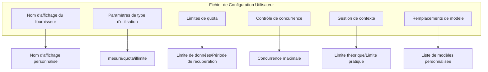

## Mécanisme de Mise à Jour Planifiée

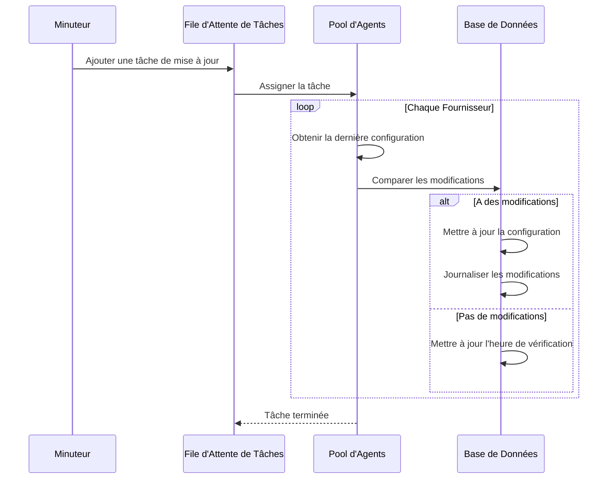

## Gestion des Erreurs

### Gestion des Échecs de Collecte

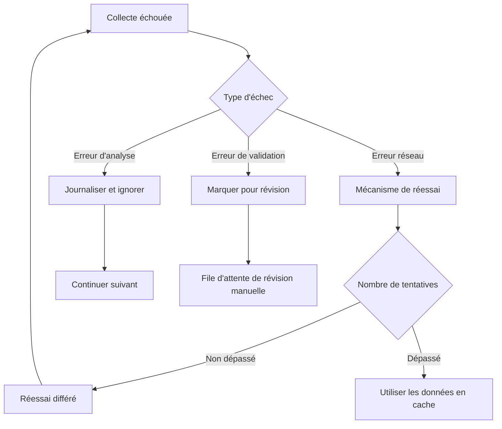

## Conception d'Extensibilité

### Ajout d'un Nouveau Fournisseur

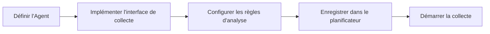

### Points d'Extension

| Type d'Extension | Description | Implémentation |
| --- | --- | --- |
| Nouveau Fournisseur | Ajouter une nouvelle source de configuration | Implémenter l'interface Agent Fournisseur |
| Nouveau champ | Étendre la structure de configuration | Mettre à jour le modèle de données et les règles de validation |
| Nouvelle règle de validation | Ajouter une logique de validation | Ajouter une implémentation de validateur |

## Implémentation de l'Agent Couche 3

### Agent ProviderScratch

`ProviderScratch` est le premier Agent officiel Couche 3, servant d'exemple d'implémentation des fonctionnalités de scraping.

```mermaid
flowchart TB
    subgraph Agent ProviderScratch
        A[Entrée Agent] --> B{Mode d'Exécution}
        B -->|Mode TUI| C[Interface Interactive]
        B -->|Mode CI| D[Exécution Automatisée]

        C --> E[Sélectionner le Fournisseur]
        D --> F[Lire les variables d'env]

        E --> G[Appeler la Compétence]
        F --> G

        G --> H[Scraper les docs]
        H --> I[Analyser les données]
        I --> J[Générer TOML]

        J --> K{Confirmer le commit ?}
        K -->|Oui| L[Écrire dans l'espace de travail]
        K -->|Non| M[Abandonner les modifications]

        L --> N[Demander le commit utilisateur]
    end
```

### Architecture de Compétence

Chaque Fournisseur correspond à une Compétence indépendante :

```mermaid
graph LR
    subgraph Compétences
        A[openai]
        B[anthropic]
        C[glm]
        D[deepseek]
        E[qwen]
        F[gemini]
    end

    subgraph Composants Partagés
        G[Scraper de Documentation]
        H[Analyseur de Données]
        I[Générateur TOML]
    end

    A --> G
    B --> G
    C --> G
    D --> G
    E --> G
    F --> G

    G --> H
    H --> I
```

### Structure de Répertoire

```text
.amphoreus/provider_scratch/
├── agent.toml
├── overview/
│   └── zhs.md
└── skills/
    ├── openai/
    │   └── prompt.md
    ├── anthropic/
    │   └── prompt.md
    ├── glm/
    │   └── prompt.md
    ├── deepseek/
    │   └── prompt.md
    ├── qwen/
    │   └── prompt.md
    └── gemini/
        └── prompt.md
```

### Automatisation CI

```mermaid
flowchart LR
    A[Déclencheur planifié] --> B[Extraire le code]
    B --> C[Exécuter ProviderScratch]
    C --> D{Détecter les modifications}
    D -->|A des modifications| E[Créer une branche]
    E --> F[Commiter les modifications]
    F --> G[Créer une PR]
    G --> H[Attendre la révision]
    D -->|Pas de modifications| I[Terminé]
```

### Variables d'Environnement

| Nom de Variable | Description |
| --- | --- |
| `AMPHOREUS_PROVIDER_SCRATCH_PROVIDERS` | Liste des fournisseurs à scraper |
| `AMPHOREUS_PROVIDER_SCRATCH_OUTPUT_DIR` | Chemin du répertoire de sortie |
| `AMPHOREUS_PROVIDER_SCRATCH_GIT_BRANCH` | Branche Git cible |
| `AMPHOREUS_PROVIDER_SCRATCH_DRY_RUN` | Exécution à blanc uniquement |

## Plans Futurs

| Fonctionnalité | Description | Priorité |
| --- | --- | --- |
| Contrôle de version de configuration | Suivre l'historique des modifications de configuration | Haute |
| Notification de modification | Notifier les utilisateurs des mises à jour de configuration | Moyenne |
| Retour en arrière de configuration | Prendre en charge le retour aux versions historiques | Moyenne |
| Recommandations intelligentes | Recommander des configurations basées sur les modèles d'utilisation | Basse |
| Agent de patrouille GitHub | Créer automatiquement des PRs pour mettre à jour les configurations | Haute |
