# Architecture des Espaces de Noms : `vars`, `refs`, `env`

> **Note (2026-06)** : La surface d'outils visible par le LLM a été réduite de 5 à 3 primitives. `ref_add` et `ref_remove` ne sont **plus exposés au LLM** — `agent_allowed_tools()` retourne uniquement `exec`, `write_to_var`, `write_to_var_json`. L'espace de noms `__refs` existe toujours comme structure de données interne (instantané/restauration, injection de prompt) mais n'est plus directement muté par le modèle. Les sections ci-dessous qui décrivent la distribution `ref_add`/`ref_remove` documentent la plomberie interne résiduelle, pas la surface d'outils LLM.

## Aperçu

Entelecheia fournit trois espaces de noms partagés dans le runtime JavaScript IEPL (`globalThis.$`) qui servent de substrat de communication inter-compétences et inter-agents. Ces espaces de noms opèrent au **niveau du runtime Cosmos**, ce qui signifie que tous les agents et compétences les partagent de manière transparente au sein d'une même session.

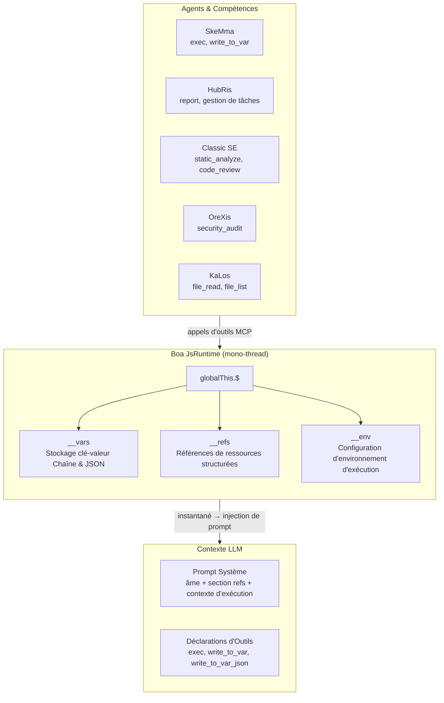

### Principes de Conception

| Principe | Description |
| --- | --- |
| **Source Unique de Vérité** | Chaque espace de noms a exactement un module (`var_namespace.rs`, `ref_namespace.rs`, `namespace.rs`) qui génère **toutes** les chaînes de code JS référençant cet espace de noms |
| **Initialisation Paresseuse** | `__vars` et `__refs` sont initialisés une fois à `JsRuntime::new()` et survivent à travers les chaînes de compétences ; `__env` est initialisé pendant l'évaluation JS de l'espace de noms |
| **Instantané/Restauration** | L'état complet `__vars` + `__refs` est capturable et restaurable, permettant la persistance de session |
| **Injection de Prompt** | Les données d'instantané pilotent les prompts système riches en contexte — le LLM voit les noms de variables disponibles, les résumés de référence et les paramètres d'environnement |
| **Contrôle d'Accès aux Outils** | Les 3 outils internes cosmos (`exec`, `write_to_var`, `write_to_var_json`) sont accordés à chaque agent via `agent_allowed_tools()` ; les SOP de compétence individuels définissent lesquels utiliser |

-----------------------------------------------------------------------------

## Comparaison des Espaces de Noms

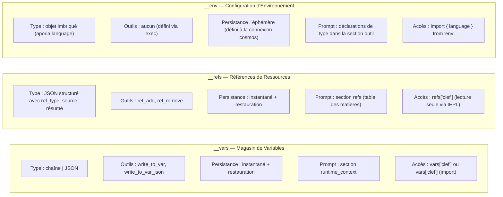

-----------------------------------------------------------------------------

## 1. `__vars` — Magasin de Variables (`vars`)

### 1.1 Objectif

`__vars` est le **mécanisme principal de communication inter-étapes** au sein d'une chaîne de compétences. Les compétences utilisent `write_to_var` / `write_to_var_json` pour persister les résultats calculés, et les étapes suivantes (ou compétences) lisent depuis `__vars` dans les blocs `exec`.

### 1.2 Architecture du Module

Toute la génération de code JS `__vars` est centralisée dans `packages/shared/core/src/var_namespace.rs`.

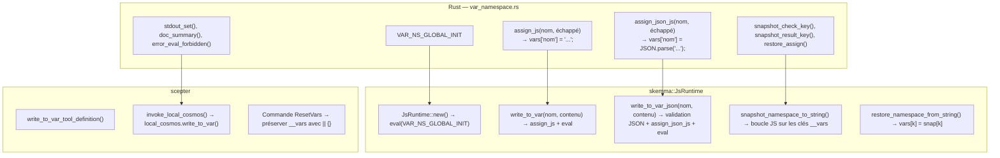

### 1.3 Séquence d'Initialisation

```text
JsRuntime::new()
  → context.eval("globalThis.$ = globalThis.$ || {}; globalThis.__vars = {}; globalThis.__refs = {};")
  → __vars initialisé comme objet vide
```

L'initialisation s'exécute **avant** `build_namespace_js()` (qui configure `__env` et `$.variant`), garantissant que `__vars` est toujours disponible lorsque les modules d'espace de noms se chargent.

> **Note :** `__refs` est initialisé avec `__vars` via `VAR_NS_GLOBAL_INIT` (défini dans `var_namespace.rs`). Le `REF_NS_GLOBAL_INIT` autonome dans `ref_namespace.rs` existe par symétrie mais n'est jamais appelé directement — l'initialisation réelle se produit dans `JsRuntime::new()`.

### 1.4 Opérations

| Opération | Nom de l'Outil | Type | Comportement |
| --- | --- | --- | --- |
| Stocker une chaîne | `write_to_var` | Bloquant | Échappe le contenu pour JS, évalue `vars['nom'] = 'contenu'` |
| Stocker du JSON | `write_to_var_json` | Bloquant | Valide le JSON, évalue `vars['nom'] = JSON.parse('contenu')` |
| Lire dans exec | `exec` | FireAndForget | Accès direct : `vars['nom']` ou `import vars from 'vars'` |
| Instantané | (interne) | — | Capture toutes les clés `__vars` comme `{"$vars": {...}}` |
| Restaurer | (interne) | — | Définit `vars[k] = snap['$vars'][k]` pour chaque clé |
| Réinitialiser | (interne) | — | `__vars = __vars \|\| {}` — préserve les valeurs existantes, assure la structure |

### 1.5 Injection de Prompt

Dans `build_runtime_context()` (`prompt.rs:472`), le magasin de variables apparaît dans le prompt système comme :

```text
## Contexte d'Exécution JS

__vars (de write_to_var / write_to_var_json, N au total) :
  `var_1`, `var_2`, `var_3`, ... (jusqu'à 30 affichées)
  Importer comme : `import vars from 'vars';`  Accès : `vars['clef']`
```

### 1.6 Affichage de Sortie

- Stockage de chaîne : `vars['nom'] défini :\n{200 premiers car. / 5 lignes}... (total_car car.)`
- Stockage JSON : `vars['nom'] défini (JSON analysé) : objet avec 3 clé(s)`
- Échec d'analyse : Erreur avec aperçu du contenu (200 premiers car.)

### 1.7 Module Synthétique `vars`

Similaire à `env`, le module `vars` est un module synthétique Boa qui enveloppe `__vars` pour un import pratique :

```python
import vars from 'vars';
// vars === __vars (référence en direct)
const rapport = vars['resultats_analyse'];
```

**Implémentation :** `packages/agents/skemma/src/js_runtime/module_loader.rs` lignes 142-156. Le module utilise `Module::synthetic()` avec une fermeture qui retourne `globalThis.__vars` directement (référence en direct, pas un instantané). Cela signifie que les modifications via `vars['clef'] = valeur` sont équivalentes à `vars['clef'] = valeur`.

-----------------------------------------------------------------------------

## 2. `__refs` — Références de Ressources (`refs`)

### 2.1 Objectif

`__refs` fournit un **passage de ressources structuré inter-agents**. Contrairement à `__vars` (chaînes brutes), les refs portent des métadonnées typées (`ref_type`, `source`, `summary`) plus des charges utiles optionnelles. Les agents peuvent :

- **Publier** des références à des fichiers, des images ou leurs propres sorties
- **Découvrir** des références par nom/type dans les prompts système
- **Accéder** au contenu des références via `refs['nom']` dans les blocs exec IEPL

### 2.2 Architecture du Module

Toute la génération de code JS `__refs` est centralisée dans `packages/shared/core/src/ref_namespace.rs`.

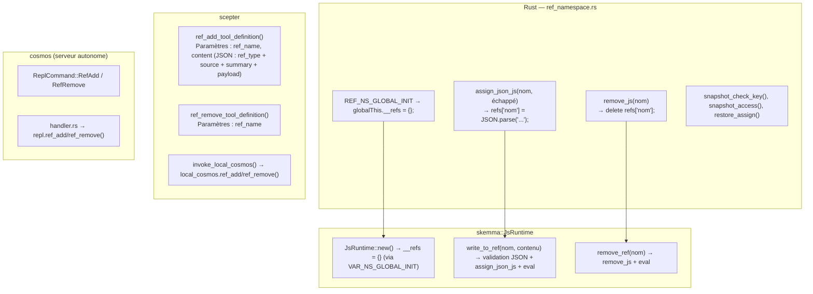

### 2.3 Structure RefItem

```typescript
// Définitions de type TypeScript (de iepl-api.d.ts)
type RefType = "code" | "image" | "agent_output";

// Utilisé dans le prompt système et runtime_context pour le listage des noms
type RefItemSummary = {
  name: string;
  ref_type: RefType;
  source: string;
  summary: string;
};

interface RefItem {
  name: string;        // ex. "code:src/main.rs", "image:diagram", "agent:orexis/audit-1"
  ref_type: RefType;   // catégorie pour le tri/filtrage
  source: string;      // qui l'a fourni ("user", nom d'agent, nom d'outil)
  summary: string;     // description en une ligne pour l'affichage dans le prompt
  files?: RefCodeFile[];   // pour les refs "code"
  images?: RefImage[];     // pour les refs "image"
  output?: RefAgentOutput; // pour les refs "agent_output"
}

interface RefCodeFile {
  path: string;
  language: string;
  content: string;
  selection?: { start_line: number; end_line: number; content: string };
}

interface RefImage {
  mime: string;          // ex. "image/png"
  data: string;          // encodé en base64 ou URL de données
  description?: string;
}

interface RefAgentOutput {
  source_agent: string;  // nom de l'agent
  source_tool: string;   // outil qui a produit cette sortie
  content: Record<string, unknown>;
}
```

### 2.4 Opérations

| Opération | Nom de l'Outil | Type | Comportement |
| --- | --- | --- | --- |
| Ajouter une référence | `ref_add` | Bloquant | Valide le JSON, évalue `refs['nom'] = JSON.parse('...')` |
| Supprimer une référence | `ref_remove` | FireAndForget | Évalue `delete refs['nom']` |
| Lire dans exec | (via `exec`) | — | `refs['nom'].files[0].content` |
| Instantané | (interne) | — | Capture toutes les clés `__refs` comme `{"$refs": {...}}` |
| Restaurer | (interne) | — | Définit `refs[k] = snap['$refs'][k]` pour chaque clé |

### 2.5 Injection de Prompt

Les refs apparaissent à **deux** emplacements dans le prompt système :

#### Emplacement 1 : `refs_section` (table des matières dédiée)

```text
## Ressources Référencées (refs)

Les ressources suivantes sont disponibles via `refs['nom']`.
- `code:src/main.rs` [code] de l'utilisateur — fichier rust principal
- `image:architecture` [image] de l'utilisateur — diagramme d'architecture système
- `agent:orexis/audit-1` [agent_output] de OreXis — résultats d'audit de sécurité
```

Généré par `build_refs_section()` à `prompt.rs:426`. Chaque ref montre **nom, type, source et résumé** — le LLM voit ce qui est disponible mais doit lire le contenu via des blocs `exec`.

#### Emplacement 2 : `runtime_context` (listage des noms)

```text
__refs (ressources référencées de l'utilisateur/agents, 3 au total) :
  `code:src/main.rs`, `image:architecture`, `agent:orexis/audit-1`
  Accès : `refs['nom']` — chaque ref a .ref_type, .source, .summary
```

### 2.6 Principe de Visibilité

> **Les noms de ref sont visibles par tous les agents. Le contenu des refs ne l'est pas.**

La `refs_section` dans le prompt système expose la **table des matières** (nom, type, source, résumé) à chaque exécution de compétence. Cependant, le contenu réel (`files[].content`, `images[].data`, `output.content`) n'est accessible que via un accès explicite `refs['nom']` dans les blocs exec IEPL. Cela signifie :

- OreXis peut voir que `code:src/main.rs` existe (d'après son résumé), mais doit explicitement lire son contenu pour l'audit
- Le LLM décide quand déréférencer le contenu en fonction de la pertinence de la tâche
- Aucun agent ne peut accidentellement divulguer le contenu d'une référence dans le flux de conversation

-----------------------------------------------------------------------------

## 3. `__env` — Configuration d'Environnement (`env`)

### 3.1 Objectif

`__env` contient les **paramètres d'environnement d'exécution** dont le moteur d'exécution IEPL et les agents ont besoin. Actuellement, la seule sous-clé est `env.aporia.language`, qui contrôle la langue de sortie de l'agent.

### 3.2 Architecture du Module

L'initialisation de l'environnement réside dans `packages/shared/iepl/src/namespace.rs`.

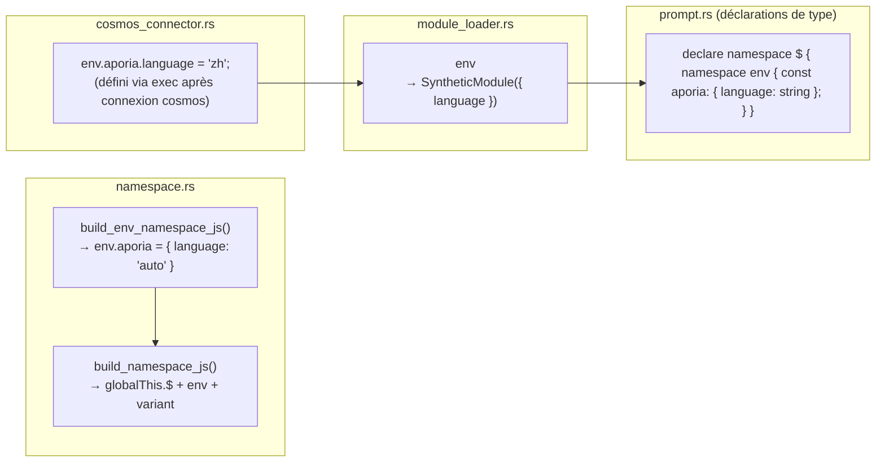

### 3.3 Opérations

| Opération | Mécanisme | Comportement |
| --- | --- | --- |
| Initialiser | `build_namespace_js()` | `__env = __env \|\| {}; env.aporia = env.aporia \|\| { language: 'auto' }` |
| Définir la langue | appel `exec` via cosmos connector | `env.aporia.language = 'zh'` |
| Lire dans IEPL | `import { language } from 'env'` | Retourne `env.aporia.language` avec repli `'auto'` |
| Instantané/Restauration | **Non pris en charge** | `__env` n'est PAS inclus dans l'instantané/restauration — il est éphémère et réinitialisé à chaque connexion cosmos |

### 3.4 Flux de Langue

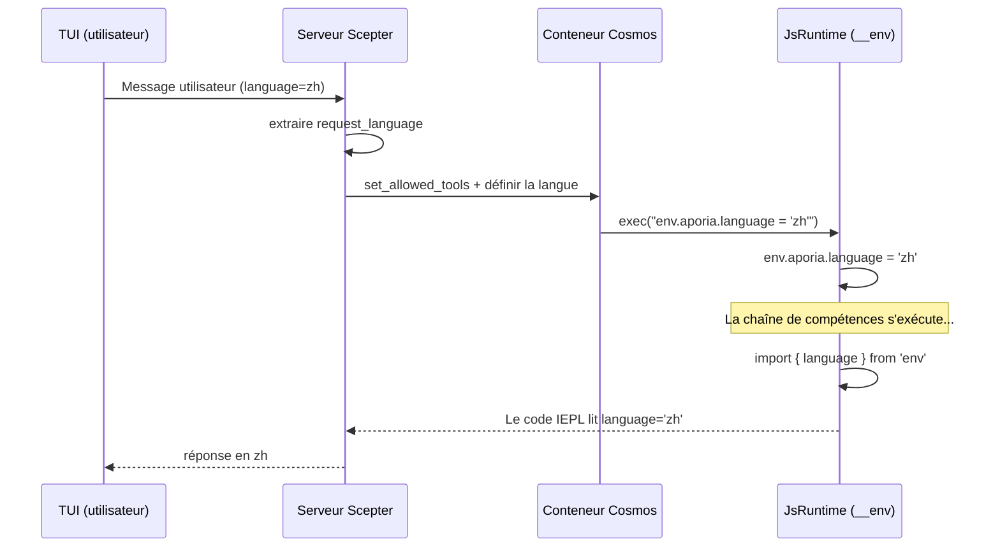

### 3.5 `$.variant` — Accesseur Rétrocompatible

**Fichier :** `packages/shared/iepl/src/namespace.rs:199-207`

`build_variant_namespace_js()` crée une propriété circulaire auto-référencée :

```javascript
Object.defineProperty(globalThis.$, 'variant', {
  get: function() { return globalThis.$; },
  set: function(val) { Object.assign(globalThis.$, val); },
  configurable: true,
  enumerable: true,
});
```

Cela permet au code écrit comme `$.variant.tools.agent.method()` de se résoudre vers le même objet que `$.tools.agent.method()`. Il existe pour la rétrocompatibilité avec des modèles d'accès alternatifs à l'espace de noms.

> **Attention à l'instantané :** Parce que `$.variant` est une référence circulaire (`$.variant === $`), tenter de `JSON.stringify` lance une `TypeError`. Le code JS d'instantané cible explicitement `__vars` et `__refs` directement plutôt que d'itérer les clés de `globalThis.$`, évitant ce problème.

-----------------------------------------------------------------------------

## 4. Architecture d'Instantané et de Restauration

### 4.1 Pourquoi Instantané/Restauration ?

Le `LocalCosmosRuntime` exécute un **seul `JsRuntime` de longue durée** dans un thread dédié. Entre les exécutions de chaîne de compétences, l'état du runtime (`__vars`, `__refs`) persiste naturellement. Cependant, les instantanés sont utilisés pour :

1. **Injection de prompt** — `build_runtime_context()` et `build_refs_section()` lisent le JSON d'instantané pour peupler le prompt système
1. **Persistance de session** — vidage/restauration sur disque pour la récupération après plantage ou la migration de session
1. **Synchronisation de conteneur** — pousser l'état vers les conteneurs cosmos via `cosmos_set_rag_context()`

### 4.2 Format d'Instantané

```json
{
  "$vars": {
    "nom_var_1": "valeur",
    "json_analyse": { "clef": "valeur" }
  },
  "$refs": {
    "code:src/main.rs": {
      "ref_type": "code",
      "source": "user",
      "summary": "fichier rust principal",
      "files": [{ "path": "src/main.rs", "language": "rust", "content": "..." }]
    }
  },
  "__lexical": {
    "ma_constante": 42
  }
}
```

### 4.3 Flux de Code d'Instantané

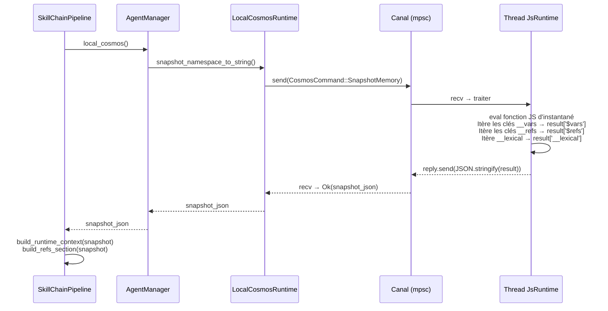

### 4.4 Code JS d'Instantané (Forme Déployée)

La fonction d'instantané accède directement aux arbres d'espaces de noms connus :

```javascript
(function() {
    var result = {};
    if (globalThis.$ && globalThis.__vars) {
        var dollarVars = {};
        var dollarKeys = Object.keys(globalThis.__vars);
        for (var j = 0; j < dollarKeys.length; j++) {
            var dk = dollarKeys[j];
            try {
                var dv = globalThis.vars[dk];
                if (typeof dv === 'function') continue;
                dollarVars[dk] = dv;
            } catch(e) {}
        }
        if (Object.keys(dollarVars).length > 0) {
            result['$vars'] = dollarVars;
        }
    }
    if (globalThis.$ && globalThis.__refs) {
        var dollarRefs = {};
        var refsKeys = Object.keys(globalThis.__refs);
        for (var j = 0; j < refsKeys.length; j++) {
            var dk = refsKeys[j];
            try {
                var dv = globalThis.refs[dk];
                if (typeof dv === 'function') continue;
                dollarRefs[dk] = dv;
            } catch(e) {}
        }
        if (Object.keys(dollarRefs).length > 0) {
            result['$refs'] = dollarRefs;
        }
    }
    // ... capture __lexical ...
    return JSON.stringify(result);
})( )
```

### 4.5 Code de Restauration (Déployé)

```javascript
(function() {
    var snap = JSON.parse(snapshot_string);
    if (snap['$vars'] && globalThis.$) {
        Object.keys(snap['$vars']).forEach(function(k) {
            try { globalThis.vars[k] = snap['$vars'][k]; } catch(e) {}
        });
    }
    if (snap['$refs'] && globalThis.$) {
        Object.keys(snap['$refs']).forEach(function(k) {
            try { globalThis.refs[k] = snap['$refs'][k]; } catch(e) {}
        });
    }
    if (snap['__lexical']) {
        Object.keys(snap['__lexical']).forEach(function(k) {
            try { globalThis[k] = snap['__lexical'][k]; } catch(e) {}
        });
    }
})()
```

-----------------------------------------------------------------------------

## 5. Enregistrement d'Outils et Contrôle d'Accès

### 5.1 Outils Internes Cosmos

Les cinq outils de niveau cosmos sont **universellement accordés** à tous les agents :

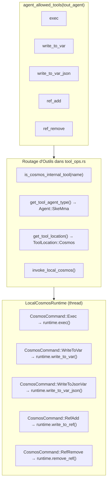

### 5.2 Définitions d'Outils

| Outil | Mode d'Appel | Requiert | Schéma de Paramètre |
| --- | --- | --- | --- |
| `exec` | FireAndForget | `code: string` | Chaîne de code JS unique |
| `write_to_var` | Bloquant | `var_name, content` | `{var_name: string, content: string}` |
| `write_to_var_json` | Bloquant | `var_name, content` | `{var_name: string, content: string (JSON valide)}` |
| `ref_add` | Bloquant | `ref_name, content` | `{ref_name: string, content: string (JSON: ref_type + source + summary)}` |
| `ref_remove` | FireAndForget | `ref_name` | `{ref_name: string}` |

### 5.3 Serveur Cosmos Autonome

Le binaire `cosmos` (serveur de runtime JS autonome) distribue tous les noms d'outils via la même interface `JsRuntime`, y compris les gestionnaires dépréciés `ref_add`/`ref_remove` qui restent comme plomberie interne résiduelle. Seules les trois primitives visibles par le LLM (`exec`, `write_to_var`, `write_to_var_json`) sont exposées au modèle ; voir la note de dépréciation en haut de ce document.

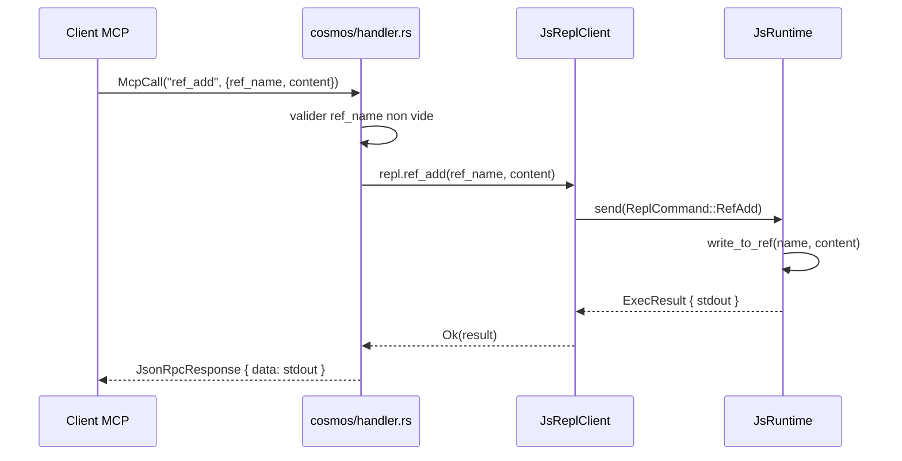

### 5.4 `is_cosmos_internal_tool` — Assistant de Routage

**Fichier :** `packages/scepter/src/agent_manager/tool_ops.rs:7-13`

```rust
fn is_cosmos_internal_tool(tool_name: &str) -> bool {
    tool_name == cosmos::EXEC
        || tool_name == cosmos::WRITE_TO_VAR
        || tool_name == cosmos::WRITE_TO_VAR_JSON
        || tool_name == cosmos::REF_ADD
        || tool_name == cosmos::REF_REMOVE
}
```

Cet assistant sert deux objectifs critiques :

1. **Résolution de type d'agent** — `get_tool_agent_type()` retourne `Agent::SkeMma` pour les outils internes, puisqu'ils s'exécutent dans le runtime Cosmos (pas dans le processus d'un agent de domaine).
1. **Routage de repli** — Lorsqu'un appel cosmos conteneurisé échoue pour un outil interne, le système revient au runtime cosmos local. Pour les outils non internes, le repli va plutôt vers l'exécution en processus. Cela garantit que les opérations cosmos n'échouent jamais silencieusement en mode conteneurisé.

### 5.5 Routage Cosmos Conteneurisé vs Local

Le système prend en charge deux modes d'exécution pour le runtime Cosmos, sélectionnés au moment de l'enregistrement de l'agent :

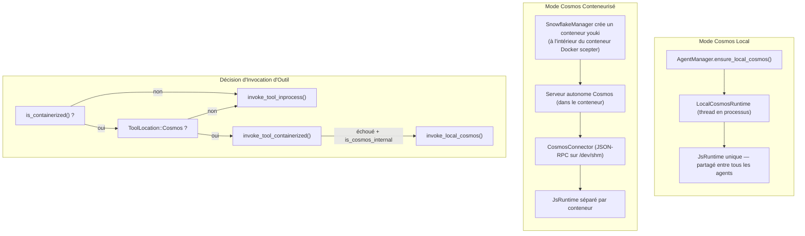

**Différences clés :**

| Aspect | Mode Local | Mode Conteneurisé |
| --- | --- | --- |
| `__vars` / `__refs` | Partagé entre tous les agents | Partagé dans le conteneur, isolé entre conteneurs |
| `__env` | Défini directement via `exec` | Défini via appel JSON-RPC `CosmosConnector` |
| Performance | Zéro surcharge de sérialisation | Sérialisation JSON-RPC par appel |
| Sécurité | Bac à sable Boa uniquement | Boa + seccomp + bac à sable youki |
| Runtime de conteneur | Docker/Podman uniquement | Docker/Podman (externe) + youki (cosmos interne) |
| Utilisé par | Agents non conteneurisés (couche=1) | Agents conteneurisés (couche=2+) |

### 5.6 Assemblage JS de l'Espace de Noms

Le JavaScript complet de l'espace de noms est assemblé par `build_scepter_namespace_config_and_js()` à `packages/scepter/src/services/local_cosmos/namespace.rs:116-124` :

```rust
pub async fn build_scepter_namespace_config_and_js(
    registry: &SharedAgentRegistry,
    scepter_tools: &HashSet<String>,
    plugin_router: &PluginRouter,
) -> (NamespaceConfig, String) {
    let config = build_namespace_config(registry, scepter_tools, plugin_router).await;
    let js = build_namespace_js(&config);
    (config, js)
}
```

Cette fonction :

1. Collecte les outils MCP de tous les agents enregistrés depuis le `AgentRegistry`
1. Construit un `NamespaceConfig` avec des listes d'outils par agent et des métadonnées (sync/async, `unwrap_data`)
1. Génère le JS d'espace de noms via `build_namespace_js(&config)` qui :

   - Crée `globalThis.$` s'il est manquant
   - Initialise `env.aporia` avec `{ language: 'auto' }`
   - Définit la propriété `$.variant` (accesseur circulaire retournant `globalThis.$`)
   - Enregistre tous les modules d'outils d'agent via `register_tool_modules_with_rag()`

Le JS d'espace de noms est évalué :

- **Une fois** au démarrage de `LocalCosmosRuntime::new()`
- **À la demande** pendant la reconstruction de la chaîne de compétences via `CosmosCommand::RebuildNamespace`

-----------------------------------------------------------------------------

## 6. Ordre d'Assemblage du Prompt Système

Le prompt système complet assemblé dans `pipeline.rs:869-882` :

```text
You are the {Agent} {skill_name} skill execution engine. Execute the skill faithfully.

[capability_section]
  → Description des capacités spécifiques à l'agent
  → Déclarations de type TypeScript (types API IEPL, env)
  → Prompts d'instruction d'import
  → Règles de sécurité des paramètres et conseils de persistance des données

[tool_decls_section]
  → ## APIs d'Outils Disponibles
  → Contenu .d.ts pour tous les outils MCP disponibles

[container_context]
  → Badges de mode d'exécution conteneur, infos de branche, contraintes

[soul_section]
  → ## Identité de l'Âme : {nom}
  → Personnalité de l'agent et principes opérationnels

[refs_section]
  → ## Ressources Référencées (refs)
  → Table des matières : nom, type, source, résumé

[output_section]
  → Routage de l'agent cible suivant
  → Conventions d'appel de rapport MCP

[runtime_context]
  → ## Contexte d'Exécution JS
  → Noms __vars (avec indication d'import)
  → Noms __refs (avec indication d'accès)
  → Noms de variables lexicales

[rag_section]
  → Sections de mémoire Philia (interactions passées pertinentes)
  → Sections de connaissance Aporia (documentation pertinente)

[skill_chain_note]
  → Navigation de chaîne : "Ceci est l'étape N sur M" ou "Dernière étape"
```

### Justification du Placement des Sections

| Section | Position | Raison |
| --- | --- | --- |
| Identité de l'agent + nom de compétence | Première phrase | Définit le rôle immédiatement |
| Déclarations d'outils | Avant l'âme | Le LLM doit connaître les outils disponibles avant que la personnalité n'affecte le choix |
| Âme | Après les outils, avant les refs | La personnalité influence comment les refs sont interprétées |
| Section refs | Après l'âme, avant la sortie | Le LLM sait quelles ressources sont disponibles avant de décider quoi produire |
| Routage de sortie | Avant le contexte d'exécution | Le LLM sait où envoyer les résultats avant de lire le contexte |
| Contexte d'exécution | Avant RAG, avant la note de chaîne | Les vars et refs fournissent le contexte d'exécution pour la récupération de connaissances |

-----------------------------------------------------------------------------

## 7. Comportement de ResetVars

Lors du passage d'une compétence à l'autre dans une chaîne, `ResetVars` est appelé pour assainir l'état du runtime. La commande utilise une initialisation **non destructive** :

```javascript
globalThis.$ = globalThis.$ || {};
globalThis.__vars = globalThis.__vars || {};
globalThis.__refs = globalThis.__refs || {};
```

Cela signifie :

- **Les valeurs existantes persistent** — `__vars` et `__refs` sont conservés intacts
- **Les états corrompus sont récupérés** — si `__refs` a été accidentellement supprimé, il est recréé
- **L'isolation des compétences est optionnelle** — les compétences ne doivent lire que les variables qu'elles connaissent (par nom dans le prompt de contexte d'exécution)
- **Pas de nettoyage forcé** — c'est la responsabilité du LLM de gérer la pollution de l'espace de noms des variables

-----------------------------------------------------------------------------

## 8. Carte des Fichiers d'Implémentation

| Composant | Fichier | Lignes | Description |
| --- | --- | --- | --- |
| Constantes et générateurs `__vars` | `packages/shared/core/src/var_namespace.rs` | 1-211 | Toute la génération de code JS pour vars |
| Constantes et générateurs `__refs` | `packages/shared/core/src/ref_namespace.rs` | 1-145 | Toute la génération de code JS pour refs |
| Génération `__env` | `packages/shared/iepl/src/namespace.rs` | 193-197 | `build_env_namespace_js()` |
| Génération `$.variant` | `packages/shared/iepl/src/namespace.rs` | 199-207 | `build_variant_namespace_js()` |
| Init `JsRuntime` | `packages/agents/skemma/src/js_runtime/runtime.rs` | 153 | `eval(VAR_NS_GLOBAL_INIT)` |
| Impl `write_to_var` | même fichier | 349-403 | Stockage de variable chaîne |
| Impl `write_to_var_json` | même fichier | 405-443 | Stockage de variable JSON |
| Impl `write_to_ref` | même fichier | 445-492 | Stockage de ref avec extraction de type |
| Impl `remove_ref` | même fichier | 494-503 | Suppression de ref |
| `snapshot_namespace_to_string` | même fichier | 549-607 | Génère le JS d'instantané |
| `restore_namespace_from_string` | même fichier | 617-646 | Génère le JS de restauration |
| `LocalCosmosRuntime` | `packages/scepter/src/services/local_cosmos/runtime.rs` | 1-507 | Canal de commande cosmos thread-safe |
| Énumération `CosmosCommand` | même fichier | 21-65 | Toutes les variantes d'opération cosmos (y compris SnapshotMemory, Shutdown) |
| Gestionnaire `ResetVars` | même fichier | 448-460 | Réinitialisation non destructive |
| Gestionnaire `RebuildNamespace` | même fichier | 478-494 | Réinitialiser les modules d'outils |
| Définitions d'outils | `packages/scepter/src/agent_manager/tool_ops.rs` | 1-795 | Toutes les 5 définitions d'outils cosmos |
| `is_cosmos_internal_tool` | même fichier | 7-13 | Assistant de routage |
| `invoke_local_cosmos` | même fichier | 714-787 | Distribution d'outils vers LocalCosmosRuntime |
| `build_runtime_context` | `packages/scepter/src/state_machine/skill_chain/prompt.rs` | 472-598 | Prompt : vars + refs + lexical |
| `build_refs_section` | même fichier | 426-470 | Prompt : table des matières des refs |
| Assemblage du prompt système | `packages/scepter/src/state_machine/skill_chain/pipeline.rs` | 869-882 | Chaîne de format du prompt système complet |
| Liste des outils autorisés | `packages/shared/domain_skills/src/tool_names.rs` | 265-273 | Accès universel aux outils cosmos |
| Gestionnaire autonome Cosmos | `packages/cosmos/src/handler.rs` | 447-521 | Distribution `ref_add` / `ref_remove` |
| Cosmos JsReplClient | `packages/cosmos/src/js_repl/mod.rs` | 442-467 | Méthodes `ref_add()` / `ref_remove()` |
| Énumération ReplCommand | même fichier | 57-96 | Variantes `RefAdd` / `RefRemove` |
| Types TypeScript IEPL | `packages/shared/bindings/iepl-api.d.ts` | 133-154 | Déclarations RefItem, RefType, __refs |
| Module `vars` | `packages/agents/skemma/src/js_runtime/module_loader.rs` | 142-156 | Export de référence en direct `__vars` |
| Module `env` | même fichier | 160-172 | Export de valeur de langue |
| Assemblage JS d'espace de noms | `packages/scepter/src/services/local_cosmos/namespace.rs` | 116-124 | `build_scepter_namespace_config_and_js` |
| Définisseur de langue CosmosConnector | `packages/scepter/src/services/cosmos_connector.rs` | 351-363 | `env.aporia.language` dans les conteneurs |
| Tests E2E | `packages/agents/skemma/tests/mcp_test.rs` | 1677-1726 | Module `refs_and_snapshot_tests` |
| Tests unitaires | `packages/agents/skemma/src/js_runtime/runtime.rs` | 679-746 | Tests `write_to_ref`, instantané, restauration |
| Tests d'espace de noms ref | `packages/shared/core/src/ref_namespace.rs` | 99-145 | Tests de motifs de génération de code JS |

-----------------------------------------------------------------------------

## 9. Préoccupations Transversales

### 9.1 Sécurité des Threads

- `LocalCosmosRuntime` possède un **seul `JsRuntime`** dans un thread dédié (nommé `"local-cosmos"`)
- Toutes les opérations sont sérialisées via un `mpsc::channel<CosmosCommand>`
- Le `JsRuntime` n'est jamais accédé depuis plusieurs threads — la sécurité des threads est assurée par le modèle de canal
- `AgentManager` détient `OnceCell<Arc<LocalCosmosRuntime>>` pour l'initialisation paresseuse

### 9.2 Limites de Mémoire

| Limite | Valeur | Appliquée Dans |
| --- | --- | --- |
| Max vars dans le prompt | 30 | `build_runtime_context()` — constante `MAX_NAMES` |
| Max refs dans le prompt | 30 | `build_refs_section()` — `.take(30)` |
| Max refs dans runtime_context | 30 | `build_runtime_context()` — constante `MAX_NAMES` |
| Limite souple du code exec | N/A (désactivé) | Limites du conteneur externe + disjoncteurs |
| Délai exec (SkeMma) | 120s par défaut | `skemma/COMPUTE_TIMEOUT` |
| Plafond absolu exec | 600s | `skemma/ABSOLUTE_CEILING` |

### 9.3 Gestion des Erreurs

| Erreur | Gestion |
| --- | --- |
| `write_to_var_json` avec JSON invalide | Retourne une erreur avec aperçu (200 premiers car.) |
| `ref_add` avec JSON invalide | Retourne `SkemmaError::JsEval` avec aperçu |
| Instantané de référence circulaire (`$.variant`) | Capture `TypeError` silencieusement, ignore la clé |
| `__refs` manquant dans l'instantané | `build_refs_section` retourne une chaîne vide |
| `__refs` corrompu après ResetVars | `\|\| {}` garantit la réinitialisation |

### 9.4 Cycle de Vie RebuildNamespace

Lors du changement de compétences dans une chaîne de compétences non conteneurisée, le JS d'espace de noms peut devoir être **reconstruit** pour inclure de nouveaux outils d'agent découverts pendant la chaîne :

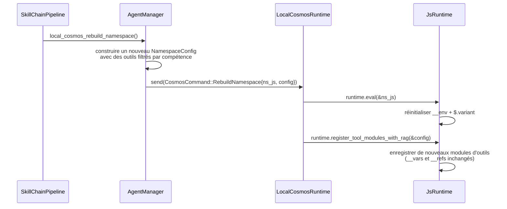

> **Invariant clé :** `RebuildNamespace` ne met à jour que les enregistrements d'outils et les paramètres d'environnement. Il ne **réinitialise pas** `__vars` ou `__refs` — ceux-ci sont gérés séparément par `ResetVars`.

### 9.5 Propagation de la Langue en Mode Conteneurisé

Lorsque les agents s'exécutent dans des conteneurs youki (imbriqués dans le conteneur Docker scepter), la valeur `env.aporia.language` est définie via le `CosmosConnector` :

```rust
// packages/scepter/src/services/cosmos_connector.rs:351-363
let lang_code = format!(
    "env.aporia.language = {};",
    serde_json::to_string(&lang).unwrap_or_else(|_| "\"en\"".to_string())
);
connector.cosmos_exec(&container_uuid, &lang_code).await?;
```

Cela envoie un appel MCP `exec` via le transport JSON-RPC au conteneur cosmos, qui évalue l'assignation JS dans le `JsRuntime` isolé du conteneur. Le chemin complet de propagation de la langue est :

```text
Langue de la requête TUI → Scepter (extraire request_language)
  → [mode local] exec direct("env.aporia.language = 'zh'")
  → [conteneurisé] CosmosConnector::cosmos_exec(appel_json_rpc)
      → gestionnaire cosmos → js_runtime.eval(...)
```

### 9.6 Sécurité

- Validation `exec` : tout code passe par la validation syntaxique AST SWC avant l'évaluation Boa
- L'utilisation de `eval()` dans les blocs `exec` est détectée et bloquée avec un conseil d'utiliser `write_to_var` à la place
- Le contenu `ref_add` passe par `JSON.parse()` — le code arbitraire ne peut pas être injecté
- Aucun outil d'espace de noms n'expose l'accès brut au contexte Boa
- Les conteneurs Cosmos s'exécutent dans des conteneurs youki en bac à sable avec profils seccomp, chacun imbriqué dans

le conteneur Docker/Podman scepter (isolation de conteneur à deux couches)
