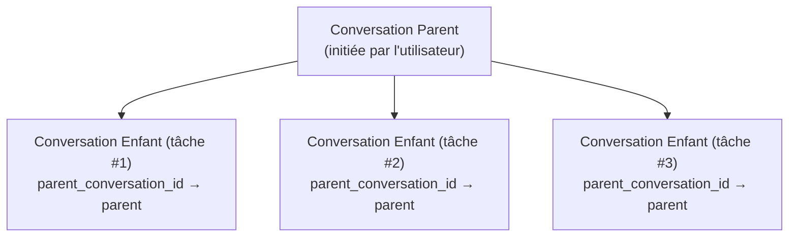

# ADR-004 : Gestion du Cycle de Vie du Stockage de Session

> **Statut** : Accepté (10-06-2026)
> **Contexte** : entelecheia + shittim-chest
> **Inspiré par** : [opencode #16101](https://github.com/anomalyco/opencode/issues/16101)

## Contexte

opencode (un agent de codage IA comparable) a accumulé 9 Go de BD d'historique de chat en seulement 2 mois avec ~30B de jetons consommés. L'utilisation de la mémoire dépassait régulièrement 30 Gio avec seulement ~10 projets chargés. La cause racine était l'absence de gestion du cycle de vie des sessions : pas de TTL, pas de nettoyage automatique, pas de plafond de stockage et pas de récupération post-compactage.

entelecheia et shittim-chest font face au même problème fondamental s'il n'est pas traité :

- **entelecheia** : Les tables `conversations` et `messages` existaient mais n'étaient jamais écrites ; le chat réel était stocké comme fichiers de log TOML illimités ; la table `dialogue_events` avait du code CRUD mais pas de migration ; les limites de configuration (`MAX_DIALOGUE_HISTORY_LEN`, `MAX_DIALOGUE_RECORDS`, `DIALOGUE_TIMEOUT_MS`) étaient définies mais jamais appliquées.
- **shittim-chest** : A une persistance de conversation/message fonctionnelle mais pas de nettoyage automatisé pour les sessions d'authentification expirées, les sessions d'espace de travail obsolètes, l'historique de croisière ou les journaux de livraison webhook.

## Décision

Implémenter un système unifié de gestion du cycle de vie du stockage avec ces principes :

### 1. Les conversations ont un cycle de vie, pas seulement une naissance

- **TTL** : Les conversations inactives au-delà de `CONVERSATION_TTL_DAYS` (par défaut 90 jours) sont éligibles au nettoyage après archivage.
- **Archiver-avant-supprimer** : Les conversations doivent être archivées (`is_archived = TRUE`) avant que le nettoyage TTL ne les supprime.
- **Sessions enfants** : Les relations de conversation parent-enfant sont suivies via `parent_conversation_id`. Les conversations enfants peuvent être archivées et nettoyées indépendamment après `CHILD_SESSION_RETENTION_DAYS` (par défaut 7 jours).

### 2. Le nettoyage est automatique, pas manuel

- **Tâches d'arrière-plan** : Le nettoyage périodique s'exécute à intervalles configurables (`CLEANUP_INTERVAL_MINUTES`, par défaut 60).
- **Stratégie mixte** : Analyse au démarrage + minuteur périodique. Ne nécessite pas d'intervention utilisateur.
- **Idempotent** : Les tâches de nettoyage peuvent être exécutées plusieurs fois en toute sécurité.

### 3. Le compactage permet la récupération de stockage

- Les messages marqués comme `is_compacted = TRUE` ont eu leur contenu résumé. Leur contenu détaillé peut être nettoyé après la période de rétention.
- Conservateur par défaut : ne nettoyer que le contenu des messages compactés, préserver les métadonnées (nom de l'outil, horodatages, compteurs de jetons).

### 4. La configuration est centralisée

Tous les paramètres du cycle de vie résident dans `StorageLifecycleConfig` (entelecheia) et `CleanupConfig` (shittim-chest), chargés depuis les variables d'environnement avec des valeurs par défaut raisonnables.

### 5. Les logs basés sur fichier sont secondaires

- `CHAT_LOG_ENABLED` par défaut à `false`. Les fichiers de log de chat TOML sont uniquement pour le débogage.
- Lorsqu'ils sont activés, les fichiers de log sont nettoyés après `CHAT_LOG_RETENTION_DAYS` (par défaut 7).

## Modifications du Schéma

### Table conversations (entelecheia)

Colonnes ajoutées :

- `parent_conversation_id UUID REFERENCES conversations(conversation_id)` — suivi des sessions enfants
- `is_archived BOOLEAN NOT NULL DEFAULT FALSE` — drapeau d'archivage
- `archived_at TIMESTAMPTZ` — quand l'archivage a eu lieu
- `metadata JSONB NOT NULL DEFAULT '{}'` — métadonnées extensibles

### Table messages (entelecheia)

Colonnes ajoutées :

- `is_compacted BOOLEAN NOT NULL DEFAULT FALSE` — marque les messages compactés éligibles au nettoyage de contenu
- `metadata JSONB NOT NULL DEFAULT '{}'` — métadonnées extensibles

### Table dialogue_events (entelecheia)

Avait du code CRUD mais pas de migration `CREATE TABLE`. Maintenant incluse dans `baseline_tables.sql`.

### Table rbac_sessions (entelecheia)

Nouvelle table pour la persistance de session kirino (backend SQL).

## Phases d'Implémentation

| Phase | Description | Statut |
| --- | --- | --- |
| 0.1 | Corrections de migration de schéma (dialogue_events, mise à niveau conversations/messages) | Fait |
| 1.2 | Espace de noms de configuration unifié (`StorageLifecycleConfig`) | Fait |
| 0.2 | `ConversationStore` avec méthodes CRUD + nettoyage | Fait |
| 2.1 | Infrastructure générique `CleanupScheduler` | Fait |
| 2.2 | Tâches de nettoyage entelecheia câblées dans `setup.rs` de scepter | Fait |
| 2.3 | Tâches de nettoyage shittim-chest | Supprimé (le paquet n'existe pas) |
| 1.3 | kirino `PgSessionManager` (backend de session SQL) | Fait |
| 3.1 | Appliquer les limites de dialogue existantes (`max_dialogue_records`, `enforce_max_conversations`) | Fait |
| 3.2 | Désactivation par défaut des logs de chat + nettoyage TTL | Fait |
| 4.1 | Commandes de gestion CLI (`session stats`, `session purge`) | Fait |
| 5 | Cascade de session enfant + cycle de vie des orphelins | Fait |

## Conséquences

### Positives

- Empêche la croissance illimitée du stockage qui a affligé opencode
- Les conversations ont un cycle de vie explicite : actif → archivé → nettoyé
- Le nettoyage en arrière-plan ne nécessite aucune intervention de l'utilisateur
- Piloté par la configuration avec des valeurs par défaut raisonnables
- PostgreSQL VACUUM récupère l'espace disque après suppression (contrairement à SQLite qu'opencode utilise)

### Négatives

- Les tâches d'arrière-plan supplémentaires consomment un minimum de CPU/mémoire
- Les conversations archivées perdent le contenu détaillé après TTL (par conception)
- Nécessite une surveillance pour garantir que les tâches de nettoyage s'exécutent

### Risques atténués

- **Perte de données** : Archiver-avant-supprimer fournit une période de grâce. Le nettoyage ne supprime que les conversations déjà archivées.
- **Impact sur les performances** : Le nettoyage s'exécute à intervalles configurables, utilise des requêtes indexées sur `updated_at`/`created_at`.
- **Orphelinage de session enfant** : `parent_conversation_id` suit les relations ; le TTL des orphelins est plus court (30 jours contre 90 jours).

## Conception du Cycle de Vie des Sessions Enfants (Phase 5)

### Problème

Le problème opencode #16101 a révélé que 86% des sessions sont des sessions enfants générées par `task()`, représentant 75% du stockage. Ces sessions enfants s'accumulent sans gestion indépendante du cycle de vie.

### Architecture



### Règles du Cycle de Vie

1. **Création** : Lorsqu'une chaîne de compétences génère une sous-tâche, une nouvelle conversation est créée avec `parent_conversation_id` défini sur le `conversation_id` du parent.

1. **Archivage indépendant** : Les enfants peuvent être archivés indépendamment du parent. Lorsqu'une tâche enfant se termine, elle est automatiquement archivée après `CHILD_SESSION_RETENTION_DAYS` (par défaut 7 jours).

1. **Cascade sur archivage du parent** : Lorsqu'un parent est archivé, tous les enfants sont archivés. Lorsqu'un parent est supprimé, tous les enfants sont supprimés.

1. **Gestion des orphelins** : Les conversations avec `parent_conversation_id` pointant vers un parent supprimé/inexistant sont traitées comme orphelines et nettoyées après `ORPHAN_CONVERSATION_TTL_DAYS` (par défaut 30 jours).

1. **Éligibilité au compactage** : Les conversations enfants sont éligibles au compactage des messages immédiatement après l'archivage (pas de période de grâce), puisque le parent conserve le résumé.

### Requêtes de Nettoyage

```sql
-- Archiver les enfants dont le parent est archivé
UPDATE conversations SET is_archived = TRUE, archived_at = NOW()
WHERE parent_conversation_id IN (
    SELECT conversation_id FROM conversations WHERE is_archived = TRUE
) AND is_archived = FALSE;

-- Supprimer les enfants dont le parent est supprimé
DELETE FROM conversations WHERE parent_conversation_id IS NOT NULL
    AND parent_conversation_id NOT IN (SELECT conversation_id FROM conversations);

-- Supprimer les enfants archivés plus anciens que la rétention
DELETE FROM conversations WHERE is_archived = TRUE
    AND archived_at < NOW() - (CHILD_SESSION_RETENTION_DAYS || ' days')::interval
    AND parent_conversation_id IS NOT NULL;
```

### État de l'Implémentation

- La colonne `parent_conversation_id` existe dans la table `conversations` (Phase 0.1)
- `ConversationStore.cleanup_expired_conversations()` gère le nettoyage basé sur TTL (Phase 0.2)
- `StorageLifecycleConfig.child_session_retention_days` et `orphan_conversation_ttl_days` configurés (Phase 1.2)
- Requêtes en cascade implémentées dans `ConversationStore` :
  - `cascade_archive_children()` — archive les enfants lorsque le parent est archivé
  - `cascade_delete_orphaned_children()` — supprime les enfants dont le parent a été supprimé
  - `cleanup_expired_child_conversations()` — nettoyage basé sur TTL pour les enfants archivés
  - `cleanup_orphan_conversations()` — nettoyage des enfants avec parent manquant
  - `enforce_max_dialogue_records()` — plafond dur sur le nombre de `dialogue_events`
  - `enforce_max_conversations()` — plafond dur sur le nombre de conversations actives
- Toutes enregistrées comme tâches de nettoyage périodiques dans `setup.rs` de scepter
