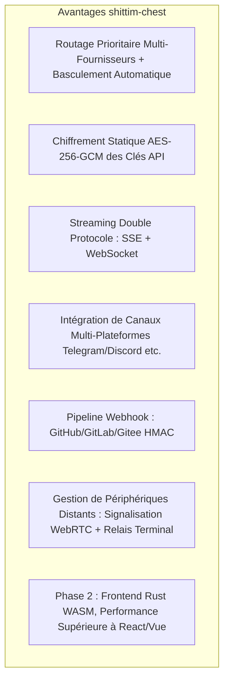

# Positionnement Produit & Paysage Concurrentiel

## Aperçu

shittim-chest est une plateforme WebUI LLM faiblement couplée, avec des concurrents directs comme Open WebUI, LobeChat et similaires. Son intégration avec entelecheia est une fonctionnalité optionnelle, pas un prérequis architectural.

## Positionnement Central

| Dimension | Description |
| --- | --- |
| Essence | Une WebUI de chat LLM autonome multi-fournisseurs |
| Concurrents | Open WebUI, LobeChat, NextChat |
| Relation avec entelecheia | Faiblement couplé : intégration optionnelle via proxy JWT |
| Indépendance | Fournit une expérience de chat complète sans entelecheia |

## Différenciation par rapport à Open WebUI

## Frontière avec entelecheia

| shittim-chest | entelecheia |
| --- | --- |
| Authentification Utilisateur (argon2 + JWT) | Identité Utilisateur + Permissions (RBAC) |
| Gestion de Sessions | Orchestration d'Agents (scepter) |
| Données de Chat (conversations/messages) | Runtime de Conteneur Cosmos |
| Gestion des Fournisseurs LLM + Chiffrement des Clés | Moteur d'Exécution TypeScript IEPL |
| Entrée Webhook (Vérification HMAC + Transfert) | Invocation d'Outils d'Agent |
| Rendu Frontend (arona) | Canal Agent WebSocket |
| Sessions de Périphériques Distants + Relais de Signalisation | Agent de Périphérique polemos |
| Configuration de Canaux Multi-Plateformes | — |

**Principe Clé** : shittim-chest ne détient que les données « côté utilisateur » ; entelecheia ne détient que les données « côté Agent ». Les deux communiquent via HTTP/WebSocket authentifié par JWT, sans jamais accéder aux bases de données l'une de l'autre.

## Feuille de Route d'Évolution de l'Architecture

| Phase | Statut | Contenu |
| --- | --- | --- |
| P1-P6 | Terminé | Chat autonome, auth, gestion des fournisseurs, Webhooks, pont proxy, gestion de périphériques |
| P7 | Prévu | Entrée/sortie vocale (conteneur Docker STT + proxy TTS) |
| P8 | Prévu | PWA mobile + Tauri Mobile |
| P9 | Prévu | Migration frontend Rust WASM (arona → Tairitsu) |

## Philosophie de Conception

1. **Autonome d'abord** : Toutes les fonctionnalités principales ne dépendent pas d'entelecheia. Les variables d'environnement `LLM_DEFAULT_PROVIDER_*` suffisent pour lancer le chat indépendamment.
1. **Intégration faiblement couplée** : L'intégration entelecheia est une couche proxy optionnelle. Les utilisateurs peuvent choisir d'utiliser uniquement le chat LLM, ou d'activer l'orchestration d'Agents via entelecheia.
1. **WASM progressif** : Le frontend Vue 3 est livré d'abord comme « spécification vivante » ; la migration WASM a des seuils de décision clairs (maturité du framework, couverture de l'écosystème, bande passante de développement).
1. **Docker natif** : Tous les composants côté serveur sont gérés via l'API Docker bollard, sans dépendance à docker-compose.
