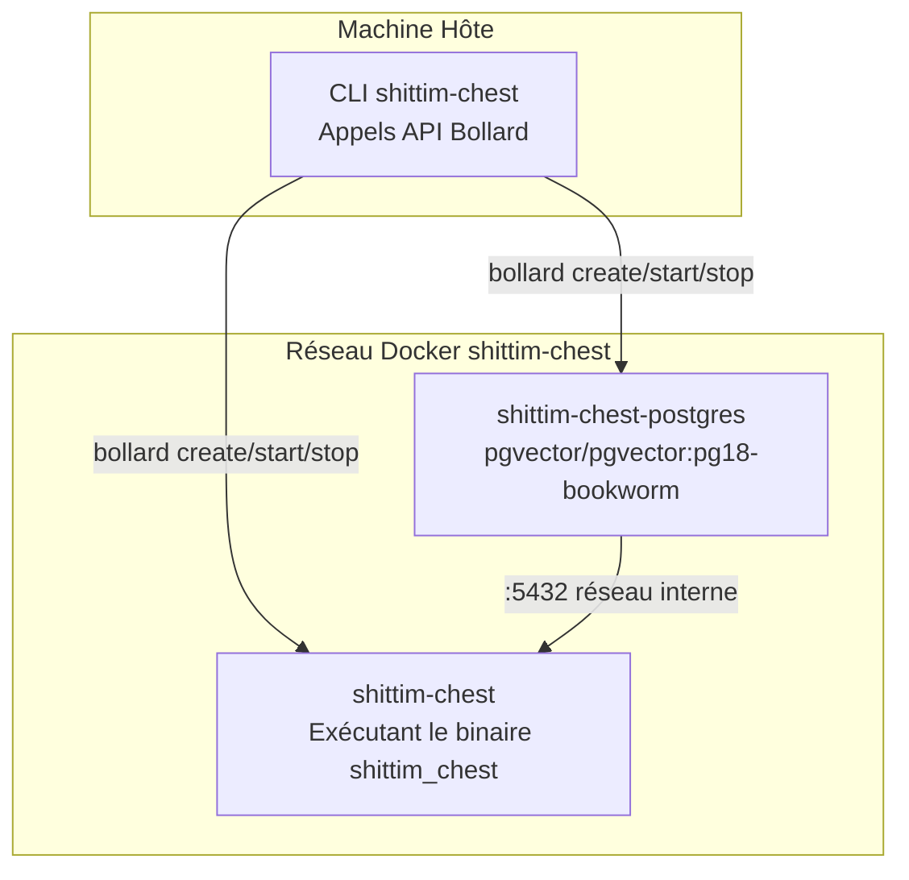

# Architecture du Wrapper CLI : Orchestration Docker Basée sur Bollard

## Aperçu

`packages/cli/` est un binaire Rust qui gère les cycles de vie des conteneurs directement via l'API Docker Bollard, remplaçant entièrement docker-compose et les scripts shell. Le CLI s'exécute sur la machine hôte, tandis que le binaire serveur (`shittim_chest`) s'exécute à l'intérieur des conteneurs.

## Pourquoi pas docker-compose

| Dimension | docker-compose | bollard (approche actuelle) |
| --- | --- | --- |
| Dépendance | Nécessite une installation autonome de docker-compose | Réutilise l'API Docker Engine |
| Programmabilité | YAML déclaratif, logique limitée | Rust natif, flux de contrôle arbitraire |
| Vérifications de santé | depends_on + condition basé sur événements | Sondage actif ; détection de mort sans timeouts |
| Gestion d'erreurs | Échec du conteneur = échec | Tentatives + collecte de logs + infos d'erreur détaillées |
| Nettoyage des ressources | `down -v` tout ou rien | Nettoyage granulaire par conteneur/réseau/volume |
| Intégration | Outil externe | Embarqué comme bibliothèque, extensible avec plus de logique |

## Topologie des Conteneurs



## Nommage des Conteneurs & Ressources

| Constante | Valeur | But |
| --- | --- | --- |
| `NET` | `shittim-chest` | Réseau pont Docker |
| `PG` | `shittim-chest-postgres` | Nom du conteneur PostgreSQL |
| `APP` | `shittim-chest` | Nom du conteneur d'application |
| `VOL` | `shittim-chest-pgdata` | Volume de données PG |
| `PG_IMG` | `pgvector/pgvector:pg18-bookworm` | Image PG |
| `RUNTIME_IMG` | `debian:bookworm-slim` | Image runtime mode dev |
| `BUILD_IMG` | `shittim-chest` | Image de build mode release |

## Mappage des Commandes

| Commande | Comportement |
| --- | --- |
| `dev [--clean]` | Démarrage unique : env → réseau → volume → PG → cargo build → migration → lancement → logs en continu |
| `up` | Mode release : construction image docker → migration → lancement en arrière-plan (restart=unless-stopped) |
| `down [--clean]` | Arrêt des conteneurs (nettoyage optionnel volume + réseau) |
| `migrate` | Exécuter db-migrate dans un conteneur jetable (jusqu'à 5 tentatives, intervalle 2s) |
| `logs` | Suivre les logs du conteneur d'application en continu |
| `status` | Vérifier l'état d'exécution des conteneurs PG et app + état de la vérification de santé |
| `build` | Construire l'image Docker complète (`docker build -t shittim-chest`) |

## Propagation des Variables d'Environnement

```text
fichier .env → dotenvy::from_path_iter → HashMap<String, String>
→ Fusionner SHITTIM_CHEST_HOST / PORT / DATABASE_URL
→ Vec<String> = ["CLE=VALEUR", ...]
→ bollard Config::env()
```

Le CLI ne lit pas sa propre configuration depuis `.env` — il ne fait que transmettre le contenu complet de `.env` dans le processus `shittim_chest` à l'intérieur du conteneur. Les mots de passe et ports sont lus via les deux clés spécifiques `SHITTIM_CHEST_DB_PASSWORD` et `SHITTIM_CHEST_PORT`.

## Conventions de Journalisation

Les logs du CLI sont envoyés directement à stderr, utilisant le même format qu'entelecheia :

- `tracing-subscriber` + `ShortTimer` (format HH:MM:SS)
- `.compact()` mode compact
- `.with_target(false)` masquer les chemins de modules
- `--log-level` paramètre CLI (par défaut `info`)

## Principes de Conception

1. **Le CLI n'effectue pas de logique métier** : Toute la logique métier réside dans le binaire `shittim_chest` à l'intérieur du conteneur
1. **Les conteneurs sont des unités immuables** : Le CLI crée/détruit des conteneurs, ne modifie jamais ceux en cours d'exécution
1. **Isolation réseau** : Le port PG n'est pas exposé à l'hôte, uniquement accessible dans le réseau Docker interne
1. **Sondage passif pour les vérifications de santé** : Ne dépend pas des événements Docker (peu fiables) ; sonde directement les résultats d'inspection
