# Chemins de Déploiement Double Mode : Dev vs Release

## Aperçu

shittim-chest prend en charge deux modes de déploiement : Dev (itération rapide locale, sans Node, sans construction d'image) et Release (image Docker complète avec fichiers statiques frontend intégrés). Les deux modes partagent la même topologie de conteneurs et le même réseau.

## Motivation de Conception

Construire une image Docker complète (construction frontend Node + compilation Rust + `embedded-frontend`) prend plus de 30 secondes, inadapté pour l'itération de développement quotidienne. Le mode Dev exploite le cache de compilation Rust incrémentale de la machine hôte, montant le binaire dans un conteneur runtime minimal pour des temps de redémarrage inférieurs à la seconde.

## Comparaison des Chemins

```mermaid
flowchart TB
    subgraph Dev[Chemin Dev]
        D1[cargo build -p shittim_chest] --> D2[Binaire : target/debug/shittim_chest]
        D2 --> D3[montage bind dans debian:bookworm-slim]
        D3 --> D4[Conteneur en cours d'exécution]
    end
    subgraph Release[Chemin Release]
        R1[docker build -t shittim-chest] --> R2[Construction multi-étapes]
        R2 --> R3[Node:22-slim construit le frontend]
        R3 --> R4[Rust:1.85-slim compile + embedded-frontend]
        R4 --> R5[runtime debian:bookworm-slim]
        R5 --> R6[Conteneur en cours d'exécution]
    end
```



| Dimension | Mode Dev (`just dev`) | Mode Release (`just up`) |
| --- | --- | --- |
| Frontend | Construit par Vite, servi par le backend via `just dev` | Intégré dans le binaire (fonctionnalité `embedded-frontend`) |
| Nécessite Node | Oui (pour la construction Vite) | Oui (dans Docker) |
| Source du binaire | `cargo build` local | Compilé dans Docker |
| Image de base du conteneur | `debian:bookworm-slim` | `debian:bookworm-slim` (résultat de construction multi-étapes) |
| Vitesse de redémarrage | < 5s (après compilation incrémentale) | 30-60s (construction complète) |
| Cas d'usage | Développement quotidien, débogage | Déploiement CI/production |
| Méthode de lancement du conteneur | `Config.cmd = ["shittim_chest"]` | L'image inclut ENTRYPOINT |

## Détails d'Implémentation du Mode Dev

### Compilation Locale

```rust
async fn cargo_build() -> Result<()> {
    Command::new("cargo")
        .args(["build", "-p", "shittim_chest"])
        .status().await?;
}
```

Le chemin de sortie de compilation est fixé à `$PWD/target/debug/shittim_chest` (profil debug, symboles de débogage préservés).

### Lancement par Montage Bind

```rust
let config = Config::<String> {
    image: Some("debian:bookworm-slim".into()),   // runtime minimal
    cmd: Some(vec!["shittim_chest".to_string()]),
    host_config: Some(HostConfig {
        binds: Some(vec![
            format!("{bin_path}:/usr/local/bin/shittim_chest:ro")
        ]),
        network_mode: Some(NET.into()),
        port_bindings: ...,
        ..
    }),
    env: Some(container_env(password, port)),
    ..
};
```

Points clés :

- Le binaire est monté en lecture seule (`:ro`) pour empêcher toute modification accidentelle dans le conteneur
- L'emplacement du binaire est `/usr/local/bin/shittim_chest`, exécuté directement dans le conteneur
- L'image de base `debian:bookworm-slim` fournit le runtime glibc requis

### Exécution des Migrations

Les migrations sont exécutées via un conteneur jetable :

```bash
docker run --rm --network shittim-chest \
  -v $PWD/target/debug/shittim_chest:/usr/local/bin/shittim_chest:ro \
  -e SHITTIM_CHEST_DATABASE_URL=... \
  debian:bookworm-slim \
  shittim_chest db-migrate
```

Tentatives automatiques jusqu'à 5 fois (intervalle de 2 secondes) pour gérer le cas où PG n'est pas encore complètement prêt.

## Détails d'Implémentation du Mode Release

### Construction Multi-Étapes Dockerfile

```dockerfile
# Étape 1 : frontend → Node:22-slim + pnpm → pnpm build:all → /app/dist/
# Étape 2 : builder  → Rust:1.85-slim + COPY dist/ → cargo build --features embedded-frontend
# Étape 3 : runtime  → debian:bookworm-slim + ca-certificates + COPY binaire
```

### Fonctionnalité embedded-frontend

```rust
# [cfg(feature = "embedded-frontend")]
{
    static FRONTEND_DIR: Dir<'_> = include_dir!("$CARGO_MANIFEST_DIR/../dist");
    // Monté sur le Router Axum aux chemins /static/*
}
```

Cette fonctionnalité utilise la macro `include_dir!` pour intégrer les artefacts de construction frontend dans le binaire au moment de la compilation. En mode Release, une SPA complète peut être servie sans proxy inverse supplémentaire.

## Nommage des Fonctions de Migration & Lancement

Pour éviter toute confusion, le code distingue explicitement deux ensembles de fonctions :

| Chemin Dev | Chemin Release |
| --- | --- |
| `run_migrate_dev()` | `run_migrate_release()` |
| `start_app_dev()` | `start_app_release()` |
| `cargo_build()` | `build_image()` |

## Développement Frontend

En mode Dev, `dev.py` reconstruit les assets frontend lors des modifications de fichiers. Le backend sert à la fois les fichiers statiques et l'API sur le même port (:3000 pour le dev, :80 pour la production).
