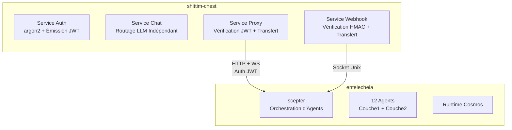

# Couplage Lâche avec entelecheia

## Aperçu

L'intégration entre shittim-chest et entelecheia est basée sur un pont proxy HTTP/WebSocket authentifié par JWT. Cette conception permet à shittim-chest de fonctionner de manière totalement indépendante sans entelecheia, tout en activant des capacités d'orchestration d'Agents à la demande lorsque nécessaire.

## Conception de la Frontière



## Propriété des Données

| shittim_chest_db | entelecheia_db |
| --- | --- |
| auth_users (hachages de mot de passe) | user_identities (user_id) |
| sessions (sessions actives) | groups |
| refresh_tokens | group_memberships |
| oauth_connections | role_assignments |
| api_keys (clés fournisseur chiffrées) | group_permissions (quotas fournisseur) |
| conversations | agent_configs |
| messages | cosmos_state |
| llm_providers (configs fournisseur) | iepl_state |
| remote_devices (enregistrements de périphériques) | |
| device_sessions | |
| channel_configs | |
| webhook_logs (journaux de livraison) | |

**Principe** : shittim-chest détient les données « côté utilisateur » ; entelecheia détient les données « côté Agent ». `user_id` est la clé de liaison entre les deux côtés.

## Protocole d'Authentification JWT

### Partage de Clé

shittim-chest et scepter partagent la clé de signature JWT via la même variable d'environnement `JWT_SECRET`. Les deux côtés peuvent vérifier indépendamment les JWT émis par l'autre.

### Structure du Token

```json
{
  "sub": "user-uuid",
  "groups": ["admin", "developer"],
  "exp": 1710000000,
  "iat": 1709996400
}
```

| Champ | Description |
| --- | --- |
| `sub` | UUID utilisateur (partagé entre les deux bases de données) |
| `groups` | Liste des groupes auxquels l'utilisateur appartient |
| `exp` | Heure d'expiration (par défaut 1 heure) |
| `iat` | Heure d'émission |

### Flux de Connexion

```text
Utilisateur → shittim_chest : POST /api/auth/login
shittim_chest : Vérifier le mot de passe argon2
shittim_chest → scepter : GET /api/user/{id}/permissions
scepter → entelecheia_db : Interroger les groupes et permissions
scepter → shittim_chest : { groups, permissions }
shittim_chest : Émettre JWT (accès + rafraîchissement)
shittim_chest → Utilisateur : tokens
```

## Pont Proxy

### Proxy HTTP

```text
Navigateur → shittim_chest:80/api/proxy/chat (JWT dans l'en-tête)
shittim_chest : Vérifier JWT
shittim_chest → scepter:8424/api/chat (Transférer JWT)
scepter → Agent → LLM → scepter → shittim_chest → Navigateur
```

### Proxy WebSocket

```text
Navigateur → shittim_chest:80/api/proxy/ws (JWT dans l'en-tête)
shittim_chest : Vérifier JWT
shittim_chest ↔ scepter:8424/ws (Transfert bidirectionnel + JWT)
Navigateur ↔ scepter : Interaction Agent full-duplex
```

### Limitation de Débit & Surveillance

Au niveau de la couche proxy, shittim-chest est responsable de :

- Limitation de débit (par utilisateur / par IP)
- Journalisation d'usage
- Gestion du cycle de vie des connexions
- Reconnexion en cas de déconnexions anormales

## Pipeline Webhook

```text
GitHub/GitLab/Gitee → POST /api/webhook/{source} → Vérification HMAC → Analyser l'événement → Socket Unix → scepter
```

shittim-chest gère la vérification HMAC et l'analyse des événements ; scepter déclenche les actions d'Agent en fonction des événements (par exemple, revue de code automatisée).

## Mode de Fonctionnement Autonome

Lorsque l'URL scepter n'est pas configurée dans les variables d'environnement ou que `SHITTIM_CHEST_SCEPTER_PROXY` est défini sur `disabled` :

- Les points de terminaison `/api/proxy/*` retournent 503 (Service Indisponible)
- Les points de terminaison `/api/devices/*` retournent 503
- Le chat utilise entièrement le LlmRouter intégré
- Toutes les autres fonctionnalités (auth, chat, gestion des fournisseurs, entrée webhook) fonctionnent normalement

Cela permet à shittim-chest d'être déployé comme une WebUI LLM autonome complète sans entelecheia.
