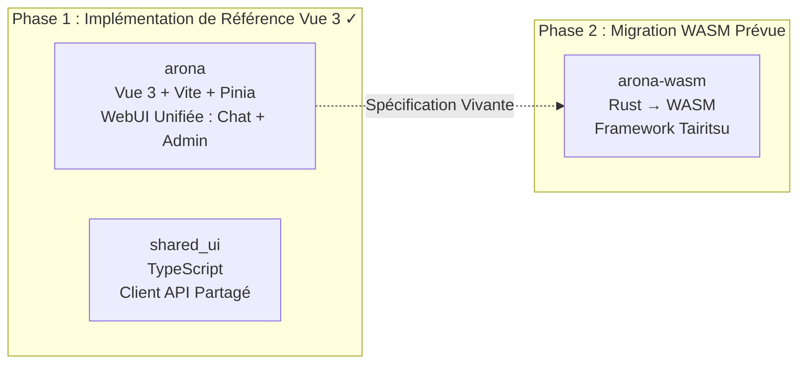
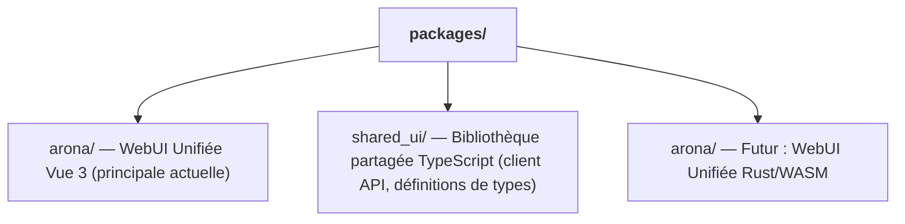

# Stratégie de Migration Double Frontend WASM

## Aperçu

shittim-chest emploie une stratégie frontend en deux phases « Vue 3 d'abord, WASM ensuite ». La version Vue 3 est livrée d'abord comme implémentation de référence de qualité production, la version Rust/WASM migrant lorsque les conditions sont mûres. Pendant la période où les deux versions fonctionnent en parallèle, des interactions utilisateur identiques doivent produire des résultats identiques.

## Décomposition des Phases



## Comparaison des Piles Technologiques

| Dimension | Phase 1 (Vue 3) | Phase 2 (WASM) |
| --- | --- | --- |
| Langage | TypeScript / Vue 3 SFC | Rust |
| Framework | Vite + Pinia + Vue Router | Tairitsu (auto-développé) |
| Artefact de build | Bundle JS/CSS | Binaire WASM |
| Taille du bundle | Plus grand | Significativement plus petit |
| Performance runtime | Bonne | Excellente (vitesse quasi-native) |
| Expérience développeur | HMR instantané | Attente de compilation |
| Maturité de l'écosystème | Mature | Stade précoce |

## Le Principe de « Spécification Vivante »

La version Vue 3 n'est pas simplement une implémentation temporaire ; elle sert de **spécification exécutable** pour la migration WASM :

1. **Complétude fonctionnelle** : Chaque fonctionnalité de la version WASM doit se comporter de manière identique à la version Vue 3
1. **Contrat API** : Les deux versions utilisent la même API REST et le même protocole WebSocket
1. **Cohérence visuelle** : Les deux versions rendent la même UI dans des états identiques
1. **Remplacement progressif** : Les fonctionnalités de chat et d'administration d'arona peuvent migrer vers WASM indépendamment

## Seuils de Décision pour la Migration WASM

La migration vers WASM ne commencera pas avant que les conditions soient mûres. Seuils de décision :

| Condition | Description |
| --- | --- |
| Maturité du framework Tairitsu | La bibliothèque de composants, le routage, la gestion d'état, l'i18n et les autres infrastructures doivent être complets |
| Couverture de l'écosystème WASM | `web-sys` / `wasm-bindgen` doivent supporter les API Web requises |
| Bande passante de développement | Personnel suffisant pour maintenir les deux versions tout en avançant la migration |
| Exigences de performance | La version Vue 3 rencontre des goulets d'étranglement de performance dans des scénarios réels |

## Structure des Packages Frontend



`shared_ui/` contient le code frontend partagé :

- Client API (auth, chat, gestion des fournisseurs, etc.)
- Utilitaires d'authentification (stockage JWT, rafraîchissement, intercepteurs)
- Définitions de types (énumérations de domaine, types requête/réponse)

## Commandes de Développement Frontend

```bash
just build-frontend  # Construire les deux frontends (pnpm build:all)
dev.py               # Surveiller + reconstruction automatique lors des modifications
```

En mode Dev, `dev.py` surveille les fichiers source et exécute `pnpm build` lors des modifications. Le backend sert à la fois les assets statiques et les points de terminaison API sur le même port — aucun serveur de développement ni proxy séparé n'est nécessaire.

## Principes de Conception

1. **Vue 3 livre les fonctionnalités d'abord** : Ne pas attendre WASM. Les utilisateurs peuvent utiliser une interface de chat et d'administration complète aujourd'hui.
1. **WASM est une amélioration, pas un remplacement** : La migration n'affecte pas les utilisateurs existants — les deux versions utilisent la même API backend.
1. **Backend agnostique du framework** : Le backend `shittim_chest` ignore l'implémentation frontend. Tout client HTTP/WS peut s'intégrer.
1. **Tairitsu est une dépendance, pas un développement interne** : Le début de la migration WASM dépend de la maturité du framework Tairitsu externe.
