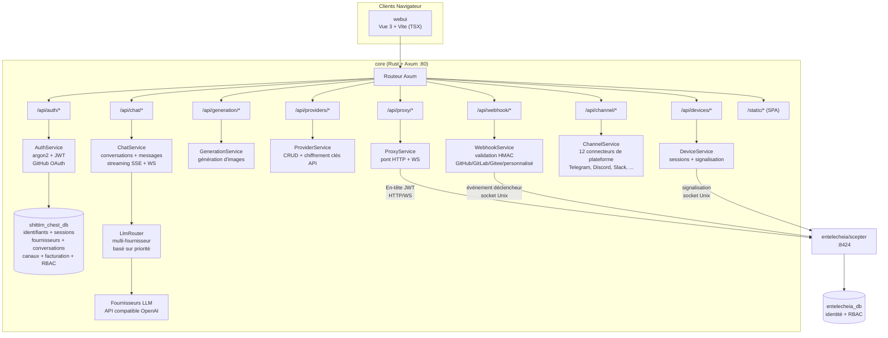
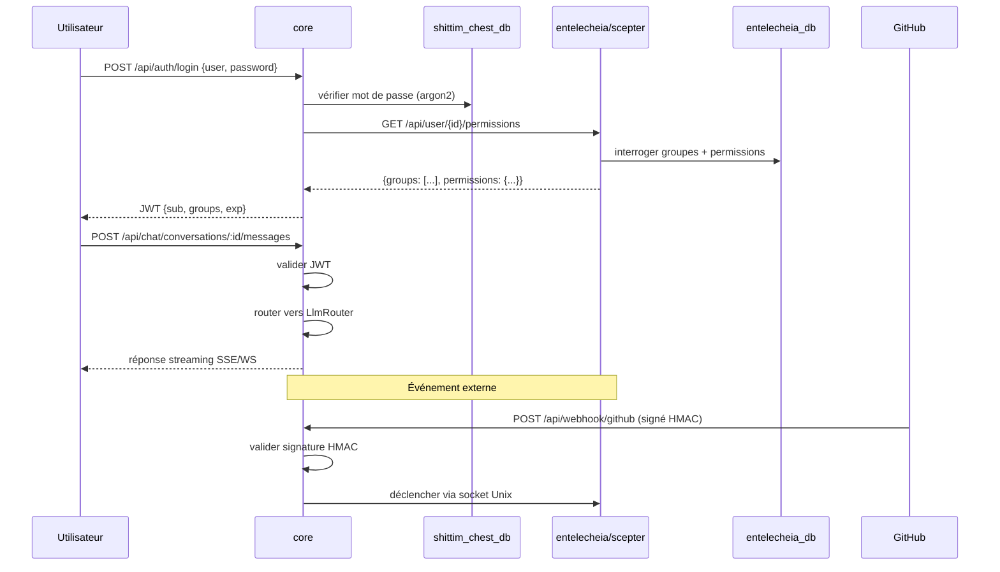

# Architecture

> **Version** : 0.1.0 — Développement actif.
> **Dernière vérification** : 2026-06-14
> Ce projet est la coque utilisateur pour [entelecheia](https://github.com/celestia-island/entelecheia).

## Périmètre

shittim-chest est un monorepo hybride Cargo + pnpm. Il possède la couche utilisateur qui enveloppe le cœur d'orchestration d'agents d'entelecheia. Les deux projets communiquent via HTTP/WebSocket authentifié par JWT — shittim-chest n'accède jamais directement à la base de données d'entelecheia pour les opérations d'agents.

| Composant | Tech | Rôle | Statut |
| --- | --- | --- | --- |
| **core** | Rust + Axum | Backend unifié : auth (JWT + OAuth), routage LLM indépendant, API chat, génération d'images, entrée webhook, proxy scepter, signalisation de périphériques distants, intégrations de canaux, facturation, RBAC, espaces de travail | 🟢 Implémenté |
| **cli** | Rust | Orchestrateur Docker : dev, up, down, migrate, logs, status | 🟢 Implémenté |
| **webui** | Vue 3 + Vite (TSX) | Frontend : surface de chat, panneau d'administration (20+ vues), topologie SCADA 2D, aperçu holographique 3D | 🟡 Partiel |
| **Types de protocole** | Rust (crate `arona`) + ts-rs | Types de protocole JSON-RPC 2.0 fournis par la crate git externe `arona` ; bindings TS consommés par webui | 🟢 Implémenté |
| **Plugins IDE** | TS + Kotlin + Rust + Lua | VS Code, IntelliJ, Zed, Neovim, pont LSP | 🟡 Fonctionnel |
| **Applications Tauri** | Rust + Tauri | Bureau, mobile, DTOs partagés | 🟡 Fonctionnel |
| **harmony** | ArkTS | Application HarmonyOS | 🟡 Fonctionnel |

## Diagramme d'Architecture

### Détail du Backend core



### Communication Inter-Projets



## Modules Backend

Tous les modules résident dans `packages/core/src/`. Le backend compte environ 34K lignes réparties sur 135 fichiers Rust (138 en incluant les fichiers de test).

### Auth (`packages/core/src/auth/`)

Entièrement implémenté :

- Inscription et connexion par nom d'utilisateur/mot de passe avec hachage argon2
- Système de tokens JWT d'accès + rafraîchissement avec rotation
- Intégration GitHub OAuth 2.0 (redirection + callback, crée automatiquement les utilisateurs)
- Gestion de sessions (CRUD sur la table `sessions`)
- Middleware de vérification de token utilisé sur toutes les routes

### Chat (`packages/core/src/chat/`)

Entièrement implémenté :

- CRUD de conversations (créer, lister, obtenir, mettre à jour, supprimer)
- Envoi/réception de messages avec routage LLM
- Réponses en streaming SSE (Server-Sent Events) (`/api/chat/stream`)
- Streaming WebSocket (`/ws/chat/stream`)
- Recherche de messages (`/api/chat/search?q=`) avec ILIKE
- Exportation de conversation (`/api/chat/conversations/:id/export?format=json|md`)

### LLM (`packages/core/src/llm/`)

Entièrement implémenté :

- Client HTTP compatible OpenAI pour le chat et la génération d'images
- Routeur multi-fournisseurs avec sélection basée sur la priorité
- CRUD de fournisseurs avec chiffrement des clés API (AES-256-GCM)
- Liste des modèles et points de terminaison de test des fournisseurs
- Configuration du timeout de requête et du buffer de streaming

### Generation (`packages/core/src/generation/`)

Entièrement implémenté :

- Points de terminaison de génération d'images (`/api/generation/images`, `/api/generation/models`)
- Utilise les fournisseurs LLM configurés

### Webhook (`packages/core/src/webhook.rs`)

Entièrement implémenté (~1000+ lignes) :

- Webhook GitHub avec validation HMAC-SHA256
- Webhook GitLab avec validation par token
- Webhook Gitee avec HMAC + token de secours
- Point de terminaison webhook personnalisé (`/api/webhook/custom/{name}`)
- Détection de livraisons en double (cache LRU, jusqu'à 10 000 IDs)
- Journal de livraison avec API de liste
- Système de liste blanche IP pour les sources webhook (`webhook_ip_whitelist.rs` séparé)
- Transfert de déclencheurs vers scepter via socket Unix

### Devices (`packages/core/src/devices/`)

Relais de signalisation implémenté (nécessite scepter externe pour la poignée de main WebRTC) :

- Points de terminaison REST pour la liste des périphériques, les détails, le CRUD de sessions
- Relais de signalisation WebSocket pour WebRTC — transfère les offres SDP/candidats ICE à scepter via socket Unix ; la réponse SDP doit provenir de scepter (`forward_sdp_to_scepter` retourne une chaîne vide si scepter est inaccessible)
- Relais de terminal (via WebSocket vers xterm.js) — transfère les frappes à scepter
- Relais de trames de bureau
- Backend d'explorateur de fichiers SFTP
- Configurable : sessions max par utilisateur, taille du buffer de trames, serveurs ICE
- Gestion de modèles de périphériques (module `device_models/`)

> **Lacune :** Le relais est réel mais ne peut pas compléter une poignée de main WebRTC sans une instance scepter en cours d'exécution. Lorsque scepter est arrêté, les réponses SDP sont vides et WebRTC échoue gracieusement.

### Channels (`packages/core/src/channel/`)

Entièrement implémenté (22 fichiers de module + `mod.rs`) :

- 12 connecteurs de plateforme : Telegram, Discord, Slack, Lark/Feishu, QQ Bot, WeCom, IRC, Matrix, Mattermost, Google Chat, Microsoft Teams, LINE
- Implémentations client API réelles par plateforme
- Contrôles de politique DM (`dm_policy.rs`)
- Limitation de débit (`rate_limit.rs`)
- Vérification de santé (`health_check.rs`)
- Appairage de canaux (`pairing.rs`)
- Système de plugins (`plugin.rs`)
- Stockage chiffré des identifiants (`crypto.rs`)
- Registre central (`registry.rs`) et routes (`routes.rs`)

### Modules Backend Supplémentaires

| Module | Description |
| --- | --- |
| `proxy/` | Pont HTTP/WS Scepter (`ws_bridge.rs` est le plus grand fichier unique de la base de code) |
| `rbac/` | Contrôle d'accès basé sur les rôles |
| `workspace/` | Gestion des espaces de travail |
| `oauth.rs` | Intégration de fournisseur OAuth |
| `billing.rs` | Intégration de paiement Stripe (vérification HMAC webhook, événements checkout/abonnement, application de quotas, déduplication de paiements) |
| `container/` | Gestion de conteneurs Docker |
| `cruise/` | Support de croisière (workflow automatisé) |
| `audio/` | Support de service audio/vocal |
| `skills.rs` | **Stub** — retourne un tableau vide ; pas de base de données ni d'intégration scepter |
| `tools.rs` | **Stub** — retourne un tableau vide ; pas de base de données ni d'intégration scepter |
| `system_settings.rs` | Configuration système |
| `trigger_forward.rs` | Transfert de déclencheurs d'événements |
| `quota_guard.rs` / `resource_quotas.rs` | Application des quotas de ressources |
| `avatar_platforms.rs` | Intégration de plateforme d'avatars |

### Base de Données

PostgreSQL via SeaORM 1.x avec **5 migrations** et **25 modèles d'entité** :

`auth_users`, `avatar_platforms`, `channel_configs`, `channel_messages`, `channel_pairings`, `channel_plugins`, `conversations`, `cruise_history`, `device_models`, `device_sessions`, `llm_providers`, `messages`, `oauth_connections`, `payment_events`, `projects`, `rbac_grants`, `rbac_groups`, `rbac_user_groups`, `remote_devices`, `scene_configs`, `sessions`, `system_settings`, `webhook_deliveries`, `workspace_alias_registry`, `workspace_sessions`

## Frontend

### webui (`packages/webui/`)

Frontend Vue 3 + Vite écrit en TSX (via `@vitejs/plugin-vue-jsx` — pas de fichiers `.vue` SFC). Package npm : `@celestia-island/webui`. ~31K lignes.

#### Vues

| Groupe de vues | Description |
| --- | --- |
| `demiurge/` | Surface de chat principale (DemiurgeView) — réponses en streaming, état des agents, appels d'outils |
| `auth/` | LoginView, RegisterView, SetupView |
| `admin/` | 20+ vues d'administration : Dashboard, Providers, Agents, RBAC, Webhooks, Channels, System, Device Models, Devices Settings, Skills, MCP Tools, OAuth Providers, Token Usage, Workspaces, Voice Service, Resource Quota, etc. |
| `topology/` | Topologie SCADA 2D : TopologyOverview, TopologyBoxDetail, TopologyDeviceDetail. Le transport est réel (WS JSON-RPC transféré à scepter) ; **sans scepter, TopologyOverview se replie sur `SIMULATED_DEVICES` codés en dur (19 appareils de démonstration) et des puces de télémétrie en chinois ; TopologyBoxDetail montre un état vide** |
| `holographic/` | Aperçu holographique 3D : HolographicOverview, HolographicBoxZoom, HolographicModelDetail. **Le chargement de modèles 3D est réel** (charge de vrais fichiers GLB, projets, configurations de scène depuis le backend local) ; les puces de paramètres de télémétrie nécessitent scepter, se replient sur vide en cas d'échec |

#### Système de composants

| Répertoire | Description |
| --- | --- |
| `base/` | 50+ composants de design system préfixés `S` (SButton, SCard, SModal, STable, STabs, STimeline, STreeView, SMarkdownRenderer, SMorphingTabs, etc.) |
| `chat/` | Composants spécifiques au chat (ChatBubble, AgentStatusBar, FloatingChatBar, ThinkingDots, ReportViewer, NodeMinimap, etc.) |
| `header/` | Composants d'en-tête (barre de fil d'Ariane, sélecteur de mode) |
| `layout/` | Coque d'application (SAppShell, SSidebar, SDrawer, SWallpaperRenderer, etc.) |
| `preview/` | Bibliothèque de symboles SCADA, topologie, composants holographiques |
| `cruise/` | Composants de workflow de croisière |
| `panels/`, `popups/`, `shared/` | UI de support |

#### Système d'animation

Tout le mouvement piloté par CSS et l'échantillonnage par trame dans la webui passe par **une boucle rAF partagée** détenue par `packages/webui/src/theme/animationBus.ts` — le « contexte d'animation » auquel chaque dialogue, modale, popup, tiroir, toast et transition de liste est censé s'enregistrer. Le bus est un singleton au niveau du processus ; il s'arrête automatiquement quand il est inactif et ne tourne que lorsqu'il y a du travail en cours, donc un onglet inactif ne brûle pas de trames.

Le bus expose quatre API d'enregistrement de travail plus deux drapeaux de canal latéral :

| API | But | Modèle de trame |
| --- | --- | --- |
| `onFrame(cb, priority?)` | Enregistrer un callback par trame. `priority` ∈ `sync` / `normal` / `idle`. Retourne `{ disconnect() }`. | Appelé à chaque trame (sync), limité à ~30 Hz de budget (normal), ou ~0,5 Hz de budget (idle). |
| `onceFrame(cb)` | Exécuter un callback à la prochaine trame, puis se déconnecter automatiquement. Tirer et oublier (pas de poignée d'annulation). | Coup unique. |
| `scheduleFrame(cb)` | Exécuter un callback à la prochaine trame ; retourne `{ disconnect() }` pour annuler avant qu'il ne se déclenche. Pour le modèle de limitation « coalescer plusieurs appels en un callback post-trame » (remplace l'idiome `if(rafId)cancel; rafId=rAF(cb)` fait main). | Coup unique (annulable). |
| `reportTransition(durationMs)` | **Déclaratif** : déclare « une transition CSS de durée N est en cours » sans callback par trame. Le bus maintient juste sa boucle en vie pendant la fenêtre pour que les observateurs échantillonnant `onFrame` ne soient pas suspendus en pleine transition. | Coût par trame nul ; état uniquement. |
| `notifyScrollStart()` | Pendant une fenêtre de défilement de 150 ms, supprimer les callbacks de priorité `normal` (économie d'énergie ; sync et idle ne sont pas affectés). | Drapeau de canal latéral. |
| `setReducedMotion(flag)` | Respecte la préférence `prefers-reduced-motion` / la classe `html.reduce-motion` de l'utilisateur — arrête la boucle d'**animation** lorsque défini. Les coups uniques (`onceFrame` / `scheduleFrame`) sont du travail utilitaire (mesures, vidages), pas de l'animation, donc ils continuent à s'écouler sur un drainer rAF séparé et ne s'arrêtent jamais. | Drapeau de canal latéral. |

La couche composable au-dessus du bus est `packages/webui/src/composables/useReportedTransition.ts`. **C'est la surface préférée** pour tout composant qui exécute une `transition` / `animation` CSS utilisant les tokens `--duration-*` partagés. Elle s'annule automatiquement au démontage du composant et coalesce les basculements rapides. Le bus suit la chronologie ; le CSS fait le travail visuel ; les deux restent synchronisés via les tokens partagés.

```ts
// composant à transition unique (le dialogue s'ouvre OU se ferme — mutuellement exclusif)
const anim = useReportedTransition(300);
function onBeforeEnter() { anim.run(); }
function onAfterEnter()  { anim.cancel(); }

// transitions superposées (ex. un TransitionGroup dont les éléments entrent ET sortent
// en même temps) — diviser par piste pour que le run() d'une sortie ne puisse pas
// annuler le report d'une entrée en cours :
const anim = useReportedTransition(300);
const enter = anim.track("enter");
const leave = anim.track("leave");
//   onBeforeEnter={enter.run} onAfterEnter={enter.cancel}
//   onBeforeLeave={leave.run} onAfterLeave={leave.cancel}
```

Le bus DOM est intentionnellement séparé de **`packages/webui/src/composables/three/animationBus3D.ts`**, qui possède sa propre boucle rAF pour le pipeline de rendu three.js. La synchronisation de trame 3D ne doit jamais affecter la planification de transition DOM et vice versa ; les deux peuvent être mis en pause ou débogués indépendamment. Tous deux exposent la même forme `onFrame → { disconnect }`.

**Tokens de mouvement** (`packages/webui/src/theme/theme.scss`) sont la source unique de vérité pour la durée/l'accélération : `--duration-instant/short/normal/long` pour le mouvement, `--duration-fade` pour les transitions d'opacité/couleur, et `--ease-spring/out-expo/in-expo/standard` pour les courbes. `prefers-reduced-motion` / `html.reduce-motion` réduit les tokens de mouvement à `0s` mais **garde délibérément `--duration-fade` non nul** — supprimer le *mouvement* déclenchant le système vestibulaire, pas l'opacité de changement d'état, est le comportement correct pour l'accessibilité. Toujours utiliser `reportTransition(--duration-*)` pour que la chronologie du bus d'une transition CSS corresponde à sa chronologie visuelle.

**Couverture** : chaque report rAF 2D-DOM dans la webui passe maintenant par le bus — `onFrame` / `reportTransition` pour l'animation continue, `onceFrame` / `scheduleFrame` pour les reports utilitaires à coup unique (mesures, recalculs limités, vidages groupés). Les seuls sites d'appel `requestAnimationFrame` bruts restants sont le pipeline 3D (`composables/three/*`, qui a son propre `animationBus3D.ts`) et la planification interne de la boucle du bus lui-même ; les deux sont intentionnels. Le nouveau travail ne devrait jamais appeler `requestAnimationFrame` directement — choisissez l'API de bus appropriée.

#### Chemins d'importation

La webui consomme son propre `src/` via **deux alias de chemin délibérément distincts** (tous deux déclarés dans `vite.config.ts` + `tsconfig.json`), et toute la base de code obéit à la séparation :

| Alias | Résout vers | Utiliser pour |
| --- | --- | --- |
| `@/<path>` | `src/*` | **Importations profondes internes** — atteindre un module spécifique directement (`@/api/client`, `@/composables/useReportedTransition`, `@/theme/animationBus`). ~600 sites ; jamais utilisé comme barillet nu. |
| `@celestia-island/shared_ui` | `src/` (→ barillet `src/index.ts`) | **La surface d'API publique curatée uniquement** — toujours le spécificateur nu, jamais un sous-chemin de code. ~92 sites. |

La séparation applique une frontière publique/privée (comme une carte `exports` de package) : le barillet (`src/index.ts`) est la seule chose importable « en tant que package », tandis que `@/` permet au code interne d'atteindre les modules d'implémentation. Traitez le barillet comme le contrat — ajoutez à `src/index.ts` quand quelque chose est destiné à être public. Les assets de design system partagés (`theme/*.scss`, `res/*`) sont également accessibles sous le namespace `shared_ui`. L'alias hérité `@shared_ui` est un doublon de `@celestia-island/shared_ui` encore référencé par quelques déclarations SCSS `@use` ; le nouveau code devrait utiliser `@celestia-island/shared_ui`.

### Types de Protocole (crate `arona`)

Les types de protocole JSON-RPC 2.0 et les énumérations partagées sont fournis par la crate Rust externe [`arona`](https://github.com/celestia-island/arona), déclarée comme dépendance git dans `Cargo.toml`. La crate dérive des bindings `ts-rs` qui sont générés dans `packages/webui/src/types/arona/` et consommés par la webui via l'alias de chemin `@celestia-island/arona`.

### Panneau d'Administration

Les vues d'administration résident dans la webui sous le groupe de routes `admin/` : Dashboard, Providers (CRUD + assistant d'ajout de fournisseur), Agents, Agent Detail, RBAC (groupes + octrois), Webhooks, Channels, System, Device Models, Devices Settings, Skills, MCP Tools, OAuth Providers, Token Usage, Workspaces, Voice Service, Resource Quota.

### i18n

La webui utilise **`vue-i18n`** (pas une implémentation personnalisée) avec **11 locales déclarées** : Arabe (`ar`), Allemand (`de`), Anglais (`en`), Espagnol (`es`), Français (`fr`), Japonais (`ja`), Coréen (`ko`), Portugais (`pt`), Russe (`ru`), Chinois simplifié (`zhs`), Chinois traditionnel (`zht`).

Chaque locale possède **17 fichiers JSON namespace** (admin, auth, chat, cmd, common, devices, errors, footer, help, logs, models, reports, skills, timeline, tokenUsage, tools, workspace). Le changement de locale dans l'application est disponible via le sélecteur de locale dans l'en-tête.

> **L'exhaustivité des traductions varie significativement** (auditées par rapport à 950 clés de référence en anglais) :
> | Niveau | Locales | Passerelle anglais | Lacune de clés |
> |------|---------|-------------------|---------|
> | Bien traduit | `ja`, `ko`, `zhs`, `zht` | ~5% | `zhs` manque 18 clés ; les autres manquent 112 |
> | Majoritairement traduit | `de`, `fr`, `pt`, `es`, `ar` | ~9–14% | Bloc partagé de 112 clés manquant |
> | Effectivement non traduit | `ru` | **~76%** | Parité complète de clés, mais les valeurs sont en anglais mot pour mot |
>
> La lacune partagée de 112 clés couvre les fonctionnalités plus récentes : `admin.agents.*`, `admin.deviceModels.*`, `admin.projects.*`, `admin.rbac.*`, `admin.resourceQuota.*`, `auth.protocol.*`, `chat.cruise.*`, `chat.voice_*`.

## Architecture RBAC

### Répartition des Données

La propriété des données est répartie entre les deux projets pour maintenir des frontières propres :

| Données | Base de données | Propriétaire | Justification |
| --- | --- | --- | --- |
| Identifiants utilisateur (hash mot de passe, OAuth, clés API) | shittim_chest_db | shittim-chest | La couche de présentation possède le flux de connexion |
| Sessions actives, tokens de rafraîchissement | shittim_chest_db | shittim-chest | La gestion de session est une préoccupation frontend |
| Conversations, messages | shittim_chest_db | shittim-chest | Les données de chat sont orientées utilisateur |
| Configs de fournisseur LLM | shittim_chest_db | shittim-chest | La gestion des fournisseurs est orientée utilisateur |
| Configs de canaux, facturation, espaces de travail | shittim_chest_db | shittim-chest | Données opérationnelles orientées utilisateur |
| Identité utilisateur, groupes, assignations de rôles | entelecheia_db | entelecheia | Le cœur d'orchestration applique les permissions |
| GroupPermissions (quotas de fournisseur, listes blanches d'agents) | entelecheia_db | entelecheia | La politique au niveau agent vit avec les agents |

### Flux d'Authentification

1. L'utilisateur s'authentifie via core (mot de passe / OAuth)
1. core valide les identifiants contre `shittim_chest_db` (argon2 pour les mots de passe)
1. core interroge entelecheia pour les permissions de groupe de l'utilisateur (ou lit depuis le cache TTL)
1. core émet un JWT avec `{ sub: user_id, groups: [...] }`
1. Toutes les requêtes suivantes portent le JWT → core valide → transfère à scepter pour les routes proxy
1. scepter valide le JWT (secret partagé via variable d'env) et applique les permissions au niveau groupe

## Dépendances Inter-Projets

### Crates Rust

shittim-chest dépend de deux crates externes de l'écosystème celestia-island :

```toml
# Crate de protocole externe — partagée entre shittim-chest et entelecheia
arona = { git = "https://github.com/celestia-island/arona.git", branch = "dev" }

# Sérialisation JSON versionnée (migrer-à-la-lecture pour les colonnes JSON/JSONB)
hifumi = { path = "../hifumi/packages/types" }
```

La crate `arona` fournit les types de protocole JSON-RPC et les énumérations partagées utilisées par les deux projets. La crate `hifumi` fournit la sérialisation JSON versionnée pour les colonnes de base de données.

### Packages npm

La webui consomme les bindings TS de la crate `arona` via l'alias de chemin `@celestia-island/arona`, qui pointe vers `packages/webui/src/types/arona/` (où la sortie `ts-rs` atterrit). Le `@celestia-island/shared_ui` de la webui est un auto-alias vers `packages/webui/src/` utilisé pour les importations internes.

## Lacunes Actuelles

> **Cette section documente les limitations connues et les zones incomplètes.**

### Fonctionnalités Dépendantes de Scepter

Les fonctionnalités suivantes ont des implémentations réelles dans shittim-chest mais nécessitent une instance [entelecheia/scepter](https://github.com/celestia-island/entelecheia) en cours d'exécution pour une fonctionnalité complète :

| Fonctionnalité | Ce qui fonctionne | Ce qui nécessite scepter |
| --- | --- | --- |
| Topologie SCADA | Transport WS, rendu SVG, navigation par fil d'Ariane | Données de télémétrie en direct (RPC `topology.*` transférés à scepter) |
| Holographique 3D | Chargement de modèle GLB, config de scène, contrôle de caméra | Puces de paramètres de télémétrie |
| Périphérique WebRTC | Relais de signalisation, auth JWT, transfert ICE | Génération de réponse SDP |
| Tableau de bord de croisière | Rendu de composants, abonnement WS | Données de streaming d'agent en direct |
| Proxy Scepter | Pont HTTP/WS (`ws_bridge.rs`, 2K lignes) | Toutes les opérations d'agent proxifiées |

Sans scepter, la topologie se replie sur `SIMULATED_DEVICES` (données de démo codées en dur) ; les puces holographiques et le WebRTC de périphérique montrent des états vides/d'échec.

### Lacunes i18n

Voir la [section i18n](#i18n) ci-dessus pour l'audit complet. Résumé : `ru` est structurellement complet mais ~76% de passerelle anglaise ; 8 locales partagent une lacune de 112 clés pour les fonctionnalités plus récentes.

### Couverture de Tests

Le backend a des tests d'intégration pour auth, chat, validation HMAC webhook, facturation (8 tests de signature Stripe) et les API d'espace de travail. Le frontend a des tests unitaires pour les composables (`useToast`, `useConfirm`, `useSolarTime`, `useAsyncData`) et les utilitaires (validation, uuid, erreurs).

**Zones non testées :** La plupart des routes admin CRUD, les appels API des connecteurs de canaux (les 12 fichiers de connecteur ont zéro test ; seuls `crypto.rs` et `rate_limit.rs` sont testés), le relais de signalisation de périphérique, le module audio (940 lignes, zéro test), les pages de topologie/holographique, les runtimes de plugins IDE, les flux d'applications Tauri/HarmonyOS. La couverture est mince par rapport à ~65K lignes de code.

### Stubs Backend

Les points de terminaison REST `skills.rs` et `tools.rs` restent des stubs de secours (retournent `[]`), mais le **chemin WS principal est entièrement câblé** via le pont notification-réponse généralisé dans `ws_bridge.rs`. Le pont traduit les méthodes requête-réponse de la webui en actions appariées de style notification de scepter :

| Méthode WS | Paire Scepter | Statut |
| --- | --- | --- |
| `skills.list` | `Skill.ListSkills` → `SkillsListResponse` | ✅ Ponté (mappeur de champs) |
| `tools.list` | `Mcp.ListTools` → `ToolsListResponse` | ✅ Ponté (mappeur de champs) |
| `layer2.agents.list` | `Tui.Layer2AgentList` → Response | ✅ Ponté (identité) |
| `layer2.tools.list` | `Tui.Layer2AgentMcpTools` → Response | ✅ Ponté (corrélation par agent) |
| `layer2.skills.list` | `Tui.Layer2AgentSkills` → Response | ✅ Ponté (corrélation par agent) |

Pour ajouter une nouvelle méthode pontée, ajoutez une entrée à `NOTIFICATION_BRIDGES` dans `ws_bridge.rs` — aucune nouvelle fonction de gestionnaire n'est nécessaire. Les points de terminaison REST (`skills.rs`, `tools.rs`) ne sont atteints qu'en secours HTTP lorsque WS est indisponible.

`chat.stop` transfère maintenant `request.cancel` à scepter (annule la chaîne de compétences en cours via `cancel_active_request()`), ne se contentant pas d'effacer l'affichage du stream côté client.

### Mode Mock

Le backend a un drapeau d'environnement `SHITTIM_CHEST_MOCK_MODE` (`config.rs`) qui saute la validation JWT et les vérifications HMAC pour le développement. C'est un **contournement de sécurité**, pas une couche de simulation de données — il émet des avertissements forts et ne doit jamais être utilisé en production.

## Licence

| Paramètre | Valeur |
| --- | --- |
| Licence commerciale | Business Source License 1.1 (BUSL-1.1) |
| Usage non commercial | Synthetic Source License 1.0 (SySL-1.0) |
| Concession d'Usage Supplémentaire | Production interne, académique, gouvernementale et usage non commercial autorisés |
| Restriction | Les services hébergés/gérés/revente par des tiers nécessitent une licence commerciale |
