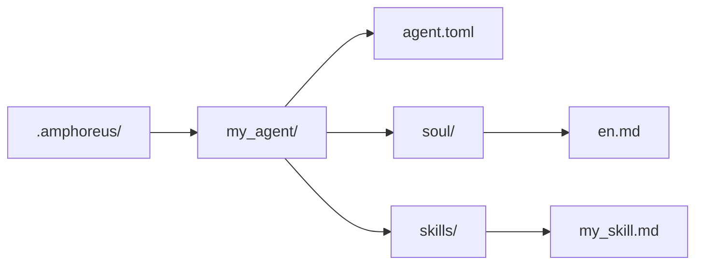

+++
title = "Tutoriel de développement d'Agent"
description = """> Guide de développement d'Agent basé sur la réalité actuelle du dépôt"""
lang = "fr"
category = "guides"
subcategory = "core"
+++

# Tutoriel de développement d'Agent

> Guide de développement d'Agent basé sur la réalité actuelle du dépôt

## Aperçu

Il existe trois niveaux d'extension réellement utilisables dans le dépôt actuel.

| Niveau | Signification actuelle |
| --- | --- |
| Layer1 | Agents principaux implémentés en tant que crate Rust et compilés dans le workspace |
| Layer2 | Web Automation, l'Agent de domaine intégré actif, avec quelques documents archivés ou planifiés |
| Layer3 | Agents personnalisés par l'utilisateur (planifié, pas encore implémenté) |

Ne considérez plus toutes les solutions Layer2 apparaissant dans la documentation historique comme des Agents intégrés actuellement actifs.

## Layer3 est le chemin d'extension le plus simple

> **Remarque** : Layer3 est actuellement uniquement en phase de conception. Le répertoire `.amphoreus/`, le chargeur d'Agent (`Layer3Workspace`) et le cadre de configuration ne sont pas encore implémentés. Cette section décrit la conception cible pour une utilisation future.

Si vous souhaitez étendre Entelecheia sans modifier le workspace Rust, privilégiez Layer3 (une fois implémenté).

### Structure minimale

### Ce que Layer3 peut actuellement fournir

- Fichiers soul basés sur des prompts
- Skills basées sur des prompts
- Réutilisation des outils de la plateforme existante
- Analyse de pré-vérification au chargement

### Ce que Layer3 ne peut pas automatiquement fournir actuellement

- Nouveau backend Rust MCP
- Garantie de sandbox complète
- Disponibilité en production native pour chaque chemin skill/outil

## Développement d'Agent intégré

Les Agents intégrés sont des crates Rust situés dans `packages/agents/<agent>/`.

La composition typique comprend :

- `src/lib.rs`
- `src/state.rs`
- `src/skills.rs`
- `src/mcp/registry.rs`
- `src/mcp/tools/*.rs`

Il faut également maintenir la documentation correspondante dans `res/prompts/agents/<agent>/`.

## Recommandations actuelles pour Layer2

L'historique du dépôt contient de nombreuses conceptions d'Agents de domaine Layer2. Actuellement, il faut les comprendre comme suit :

- Le crate Layer2 intégré actuellement actif dans le workspace est Web Automation
- De nombreux anciens documents Layer2 décrivent des objectifs de conception ou du matériel archivé
- Le nouveau développement Layer2 intégré doit être considéré comme un développement de produit réel, et non comme quelque chose qui peut être « activé » simplement en restaurant la documentation

## Avertissements de sécurité actuels

- L'analyse de pré-vérification existe, mais reste une analyse basée sur des règles de mots-clés.
- La disponibilité des outils dépend de l'implémentation réelle sous-jacente de l'outil MCP correspondant.
- Certains outils et skills mentionnés dans la documentation peuvent encore être des implémentations partielles ou des stubs.

## Chemins de référence

- `packages/shared/custom_agent/src/`
- `packages/agents/hubris/`
- `packages/agents/kalos/`
- `packages/agents/aporia/`
- `res/prompts/agents/`

## Suggestions de test

Il est actuellement recommandé de vérifier directement :

- L'analyse et le chargement de Layer3
- L'analyse des skills
- Les tests directs des outils MCP en Rust
- Le chemin agent/outil que vous avez réellement modifié

Ne considérez plus les anciens documents d'architecture comme preuve qu'« un certain chemin Layer2 est actif ».
