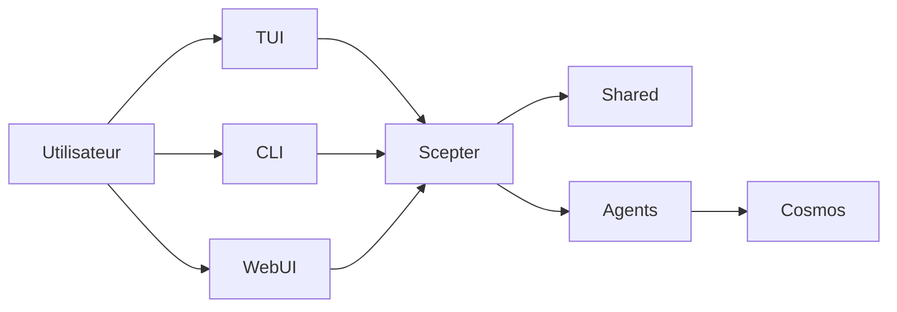

+++
title = "Architecture"
description = """> Basé sur la structure d'exécution actuelle, pas sur une vision idéalisée"""
lang = "fr"
category = "guides"
subcategory = "core"
+++

# Architecture

> Basé sur la structure d'exécution actuelle, pas sur une vision idéalisée

## Aperçu de l'exécution

Le cœur de la plateforme actuelle est `packages/scepter`, `packages/shared` et `packages/tui`.

## Parties les plus matures actuellement

- Orchestration du serveur Scepter
- Configuration, noms d'outils, prompts et types d'état dans Shared
- Parcours utilisateur TUI
- Chemin d'exécution basé sur les conteneurs

## Parties encore en implémentation partielle

- Couverture des commandes CLI
- Intégration avancée memory / RAG
- La plupart des solutions Layer2 spécifiques au domaine

## Structure des Agents actuellement actifs

### Layer1

Le workspace compile actuellement 12 Agents Layer1, couvrant le routage des messages, la planification, les fichiers, les conteneurs, les scripts, la connaissance, la recherche, l'ordonnancement, la sécurité, la mémoire et les capacités liées aux appareils.

### Layer2

Le workspace actuel compte deux crates Layer2 intégrés actifs : **Web Automation** (automatisation du navigateur) et **Génie logiciel classique** (analyse statique, revue de code, mesure de qualité, refactoring, diagnostic LSP/symboles/refactoring). Les 11 Agents spécialisés listés dans l'ancienne documentation décrivent du contenu archivé ou planifié en dehors de ces deux-là.

### Layer3

Layer3 reste un point d'extension d'Agent personnalisé basé sur `.amphoreus/` (phase de conception, pas encore implémenté).

## Modèle d'exécution

### Outils visibles par le modèle

Le modèle ne voit généralement que :

- `exec`
- `write_to_var`
- `write_to_var_json`

Les outils MCP internes sont appelés indirectement via l'exécution.

### Chemins en processus et en conteneur

Une partie de la logique s'exécute dans le processus Scepter, tandis qu'une autre partie du travail est effectuée via des chemins conteneurisés et des modules auxiliaires d'exécution.

### WebUI / IDE / Tauri

L'interface Web (arona), le panneau d'administration (malkuth), le plugin IDE et l'application Tauri ont été migrés vers le projet frère **shittim-chest** et supprimés de ce dépôt. L'interface privilégiée de ce dépôt est le **TUI** ; la couche Web/IDE se trouve dans shittim-chest et communique avec Scepter via JWT + WebSocket/HTTP.

## Capacités Memory et Connaissance

RAG et memory sont plus matures que ce que décrivent les anciens aperçus, mais il reste encore de la colle d'intégration à compléter :

- Trois backends d'embedding sont implémentés : API (compatible OpenAI), inférence ONNX locale (`FastEmbeddingService`, BGE-M3 par défaut), fallback de hachage SHA-256
- Les documents vectoriels en mémoire et le stockage **PgVector** (index HNSW) sont tous deux disponibles
- Le parcours de graphe et la recherche hybride (fusion RRF) sont disponibles
- Le câblage automatique embedding→RAG et la synchronisation des abonnements RAG restent à intégrer
