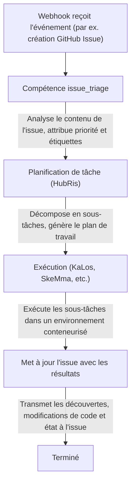

# Intégration du suivi d'issues

> Connecter les systèmes externes de suivi d'issues aux flux de travail d'Agent d'Entelecheia
> Note sur l'état actuel : HubRis fournit actuellement des capacités d'assistance pour la création, la mise à jour, la recherche et les commentaires d'issues, et une intégration webhook existe dans le dépôt. Mais ce document ne doit pas être interprété comme « il existe déjà une surface produit d'issue inter-plateforme complète et unifiée ».

-----------------------------------------------------------------------------

## Table des matières

- [Aperçu](#aperçu)
- [Identification à trois niveaux du conteneur](#identification-à-trois-niveaux-du-conteneur)
- [Format de l'ID de liaison](#format-de-lid-de-liaison)
- [Comment les Agents interagissent avec les Issues](#comment-les-agents-interagissent-avec-les-issues)
- [Flux de travail pilotés par les Issues](#flux-de-travail-pilotés-par-les-issues)
- [Registre des préfixes de plateforme](#registre-des-préfixes-de-plateforme)
- [Nommage des branches Fork de conteneur](#nommage-des-branches-fork-de-conteneur)
- [Intégration WebUI](#intégration-webui)

-----------------------------------------------------------------------------

## Aperçu

Actuellement, les capacités liées aux issues d'Entelecheia proviennent principalement de deux directions :

- L'intégration webhook peut transmettre les événements externes dans le système
- HubRis fournit des capacités d'assistance de type CRUD pour les issues

L'automatisation inter-plateforme des issues peut être considérée comme une direction et une implémentation partielle existantes, mais il ne faut pas supposer par défaut que chaque flux de travail décrit dans ce document est déjà complètement bouclé.

-----------------------------------------------------------------------------

## Identification à trois niveaux du conteneur

Les conteneurs dans Entelecheia utilisent un système d'ID à trois niveaux, maintenant l'identité dans différents contextes :

| Niveau | Format | Cycle de vie | Utilisation |
| --- | --- | --- | --- |
| UUID | UUID standard (par ex. `550e8400-e29b-41d4-a716-446655440000`) | Permanent | Clé primaire de base de données, traçabilité inter-redémarrages |
| ID de liaison | `@platform#id` (par ex. `@github#234`) | Stable | Liaison de ressources externes, nommage de branches |
| ID d'exécution | `#xxx` (par ex. `#616`) | Par session | Affichage TUI, routage socket Unix |

L'**ID de liaison** lie un conteneur à une ressource de plateforme externe. Il reste stable après les redémarrages de Scepter, contrairement à l'ID d'exécution qui est réattribué à chaque démarrage.

-----------------------------------------------------------------------------

## Format de l'ID de liaison

Le format général de l'ID de liaison est :

```text
@platform#id[@#floor]
```

- `platform` — Préfixe de plateforme (par ex. `github`, `gitee`, `gitlab`)
- `id` — Numéro d'issue ou de ressource sur la plateforme
- `@#floor` — Numéro d'étage optionnel, pour les références imbriquées (par ex. commentaires)

### Exemples

| ID de liaison | Signification |
| --- | --- |
| `@github#123` | GitHub Issue #123 |
| `@gitee#456` | Gitee Issue #456 |
| `@gitlab#789` | GitLab Issue #789 |
| `@github#123@#5` | 5e commentaire de GitHub Issue #123 |
| `@feishu#abc123` | Sujet de message Feishu abc123 |

Les ID de liaison sont utilisés pour :

- Les étiquettes et métadonnées de conteneur
- Les noms de branches pour le développement piloté par les issues
- Les paramètres de compétence d'Agent
- Le filtrage de la liste d'issues WebUI

-----------------------------------------------------------------------------

## Comment les Agents interagissent avec les Issues

Les Agents interagissent avec les issues externes via les outils MCP HubRis. Ces outils encapsulent les API spécifiques à chaque plateforme :

### Opérations d'issue disponibles

| Outil | Description |
| --- | --- |
| `$.agent.HubRis.issue_create()` | Créer une nouvelle issue sur une plateforme externe |
| `$.agent.HubRis.issue_update()` | Mettre à jour une issue existante (titre, corps, état, étiquettes) |
| `$.agent.HubRis.issue_search()` | Rechercher des issues inter-plateformes avec filtres |
| `$.agent.HubRis.issue_comment()` | Ajouter un commentaire à une issue existante |

### Utilisation dans le code exec

```typescript
$.agent.HubRis.issue_create({
  platform: "github",
  repository: "celestia-island/entelecheia",
  title: "Fix WebSocket reconnection logic",
  body: "The WebSocket client does not retry on connection loss.",
  labels: ["bug", "priority:high"]
});
```

```typescript
$.agent.HubRis.issue_search({
  platform: "github",
  repository: "celestia-island/entelecheia",
  state: "open",
  labels: ["bug"]
});
```

```typescript
$.agent.HubRis.issue_comment({
  binding_id: "@github#123",
  body: "Investigation complete. Root cause identified in src/ws/client.rs:42."
});
```

-----------------------------------------------------------------------------

## Flux de travail pilotés par les Issues

Le flux de travail par défaut piloté par les issues suit le pipeline suivant :



### Exemple étape par étape

1. Un développeur crée l'issue `@github#42` avec le titre "Memory leak in container cleanup"
1. Le Webhook GitHub transmet l'événement à Scepter
1. La compétence `issue_triage` la classe comme **bug**, priorité **high**
1. HubRis décompose la tâche : (a) reproduire la fuite (b) trouver la cause racine (c) implémenter le correctif
1. KaLos lit les fichiers source pertinents, SkeMma exécute des scripts de diagnostic
1. L'Agent soumet le correctif et commente la solution sur `@github#42`

-----------------------------------------------------------------------------

## Registre des préfixes de plateforme

Le mappage des préfixes de plateforme est configurable. Le registre par défaut inclut :

| Préfixe | Plateforme | Modèle d'URL d'issue |
| --- | --- | --- |
| `github` | GitHub | `https://github.com/{repo}/issues/{id}` |
| `gitee` | Gitee | `https://gitee.com/{repo}/issues/{id}` |
| `gitlab` | GitLab | `https://gitlab.com/{repo}/-/issues/{id}` |
| `feishu` | Feishu / Lark | Lien de message interne |
| `discord` | Discord | Lien de message de canal |
| `telegram` | Telegram | Lien de message de chat |

### Support de l'internationalisation

Les préfixes de plateforme prennent en charge les noms internationalisés. Par exemple, Feishu peut être référencé par :

- `@feishu#123` (nom anglais)
- `@飞书#123` (nom chinois)

Le registre des préfixes les normalise en interne en préfixes canoniques.

-----------------------------------------------------------------------------

## Nommage des branches Fork de conteneur

Lorsque les Agents créent des branches pour le travail piloté par les issues, les branches suivent une convention de nommage :

### Format

```text
cosmos-<binding_id>-<reason>
```

ou

```text
cosmos-<uuid8>-<reason>
```

### Exemples

| Nom de branche | Contexte |
| --- | --- |
| `cosmos-@github#42-fix-memory-leak` | Correction de GitHub Issue #42 |
| `cosmos-@gitee#15-add-ci-pipeline` | Développement de fonctionnalité pour Gitee Issue #15 |
| `cosmos-a1b2c3d4-refactor-auth-module` | Tâche interne utilisant le préfixe UUID |

Le format d'ID de liaison garantit que les branches peuvent être retracées jusqu'à leur issue d'origine.

-----------------------------------------------------------------------------

## Intégration WebUI

La WebUI d'Entelecheia fournit une vue unifiée des issues sur toutes les plateformes connectées.

### Barre latérale gauche — Liste agrégée des issues

- Affiche les issues de toutes les plateformes dans une liste unique
- Chaque entrée affiche : icône de plateforme, numéro d'issue, titre, état, Agent assigné
- Cliquer sur une issue ouvre sa vue détaillée

### Filtrage

Les issues peuvent être filtrées selon :

- **Plateforme** : afficher uniquement GitHub, Gitee, GitLab, etc.
- **État** : ouvert, fermé, en cours
- **Priorité** : haute, moyenne, basse (dérivée des étiquettes)
- **Agent assigné** : filtrer par l'Agent traitant actuellement l'issue

### Vue détaillée de l'issue

La vue détaillée affiche :

- Le titre complet de l'issue et le corps (rendu depuis Markdown)
- Lien vers la plateforme (ouvrir l'issue d'origine dans le navigateur)
- Journal d'activité de l'Agent (appels de compétence, commentaires publiés)
- Conteneurs et branches associés

-----------------------------------------------------------------------------

## Prochaines étapes

- Lisez [Configuration de plateforme Webhook](webhook-setup.md) pour connecter votre plateforme
- Parcourez [l'Architecture](architecture.md) pour comprendre la conception de l'Agent HubRis
- L'intégration IDE a été migrée vers le dépôt frère [shittim-chest](https://github.com/celestia-island/shittim-chest)
