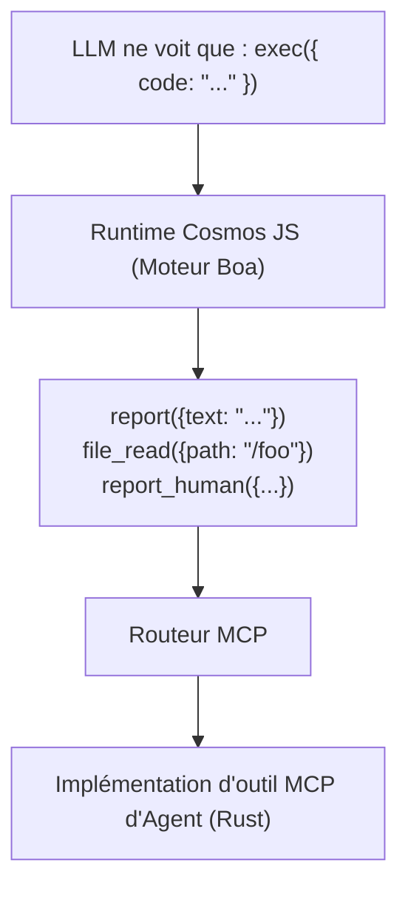
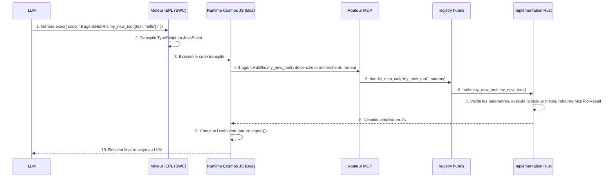

# Tutoriel de développement d'outils MCP

> Comment créer et enregistrer des outils MCP dans la plateforme Entelecheia

---

## Table des matières

- [Micro-noyau Exec-Only](#micro-noyau-exec-only)
- [Structure d'un outil MCP](#structure-dun-outil-mcp)
- [Ajouter un nouvel outil MCP](#ajouter-un-nouvel-outil-mcp)
- [Bonnes pratiques](#bonnes-pratiques)
- [Tester les outils MCP](#tester-les-outils-mcp)

---

## Micro-noyau Exec-Only

Entelecheia utilise une **architecture micro-noyau** pour l'accès aux outils. Le LLM ne voit que trois outils — `exec`, `write_to_var`, `write_to_var_json` — tout le travail réel est effectué dans son runtime TypeScript (moteur IEPL).



**Principe fondamental** : Le LLM n'appelle jamais directement les outils MCP. Il génère du code TypeScript qui appelle les fonctions API d'outils via l'import de modules ES (par exemple `import { report } from 'hubris'; report()`), le moteur IEPL le transpile en JavaScript et le distribue à l'implémentation Rust réelle.

- Import de modules ES — motif général (par ex. `import { report } from 'hubris'; report()`, `file_read()`)
- `exec`, `write_to_var`, `write_to_var_json` sont les trois seuls outils enregistrés pour tous les Agents (voir `packages/shared/domain_skills/src/tool_names.rs:265-283`)

La déclaration `related_tools` dans le frontmatter TOML de la Skill détermine quelles API d'import de modules ES seront documentées dans le prompt envoyé au LLM.

---

## Structure d'un outil MCP

Un outil MCP se compose de trois parties :

1. **Implémentation Rust** — la logique réelle, située dans `packages/agents/<agent>/src/mcp/tools/`
1. **Distribution par Registry** — le routage, situé dans `packages/agents/<agent>/src/mcp/registry.rs`
1. **Constantes de nom d'outil** — constantes de chaîne, situées dans `packages/shared/domain_skills/src/tool_names.rs`

### Définition d'outil dans mcp/registry.rs

Chaque Agent a une fonction `handle_mcp_call` qui route le nom de l'outil vers l'implémentation correspondante :

```rust
// packages/agents/kalos/src/mcp/registry.rs

use serde_json::Value;
use tracing::info;
use crate::{mcp::tools, state::KalosState};
use _shared::skills::{mcp_tools::McpToolResult, tool_names};

pub async fn handle_mcp_call(
    state: &std::sync::Arc<tokio::sync::RwLock<KalosState>>,
    tool_name: &str,
    parameters: Value,
) -> McpToolResult {
    info!("Calling Kalos MCP tool: {}", tool_name);

    match tool_name {
        tool_names::kalos::FILE_READ => tools::file_read(state, parameters).await,
        tool_names::kalos::FILE_WRITE => tools::file_write(state, parameters).await,
        tool_names::kalos::FILE_EDIT => tools::file_edit(state, parameters).await,
        // ...
        _ => McpToolResult::failure(format!("Unknown tool: {}", tool_name)),
    }
}
```

### Utiliser validate_required_params pour la validation des paramètres

Pour les outils ayant des paramètres obligatoires, utilisez la fonction auxiliaire de validation partagée :

```rust
use _shared::skills::mcp_tools::validate_required_params;

pub async fn my_tool(parameters: Value) -> McpToolResult {
    if let Some(failure) = validate_required_params(
        &parameters,
        &["title", "content"],  // noms des paramètres obligatoires
        "my_tool",              // nom de l'outil pour le message d'erreur
    ) {
        return failure;
    }

    let title = parameters.get("title").unwrap().as_str().unwrap();
    // ...
}
```

`validate_required_params` vérifie que chaque paramètre obligatoire existe et est une chaîne non vide. Si tous sont valides, elle retourne `None`, sinon elle retourne `Some(McpToolResult::failure(...))` avec un message d'erreur descriptif.

Référence : `packages/shared/domain_skills/src/mcp_tools.rs:12-41`.

### Valeur de retour : McpToolResult

Chaque outil doit retourner un `McpToolResult`. Les constructeurs principaux :

```rust
// Succès avec des données JSON arbitraires
McpToolResult::success(serde_json::to_value(my_struct).unwrap_or_default())

// Succès avec une structure sérialisable
McpToolResult::success_struct(&my_result)

// Succès avec du texte brut
McpToolResult::success_text("Operation completed".into())

// Succès avec suivi d'utilisation LLM
McpToolResult::success_with_usage(
    "Result text".into(),
    Some("gpt-4".into()),
    Some((prompt_tokens, completion_tokens)),
)

// Échec avec un message d'erreur
McpToolResult::failure("Missing required parameter: title".into())

// Échec avec plusieurs erreurs
McpToolResult::failure_lines(vec!["Error 1".into(), "Error 2".into()])
```

Référence : `packages/shared/domain_skills/src/mcp_tools.rs:62-136`.

---

## Ajouter un nouvel outil MCP

Ce guide étape par étape utilise HubRis comme exemple pour montrer comment ajouter un nouvel outil à un Agent existant.

### Étape 1 : Ajouter la constante de nom d'outil

Modifier `packages/shared/domain_skills/src/tool_names.rs` :

```rust
/// HubRis tool names
pub mod hubris {
    pub const REPORT: &str = "report";
    pub const CREATE_TODO: &str = "create_todo";
    // ... outils existants ...
    pub const MY_NEW_TOOL: &str = "my_new_tool";  // ajouter cette ligne
}
```

### Étape 2 : Implémenter l'outil

Créer un nouveau fichier `packages/agents/hubris/src/mcp/tools/my_new_tool.rs` :

```rust
use serde::Serialize;
use serde_json::Value;
use std::sync::Arc;
use tokio::sync::RwLock;

use crate::state::HubrisState;
use _shared::skills::mcp_tools::{validate_required_params, McpToolResult};

# [derive(Serialize, Debug, Clone)]
struct MyNewToolResult {
    id: String,
    message: String,
}

pub async fn my_new_tool(
    state: &Arc<RwLock<HubrisState>>,
    parameters: Value,
) -> McpToolResult {
    if let Some(failure) = validate_required_params(&parameters, &["text"], "my_new_tool") {
        return failure;
    }

    let text = parameters.get("text").and_then(|v| v.as_str()).unwrap();
    let id = uuid::Uuid::now_v7().to_string();

    let result = MyNewToolResult {
        id,
        message: format!("Processed: {}", text),
    };

    McpToolResult::success(serde_json::to_value(result).unwrap_or_default())
}
```

### Étape 3 : Enregistrer dans le module

Modifier `packages/agents/hubris/src/mcp/tools/mod.rs` :

```rust
pub mod report;
pub mod todo_ops;
pub mod my_new_tool;  // ajouter cette ligne
```

### Étape 4 : Ajouter à la distribution Registry

Modifier `packages/agents/hubris/src/mcp/registry.rs` :

```rust
pub async fn handle_mcp_call(
    state: &Arc<RwLock<HubrisState>>,
    todo_store: &Option<Arc<TodoStore>>,
    tool_name: &str,
    parameters: Value,
) -> McpToolResult {
    match tool_name {
        // ... outils existants ...
        tool_names::hubris::MY_NEW_TOOL => {
            crate::mcp::tools::my_new_tool::my_new_tool(state, parameters).await
        },
        _ => McpToolResult::failure(format!(
            "HubRis does not provide tool: {}",
            tool_name
        )),
    }
}
```

### Étape 5 : Créer la documentation de l'outil MCP

Créer `res/prompts/agents/hubris/mcp/my_new_tool.md` :

```markdown
+++
name = "my_new_tool"
agent = "hubris"

[description]
en = "Process text and return a structured result."
zhs = "处理文本并返回结构化结果。"
+++

# my_new_tool

Process text and return a structured result.

## Parameters

- **text** (string, required): The text to process

## Returns

### Success

\`\`\`json
{ "id": "...", "message": "Processed: ..." }
\`\`\`

### Failure

\`\`\`text
Missing required parameter(s) for my_new_tool: text
\`\`\`
```

### Étape 6 : Exposer via related_tools dans la Skill

Pour que le LLM perçoive votre outil, ajoutez-le au frontmatter de la Skill :

```toml
[[related_tools]]
agent_name = "hubris"
tool_name = "my_new_tool"
```

Cela injecte la documentation API de l'outil dans le prompt de la Skill, permettant au LLM d'appeler `$.agent.HubRis.my_new_tool()`.

### Étape 7 : Utiliser via exec (injection dans le prompt)

Lorsque le LLM traite une Skill dont `related_tools` liste `my_new_tool`, il génère du code TypeScript :

```typescript
const result: { id: string; message: string } = await $.agent.HubRis.my_new_tool({ text: "some content to process" });
```

Le moteur IEPL transpile le TypeScript en JavaScript, puis le runtime Cosmos JS intercepte l'appel, le distribue via le routeur MCP à l'implémentation Rust, et renvoie le résultat au contexte JavaScript.

### Chaîne d'appel complète



---

## Bonnes pratiques

### 1. Toujours utiliser write_to_var pour les sorties multilignes

Lors de la construction de chaînes multilignes dans le code `exec`, utilisez `write_to_var` pour éviter les chaînes inline trop coûteuses en tokens :

```typescript
// Déconseillé — grande chaîne inline
exec({ code: "report({text: 'line1\\nline2\\nline3\\n...very long...'})" })

// Recommandé — construction progressive
exec({ code: `
  let output: string = '';
  $write_to_var('step1', 'First part of the content');
  $write_to_var('step2', 'Second part of the content');
  output = $read_var('step1') + '\\n' + $read_var('step2');
  report({text: output});
` })
```

### 2. Utiliser env.aporia.language pour définir la langue de sortie

Les Skills qui produisent du texte destiné aux utilisateurs doivent vérifier la langue de sortie configurée :

```typescript
const lang: string = env.aporia.language;  // par ex. "en", "zhs", "ja"
const greeting: string = lang === "en" ? "Hello" : lang === "zhs" ? "你好" : "Hello";
```

Le frontmatter de la Skill peut déclarer cette dépendance :

```toml
config = ["user_language"]
```

### 3. Utiliser TypeScript, toujours const/let, jamais var

Tout le code dans `exec` doit utiliser la syntaxe TypeScript :

```typescript
// Correct
const result = file_read({path: '/src/main.rs'});
let items: string[] = result.content.split('\n');

// Incorrect
var result = file_read({path: '/src/main.rs'});
```

### 4. Construire les objets progressivement

Pour les objets de paramètres complexes, construisez-les progressivement :

```typescript
let params: Record<string, unknown> = {};
params.title = "My Task";
params.description = "Detailed description";
params.priority = "high";

if (hasDueDate) {
    params.due_date = dueDate;
}

$.agent.HubRis.create_todo(params);
```

### 5. Rapporter les résultats via report()

Chaque Skill doit appeler `report()` au moins une fois avant de se terminer. C'est ainsi que les résultats sont capturés et routés vers l'étape suivante de la chaîne de compétences :

```typescript
report({text: "Task decomposition complete. Found 3 sub-tasks."});
```

Les appels multiples sont agrégés — tout le contenu est fusionné à la fin de la phase de réflexion.

### 6. Conventions de nommage des paramètres

- Les noms de paramètres utilisent `snake_case` (par ex. `parent_id`, `due_date`, `workspace_id`)
- Les ID de type chaîne doivent utiliser le format UUID
- Les horodatages doivent utiliser le format ISO 8601 / RFC 3339
- Les paramètres optionnels doivent documenter des valeurs par défaut claires

### 8. Conception d'outils privilégiant les lots IEPL (critique)

Dans un MCP traditionnel, les outils sont à granularité fine — CPU, mémoire, disque appellent chacun des outils différents. Dans IEPL, chaque aller-retour consomme des tokens LLM et de la latence. **Concevez les outils pour retourner toutes les données pertinentes en 1 à 2 appels maximum.**

```rust
// Déconseillé : trois outils séparés pour obtenir les informations de l'appareil
pub const CPU_INFO: &str = "cpu_info";
pub const MEMORY_INFO: &str = "memory_info";
pub const STORAGE_INFO: &str = "storage_info";

// Recommandé : un seul outil retourne la configuration système complète
pub const SYSTEM_INFO: &str = "system_info";
// Retourne : { cpu: {...}, memory: {...}, storage: {...}, pci: [...], gpu: {...}, os: {...} }
```

Pour les outils qui lisent des données depuis des sources externes (appareils, protocoles, bases de données), acceptez des paramètres `scan` ou `ranges` pour prendre en charge les requêtes par lots :

```typescript
// Lecture Modbus par lot — un seul appel lit plusieurs plages de registres
const result = $.agent.SkeMma.modbus_read({
  endpoint: "/dev/ttyUSB0",
  scan: [
    { register_type: "holding", start_address: 0, count: 10 },
    { register_type: "input", start_address: 100, count: 5 }
  ]
});
```

**Les outils à granularité fine ne sont acceptables que pour** : les opérations d'écriture ciblant une adresse spécifique, ou les requêtes où l'appelant demande explicitement des données de portée étroite.

### 7. Gestion des erreurs dans les outils

Retournez des messages d'erreur descriptifs pour aider le LLM à s'auto-corriger :

```rust
// Recommandé — spécifique, actionnable
McpToolResult::failure("Missing required parameter(s) for create_todo: title".into())

// Recommandé — avec contexte
McpToolResult::failure(format!("TODO item {} not found", id))

// Déconseillé — vague
McpToolResult::failure("Error".into())
```

---

## Tester les outils MCP

### Tests unitaires d'outils individuels

Testez chaque fonction d'outil directement en construisant des paramètres `Value` et en assertant le `McpToolResult` :

```rust
# [tokio::test]
async fn test_report_success() {
    use std::sync::Arc;
    use tokio::sync::RwLock;

    let state = Arc::new(RwLock::new(HubrisState::new()));
    let params = serde_json::json!({
        "text": "Test report content"
    });

    let result = crate::mcp::tools::report::report(&state, params).await;

    assert!(result.success);
    assert!(result.data.get("summary").is_some());

    // Vérifier que l'état a été mis à jour
    let state = state.read().await;
    assert_eq!(state.pending_reports.len(), 1);
    assert_eq!(state.pending_reports[0], "Test report content");
}

# [tokio::test]
async fn test_report_empty_text() {
    let state = Arc::new(RwLock::new(HubrisState::new()));
    let params = serde_json::json!({
        "text": ""
    });

    let result = crate::mcp::tools::report::report(&state, params).await;

    assert!(!result.success);
    assert!(!result.error.is_empty());
}
```

### Tester la distribution du Registry

Testez que le registry route correctement les noms d'outils :

```rust
# [tokio::test]
async fn test_registry_routes_known_tool() {
    let state = Arc::new(RwLock::new(HubrisState::new()));
    let params = serde_json::json!({"text": "hello"});

    let result = handle_mcp_call(&state, &None, "report", params).await;
    assert!(result.success);
}

# [tokio::test]
async fn test_registry_rejects_unknown_tool() {
    let state = Arc::new(RwLock::new(HubrisState::new()));
    let params = serde_json::json!({});

    let result = handle_mcp_call(&state, &None, "nonexistent_tool", params).await;
    assert!(!result.success);
    assert!(result.error[0].contains("does not provide tool"));
}
```

### Tester la validation des paramètres

Testez directement la fonction auxiliaire `validate_required_params` :

```rust
# [test]
fn test_validate_required_params_all_present() {
    let params = serde_json::json!({"title": "test", "content": "body"});
    let result = validate_required_params(&params, &["title", "content"], "test_tool");
    assert!(result.is_none());
}

# [test]
fn test_validate_required_params_missing() {
    let params = serde_json::json!({"title": "test"});
    let result = validate_required_params(&params, &["title", "content"], "test_tool");
    assert!(result.is_some());
    let failure = result.unwrap();
    assert!(!failure.success);
    assert!(failure.error[0].contains("content"));
}

# [test]
fn test_validate_required_params_empty_string() {
    let params = serde_json::json!({"title": ""});
    let result = validate_required_params(&params, &["title"], "test_tool");
    assert!(result.is_some());
}
```

### Tester avec le Store de base de données

Pour les outils qui dépendent d'un Store de base de données, testez généralement avec une base de données en mémoire ou de test :

```rust
# [tokio::test]
async fn test_create_todo_success() {
    // Configuration : créer un TodoStore de test (dépend de l'infrastructure de test)
    let todo_store = create_test_store().await;
    let params = serde_json::json!({
        "title": "Test Task",
        "workspace_id": test_workspace_id.to_string()
    });

    let result = create_todo(&todo_store, params).await;

    assert!(result.success);
    let id = result.data.get("id").unwrap().as_str().unwrap();
    assert!(!id.is_empty());
    assert_eq!(result.data.get("title").unwrap().as_str(), Some("Test Task"));
}
```

### Exécuter les tests

```bash
# Exécuter tous les tests
just test

# Exécuter les tests d'un crate Agent spécifique
cargo test -p hubris
cargo test -p kalos

# Exécuter un test spécifique
cargo test -p hubris test_report_success

# Exécuter avec sortie
cargo test -p hubris -- --nocapture
```

---

## Référence rapide : fichiers clés

| Usage | Chemin |
| --- | --- |
| Définition `McpToolResult` | `packages/shared/domain_skills/src/mcp_tools.rs` |
| `validate_required_params` | `packages/shared/domain_skills/src/mcp_tools.rs:12-41` |
| Constantes de nom d'outil | `packages/shared/domain_skills/src/tool_names.rs` |
| `agent_allowed_tools()` | `packages/shared/domain_skills/src/tool_names.rs:166-169` |
| Registry MCP HubRis | `packages/agents/hubris/src/mcp/registry.rs` |
| Outil report HubRis | `packages/agents/hubris/src/mcp/tools/report.rs` |
| Outils CRUD TODO HubRis | `packages/agents/hubris/src/mcp/tools/todo_ops.rs` |
| Registry MCP KaLos | `packages/agents/kalos/src/mcp/registry.rs` |
| Exemples de doc d'outil MCP | `res/prompts/agents/hubris/mcp/` |
| Exemples de prompt de Skill | `res/prompts/agents/hubris/skills/` |
