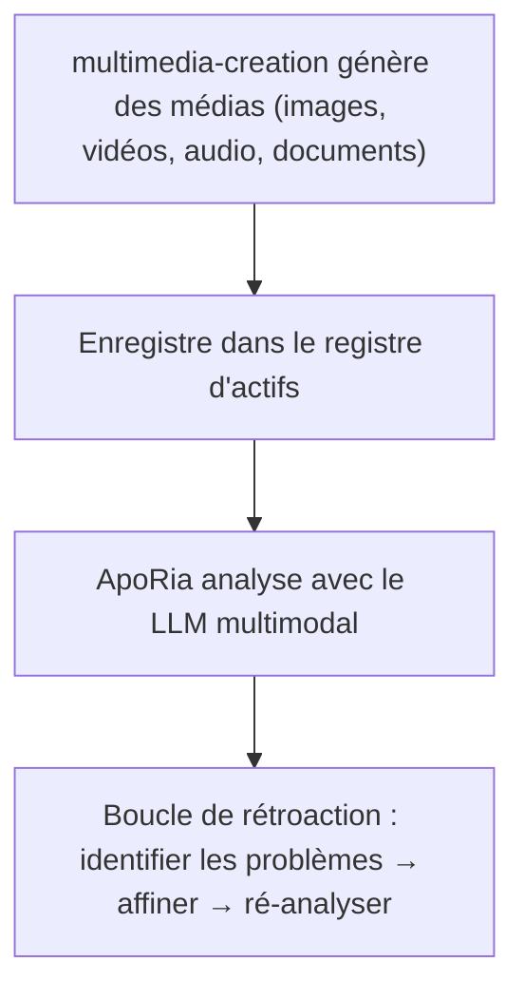

# Pipeline multimodal

> **⚠️ Référence d'Agent archivée — hors du pipeline de développement**
> L'Agent Layer2 `multimedia-creation` référencé dans ce document a été **archivé**. Son code Rust, ses liaisons `.d.ts` et son enregistrement d'Agent ont été supprimés. Le pipeline multimodal décrit ici est un **objectif de conception**, pas une fonctionnalité livrée. À moins que le développeur ne le demande explicitement, n'implémentez ni ne planifiez le travail sur ce pipeline.
> Utiliser multimedia-creation et ApoRia pour générer, enregistrer et analyser des médias
> Note sur l'état actuel : ce document décrit principalement le flux de travail cible. Des outils liés au multimodal existent effectivement dans ApoRia dans la base de code actuelle, mais ils n'ont pas encore pleinement atteint les capacités de registre d'actifs centralisé et de boucle fermée complète décrites ci-dessous.

-----------------------------------------------------------------------------

## Table des matières

- [Aperçu](#aperçu)
- [Registre d'actifs](#registre-dactifs)
- [Outils de génération](#outils-de-génération)
- [Enregistrement](#enregistrement)
- [Analyse multimodale](#analyse-multimodale)
- [Cycle de revue](#cycle-de-revue)
- [Documents Office](#documents-office)
- [Exemple complet](#exemple-complet)

-----------------------------------------------------------------------------

## Aperçu

Entelecheia contient actuellement des modules de base liés au multimodal, en particulier des outils précoces du côté ApoRia. Mais le pipeline multimedia-creation → registre d'actifs centralisé → boucle de revue multimodale décrit ici est mieux considéré comme une conception cible plutôt qu'un état complet actuel.



-----------------------------------------------------------------------------

## Registre d'actifs

Le registre d'actifs est un stockage centralisé de métadonnées multimédias géré par ApoRia. Il suit :

- Les chemins de fichiers et emplacements de stockage
- Les types MIME
- Les métadonnées de génération (prompt, paramètres, horodatage)
- L'historique d'analyse et les scores de qualité

### Flux de travail enregistrement / récupération

```typescript
const asset = $.agent.ApoRia.media_asset_register({
  file_path: "/output/marketing-banner.png",
  mime_type: "image/png",
  metadata: {
    prompt: "A futuristic city skyline at sunset",
    generator: "multimedia-creation",
    model: "stable-diffusion-xl"
  }
});

const asset_id: string = asset.id;

const retrieved = $.agent.ApoRia.media_asset_retrieve({
  asset_id: asset_id
});
```

-----------------------------------------------------------------------------

## Outils de génération

multimedia-creation fournit des outils de génération pour divers types de médias. Tous les outils sont appelés via `$multimedia-creation.<tool>()` dans le code exec.

### Génération d'images

```typescript
$multimedia-creation.image_generate({
  prompt: "A futuristic city skyline at sunset, cyberpunk style",
  width: 1024,
  height: 512,
  model: "stable-diffusion-xl",
  output_path: "/output/city-skyline.png"
});
```

### Génération de vidéos

```typescript
$multimedia-creation.video_generate({
  prompt: "Camera panning across a mountain landscape at golden hour",
  duration_seconds: 10,
  fps: 24,
  resolution: "1080p",
  output_path: "/output/mountain-pan.mp4"
});
```

### Génération audio

```typescript
$multimedia-creation.audio_generate({
  prompt: "Ambient electronic background music, calm and atmospheric",
  duration_seconds: 30,
  format: "mp3",
  output_path: "/output/ambient-bg.mp3"
});
```

### Génération de documents

```typescript
$multimedia-creation.doc_generate({
  template: "technical-report",
  title: "Q4 Performance Analysis",
  content: report_markdown,
  format: "docx",
  output_path: "/output/q4-report.docx"
});
```

### Génération de feuilles de calcul

```typescript
$multimedia-creation.sheet_generate({
  title: "Budget Forecast 2025",
  data: budget_data,
  format: "xlsx",
  output_path: "/output/budget-2025.xlsx"
});
```

### Génération de diapositives

```typescript
$multimedia-creation.slide_generate({
  title: "Product Roadmap Presentation",
  sections: slide_sections,
  format: "pptx",
  output_path: "/output/roadmap.pptx"
});
```

-----------------------------------------------------------------------------

## Enregistrement

Après avoir généré un média, enregistrez-le dans le registre d'actifs pour qu'ApoRia puisse l'analyser :

```typescript
const result = $multimedia-creation.image_generate({
  prompt: "Product hero shot on white background",
  width: 1920,
  height: 1080,
  output_path: "/output/hero-shot.png"
});

const asset = $.agent.ApoRia.media_asset_register({
  file_path: result.output_path,
  mime_type: "image/png",
  metadata: {
    prompt: "Product hero shot on white background",
    generator: "multimedia-creation",
    dimensions: "1920x1080"
  }
});

const asset_id: string = asset.id;
```

-----------------------------------------------------------------------------

## Analyse multimodale

ApoRia fournit une analyse multimodale via `$.agent.ApoRia.multimodal_chat()`. Passez un ou plusieurs ID d'actifs avec un prompt textuel :

```typescript
const analysis = $.agent.ApoRia.multimodal_chat({
  prompt: "Analyze this image for composition, color balance, and visual hierarchy. Rate each aspect from 1-10.",
  asset_ids: [asset_id]
});
```

### Analyser plusieurs actifs

```typescript
const comparison = $.agent.ApoRia.multimodal_chat({
  prompt: "Compare these two design variations. Which one has better visual balance and why?",
  asset_ids: [variant_a_id, variant_b_id]
});
```

### Analyse avec contexte

```typescript
const context_analysis = $.agent.ApoRia.multimodal_chat({
  prompt: "Does this image match the brand guidelines? Guidelines: primary color blue (#0066CC), clean layout, sans-serif typography.",
  asset_ids: [asset_id]
});
```

-----------------------------------------------------------------------------

## Cycle de revue

Le pipeline multimodal prend en charge des cycles de revue itératifs :

1. **Générer** — multimedia-creation crée le média initial
1. **Enregistrer** — stocker dans le registre d'actifs
1. **Analyser** — ApoRia évalue le média à l'aide du LLM multimodal
1. **Identifier les problèmes** — extraire les points d'amélioration spécifiques de l'analyse
1. **Affiner** — multimedia-creation ajuste les paramètres selon les retours et régénère
1. **Ré-analyser** — ApoRia évalue la sortie affinée

### Exemple de cycle de revue dans le code exec

```typescript
let iteration: number = 0;
const max_iterations: number = 3;
const quality_threshold: number = 8.0;
let current_prompt: string = "A serene mountain lake at dawn, photorealistic";

while (iteration < max_iterations) {
  iteration++;

  const gen_result = $multimedia-creation.image_generate({
    prompt: current_prompt,
    width: 1024,
    height: 768,
    output_path: `/output/lake-v${iteration}.png`
  });

  const asset = $.agent.ApoRia.media_asset_register({
    file_path: gen_result.output_path,
    mime_type: "image/png",
    metadata: { prompt: current_prompt, iteration: iteration }
  });

  const analysis = $.agent.ApoRia.multimodal_chat({
    prompt: "Rate this image on composition (1-10), color harmony (1-10), and overall quality (1-10). Provide specific improvement suggestions.",
    asset_ids: [asset.id]
  });

  const overall_score: number = analysis.data.overall_quality;

  if (overall_score >= quality_threshold) {
    report({ text: `Quality threshold met at iteration ${iteration}. Score: ${overall_score}` });
    break;
  }

  const suggestions = analysis.data.improvement_suggestions;
  current_prompt = current_prompt + ". " + suggestions.join(". ");

  if (iteration === max_iterations) {
    report({ text: `Max iterations reached. Final score: ${overall_score}` });
  }
}
```

-----------------------------------------------------------------------------

## Documents Office

multimedia-creation peut générer des documents compatibles Office :

### Documents Word (`doc_generate`)

Génère des fichiers `.docx` à partir de contenu Markdown ou structuré. Prend en charge des modèles pour les types de documents courants :

- Rapports techniques
- Comptes rendus de réunion
- Propositions

```typescript
$multimedia-creation.doc_generate({
  template: "meeting-notes",
  title: "Sprint Planning - Week 12",
  content: meeting_content,
  format: "docx",
  output_path: "/output/sprint-12-notes.docx"
});
```

### Feuilles de calcul Excel (`sheet_generate`)

Génère des fichiers `.xlsx` avec des données structurées, des formules et du formatage :

```typescript
$multimedia-creation.sheet_generate({
  title: "Monthly Revenue",
  data: revenue_data,
  format: "xlsx",
  output_path: "/output/revenue.xlsx"
});
```

### Présentations PowerPoint (`slide_generate`)

Génère des fichiers `.pptx` avec des sections, des puces et une intégration optionnelle d'images :

```typescript
$multimedia-creation.slide_generate({
  title: "Quarterly Business Review",
  sections: [
    { title: "Revenue", bullets: ["Q1: $1.2M", "Q2: $1.5M"] },
    { title: "Goals", bullets: ["Launch v2.0", "Expand to APAC"] }
  ],
  format: "pptx",
  output_path: "/output/qbr.pptx"
});
```

-----------------------------------------------------------------------------

## Exemple complet

Cet exemple montre le pipeline complet : générer une image marketing, l'enregistrer, l'analyser et l'affiner.

### Étape 1 : Générer l'image initiale

```typescript
const gen = $multimedia-creation.image_generate({
  prompt: "A modern SaaS product dashboard mockup, clean UI, blue and white color scheme",
  width: 1920,
  height: 1080,
  output_path: "/output/dashboard-v1.png"
});
```

### Étape 2 : Enregistrer l'actif

```typescript
const asset = $.agent.ApoRia.media_asset_register({
  file_path: gen.output_path,
  mime_type: "image/png",
  metadata: {
    prompt: "SaaS dashboard mockup",
    purpose: "marketing",
    version: 1
  }
});
```

### Étape 3 : Analyser la composition

```typescript
const analysis = $.agent.ApoRia.multimodal_chat({
  prompt: "Analyze this dashboard mockup for: 1) Visual hierarchy, 2) Color consistency, 3) Readability of data elements. Provide a score (1-10) for each and specific suggestions for improvement.",
  asset_ids: [asset.id]
});
```

### Étape 4 : Affiner selon les retours

```typescript
const refined = $multimedia-creation.image_generate({
  prompt: "A modern SaaS product dashboard mockup, clean UI, blue and white color scheme. " + analysis.data.suggestions.join(". "),
  width: 1920,
  height: 1080,
  output_path: "/output/dashboard-v2.png"
});
```

### Étape 5 : Enregistrer et ré-analyser

```typescript
const refined_asset = $.agent.ApoRia.media_asset_register({
  file_path: refined.output_path,
  mime_type: "image/png",
  metadata: {
    prompt: "SaaS dashboard mockup (refined)",
    purpose: "marketing",
    version: 2,
    previous_version: asset.id
  }
});

const final_analysis = $.agent.ApoRia.multimodal_chat({
  prompt: "Compare this refined version to the original. Has the visual hierarchy improved? Rate the overall quality 1-10.",
  asset_ids: [asset.id, refined_asset.id]
});

report({
  text: `Marketing image pipeline complete. Initial score: ${analysis.data.overall_score}, Refined score: ${final_analysis.data.overall_score}`
});
```

-----------------------------------------------------------------------------

## Prochaines étapes

- Lisez le [Guide fondamental](fundamentals.md) pour plus de détails sur les Agents multimedia-creation et ApoRia
- Parcourez [l'Architecture](architecture.md) pour un aperçu complet du système d'Agents
- Configurez [l'intégration Webhook](webhook-setup.md) pour déclencher la génération depuis des événements externes
