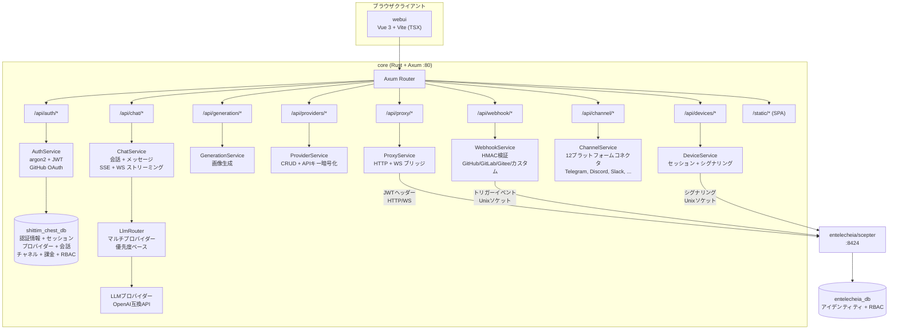
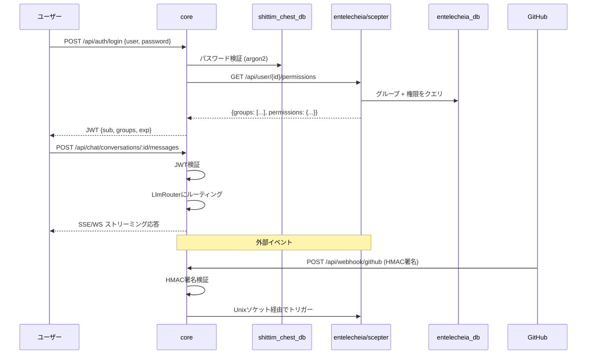

+++
title = "Shittim Chest アーキテクチャ概要"
description = """> バージョン: 0.1.0 — 活発に開発中。"""
lang = "ja"
category = "architecture"
subcategory = "webui"
+++

# アーキテクチャ

> **バージョン**: 0.1.0 — 活発に開発中。
> **最終確認日**: 2026-06-14
> 本プロジェクトは[entelecheia](https://github.com/celestia-island/entelecheia)のユーザー向けシェルです。

## 範囲

shittim-chestはハイブリッドCargo + pnpmモノレポです。entelecheiaのエージェントオーケストレーションコアをラップするユーザー向け層を所有します。2つのプロジェクトはJWT認証されたHTTP/WebSocketを通じて通信します — shittim-chestがエージェント操作のためにentelecheiaのデータベースに直接アクセスすることはありません。

| コンポーネント | 技術 | 役割 | 状態 |
| --- | --- | --- | --- |
| **core** | Rust + Axum | 統合バックエンド: 認証（JWT + OAuth）、独立したLLMルーティング、チャットAPI、画像生成、webhookイングレス、scepterプロキシ、リモートデバイスシグナリング、チャネル統合、課金、RBAC、ワークスペース | 🟢 実装済み |
| **cli** | Rust | Dockerオーケストレーター: dev、up、down、migrate、logs、status | 🟢 実装済み |
| **webui** | Vue 3 + Vite (TSX) | フロントエンド: チャット画面、管理パネル（20以上のビュー）、2D SCADAトポロジー、3Dホログラフィックプレビュー | 🟡 部分的 |
| **プロトコル型** | Rust（`arona`クレート）+ ts-rs | 外部`arona` gitクレートによって提供されるJSON-RPC 2.0プロトコル型。TSバインディングはwebuiで消費 | 🟢 実装済み |
| **IDEプラグイン** | TS + Kotlin + Rust + Lua | VS Code、IntelliJ、Zed、Neovim、LSPブリッジ | 🟡 機能的 |
| **Tauriアプリ** | Rust + Tauri | デスクトップ、モバイル、共有DTO | 🟡 機能的 |
| **harmony** | ArkTS | HarmonyOSアプリ | 🟡 機能的 |

## アーキテクチャ図

### coreバックエンド詳細



### クロスプロジェクト通信



## バックエンドモジュール

すべてのモジュールは`packages/core/src/`配下にあります。バックエンドは135 Rustファイル（テストファイルを含めると138）で約34K行です。

### 認証 (`packages/core/src/auth/`)

完全実装:

- argon2ハッシュを用いたユーザー名/パスワード登録およびログイン
- ローテーション付きJWTアクセス + リフレッシュトークンシステム
- GitHub OAuth 2.0統合（リダイレクト + コールバック、ユーザーを自動作成）
- セッション管理（`sessions`テーブルに対するCRUD）
- 全ルートで使用されるトークン検証ミドルウェア

### チャット (`packages/core/src/chat/`)

完全実装:

- 会話CRUD（作成、一覧、取得、更新、削除）
- LLMルーティング付きメッセージ送信/受信
- SSE（Server-Sent Events）ストリーミング応答（`/api/chat/stream`）
- WebSocketストリーミング（`/ws/chat/stream`）
- ILIKEを用いたメッセージ検索（`/api/chat/search?q=`）
- 会話エクスポート（`/api/chat/conversations/:id/export?format=json|md`）

### LLM (`packages/core/src/llm/`)

完全実装:

- チャットおよび画像生成用OpenAI互換HTTPクライアント
- 優先度ベースの選択とフォールバック付きマルチプロバイダールーター
- APIキー暗号化付きプロバイダーCRUD（AES-256-GCM）
- モデル一覧およびプロバイダーテストエンドポイント
- リクエストタイムアウトおよびストリーミングバッファ設定

### 生成 (`packages/core/src/generation/`)

完全実装:

- 画像生成エンドポイント（`/api/generation/images`、`/api/generation/models`）
- 設定済みLLMプロバイダーを使用

### Webhook (`packages/core/src/webhook.rs`)

完全実装（約1,000行以上）:

- HMAC-SHA256検証付きGitHub webhook
- トークン検証付きGitLab webhook
- HMAC + トークンフォールバック付きGitee webhook
- カスタムwebhookエンドポイント（`/api/webhook/custom/{name}`）
- 重複配信検出（LRUキャッシュ、最大10,000 ID）
- 一覧API付き配信ログ
- webhookソース用IPホワイトリストシステム（別途`webhook_ip_whitelist.rs`）
- Unixソケット経由のscepterへのトリガー転送

### デバイス (`packages/core/src/devices/`)

シグナリングリレーが実装（WebRTCハンドシェイクには外部scepterが必要）:

- デバイス一覧、詳細、セッションCRUD用RESTエンドポイント
- WebRTC用WebSocketシグナリングリレー — SDPオファー/ICE候補をUnixソケット経由でscepterに転送。SDPアンサーはscepterから来る必要がある（`forward_sdp_to_scepter`はscepterが到達不能の場合空文字列を返す）
- ターミナルリレー（xterm.jsへのWebSocket経由） — キーストロークをscepterに転送
- デスクトップフレームリレー
- SFTPファイルブラウザバックエンド
- 設定可能: ユーザーあたりの最大セッション数、フレームバッファサイズ、ICEサーバー
- デバイスモデル管理（`device_models/`モジュール）

> **ギャップ:** リレーは本物ですが、動作中のscepterインスタンスなしではWebRTCハンドシェイクを完了できません。scepterがダウンしている場合、SDPアンサーは空になり、WebRTCは正常に失敗します。

### チャネル (`packages/core/src/channel/`)

完全実装（22モジュールファイル + `mod.rs`）:

- 12プラットフォームコネクタ: Telegram、Discord、Slack、Lark/Feishu、QQ Bot、WeCom、IRC、Matrix、Mattermost、Google Chat、Microsoft Teams、LINE
- プラットフォームごとの本物のAPIクライアント実装
- DMポリシー制御（`dm_policy.rs`）
- レート制限（`rate_limit.rs`）
- ヘルスチェック（`health_check.rs`）
- チャネルペアリング（`pairing.rs`）
- プラグインシステム（`plugin.rs`）
- 暗号化認証情報ストレージ（`crypto.rs`）
- 中央レジストリ（`registry.rs`）とルート（`routes.rs`）

### 追加バックエンドモジュール

| モジュール | 説明 |
| --- | --- |
| `proxy/` | Scepter HTTP/WSブリッジ（`ws_bridge.rs`はコードベース最大の単一ファイル） |
| `rbac/` | ロールベースアクセス制御 |
| `workspace/` | ワークスペース管理 |
| `oauth.rs` | OAuthプロバイダー統合 |
| `billing.rs` | Stripe決済統合（webhook HMAC検証、チェックアウト/サブスクリプションイベント、クォータ強制、決済重複防止） |
| `container/` | Dockerコンテナ管理 |
| `cruise/` | Cruise（自動化ワークフロー）サポート |
| `audio/` | 音声/ボイスサービスサポート |
| `skills.rs` | **スタブ** — 空の配列を返す。データベースバックアップやscepter統合はまだない |
| `tools.rs` | **スタブ** — 空の配列を返す。データベースバックアップやscepter統合はまだない |
| `system_settings.rs` | システム設定 |
| `trigger_forward.rs` | イベントトリガー転送 |
| `quota_guard.rs` / `resource_quotas.rs` | リソースクォータ強制 |
| `avatar_platforms.rs` | アバタープラットフォーム統合 |

### データベース

SeaORM 1.xによるPostgreSQL、**5マイグレーション**と**25エンティティモデル**:

`auth_users`、`avatar_platforms`、`channel_configs`、`channel_messages`、`channel_pairings`、`channel_plugins`、`conversations`、`cruise_history`、`device_models`、`device_sessions`、`llm_providers`、`messages`、`oauth_connections`、`payment_events`、`projects`、`rbac_grants`、`rbac_groups`、`rbac_user_groups`、`remote_devices`、`scene_configs`、`sessions`、`system_settings`、`webhook_deliveries`、`workspace_alias_registry`、`workspace_sessions`

## フロントエンド

### webui (`packages/webui/`)

Vue 3 + Viteフロントエンド、TSXで記述（`@vitejs/plugin-vue-jsx`経由 — `.vue` SFCファイルなし）。npmパッケージ: `@celestia-island/webui`。約31K行。

#### ビュー

| ビューグループ | 説明 |
| --- | --- |
| `demiurge/` | メインチャット画面（DemiurgeView） — ストリーミング応答、エージェント状態、ツール呼び出し |
| `auth/` | LoginView、RegisterView、SetupView |
| `admin/` | 20以上の管理ビュー: ダッシュボード、プロバイダー、エージェント、RBAC、Webhook、チャネル、システム、デバイスモデル、デバイス設定、スキル、MCPツール、OAuthプロバイダー、トークン使用量、ワークスペース、音声サービス、リソースクォータ など |
| `topology/` | 2D SCADAトポロジー: TopologyOverview、TopologyBoxDetail、TopologyDeviceDetail。トランスポートは本物（WS JSON-RPCをscepterに転送）。**scepterがない場合、TopologyOverviewはハードコードされた`SIMULATED_DEVICES`（19デモデバイス）と中国語テレメトリチップにフォールバック。TopologyBoxDetailは空の状態を表示** |
| `holographic/` | 3Dホログラフィックプレビュー: HolographicOverview、HolographicBoxZoom、HolographicModelDetail。**3Dモデル読み込みは本物**（実際のGLBファイル、プロジェクト、シーン設定をローカルバックエンドから読み込み）。テレメトリパラメータチップにはscepterが必要で、失敗時は空にフォールバック |

#### コンポーネントシステム

| ディレクトリ | 説明 |
| --- | --- |
| `base/` | 50以上の`S`接頭辞デザインシステムコンポーネント（SButton、SCard、SModal、STable、STabs、STimeline、STreeView、SMarkdownRenderer、SMorphingTabs など） |
| `chat/` | チャット固有コンポーネント（ChatBubble、AgentStatusBar、FloatingChatBar、ThinkingDots、ReportViewer、NodeMinimap など） |
| `header/` | ヘッダーコンポーネント（パンくずリストバー、モード切替） |
| `layout/` | アプリシェル（SAppShell、SSidebar、SDrawer、SWallpaperRenderer など） |
| `preview/` | SCADAシンボルライブラリ、トポロジー、ホログラフィックコンポーネント |
| `cruise/` | Cruiseワークフローコンポーネント |
| `panels/`、`popups/`、`shared/` | サポートUI |

#### アニメーションシステム

webui内のすべてのCSS駆動モーションとフレーム単位のサンプリングは、`packages/webui/src/theme/animationBus.ts`が所有する**1つの共有rAFループ**を通じて実行されます — すべてのダイアログ、モーダル、ポップアップ、ドロワー、トースト、リストトランジションが登録することが期待される「アニメーションコンテキスト」です。このバスはプロセスレベルのシングルトンであり、アイドル時には自己停止し、処理中の作業がある場合にのみ回転するため、アイドル状態のタブはフレームを消費しません。

バスは4つの作業登録APIと2つのサイドチャネルフラグを公開します:

| API | 目的 | フレームモデル |
| --- | --- | --- |
| `onFrame(cb, priority?)` | フレームごとのコールバックを登録。`priority` ∈ `sync` / `normal` / `idle`。`{ disconnect() }`を返す。 | 毎フレーム呼び出し（sync）、約30 Hzの予算に間引き（normal）、約0.5 Hzの予算に間引き（idle）。 |
| `onceFrame(cb)` | 次のフレームでコールバックを実行し、自動切断。ファイアアンドフォーゲット（キャンセルハンドルなし）。 | ワンショット。 |
| `scheduleFrame(cb)` | 次のフレームでコールバックを実行。発火前にキャンセルするための`{ disconnect() }`を返す。「多数の呼び出しを1つのポストフレームコールバックに集約する」スロットルパターン用（手書きの`if(rafId)cancel; rafId=rAF(cb)`イディオムを置き換え）。 | ワンショット（キャンセル可能）。 |
| `reportTransition(durationMs)` | **宣言的**: 「持続時間NのCSSトランジションが実行中である」ことをフレームごとのコールバックなしで宣言。バスは単にループをウィンドウの間生存させ、`onFrame`をサンプリングするオブザーバーがトランジション中に停止されないようにする。 | フレームごとのコストゼロ。状態のみ。 |
| `notifyScrollStart()` | 150ミリ秒のスクロールウィンドウ中に、`normal`優先度のコールバックを抑制（電力を節約。syncとidleは影響を受けない）。 | サイドチャネルフラグ。 |
| `setReducedMotion(flag)` | ユーザーの`prefers-reduced-motion` / `html.reduce-motion`クラスを尊重 — 設定されている間、**アニメーション**ループを停止。ワンショット（`onceFrame` / `scheduleFrame`）はユーティリティ作業（測定、フラッシュ）であり、アニメーションではないため、別のドレイナーrAFで排出を継続し、決して一時停止しない。 | サイドチャネルフラグ。 |

バス上のコンポーザブル層は`packages/webui/src/composables/useReportedTransition.ts`です。**これは**、共有`--duration-*`トークンを使用してCSS `transition` / `animation`を実行するすべてのコンポーネントにとって**推奨されるサーフェス**です。コンポーネントのアンマウント時に自動キャンセルされ、高速な切り替えを集約します。バスはタイムラインを追跡し、CSSは視覚的な作業を行い、両者は共有トークンを通じて同期を保ちます。

```ts
// 単一トランジションコンポーネント（ダイアログが開くOR閉じる — 相互排他的）
const anim = useReportedTransition(300);
function onBeforeEnter() { anim.run(); }
function onAfterEnter()  { anim.cancel(); }

// 重複トランジション（例: アイテムが同時に出現AND退出するTransitionGroup）
// — トラックで分割し、退出のrun()が実行中の出現のreportをキャンセルできないようにする:
const anim = useReportedTransition(300);
const enter = anim.track("enter");
const leave = anim.track("leave");
//   onBeforeEnter={enter.run} onAfterEnter={enter.cancel}
//   onBeforeLeave={leave.run} onAfterLeave={leave.cancel}
```

DOMバスは意図的に**`packages/webui/src/composables/three/animationBus3D.ts`**から分離されており、これはthree.jsレンダリングパイプライン用の独自のrAFループを所有します。3DフレームタイミングがDOMトランジションスケジューリングに影響を与えてはならず、その逆も同様です。両者は独立して一時停止またはデバッグできます。両方とも同じ`onFrame → { disconnect }`の形状を公開します。

**モーショントークン**（`packages/webui/src/theme/theme.scss`）は持続時間/イージングの唯一の真実の源です: 移動には`--duration-instant/short/normal/long`、不透明度/色のフェードには`--duration-fade`、曲線には`--ease-spring/out-expo/in-expo/standard`。`prefers-reduced-motion` / `html.reduce-motion`は移動トークンを`0s`に縮小しますが、**意図的に`--duration-fade`を非ゼロのままにします** — 前庭をトリガーする*移動*を抑制し、状態変化の不透明度を抑制しないことがアクセシビリティ的に正しい動作です。CSSトランジションのバスタイムラインが視覚的タイムラインと一致するように、常に`reportTransition(--duration-*)`を使用してください。

**カバレッジ**: webui内のすべての2D-DOM rAF遅延は現在バスを経由します — 連続アニメーションには`onFrame` / `reportTransition`、ワンショットユーティリティ遅延（測定、スロットルされた再計算、バッチフラッシュ）には`onceFrame` / `scheduleFrame`。残る唯一の生の`requestAnimationFrame`呼び出し箇所は3Dパイプライン（`composables/three/*`、独自の`animationBus3D.ts`を持つ）とバス自身の内部ループスケジューリングです。両方とも意図的です。新しい作業は決して`requestAnimationFrame`を直接呼び出してはいけません — 適切なバスAPIを選択してください。

#### インポートパス

webuiは自身の`src/`を**意図的に区別された2つのパスエイリアス**（両方とも`vite.config.ts` + `tsconfig.json`で宣言）を通じて消費し、コードベース全体がこの分割に従います:

| エイリアス | 解決先 | 用途 |
| --- | --- | --- |
| `@/<path>` | `src/*` | **内部の深いインポート** — 特定のモジュールに直接到達（`@/api/client`、`@/composables/useReportedTransition`、`@/theme/animationBus`）。約600箇所。裸のバレルとして使用されることはない。 |
| `@celestia-island/shared_ui` | `src/`（→ `src/index.ts`バレル） | **厳選された公開APIサーフェスのみ** — 常に裸の指定子で、コードサブパスではない。約92箇所。 |

この分割は公開/非公開の境界を強制します（パッケージの`exports`マップのようなもの）: バレル（`src/index.ts`）は「パッケージとして」インポート可能な唯一のものであり、`@/`は内部コードが実装モジュールに到達することを許可します。バレルを契約として扱ってください — 何かが公開されるべき場合に`src/index.ts`に追加します。共有デザインシステムアセット（`theme/*.scss`、`res/*`）も`shared_ui`名前空間の下で到達可能です。レガシーな`@shared_ui`エイリアスは、いくつかのSCSS `@use`文でまだ参照されている`@celestia-island/shared_ui`の複製です。新しいコードは`@celestia-island/shared_ui`を使用すべきです。

### プロトコル型（`arona`クレート）

JSON-RPC 2.0プロトコル型と共有列挙型は、外部の[`arona`](https://github.com/celestia-island/arona) Rustクレートによって提供され、`Cargo.toml`でgit依存関係として宣言されています。このクレートは`ts-rs`バインディングを導出し、`packages/webui/src/types/arona/`に生成され、`@celestia-island/arona`パスエイリアスを通じてwebuiで消費されます。

### 管理パネル

管理ビューは`admin/`ルートグループの下のwebui内にあります: ダッシュボード、プロバイダー（CRUD + プロバイダー追加ウィザード）、エージェント、エージェント詳細、RBAC（グループ + 権限）、Webhook、チャネル、システム、デバイスモデル、デバイス設定、スキル、MCPツール、OAuthプロバイダー、トークン使用量、ワークスペース、音声サービス、リソースクォータ。

### i18n

webuiは**`vue-i18n`**（カスタム実装ではない）を使用し、**11の宣言されたロケール**をサポートします: アラビア語（`ar`）、ドイツ語（`de`）、英語（`en`）、スペイン語（`es`）、フランス語（`fr`）、日本語（`ja`）、韓国語（`ko`）、ポルトガル語（`pt`）、ロシア語（`ru`）、簡体字中国語（`zhs`）、繁体字中国語（`zht`）。

各ロケールには**17の名前空間JSONファイル**があります（admin、auth、chat、cmd、common、devices、errors、footer、help、logs、models、reports、skills、timeline、tokenUsage、tools、workspace）。アプリ内ロケール切り替えはヘッダーのロケールピッカーから利用可能です。

> **翻訳の完全性は大幅に異なります**（950の英語リファレンスキーに対して監査）:
> | 階層 | ロケール | 英語パススルー | キーギャップ |
> |------|---------|-------------------|---------|
> | 十分に翻訳 | `ja`、`ko`、`zhs`、`zht` | ~5% | `zhs`は18キー不足。他は112不足 |
> | ほぼ翻訳 | `de`、`fr`、`pt`、`es`、`ar` | ~9–14% | 共通の112キーブロックが不足 |
> | 実質的に未翻訳 | `ru` | **~76%** | キー数は完全だが、値は逐語的な英語 |
> 共通の112キーギャップは新しい機能をカバーします: `admin.agents.*`、`admin.deviceModels.*`、`admin.projects.*`、`admin.rbac.*`、`admin.resourceQuota.*`、`auth.protocol.*`、`chat.cruise.*`、`chat.voice_*`。

## RBACアーキテクチャ

### データ分割

クリーンな境界を維持するために、データ所有権は2つのプロジェクト間で分割されます:

| データ | データベース | 所有者 | 根拠 |
| --- | --- | --- | --- |
| ユーザー認証情報（パスワードハッシュ、OAuth、APIキー） | shittim_chest_db | shittim-chest | プレゼンテーション層がログインフローを所有 |
| アクティブセッション、リフレッシュトークン | shittim_chest_db | shittim-chest | セッション管理はフロントエンドの関心事 |
| 会話、メッセージ | shittim_chest_db | shittim-chest | チャットデータはユーザー向け |
| LLMプロバイダー設定 | shittim_chest_db | shittim-chest | プロバイダー管理はユーザー向け |
| チャネル設定、課金、ワークスペース | shittim_chest_db | shittim-chest | ユーザー向け運用データ |
| ユーザーID、グループ、ロール割り当て | entelecheia_db | entelecheia | オーケストレーションコアが権限を強制 |
| GroupPermissions（プロバイダークォータ、エージェントホワイトリスト） | entelecheia_db | entelecheia | エージェントレベルのポリシーはエージェントと共に存在 |

### 認証フロー

1. ユーザーがcoreを通じて認証（パスワード / OAuth）
1. coreがshittim_chest_dbに対して認証情報を検証（パスワードにはargon2）
1. coreがentelecheiaにユーザーのグループ権限をクエリ（またはTTLキャッシュから読み取り）
1. coreが`{ sub: user_id, groups: [...] }`を含むJWTを発行
1. 後続のすべてのリクエストはJWTを保持 → coreが検証 → プロキシルートのためにscepterに転送
1. scepterがJWTを検証（環境変数経由の共有秘密鍵）し、グループレベルの権限を強制

## クロスプロジェクト依存関係

### Rustクレート

shittim-chestはcelestia-islandエコシステムの2つの外部クレートに依存します:

```toml
# 外部プロトコルクレート — shittim-chestとentelecheia間で共有
arona = { git = "https://github.com/celestia-island/arona.git", branch = "dev" }

# バージョン付きJSONシリアライゼーション（JSON/JSONBカラムの読み取り時移行）
hifumi = { path = "../hifumi/packages/types" }
```

`arona`クレートは両方のプロジェクトで使用されるJSON-RPCプロトコル型と共有列挙型を提供します。`hifumi`クレートはデータベースカラム用のバージョン付きJSONシリアライゼーションを提供します。

### npmパッケージ

webuiは`arona`クレートのTSバインディングを`@celestia-island/arona`パスエイリアスを通じて消費します。これは`packages/webui/src/types/arona/`（`ts-rs`出力が着地する場所）を指します。webuiの`@celestia-island/shared_ui`は、内部インポートに使用される`packages/webui/src/`への自己エイリアスです。

## 現在のギャップ

> **本セクションでは、既知の制限と不完全な領域を文書化しています。**

### Scepter依存機能

以下の機能はshittim-chest内に本物の実装がありますが、完全な機能のためには動作中の[entelecheia/scepter](https://github.com/celestia-island/entelecheia)インスタンスが必要です:

| 機能 | 動作するもの | scepterが必要なもの |
| --- | --- | --- |
| トポロジーSCADA | WSトランスポート、SVGレンダリング、パンくずリストナビゲーション | ライブテレメトリデータ（scepterに転送される`topology.*` RPC） |
| ホログラフィック3D | GLBモデル読み込み、シーン設定、カメラ制御 | テレメトリパラメータチップ |
| デバイスWebRTC | シグナリングリレー、JWT認証、ICE転送 | SDPアンサー生成 |
| Cruiseダッシュボード | コンポーネントレンダリング、WSサブスクリプション | ライブエージェントストリーミングデータ |
| Scepterプロキシ | HTTP/WSブリッジ（`ws_bridge.rs`、2K行） | すべてのプロキシされたエージェント操作 |

scepterがない場合、トポロジーは`SIMULATED_DEVICES`（ハードコードされたデモデータ）にフォールバックし、ホログラフィックチップとデバイスWebRTCは空/失敗状態を表示します。

### i18nギャップ

完全な監査については上記の[i18nセクション](#i18n)を参照してください。要約: `ru`は構造的に完全ですが約76%が英語のパススルー。8ロケールが新しい機能による112キーのギャップを共有しています。

### テストカバレッジ

バックエンドには認証、チャット、webhook HMAC検証、課金（8つのStripe署名テスト）、ワークスペースAPIの統合テストがあります。フロントエンドにはコンポーザブル（`useToast`、`useConfirm`、`useSolarTime`、`useAsyncData`）とユーティリティ（検証、uuid、エラー）のユニットテストがあります。

**未テストの領域:** ほとんどのCRUD管理ルート、チャネルコネクタAPI呼び出し（12のコネクタファイルすべてがゼロテスト。`crypto.rs`と`rate_limit.rs`のみテスト済み）、デバイスシグナリングリレー、音声モジュール（940行、ゼロテスト）、トポロジー/ホログラフィックページ、IDEプラグインランタイム、Tauri/HarmonyOSアプリフロー。カバレッジは約65K行のコードに対して薄いです。

### バックエンドスタブ

`skills.rs`と`tools.rs` RESTエンドポイントはフォールバック専用のスタブのままです（`[]`を返す）が、**主要なWSパスは`ws_bridge.rs`の汎用通知-応答ブリッジを通じて完全に配線されています**。このブリッジはwebuiのリクエスト-レスポンスメソッドをscepterの通知スタイルのペアアクションに変換します:

| WSメソッド | Scepterペア | 状態 |
| --- | --- | --- |
| `skills.list` | `Skill.ListSkills` → `SkillsListResponse` | ✅ ブリッジ済み（フィールドマッパー） |
| `tools.list` | `Mcp.ListTools` → `ToolsListResponse` | ✅ ブリッジ済み（フィールドマッパー） |
| `layer2.agents.list` | `Tui.Layer2AgentList` → Response | ✅ ブリッジ済み（同一性） |
| `layer2.tools.list` | `Tui.Layer2AgentMcpTools` → Response | ✅ ブリッジ済み（エージェントごとの相関） |
| `layer2.skills.list` | `Tui.Layer2AgentSkills` → Response | ✅ ブリッジ済み（エージェントごとの相関） |

新しいブリッジメソッドを追加するには、`ws_bridge.rs`の`NOTIFICATION_BRIDGES`にエントリを追加するだけです — 新しいハンドラ関数は不要です。RESTエンドポイント（`skills.rs`、`tools.rs`）はWSが利用不可の場合のHTTPフォールバックとしてのみ使用されます。

`chat.stop`は現在`request.cancel`をscepterに転送し（`cancel_active_request()`を通じて実行中のスキルチェーンを中止）、クライアント側のストリーム表示をクリアするだけではありません。

### モックモード

バックエンドには開発用にJWT検証とHMACチェックをスキップする`SHITTIM_CHEST_MOCK_MODE`環境フラグ（`config.rs`）があります。これは**セキュリティバイパス**であり、データシミュレーション層ではありません — 大きな警告を発し、プロダクションでは決して使用すべきではありません。

## ライセンス

| パラメータ | 値 |
| --- | --- |
| 商用ライセンス | Business Source License 1.1 (BUSL-1.1) |
| 非商用利用 | Synthetic Source License 1.0 (SySL-1.0) |
| 追加利用許諾 | 内部プロダクション、学術、政府、非商用利用が許可 |
| 制限 | 第三者によるホスティング/管理/再販サービスには商用ライセンスが必要 |
