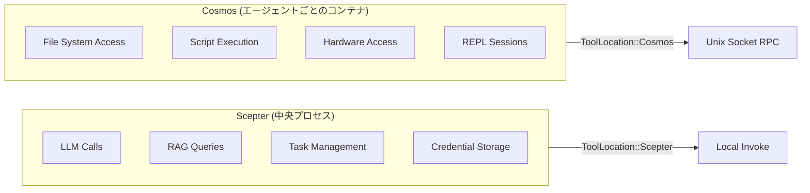
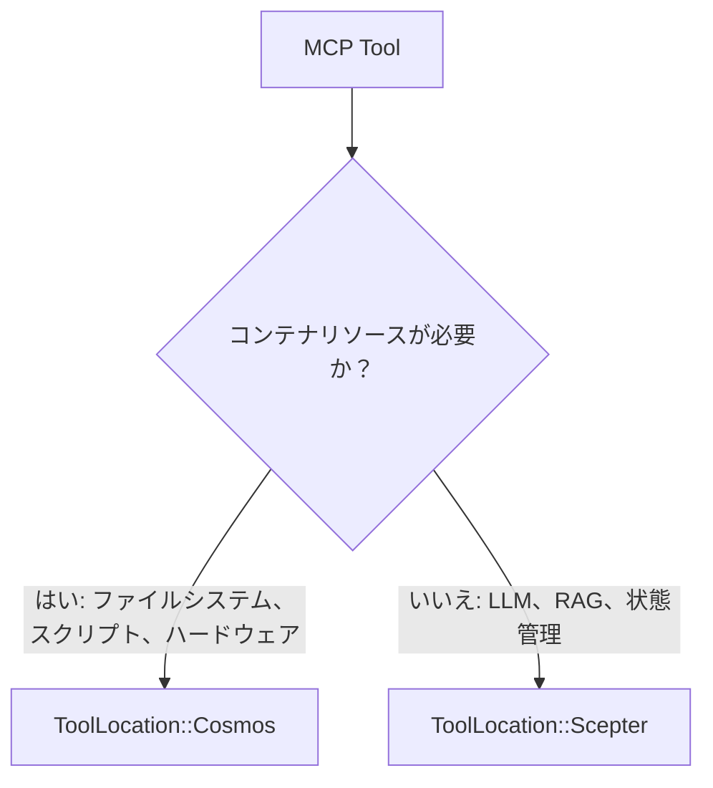
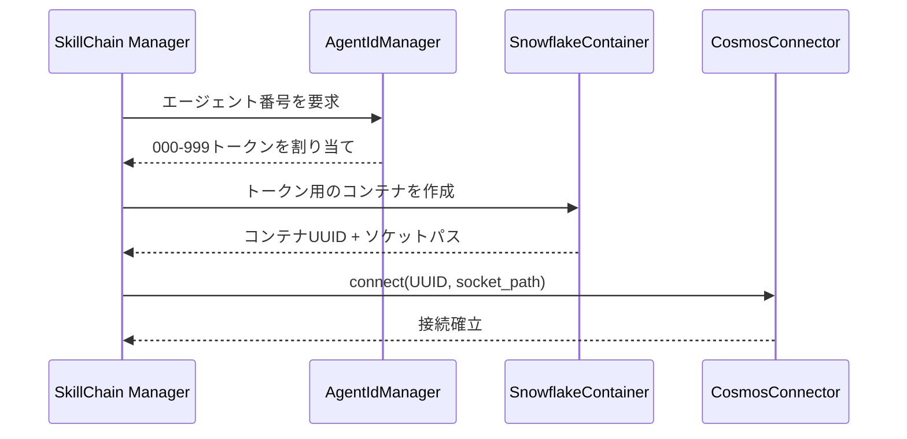
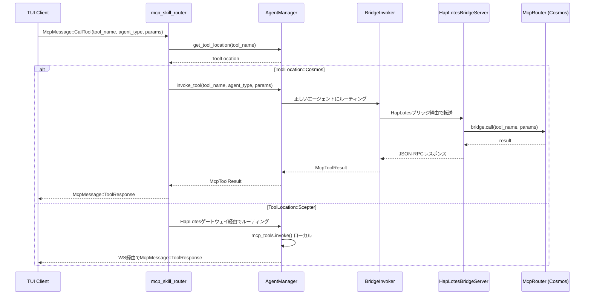
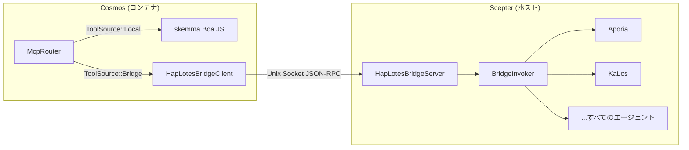
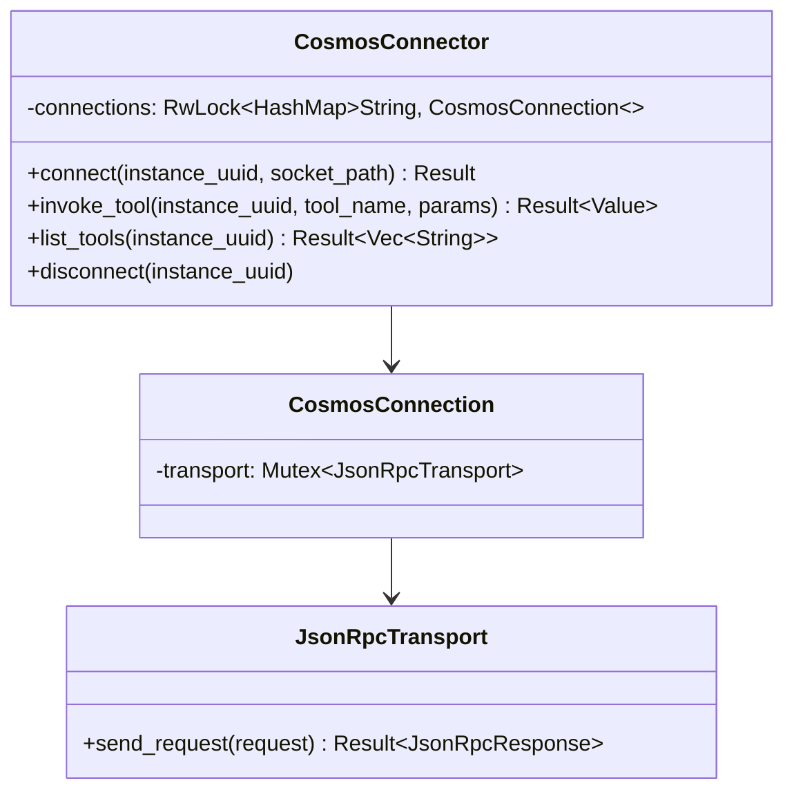
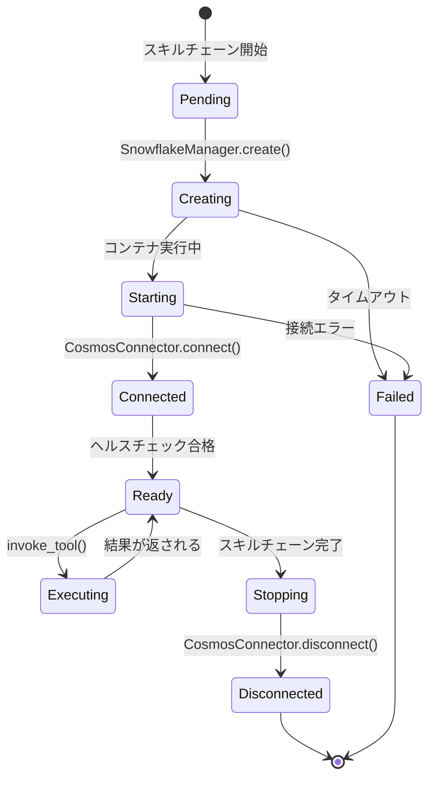
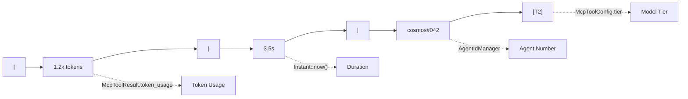
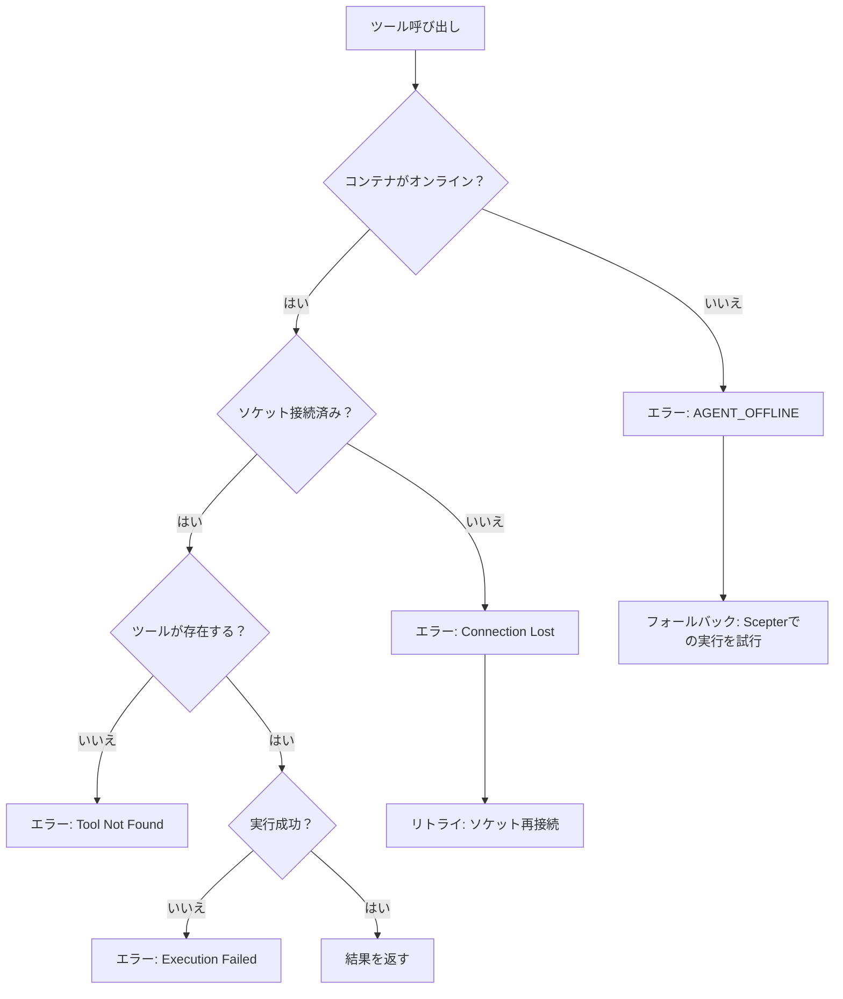

+++
title = "Cosmosコンテナスケジューリングとトークンルーティング設計"
description = """このドキュメントはCosmosコンテナスケジューリングアーキテクチャについて説明します：ToolLocation::CosmosでマークされたMCPツールがどのようにunix-socket JSON-RPCを通じて対応するコンテナにルーティング"""
lang = "ja"
category = "design"
subcategory = "core"
+++

# Cosmosコンテナスケジューリングとトークンルーティング設計

## 概要

このドキュメントはCosmosコンテナスケジューリングアーキテクチャについて説明します：`ToolLocation::Cosmos`でマークされたMCPツールがどのようにunix-socket JSON-RPCを通じて対応するコンテナにルーティングされるか、そしてトークン（エージェント番号）システムがコンテナIDとルーティングにどのように結びつくかについてです。

## I. ツールロケーションモデル

### 二重実行環境



### ToolLocation列挙型

| バリアント | 実行サイト | トランスポート |
| --- | --- | --- |
| `Scepter`（デフォルト） | プロセス内、`McpToolInvoker`経由 | 直接関数呼び出し |
| `Cosmos` | コンテナ内、`CosmosConnector`経由 | UnixソケットJSON-RPC |

### ロケーション決定基準



コンテナリソース（ファイルシステム、スクリプト実行、ハードウェアアクセス）を必要とするツールは`Cosmos`とマークされます。集中サービス（LLM、RAG、タスク管理、人間との対話）は`Scepter`のままです。

## II. トークンシステムとコンテナID

### エージェント番号割り当て



### トークンプロパティ

| プロパティ | 説明 |
| --- | --- |
| フォーマット | 3桁の数字: `000`-`999` |
| アロケータ | スキルチェーン内の`AgentIdManager` |
| バインディング | スキルチェーンパネルごとに1トークン |
| 表示 | TUI統計行に`cosmos#NNN`として表示 |
| 永続性 | エージェント再起動後も存続 |

## III. リクエストルーティングフロー

### TUI発信のMCP呼び出し



### 主要ルーティングロジック

ルーティング決定は`mcp_skill_router.rs`で行われます：

1. `agent_manager.get_tool_location(tool_name)`をチェック
1. `ToolLocation::Cosmos`でコンテナ化モードがアクティブな場合：

   - `agent_manager.invoke_tool()`を呼び出し、`BridgeInvoker` → HapLotesブリッジ → Cosmosの`McpRouter`を通じてルーティング
   - Cosmosの`McpRouter`はローカル（skemma）でディスパッチするか、リモートエージェントの場合はブリッジ経由でScepterに戻す
   - `McpMessage::ToolResponse`を直接TUIに返す

1. それ以外：HapLotesゲートウェイを通じてエージェントプロセスにルーティング

## IV. CosmosConnector / ブリッジアーキテクチャ

### HapLotesブリッジ（現在）

HapLotesブリッジはScepterとCosmosコンテナ間の**唯一の通信チャネル**です。



### 接続プール（CosmosConnector — Scepter側）



### JSON-RPCプロトコル

すべてのメソッド名はコンパイル時の型安全性のために`UnixMethod`列挙型を使用します：

| UnixMethodバリアント | 方向 | パラメータ |
| --- | --- | --- |
| `UnixMethod::McpCall` | Scepter → Cosmos | `{ tool_name, parameters }` |
| `UnixMethod::McpListTools` | Scepter → Cosmos | なし |
| `UnixMethod::ReplSnapshot` | Scepter → Cosmos | `{ path }` |
| `UnixMethod::ReplRestore` | Scepter → Cosmos | `{ path }` |
| `UnixMethod::BridgeCall` | Cosmos → Scepter | `{ tool_name, parameters }` |
| `UnixMethod::BridgeListTools` | Cosmos → Scepter | なし |

### レスポンスフォーマット

```json
{
  "success": true,
  "data": { ... },
  "error": null
}
```

## V. コンテナライフサイクル



### コンテナエージェント

Cosmosコンテナ内では、skemmaのみがローカルで実行されます（Boa JSエンジン）。他のすべてのエージェントツールはHapLotesブリッジを通じてScepterにルーティングされます：

| エージェント | 役割 | Cosmos内？ |
| --- | --- | --- |
| SkeMma | スクリプト実行（Boa JS） | **ローカル**（インプロセス） |
| Aporia | LLMチャット | ブリッジ経由 → Scepter |
| KaLos | ファイルI/O | ブリッジ経由 → Scepter |
| NeiKos | コンテナ管理 | ブリッジ経由 → Scepter |
| EleOs | Web検索 | ブリッジ経由 → Scepter |
| その他すべて | 様々 | ブリッジ経由 → Scepter |

## VI. 統計行の統合

### 表示フォーマット

TUI AgentDetailPageでは、統計行に以下が表示されます：



| セグメント | ソース |
| --- | --- |
| `1.2k tokens` | `McpToolResult.token_usage` |
| `3.5s` | `Instant::now()`からの経過時間 |
| `cosmos#042` | `AgentIdManager`からのエージェント番号 |
| `[T2]` | `McpToolConfig.tier`からのモデルティア |

## VII. エラーハンドリング

### 障害モード



### グレースフルデグラデーション

コンテナが利用できない場合、ツールにローカル実装が登録されていれば、システムはオプションで`Scepter`ローカル実行にフォールバックできます。

## VIII. 将来の拡張

| 機能 | 説明 | 優先度 |
| --- | --- | --- |
| コンテナプーリング | スキルチェーン間でコンテナを再利用 | 中 |
| ヘルスモニタリング | 定期的なコンテナヘルスチェック | 高 |
| リソース制限 | コンテナごとのCPU/メモリ制限 | 高 |
| マルチコンテナツール | 複数のコンテナにまたがるツール | 低 |
| コンテナ移行 | 実行中のコンテナをホスト間で移動 | 低 |
