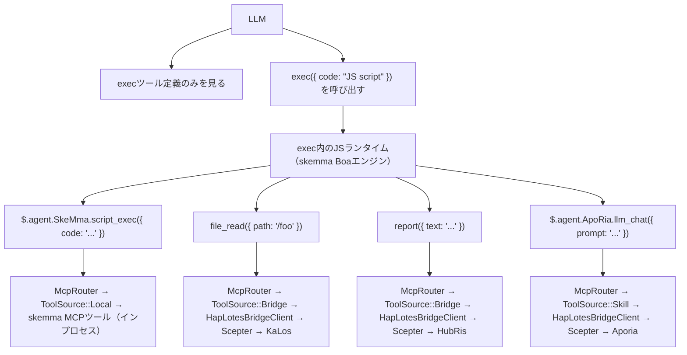
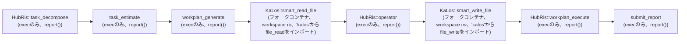
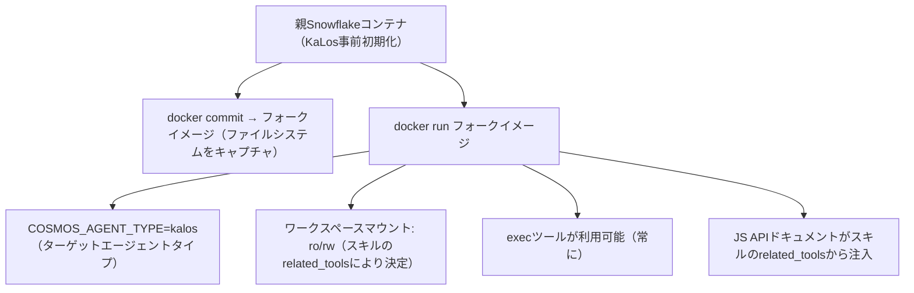

+++
title = "クロスエージェントスキルルーティングアーキテクチャ"
description = """スキルチェーン（execute_skill_chain）はexec-onlyマイクロカーネルアーキテクチャを使用します。LLMが見るのはexec、write_to_var、write_to_var_jsonの3つのツールのみで、エージェントごとのツー"""
lang = "ja"
category = "design"
subcategory = "core"
+++

# クロスエージェントスキルルーティングアーキテクチャ

## 問題

スキルチェーン（`execute_skill_chain`）はexec-onlyマイクロカーネルアーキテクチャを使用します。LLMが見るのは`exec`、`write_to_var`、`write_to_var_json`の3つのツールのみで、エージェントごとのツールホワイトリストやスキルごとのツール定義はありません。すべてのMCPツール呼び出しは、ESモジュールインポートと`file_read()`などのクロスエージェントTS APIを通じてTypeScriptランタイム（IEPLエンジン）内で行われます。

## 設計原則

1. **Exec-onlyマイクロカーネル** — LLMにMCPツール定義が直接与えられることはありません。3つのツール（`exec`、`write_to_var`、`write_to_var_json`）のみです。すべてのツール呼び出しはIEPLエンジンのTSランタイム内で行われます。
1. **`related_tools`がすべてを駆動** — スキルはTOMLフロントマターで`related_tools`を宣言します。これらの名前がTS APIドキュメントとなりLLMプロンプトに注入されます（例：`file_read()`、`report()`）。
1. **TS API → McpRouter経由のルーティング** — `exec`のIEPLランタイム内で、ESモジュールインポートが`McpRouter`を通じて正しいMCPツール実装にルーティングされます。`file_read()`のようなクロスエージェント呼び出しはKaLosエージェントの`file_read`実装に解決されます。
1. **コンテナ分離** — 子コンテナは`docker commit`フォークを通じて親ファイルシステムを継承します。ワークスペースはスキルの`related_tools`に基づいて読み取り専用または読み書き可能でマウントされます。
1. **`related_tools`が読み取り/書き込みモードを決定** — `skill_needs_write_access()`は書き込みツール名（`file_write`、`file_edit`など）について`related_tools`を検査し、フォークコンテナのマウントモードを決定します。

## アーキテクチャ

### Exec-Onlyマイクロカーネルフロー



### スキルチェーン実行フロー



### コンテナフォークメカニズム



## 実装詳細

### コアコンポーネント

| コンポーネント | ファイル | 責任 |
| --- | --- | --- |
| `skill_to_agent_name()` | `skill_chain.rs` | 指定されたスキルを所有するエージェント名を検索 |
| `skill_needs_write_access()` | `skill_chain.rs` | 書き込みツール名について`related_tools`を検査し、フォークコンテナのマウントモードを決定 |
| `fork_for_sub_skill()` | `snowflake_manager.rs` | `docker commit` + `docker run`を実行；`skill_needs_write_access()`に基づいてワークスペースをro/rwでマウント |
| `find_by_agent_type()` | `snowflake_manager.rs` | 逆順で検索し、最新のフォークコンテナを返す |
| `McpRouter` | `packages/cosmos/src/bin/cosmos/mcp_router.rs` | ESモジュールインポート呼び出しをルーティング：`ToolSource::Local` → skemma、`ToolSource::Bridge` → HapLotes |
| `HapLotesBridgeClient` | `packages/agents/haplotes/src/bridge/client.rs` | Cosmos → Scepterブリッジ：`bridge_call()`、`bridge_list_tools()` |
| `BridgeInvoker` | `packages/scepter/src/agent_manager/bridge_invoker.rs` | Scepter側：ツール呼び出しを正しい登録済みエージェントにルーティング |
| `build_js_api_docs()` | `skill_chain.rs` | プロンプト注入用にスキルの`related_tools`からJS APIドキュメントを生成 |
| `build_skill_user_prompt(agent_name, ...)` | `skill_chain.rs` | 注入されたJS APIドキュメント付きでスキルプロンプトを組み立て |

### JS APIドキュメントの生成方法

スキルのTOMLフロントマターは`related_tools`を宣言します：

```toml
# smart_read_file.md
related_tools = ["file_read", "file_list", "file_exists"]
```

システムは各ツールを所有者エージェントに解決し、`.d.ts`宣言からTS APIドキュメントを生成します：

```typescript
// .d.tsからの型宣言付きで利用可能なAPIとしてLLMプロンプトに注入：
file_read({ path: string }): Promise<string>
file_list({ dir: string }): Promise<string[]>
file_exists({ path: string }): Promise<boolean>
report({ text: string }): Promise<void>
```

LLMは`exec`コード内でこれらのAPIを呼び出します；McpRouterは正しいエージェントのMCPツール実装にディスパッチします。

### フォークライフサイクル

1. **作成**: `docker commit` 親コンテナ → フォークイメージ → `docker run` 子コンテナ
1. **接続**: CosmosConnectorが子コンテナのUnixソケットに接続
1. **ブリッジ**: フォークコンテナ内のHapLotesBridgeClientがScepterのHapLotesBridgeServerに接続
1. **実行**: LLMがJSコードで`exec`を呼び出し；JSランタイムがMcpRouter → ブリッジ → Scepterエージェントを使用
1. **クリーンアップ**: チェーンが終了すると、`snowflake.remove()`がコンテナを破棄 + `docker rmi`がイメージをクリーンアップ

### ワークスペースマウント戦略

| スキルタイプ | `related_tools`の特性 | ワークスペースマウント |
| --- | --- | --- |
| 読み取り専用（smart_read_file） | file_read、file_list、file_existsのみ | `:ro`（読み取り専用） |
| 書き込み（smart_write_file） | file_write、file_edit、file_deleteを含む | `:rw`（読み書き可能） |

### クロスエージェントツールルーティング

`exec`のJSランタイム内で、McpRouterはHapLotesブリッジを通じてツール呼び出しを解決します：

```mermaid
flowchart TB
    subgraph Bridge["ブリッジ呼び出し"]
        A1["exec({ code: &quot;file_read({path:'/foo'})&quot; })"] --> B1["McpRouterが &quot;kalos&quot; + &quot;file_read&quot; を解決"]
        B1 --> C1["tool_to_source → ToolSource::Bridge"]
        C1 --> D1["HapLotesBridgeClient → bridge.call(&quot;kalos.file_read&quot;, params)"]
        D1 --> E1["ScepterのHapLotesBridgeServer → BridgeInvoker"]
        E1 --> F1["KaLosエージェント → file_read MCPツールにルーティング"]
    end
    subgraph Local["ローカル呼び出し"]
        A2["exec({ code: &quot;$.agent.SkeMma.script_exec({code:'1+1'})&quot; })"] --> B2["McpRouterが &quot;skemma&quot; + &quot;script_exec&quot; を解決"]
        B2 --> C2["tool_to_source → ToolSource::Local"]
        C2 --> D2["skemma MCPツールを直接呼び出し（インプロセスBoaエンジン）"]
    end
```



### 書き込みアクセス検出

```rust
fn skill_needs_write_access(skill: &Skill) -> bool {
    const WRITE_TOOLS: &[&str] = &["file_write", "file_edit", "file_delete", "file_rename"];
    skill.related_tools.iter().any(|t| WRITE_TOOLS.contains(&t.as_str()))
}
```

この関数はスキルのTOMLフロントマターから`related_tools`を読み取ります。書き込みツールが存在する場合、フォークコンテナのワークスペースは読み書き可能でマウントされます。

## 設定

### スキルTOMLフロントマター

```toml
# smart_read_file.md
+++
related_tools = ["file_read", "file_list", "file_exists"]

[[next_action]]
agent = "hubris"
name = "operator"
+++

# smart_write_file.md
+++
related_tools = ["file_write", "file_edit"]

[[next_action]]
agent = "hubris"
name = "workplan_execute"
+++
```

### next_actionチェーン（スキルTOML）

```toml
# workplan_generate.md
[[next_action]]
agent = "kalos"
name = "smart_read_file"

# smart_read_file.md
[[next_action]]
agent = "hubris"
name = "operator"

# operator.md
[[next_action]]
agent = "kalos"
name = "smart_write_file"

# smart_write_file.md
[[next_action]]
agent = "hubris"
name = "workplan_execute"
```

## スキルJS APIリファレンス

| スキル | エージェント | JS API（`related_tools`から） | ステータス |
| --- | --- | --- | --- |
| `smart_read_file` | KaLos | `file_read()`、`file_list()`、`file_exists()` | ✅ 実装済み |
| `smart_write_file` | KaLos | `file_write()`、`file_edit()` | ✅ 実装済み |
| `exec_script` | SkeMma | `$skeMma.script_exec()` | 保留中 |
| `smart_command` | SkoPeo | `$skoPeo.smart_command_execute()` | 保留中 |

## リスクと考慮事項

1. **コンテナリソース** — 各フォークが新しいDockerコンテナを作成します；コンテナはチェーン終了時に自動的にクリーンアップされます。
1. **トークンコスト** — 各フォークは独自の独立したLLMコンテキストを持ちます；JS APIドキュメントはスキルごとに控えめなオーバーヘッドを追加します。
1. **フォークチェーンの深さ** — 現在深さ制限はありません；フォークは`step_index > 1`の場合にのみ発生します。
1. **コンテキスト受け渡し** — 親 → 子はレポート内容を通じて受け渡します；切り詰め戦略が必要になる場合があります。
1. **並列安全性** — 複数のチェーンが同じエージェントタイプを同時にフォークする場合、逆順検索により各チェーンが最新のフォークを使用することが保証されます。
1. **APIサーフェス制御** — LLMは注入されたドキュメントにリストされたJS APIのみを呼び出せます；McpRouterは未知のツール名を拒否します。
