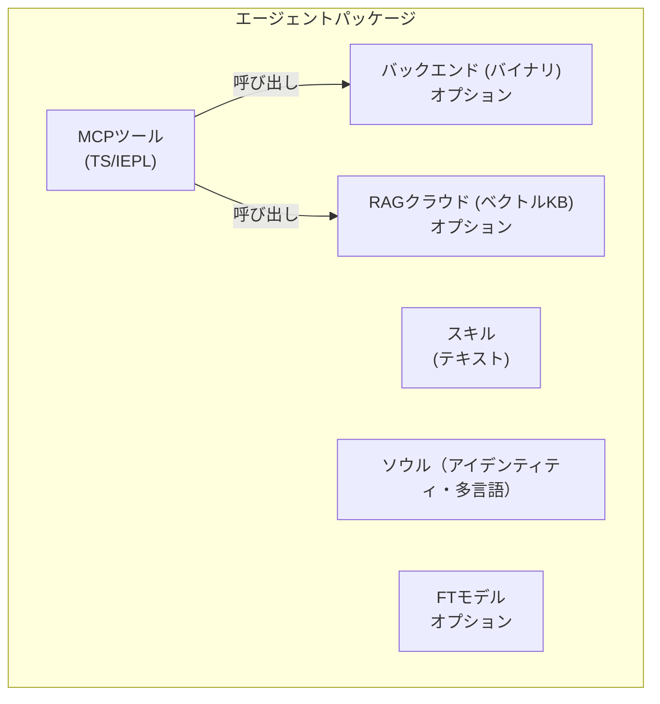

+++
title = "レイヤー2/3 エージェントパッケージ仕様"
description = """> ステータス: ドラフト v1 — 2026-06-26"""
lang = "ja"
category = "design"
subcategory = "core"
+++

# レイヤー2/3 エージェントパッケージ仕様

> **ステータス**: ドラフト v1 — 2026-06-26
> **スコープ**: レイヤー2およびレイヤー3エージェント向けの自己完結型パッケージ形式を定義する。

## 概要

レイヤー2/3エージェントは最大5つのコンポーネントで構成される**自己完結型パッケージ**である。パッケージは配布の単位であり、独立してインストール、更新、削除が可能である。



## 5つのコンポーネント

### 1. MCPツール（IEPL TypeScript）

主要なツールインターフェース。IEPLサンドボックス（Boa JSランタイム）で実行されるTypeScriptソースとして記述。各ツールファイルは関数をエクスポートする：

```typescript
// mcp/memory_store.ts
import type { McpResult } from '@entecheia/sdk';

export async function memory_store(params: {
  text: string;
  node_type: string;
  entity_type?: string;
  properties?: Record<string, string>;
}): Promise<McpResult> {
  // ツールロジック — バックエンドプリミティブの呼び出し、
  // 他のツールの合成、クラウドサービスへのHTTPリクエストが可能
  const result = await backend.memory_store(params);
  return { ok: true, data: result };
}
```

ツールには以下の種類がある：

- **純粋TS**: ロジックのみ、他のツールの合成やデータ変換を行う
- **バックエンド連携**: MCPバックエンドが提供するプリミティブを呼び出す
- **クラウド連携**: リモートAPI（RAG、モデル、外部サービス）を呼び出す

TypeScriptソースは純粋なテキストであり、コンパイルなしでバージョン管理、レビュー、配布が可能。セルフサービスパッケージング機能により、複数の `.ts` ファイルを単一の `bundle.js` にオプションでバンドルできる。

### 2. MCPバックエンド（オプションのバイナリ）

一部のツールはIEPLサンドボックスの範囲を超える機能（ファイルI/O、ハードウェアアクセス、データベース接続）を必要とする。これらは**バイナリバックエンド**（scepterプロセスと並行して動作するRustバイナリ）によって提供される。

- バックエンドはDockerイメージにコンパイルされ、scepterの「ポケット」（`/workspace-base/target/` ディレクトリ）に格納される。
- 実行時、scepterは `backend` モジュールインポートを介してIEPL環境にバイナリパスを動的に渡す。
- バックエンドはプリミティブ操作を公開し、すべての合成とオーケストレーションはTSレイヤーで行われる。

バックエンドインターフェースの例（Rustから自動生成）：

```typescript
// Rustバックエンドから自動生成
declare module 'backend' {
  export function memory_store_raw(params: {...}): Promise<McpResult>;
  export function memory_query_raw(query: string): Promise<McpResult>;
}
```

### 3. スキル（純粋テキスト）

スキルプロンプトはTOMLフロントマター付きのmarkdownファイルである。エージェントがタスクを**どのように**実行するか（システムプロンプト、ツールホワイトリスト、実行モード、パイプライン構造）を定義する。

```markdown
+++
name = "memory_consolidate"
agent = "philia"
related_tools = ["memory_consolidate", "memory_query"]
location = "scepter"
execution_mode = "read"

[features]
tier = "worker"
+++

# memory_consolidate

構造化された想起のためにメモリノードをエピソードに統合する...
```

スキルは言語に依存しない（`#` ボディはプロンプトテンプレート）。純粋なテキストであり、コンパイルやバイナリは不要。

### 4. RAGデータベース（オプション、クラウドホスト）

エージェントにドメイン固有の知識を提供するベクトル知識ベース。Entelecheiaのクラウドインフラストラクチャ上でホストされる。

- オプション：エージェントはRAGなしでも機能可能（機能低下）。
- クエリ制限あり：クォータが枯渇した場合、クエリは空を返す — エージェントはグレースフルに劣化する。
- マニフェスト内でURL + APIキーにより参照され、パッケージにバンドルされない。

### 5. ファインチューニングモデル（オプション、クラウドホスト）

エージェントの特定ドメイン向けにファインチューニングされたモデル。同様にクラウドホストされる。

- オプション：エージェントはデフォルトでプラットフォームの汎用モデル（例：GLM-5）を使用する。
- 将来的にセルフホスティング用にオープンウェイト化される可能性がある。
- マニフェスト内でモデルIDにより参照される。

## パッケージディレクトリ構造

```text
packages/agents/{agent_name}/
├── manifest.toml           # パッケージメタデータと設定
├── mcp/
│   ├── *.ts                # TypeScriptツール実装（IEPL）
│   └── *.md                # ツールドキュメント（パラメータ、戻り値）
├── backend/                # オプションのRustバックエンド
│   ├── Cargo.toml
│   └── src/
│       └── lib.rs
├── skills/
│   └── *.md                # スキルプロンプト
├── soul/
│   └── {lang}.md           # 言語別エージェントパーソナリティ
├── rag.toml                # オプション：RAGデータベース参照
└── model.toml              # オプション：ファインチューニングモデル参照
```

## manifest.toml形式

```toml
[package]
name = "philia"              # ディレクトリ名と一致必須
version = "0.2.0"
description = "認知記憶システム — 保存、クエリ、統合"
layer = 2                    # 2 = プラットフォームエージェント, 3 = 拡張
category = "complex_tool"    # simple_tool | complex_tool | coordinator

[dependencies]
# このエージェントがツールを呼び出す他のエージェントパッケージ
aporia = "0.2.0"

[backend]
# 純粋TSエージェントの場合は完全に省略
type = "rust"
binary = "philia"            # /workspace-base/target/debug/ 内のバイナリ名
provides = [                 # TSレイヤーに公開されるプリミティブ
  "memory_store_raw",
  "memory_query_raw",
  "memory_consolidate_raw",
]

[rag]
# クラウドRAG未使用時は省略
provider = "entelecheia-cloud"
database_id = "philia-knowledge-v1"
endpoint = "https://rag.entelecheia.ai/v1"

[model]
# デフォルトプラットフォームモデル使用時は省略
provider = "entelecheia-cloud"
model_id = "philia-ft-v1"
endpoint = "https://model.entelecheia.ai/v1"
```

## TS SDK（`@entecheia/sdk`）

SDKはツール作成者向けの型とユーティリティを提供する：

```typescript
// @entecheia/sdk — 型
export interface McpResult {
  ok: boolean;
  data?: unknown;
  error?: string;
}

export interface McpToolParams {
  [key: string]: unknown;
}

// @entecheia/sdk — ユーティリティ
export function rag_search(query: string): string;        // RAG検索（同期、キャッシュあり）
export function llm_chat(prompt: string): Promise<string>; // LLM呼び出し
export function vars_get(key: string): unknown;           // クロススキル状態
export function vars_set(key: string, value: unknown): void;
```

`backend` モジュールはマニフェストの `[backend].provides` リストからエージェントごとに自動生成される。バイナリプリミティブに対する型付きラッパーを提供する。

## レイヤーアーキテクチャ

| レイヤー | エージェント | 出荷方法 | パッケージ？ | コンテナ？ |
| --- | --- | --- | --- | --- |
| L1 | SkeMma, HapLotes, HubRis, KaLos, NeiKos, ApoRia, EleOs, EpieiKeia, OreXis, PhiLia, PoleMos, SkoPeo | イメージに内蔵 | バックエンドのみ（Rustクレート） | なし（プロセス内） |
| L2 | ClassicSoftwareEngineering, WebAutomation, WebUiPanel, IndustrialIoT | イメージに内蔵 | **完全パッケージ**（TS + スキル + ソウル） | あり（e-skemma） |
| L3 | ユーザーインストール拡張 | 動的インストール | **完全パッケージ** | あり（e-skemma） |

- **レイヤー1**（12エージェント）: コアプラットフォームエージェント。Rustクレートがプリミティブ操作（ファイルI/O、メモリ、コンテナ、ハードウェア等）を提供する。パッケージではなく、プラットフォームそのものである。ツールはインポート可能なモジュールとして公開（例：`import { file_write } from 'kalos'`）。
- **レイヤー2**（4エージェント）: 最初の真のパッケージ。**バイナリバックエンドを持たず**、レイヤー1プリミティブの純粋なTS/IEPL合成である。パッケージ形式の例としてイメージに同梱される。
- **レイヤー3**: ユーザーインストールパッケージ。L2と同じ形式だが動的にロードされる。オプションでバイナリバックエンドを宣言可能（ユーザーがコンパイルしscepter経由で注入）。

## 移行パス

既存のRustエージェントクレート（`packages/agents/*/src/`）は**バックエンド**となる。MCPツールドキュメント（`res/prompts/agents/*/mcp/*.md`）はパッケージ内に移動。スキルプロンプト（`res/prompts/agents/*/skills/*.md`）はパッケージ内に移動。ソウルファイル（`res/prompts/soul/`）はパッケージ内に移動。

旧 `shared/plugin_host`（wasmベース）は、既に `shared/iepl` に存在するIEPL TSランタイムに置き換えられる。wasmコンパイル不要。
