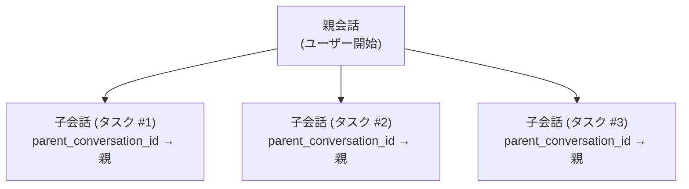

+++
title = "セッションストレージライフサイクル管理"
description = """> ステータス: 承認済み (2026-06-10)"""
lang = "ja"
category = "design"
subcategory = "core"
+++

# ADR-004: セッションストレージライフサイクル管理

> **ステータス**: 承認済み (2026-06-10)
> **コンテキスト**: entelecheia + shittim-chest
> **参考**: [opencode #16101](https://github.com/anomalyco/opencode/issues/16101)

## 背景

opencode（同等のAIコーディングエージェント）は、わずか2ヶ月で約300億トークン消費、9GBのチャット履歴DBを蓄積した。メモリ使用量はわずか約10プロジェクトのロードで定期的に30GiBを超えた。根本原因はセッションライフサイクル管理の欠如：TTLなし、自動クリーンアップなし、ストレージ上限なし、圧縮後の領域回収なし。

entelecheiaとshittim-chestは、未対策のままでは同じ根本的な問題に直面する：

- **entelecheia**: `conversations` および `messages` DBテーブルは存在するが書き込まれたことがない。実際のチャットは無制限のTOMLログファイルとして保存されていた。`dialogue_events` テーブルにはCRUDコードがあるがマイグレーションがない。設定上限（`MAX_DIALOGUE_HISTORY_LEN`、`MAX_DIALOGUE_RECORDS`、`DIALOGUE_TIMEOUT_MS`）は定義されているが強制されていない。
- **shittim-chest**: 動作する会話/メッセージ永続化があるが、期限切れの認証セッション、古いワークスペースセッション、クルーズ履歴、Webhook配信ログに対する自動クリーンアップがない。

## 決定

以下の原則に基づく統合ストレージライフサイクル管理システムを実装する：

### 1. 会話には誕生だけでなくライフサイクルがある

- **TTL**: `CONVERSATION_TTL_DAYS`（デフォルト90日）を超えて非アクティブな会話は、アーカイブ後にクリーンアップ対象となる。
- **アーカイブ後削除**: TTLクリーンアップが会話を削除する前に、会話はアーカイブ（`is_archived = TRUE`）されなければならない。
- **子セッション**: 親子会話関係は `parent_conversation_id` で追跡される。子会話は独立してアーカイブされ、`CHILD_SESSION_RETENTION_DAYS`（デフォルト7日）後にクリーンアップ可能。

### 2. クリーンアップは手動ではなく自動

- **バックグラウンドタスク**: 設定可能な間隔（`CLEANUP_INTERVAL_MINUTES`、デフォルト60）で定期的なクリーンアップが実行される。
- **混合戦略**: 起動時スキャン + 定期タイマー。ユーザーの介入不要。
- **べき等性**: クリーンアップタスクは安全に複数回実行可能。

### 3. 圧縮によりストレージ領域を回収

- `is_compacted = TRUE` とマークされたメッセージは、その内容が要約されている。詳細な内容は保持期間後にクリーンアップ可能。
- デフォルトで保守的：圧縮されたメッセージの内容のみをクリアし、メタデータ（ツール名、タイムスタンプ、トークン数）は保持する。

### 4. 設定は一元化

すべてのライフサイクルパラメータは `StorageLifecycleConfig`（entelecheia）および `CleanupConfig`（shittim-chest）に格納され、環境変数から適切なデフォルト値でロードされる。

### 5. ファイルベースのログは二次的

- `CHAT_LOG_ENABLED` のデフォルトは `false`。TOMLチャットログファイルはデバッグ専用。
- 有効時、ログファイルは `CHAT_LOG_RETENTION_DAYS`（デフォルト7）後にクリーンアップされる。

## スキーマ変更

### conversationsテーブル（entelecheia）

追加カラム：

- `parent_conversation_id UUID REFERENCES conversations(conversation_id)` — 子セッション追跡
- `is_archived BOOLEAN NOT NULL DEFAULT FALSE` — アーカイブフラグ
- `archived_at TIMESTAMPTZ` — アーカイブ日時
- `metadata JSONB NOT NULL DEFAULT '{}'` — 拡張可能なメタデータ

### messagesテーブル（entelecheia）

追加カラム：

- `is_compacted BOOLEAN NOT NULL DEFAULT FALSE` — 圧縮済みメッセージを内容クリーンアップ対象としてマーク
- `metadata JSONB NOT NULL DEFAULT '{}'` — 拡張可能なメタデータ

### dialogue_eventsテーブル（entelecheia）

以前はCRUDコードがあったが `CREATE TABLE` マイグレーションがなかった。現在は `baseline_tables.sql` に含まれている。

### rbac_sessionsテーブル（entelecheia）

kirinoセッション永続化（SQLバックエンド）用の新規テーブル。

## 実装フェーズ

| フェーズ | 説明 | ステータス |
| --- | --- | --- |
| 0.1 | スキーママイグレーション修正（dialogue_events、conversations/messages アップグレード） | 完了 |
| 1.2 | 統合設定名前空間（`StorageLifecycleConfig`） | 完了 |
| 0.2 | CRUD + クリーンアップメソッドを持つ `ConversationStore` | 完了 |
| 2.1 | 汎用 `CleanupScheduler` インフラストラクチャ | 完了 |
| 2.2 | scepter `setup.rs` に配線されたentelecheiaクリーンアップタスク | 完了 |
| 2.3 | shittim-chestクリーンアップタスク | 削除（パッケージが存在しない） |
| 1.3 | kirino `PgSessionManager`（SQLセッションバックエンド） | 完了 |
| 3.1 | 既存の対話制限の強制（`max_dialogue_records`、`enforce_max_conversations`） | 完了 |
| 3.2 | チャットログファイルのデフォルトオフ + TTLクリーンアップ | 完了 |
| 4.1 | CLI管理コマンド（`session stats`、`session purge`） | 完了 |
| 5 | 子セッションカスケード + 孤立ライフサイクル | 完了 |

## 結果

### ポジティブ

- opencodeを悩ませた無制限のストレージ増大を防止
- 会話に明示的なライフサイクルがある：アクティブ → アーカイブ → クリーンアップ
- バックグラウンドクリーンアップはユーザー介入不要
- 設定駆動で適切なデフォルト値
- PostgreSQLのVACUUMが削除後にディスク領域を回収（opencodeが使用するSQLiteとは異なる）

### ネガティブ

- 追加のバックグラウンドタスクが最小限のCPU/メモリを消費
- アーカイブされた会話はTTL後に詳細内容を失う（設計通り）
- クリーンアップタスクが実行中であることを監視する必要がある

### 軽減されたリスク

- **データ損失**: アーカイブ後削除が猶予期間を提供。クリーンアップは既にアーカイブ済みの会話のみを削除。
- **パフォーマンス影響**: クリーンアップは設定可能な間隔で実行され、`updated_at`/`created_at` のインデックス付きクエリを使用。
- **子セッションの孤立**: `parent_conversation_id` が関係を追跡。孤立TTLは親よりも短い（30日 vs 90日）。

## 子セッションライフサイクル設計（フェーズ5）

### 問題

opencode issue #16101は、セッションの86%が `task()` によって生成された子セッションであり、ストレージの75%を占めることを明らかにした。これらの子セッションは独立したライフサイクル管理なしに蓄積される。

### アーキテクチャ



### ライフサイクルルール

1. **作成**: スキルチェーンがサブタスクを生成する際、`parent_conversation_id` を親の `conversation_id` に設定した新しい会話が作成される。

1. **独立したアーカイブ**: 子は親とは独立してアーカイブ可能。子タスクが完了すると、`CHILD_SESSION_RETENTION_DAYS`（デフォルト7日）後に自動的にアーカイブされる。

1. **親アーカイブ時のカスケード**: 親がアーカイブされると、すべての子がアーカイブされる。親が削除されると、すべての子が削除される。

1. **孤立処理**: 削除された/存在しない親を指す `parent_conversation_id` を持つ会話は孤立として扱われ、`ORPHAN_CONVERSATION_TTL_DAYS`（デフォルト30日）後にクリーンアップされる。

1. **圧縮適格性**: 子会話はアーカイブ後すぐにメッセージ圧縮の対象となる（猶予期間なし）。親が要約を保持しているため。

### クリーンアップクエリ

```sql
-- 親がアーカイブされている子をアーカイブ
UPDATE conversations SET is_archived = TRUE, archived_at = NOW()
WHERE parent_conversation_id IN (
    SELECT conversation_id FROM conversations WHERE is_archived = TRUE
) AND is_archived = FALSE;

-- 親が削除されている子を削除
DELETE FROM conversations WHERE parent_conversation_id IS NOT NULL
    AND parent_conversation_id NOT IN (SELECT conversation_id FROM conversations);

-- 保持期間を超えたアーカイブ済みの子を削除
DELETE FROM conversations WHERE is_archived = TRUE
    AND archived_at < NOW() - (CHILD_SESSION_RETENTION_DAYS || ' days')::interval
    AND parent_conversation_id IS NOT NULL;
```

### 実装状況

- `parent_conversation_id` カラムは `conversations` テーブルに存在（フェーズ0.1）
- `ConversationStore.cleanup_expired_conversations()` がTTLベースのクリーンアップを処理（フェーズ0.2）
- `StorageLifecycleConfig.child_session_retention_days` および `orphan_conversation_ttl_days` を設定（フェーズ1.2）
- `ConversationStore` にカスケードクエリを実装：
  - `cascade_archive_children()` — 親アーカイブ時に子をアーカイブ
  - `cascade_delete_orphaned_children()` — 親が削除された子を削除
  - `cleanup_expired_child_conversations()` — アーカイブ済みの子のTTLベースクリーンアップ
  - `cleanup_orphan_conversations()` — 親が存在しない子をクリーンアップ
  - `enforce_max_dialogue_records()` — dialogue_events数のハードキャップ
  - `enforce_max_conversations()` — アクティブ会話数のハードキャップ
- すべてscepter `setup.rs` で定期的クリーンアップタスクとして登録済み
