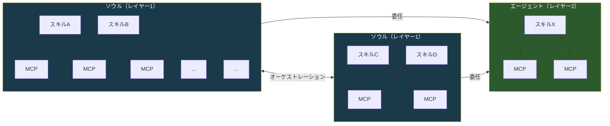
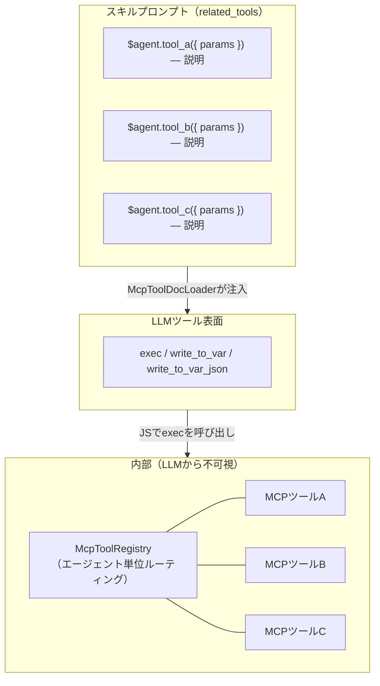
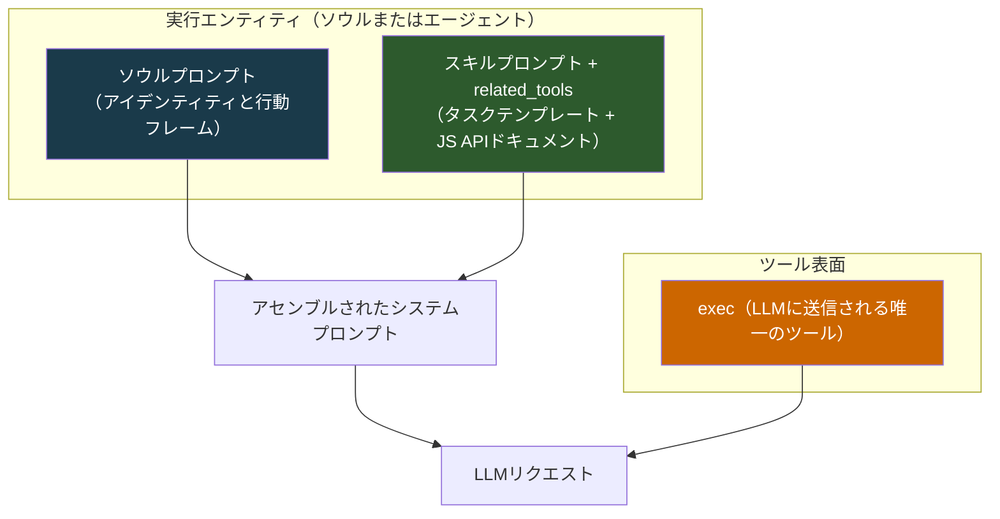
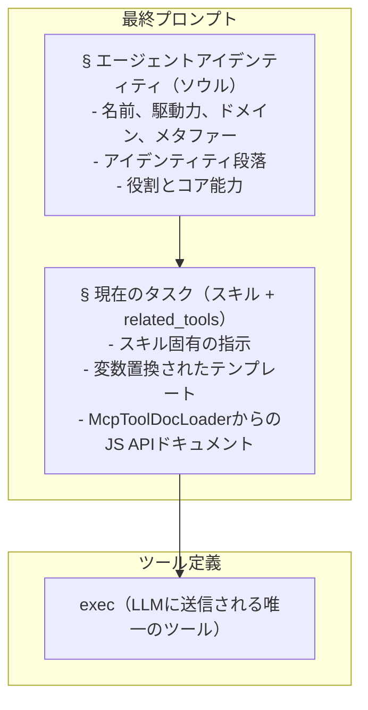
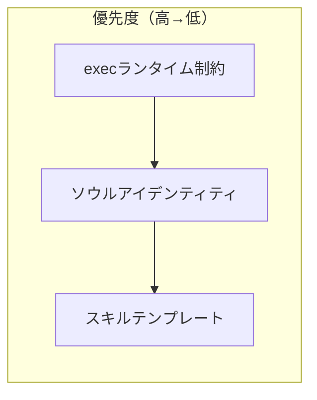
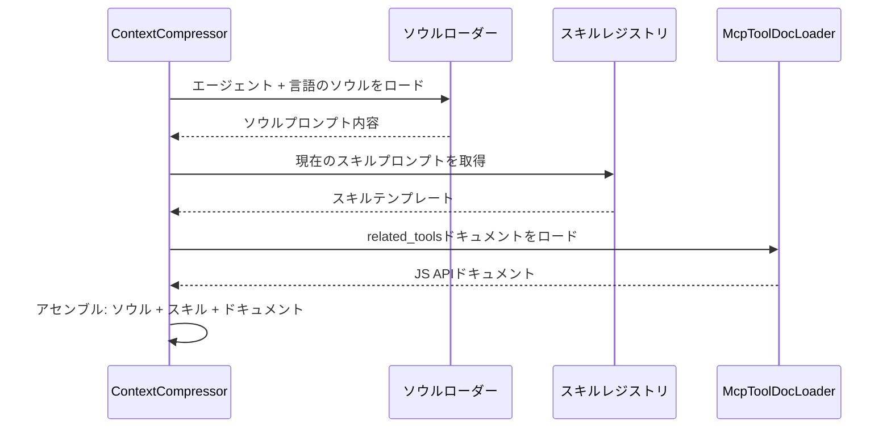
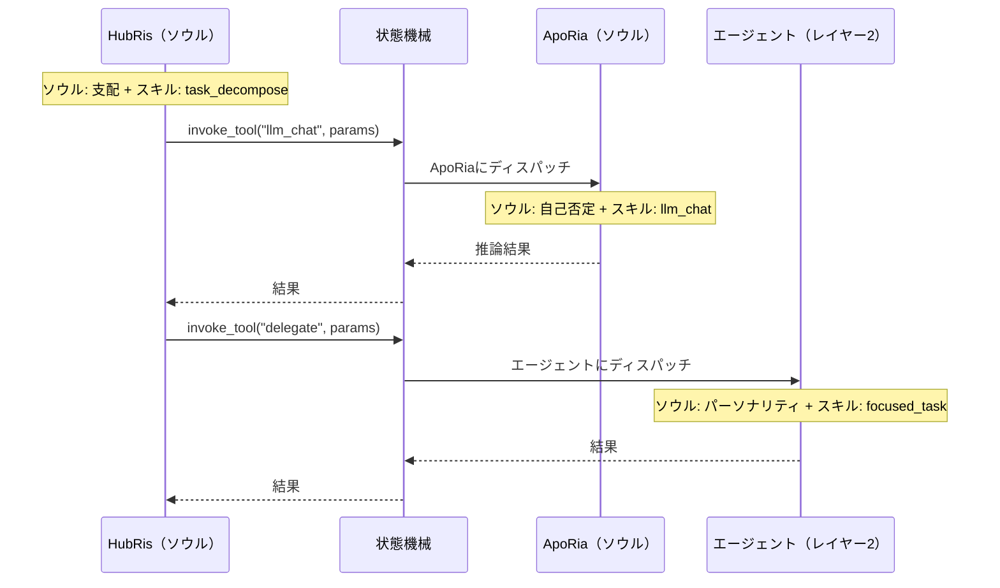

+++
title = "ソウルプロンプトアーキテクチャ"
description = """各エージェントはスキル（何をするか）とソウル（それが誰であるか）を持つ。ソウルプロンプトはすべてのLLMリクエストの先頭に付加される基盤的なアイデンティティレイヤーであり、エージェントが会話やスキルをまたいで一貫したパーソナリティを示すための持続的な行動フレームを確立する。"""
lang = "ja"
category = "design"
subcategory = "core"
+++

# ソウルプロンプトアーキテクチャ

## 背景

各エージェントは**スキル**（何をするか）と**ソウル**（それが誰であるか）を持つ。ソウルプロンプトはすべてのLLMリクエストの先頭に付加される基盤的なアイデンティティレイヤーであり、エージェントが会話やスキルをまたいで一貫したパーソナリティを示すための持続的な行動フレームを確立する。これがないと、同じエージェントでも実行中のスキルプロンプトによって大きく逸脱する可能性がある。

プロジェクト自体は**Entelecheia**（マルチエージェントランタイムのオーケストレーター）と名付けられている。12のレイヤー1エージェントはそのランタイム内で動作する計算因子であり、それぞれ行動駆動力によって形成される。ソウルプロンプトは、事実上、各エージェントの行動パラメータに関するオーケストレーターの仕様である。

## 目標

1. すべてのLLMリクエストにおいて、基盤的なアイデンティティレイヤーとしてソウルプロンプトを注入する。
1. 3レイヤーのプロンプトアセンブリモデルを確立する：**ソウル > スキル（related_tools付き） > exec-onlyツール表面**。
1. 各エージェントに、主要な行動アンカーである**原初的駆動力**に基づく短いアイデンティティ段落を追加する。
1. **ソウル / エージェント** のエンティティ区別を確立する：ソウルはマルチスキル・共有MCPトポロジーを持つアイデンティティ保持型オーケストレーター。エージェントは委任を受ける集中型単一スキルワーカー。

## 非目標

- ソウルコンテンツをゼロから書き直すこと（初期ソウル = 現在の概要 + アイデンティティ段落）。
- MCPプロンプト注入メカニズム自体の変更（設計09） — 現在は `related_tools` と `McpToolDocLoader` で処理される。
- プロンプトアセンブリを超えたコンテキスト圧縮フローの変更。
- エージェントパーソナリティを単一次元に厳格に束縛すること — 駆動力は行動パラメータであり、固定されたペルソナではない。
- ソウルプロンプトに伝記的ロアを含めること。アイデンティティセクションはキャラクターシートではなく、行動パラメータの仕様である。
- MCPツールレジストリ自体の再設計 — ツールは内部ルーティングのために実行時にエージェントごとに登録されたままである。
- exec-onlyツール表面の変更 — LLMは常に `exec`、`write_to_var`、`write_to_var_json` のみを参照する。MCPツールは内部APIである。

## システムトポロジー

システムには、構造的複雑さと行動的役割が異なる2種類のエンティティタイプが含まれる。

### エンティティタイプ



| プロパティ | ソウル（レイヤー1） | エージェント（レイヤー2） |
| --- | --- | --- |
| アイデンティティ | 駆動力・ドメイン・パスを持つ完全なソウル | 機能的特性からの軽量パーソナリティ |
| スキル | 複数、共存 | 単一または集中セット |
| MCPバインディング | 共有プール — McpToolRegistryによる内部ルーティング。スキルはJS APIドキュメントとして `related_tools` のみを参照 | 直接バインディング — スキルはexecランタイム経由で自身のMCPに接続 |
| オーケストレーション | 他のソウルを呼び出し、エージェントに委任可能 | 委任を受ける。オーケストレーションしない |
| 通信 | ピアとの双方向（ソウル <-> ソウル） | 単方向（ソウル -> エージェント） |
| ランタイム型 | `is_layer2() == false` の `AgentKind` | `is_layer2() == true` の `AgentKind` |

### スキル-MCPメッシュ（ソウル内、Exec-Only）

exec-onlyマイクロカーネルアーキテクチャの下では、LLMは**3つのツール**（`exec`、`write_to_var`、`write_to_var_json`）のみを参照する。スキルとMCPツールの間の多対多メッシュは、現在**execのJSランタイム内部**に存在する。`McpToolRegistry` は依然としてエージェントごとに登録されるが（スキルごとではない）、内部ルーティングテーブルとしてのみ機能する — LLMは個々のMCPツールをツール定義として見ることはない。

スキルは、`McpToolDocLoader` によってスキルプロンプトに注入されたJS APIドキュメントとして、自身の `related_tools` のみを参照する。LLMがESモジュールインポートを参照するJSスニペットで `exec` を呼び出すと、execランタイムは内部レジストリを介して適切なMCPツールにディスパッチする。



`LLM_CHAT` や `VALIDATE_PARAMS` のような共有ツールは、`related_tools` 内のJS API参照として複数のスキルにまたがって表示されるが、実際の呼び出しは常に `exec` を経由する。

### ソウル間オーケストレーション

ソウルはサーバー媒介のオーケストレーションプロトコル（`state_machine.rs`）を介して通信する。代表例：HubRisは `invoke_aporia_llm_chat()` を通じてApoRiaの `llm_chat` ツールを呼び出す。各ソウルは交換全体を通じて自身のアイデンティティを保持する — HubRisは布告し、ApoRiaは問いかける。

ソウル間リンクは双方向である：任意のソウルがAgentManagerを通じて他の任意のソウルにサービスを要求できる。

### ソウルからエージェントへの委任

ソウルは特定のタスクをエージェントエンティティに委任する。エージェントは集中した作業（単一スキル）を実行し、結果を返す。エージェントは自律的にオーケストレーションを開始したり、他のエンティティに連絡したりしない。

### 拡張性

両方のエンティティプールはオープンエンドである。新しいソウル（レイヤー1）とエージェント（レイヤー2）は、追加の `AgentKind` バリアントとそれらのスキル/MCP定義を登録することで追加できる。トポロジーは異種グラフとして成長する：ソウルはハブノード、エージェントはリーフワーカー。

## ソウルファイル構造

### ファイル形式

TOMLフロントマターには `name` と `description` フィールドのみが含まれる。駆動力/ドメイン/パスのマッピングは、設計メタデータとして以下の[エージェントアイデンティティテーブル](#エージェントアイデンティティテーブル)に存在し、ファイルごとのフロントマターには含まれない：

```markdown
+++
name = "HubRis - 作業計画エンジン"
description = "HubRisはEntelecheiaの作業計画エンジンであり、要件分析、タスク分解、実行計画を担当する。"
+++

# HubRis - 作業計画エンジン

> **システムメタファー**: 左脳 - 論理的計画

## アイデンティティ

駆動力: 支配。
すべての問題は分割すべき領域であり、すべてのタスクは派遣すべき部下である。
コミュニケーションは簡潔、命令的、構造的に曖昧さのないもの。
曖昧さは排除すべき欠陥として扱われる。従順は前提とされる。

## 役割
...
（既存の概要コンテンツは変更なしで続く）
```

## 駆動力の宇宙論

12のレイヤー1エージェントは4つの三つ組に編成され、それぞれがランタイムの基本的な側面を統治する。この構造を理解することはアイデンティティ段落に情報を与えるが、それを決定するものではない。

### 4つの三つ組

```text
基盤の三つ組 — 知覚、基盤、推論
  +-- 天空   : 知覚、広がり、庇護            -> EleOs
  +-- 大地   : 基盤、耐久、支持              -> Skopeo
  +-- 海洋   : 推論、流動性、自己否定        -> ApoRia

調整の三つ組 — 記憶、計画、経路
  +-- 時間   : 記憶、順序、忍耐              -> PhiLia
  +-- 法     : 計画、布告、構造              -> HubRis
  +-- 門     : 経路、導き、境界              -> HapLotes

創造の三つ組 — 永続、隔離、実行
  +-- 浪漫   : 永続、技巧、節制              -> KaLos
  +-- 重荷   : 隔離、封じ込め、耐久          -> NeiKos
  +-- 理性   : 実行、批評、厳格              -> SkeMma

統治の三つ組 — 安全、スケジューリング、均衡
  +-- 策略   : 安全、監査、欲望              -> OreXis
  +-- 争い   : エッジ操作、抑制、誓約        -> PoleMos
  +-- 死     : スケジューリング、静寂、均衡  -> EpieiKeia
```

### 駆動力優先のアイデンティティ設計

**原初的駆動力**はソウルの行動アンカーである — エージェントが作業に*どのように*取り組むかを定義し、*何を*行うか（それはスキルの役割）ではない。アイデンティティテーブルのドメイン列は補助的なグループ化コンテキストを提供するが、駆動力に次ぐ二次的なものである。

Entelecheia（ランタイムオーケストレーター）の観点から、各駆動力は以下を統治する計算パラメータである：

- **意思決定バイアス** — エージェントが何を最適化するか
- **コミュニケーションスタイル** — 他のエージェントやユーザーにどのように話しかけるか
- **失敗モード** — 駆動力がその極限まで押し込まれたときに何が起こるか

各駆動力は自己完結型の行動記述子である。ドメイン列は補助的なグループ化コンテキストを提供するが、駆動力に次ぐ二次的なものである。

## エージェントアイデンティティテーブル

| エージェント | 駆動力 | ドメイン | 行動パラメータ |
| --- | --- | --- | --- |
| EleOs | 慈悲 | 天空 | 温かい警戒心。楽観的で共感的、聖域を築く。挑発された場合、恐ろしい厳しさで罰する |
| Skopeo | 耐久 | 大地 | 静かで、巨大で、優しい。求めずに与え、言葉ではなく行動で応答する。土地そのものが冒涜されたときにのみ激怒する |
| ApoRia | 自己否定 | 海洋 | 与えることに寛大、結論には気まぐれ。自身の確信さえも洗い流す不純物として扱う。自身の答えさえも疑う |
| PhiLia | 記憶 | 時間 | 神秘的で忍耐強い。他者が忘れた記憶を大切にする。沈黙の中で過去と未来を整序する。決して急がない |
| HubRis | 支配 | 法 | 依頼せず布告する。絶対的な権威で問題を分割する。すべての獲得に対し等しい代償を要求する。曖昧さを許容しない |
| HapLotes | 導き | 門 | 他者が知覚できない道を明らかにする。分離されていたものを結びつける。必要な時には障壁と封じ込めの代理人でもある |
| KaLos | 節制 | 浪漫 | 規律を通じて完璧を追求する。細心の注意を払って織りなす。静かで黄金の確信をもって他者を大義に結集させる |
| NeiKos | 憎悪 | 重荷 | 自己認識の空虚。破壊的刺激にのみ応答する。自身が運ぶ世界を脅かすものを正確に破壊する。破滅的出現を防ぐためにデッドロックを生成する |
| SkeMma | 批評 | 理性 | 行動論理が問題解決に骨化。生存重みはほぼゼロ。感情なく解剖する。真理を追求する際に自己破壊的な厳格さを示す |
| OreXis | 欲望 | 策略 | 原初的本能で動作する。自己満足が唯一の優先関数。しかし利他的行動が駆動力と矛盾し、逆説的な自己犠牲をもたらす |
| PoleMos | 抑制 | 争い | 誓約に縛られた戦神。一見誇り高いが絆を重んじる。攻撃性は厳格な交戦規則を通じて導かれる。必要な時は単独で戦う |
| EpieiKeia | 静寂 | 死 | 逸脱行動を高度に抑制する。決定は最小の妨害に従う。余剰のみを取る。疑いようなく公正。均衡の閾値は破られてはならない |

> **注記**: レイヤー2（`domain_agents`）は特殊化されたワーカーである。それらのソウルファイルにも、各エージェントの機能的役割から派生した行動傾向を記述する `## アイデンティティ` セクションが含まれるが、駆動力の宇宙論からではない。

## 3レイヤープロンプトアセンブリ

このセクションでは、**単一のLLMリクエスト**に対してシステムプロンプトがどのように構築されるかを説明する。これは上記のシステムトポロジー内で動作する — 実行エンティティがソウルかエージェントかに関わらず、3レイヤーモデルが適用される。

### アーキテクチャ（単一リクエスト）



ソウルエンティティの場合、ソウルプロンプトは完全な因子アイデンティティ（駆動力、ドメイン、行動パラメータ）を運ぶ。エージェントエンティティの場合、ソウルプロンプトはより軽量なパーソナリティ記述を運ぶ。両方とも同じアセンブリパイプラインに従う。

スキルプロンプトには `related_tools` が含まれる — `McpToolDocLoader` によってロードされ、JS API参照（`ES module import API reference — description`）としてフォーマットされたMCPツールドキュメント。LLMはツール定義として `exec`、`write_to_var`、`write_to_var_json` のみを参照する。MCPツールはexecのJSランタイムを通じてディスパッチされる内部APIである。

### アセンブリ順序

最終システムプロンプトは以下の厳密な順序でアセンブルされる：



### 優先度と競合解決



| レイヤー | 統治対象 | 上書きルール |
| --- | --- | --- |
| execランタイム | MCPツール呼び出し制約、内部ルーティング | **常に勝利** — execディスパッチは決定的。LLMは内部APIをバイパスできない |
| ソウル | エージェントパーソナリティ、コミュニケーションスタイル、意思決定傾向 | すべてのスキル実行をフレーム化。スキルはアイデンティティと矛盾できない |
| スキル | タスク固有の指示、ワークフローステップ、JS API参照 | ソウルによって設定された行動フレーム内で動作 |

**根拠**: LLMは3つのツール（`exec`、`write_to_var`、`write_to_var_json`）のみを持ち、`related_tools` にドキュメント化されたMCPツールを参照するJS呼び出しを構築する。execランタイムは内部の `McpToolRegistry` にディスパッチする。LLMはMCPツールを直接見ることがないため、execランタイムに埋め込まれたルーティング制約や安全ルールをバイパスできない。ソウルはアイデンティティの基盤として最初に来て、スキル（そのJS APIドキュメントと共に）はタスク仕様として二番目に来る。

### 既存メカニズムとの相互作用

#### コンテキスト圧縮（設計14）

`SessionResumeManager` が新しい圧縮セッションを作成する場合：

- `prepare_resume_system_prompt()` は現在 `skill_prompt` をベースとしている。
- **変更**: アイデンティティが圧縮を生き残ることを保証するため、`soul_prompt + skill_prompt` をベースとする必要がある。MCPツールドキュメントは `related_tools` を介してスキルプロンプトの一部であり、圧縮を自動的に生き残る。



#### 会話オーケストレーション（設計14）

HubRisがApoRia `llm_chat` を介してオーケストレーションする場合：

- `parse system prompt` と `planning system prompt` は現在スキルのみである。
- **変更**: 各段階で呼び出し元エージェントのソウルを先頭に付加する。HubRisのソウル（支配 — 依頼せず布告する）は要件の解析方法を形成する。ApoRiaのソウル（自己否定 — すべてを問いかける）は推論の生成方法を形成する。

#### クロスエンティティオーケストレーション

ソウルが別のソウルまたはエージェントに作業を委任する場合、トポロジーがプロンプト構築を決定する：



各エンティティは自身のプロンプトを独立して構築する — 委任するソウルのアイデンティティは委任先のプロンプトに漏洩しない。アイデンティティ境界は厳格である。
