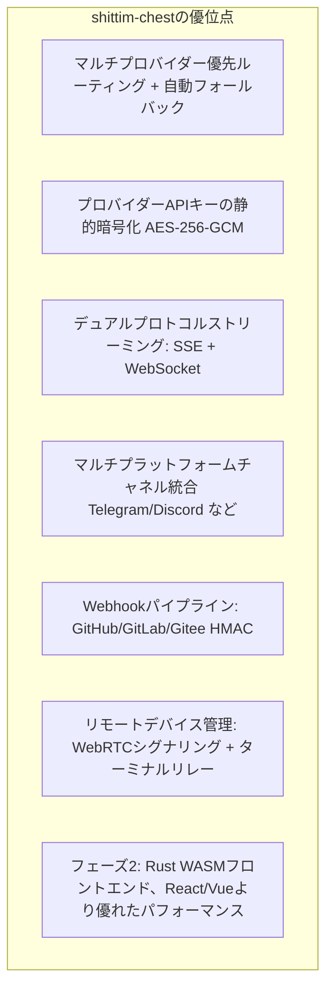

+++
title = "製品ポジショニングと競合状況"
description = """shittim-chestは疎結合のLLM WebUIプラットフォームであり、直接の競合はOpen WebUIやLobeChatなどです。entelecheiaとの統合はオプション機能であり、アーキテクチャ上の前提条件ではありません。"""
lang = "ja"
category = "design"
subcategory = "webui"
+++

# 製品ポジショニングと競合状況

## 概要

shittim-chestは疎結合のLLM WebUIプラットフォームであり、直接の競合はOpen WebUIやLobeChatなどです。entelecheiaとの統合はオプション機能であり、アーキテクチャ上の前提条件ではありません。

## コアポジショニング

| 側面 | 説明 |
| --- | --- |
| 本質 | スタンドアロンのマルチプロバイダーLLMチャットWebUI |
| 競合 | Open WebUI、LobeChat、NextChat |
| entelecheiaとの関係 | 疎結合：JWTプロキシ経由のオプション統合 |
| 独立性 | entelecheiaなしで完全なチャット体験を提供 |

## Open WebUIとの差別化

## entelecheiaとの境界

| shittim-chest | entelecheia |
| --- | --- |
| ユーザー認証 (argon2 + JWT) | ユーザーアイデンティティ + 権限 (RBAC) |
| セッション管理 | エージェントオーケストレーション (scepter) |
| チャットデータ (会話/メッセージ) | Cosmosコンテナランタイム |
| LLMプロバイダー管理 + キー暗号化 | IEPL TypeScript実行エンジン |
| Webhook受信 (HMAC検証 + 転送) | エージェントツール呼び出し |
| フロントエンドレンダリング (arona) | WebSocketエージェントチャネル |
| リモートデバイスセッション + シグナリングリレー | polemosデバイスエージェント |
| マルチプラットフォームチャネル設定 | — |

**主要原則**: shittim-chestは「ユーザー側」データのみを保持し、entelecheiaは「エージェント側」データのみを保持します。両者はJWT認証されたHTTP/WebSocketを介して通信し、互いのデータベースにアクセスすることはありません。

## アーキテクチャ進化ロードマップ

| フェーズ | ステータス | 内容 |
| --- | --- | --- |
| P1-P6 | 完了 | スタンドアロンチャット、認証、プロバイダー管理、Webhook、プロキシブリッジ、デバイス管理 |
| P7 | 計画中 | 音声入出力 (STT Dockerコンテナ + TTSプロキシ) |
| P8 | 計画中 | PWAモバイル + Tauriモバイル |
| P9 | 計画中 | Rust WASMフロントエンド移行 (arona → Tairitsu) |

## 設計理念

1. **スタンドアロンファースト**: すべてのコア機能はentelecheiaに依存しません。`LLM_DEFAULT_PROVIDER_*`環境変数のみでチャットを独立して起動できます。
1. **疎結合統合**: entelecheia統合はオプションのプロキシレイヤーです。ユーザーはLLMチャットのみを使用するか、entelecheia経由でエージェントオーケストレーションを有効にするかを選択できます。
1. **段階的WASM**: Vue 3フロントエンドは「生きた仕様」として最初に提供され、WASM移行には明確な判断基準（フレームワークの成熟度、エコシステムのカバレッジ、開発リソース）があります。
1. **Dockerネイティブ**: すべてのサーバーサイドコンポーネントはbollard Docker APIを介して管理され、docker-composeに依存しません。
