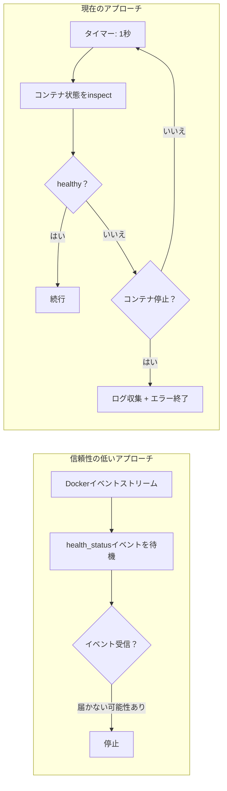

+++
title = "PostgreSQLヘルスチェック戦略"
description = """CLIラッパーは、アプリケーションコンテナを起動する前にPostgreSQLの準備が整っていることを確認する必要があります。このドキュメントは、Dockerイベント（信頼性低）と固定タイムアウト（柔軟性欠如）"""
lang = "ja"
category = "design"
subcategory = "webui"
+++

# PostgreSQLヘルスチェック戦略

## 概要

CLIラッパーは、アプリケーションコンテナを起動する前にPostgreSQLの準備が整っていることを確認する必要があります。このドキュメントは、パッシブポーリングヘルスチェック戦略の背後にある設計判断を定義します — Dockerイベント（信頼性低）と固定タイムアウト（柔軟性欠如）を却下しています。

## Dockerイベントを使用しない理由



Dockerイベントストリームでは、`container`フィルターは特にPGコンテナの再起動後に`health_status`イベントに対して信頼性が低くなります。実際には、イベントが発生せず、CLIが無期限に待機する可能性があります。

## ポーリング戦略

```text
while true:
    sleep 1s
    state = docker.inspect_container(PG)
    if state.health.status == HEALTHY:
        break
    if !state.running:
        bail!(collect_logs(PG))
```

| パラメータ | 値 | 理由 |
| --- | --- | --- |
| ポーリング間隔 | 1秒 | 十分な応答性、inspectのオーバーヘッドなし |
| タイムアウト | なし | ハードタイムアウトなし、PGのコールドスタートに対応 |
| 死亡検出 | 毎ポーリング | コンテナ不在 → 即座にエラー、最後の50行のログを出力 |

## PostgreSQLコンテナのヘルス設定

```rust
HealthConfig {
    test:        ["CMD-SHELL", "pg_isready -U shittim_chest"],
    interval:    5_000_000_000,   // 5秒（ナノ秒）
    timeout:     5_000_000_000,   // 5秒
    retries:     10,
    start_period: 30_000_000_000, // 30秒の初期猶予期間
}
```

| パラメータ | 値 | 理由 |
| --- | --- | --- |
| `pg_isready` | ユーザーレベル | TCPポート検出より信頼性が高く、PGが完全に接続を受け付けていることを確認 |
| `interval: 5s` | 中程度 | 頻繁なリトライとログノイズを回避 |
| `retries: 10` | 高 | マイグレーションとinitdbに時間がかかる可能性あり、十分なリトライ |
| `start_period: 30s` | 長 | pg18のinitdb初回起動は遅くなる可能性あり |

## データボリュームマウントパス

```rust
Mount {
    target: "/var/lib/postgresql",     // pg18の新しいパス
    source: "shittim-chest-pgdata",
    typ: MountTypeEnum::VOLUME,
}
```

pg18はデータディレクトリを`/var/lib/postgresql/data`から`/var/lib/postgresql`に変更しました。誤ったパスを使用すると、起動後にPGがデータを見つけられなくなります。

## マイグレーションリトライ

データベースマイグレーションには独立した5回のリトライロジックがあります：

```text
for retry in 0..5:
    execute docker run --rm ... shittim_chest db-migrate
    if success: break
    sleep 2s
```

`wait_healthy`が返った後でも、PGがまだリカバリを完了している最中のためマイグレーションが失敗する可能性があります。短いリトライがこのクリティカルな時間枠を処理します。

## ログ収集

コンテナがクラッシュした場合、最後の50行のログが自動的に収集されます：

```rust
async fn collect_logs(docker: &Docker, name: &str) -> String {
    docker.logs(name, LogsOptions { tail: "50", stdout: true, stderr: true, .. })
}
```

これはPG起動失敗のデバッグに不可欠です — initdbエラー、権限の問題、ポート競合などはコンテナログでのみ確認できます。
