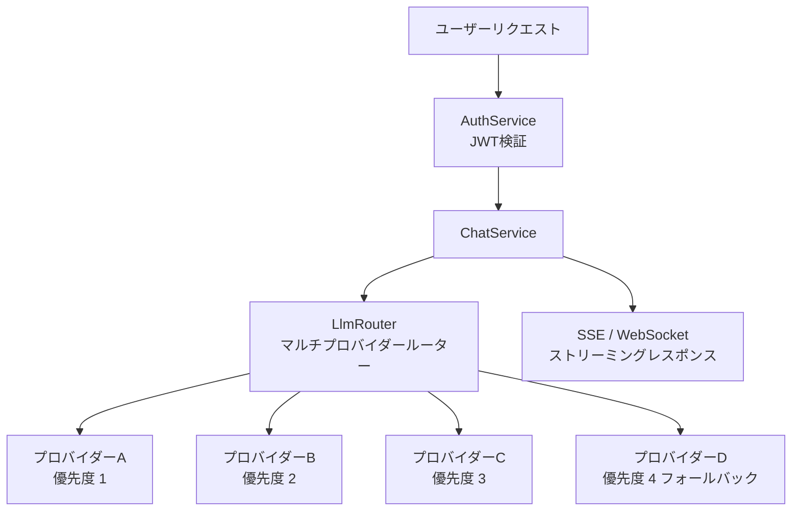
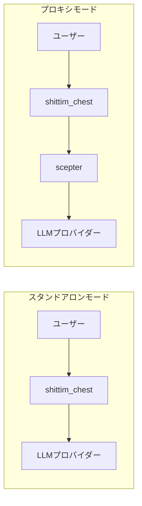

+++
title = "独立LLMアーキテクチャ"
description = """shittim-chestはentelecheiaに依存しない完全に独立したLLMルーティングレイヤーを持ちます。ユーザーは複数のLLMプロバイダーを設定でき、組み込みルーターが優先度と可用性に基づいて自動的に選"""
lang = "ja"
category = "design"
subcategory = "webui"
+++

# 独立LLMアーキテクチャ

## 概要

shittim-chestはentelecheiaに依存しない完全に独立したLLMルーティングレイヤーを持ちます。ユーザーは複数のLLMプロバイダーを設定でき、組み込みルーターが優先度と可用性に基づいて自動的に選択します。これがOpen WebUIに対するshittim-chestのコア差別化能力です。

## アーキテクチャ



## コア機能

### 1. マルチプロバイダー優先ルーティング

```text
各プロバイダーには優先度フィールドがあります（低い数値 = 高い優先度）。
リクエストは最高優先度から最低優先度へ試行されます：
  → プロバイダーA（priority=1）利用可能 → 使用
  → 利用不可 → プロバイダーB（priority=2）利用可能 → 使用
  → 利用不可 → ... → エラー返却
```

### 2. 自動フォールバック

高優先度のプロバイダーがエラー（タイムアウト、レート制限、到達不能）を返した場合、ルーターは自動的に次の利用可能なプロバイダーに切り替え、ユーザーには透過的です。

### 3. APIキー暗号化ストレージ

すべてのプロバイダーAPIキーはAES-256-GCMで静的に暗号化され、`shittim_chest_db`に保存されます。暗号化キーは`ENCRYPTION_KEY`環境変数で提供されます。データベースが侵害されても、APIキーは解読不可能なままです。

### 4. デュアルプロトコルストリーミング

| プロトコル | エンドポイント | ユースケース |
| --- | --- | --- |
| SSE | `/api/chat/stream` | シンプルなHTTPストリーミング、プロキシ互換、ブラウザネイティブサポート |
| WebSocket | `/ws/chat/stream` | 双方向通信、キャンセルとリアルタイムインタラクションをサポート |

### 5. OpenAI互換性

すべてのプロバイダーインターフェースはOpenAIの`/v1/chat/completions`形式に従い、任意のOpenAI API互換サービス（DeepSeek、OpenAI、ローカルOllama/LM Studioなど）との統合を可能にします。

## プロバイダー管理

### 設定ソース

| 方法 | ユースケース |
| --- | --- |
| 環境変数 (`LLM_DEFAULT_PROVIDER_*`) | クイックスタート、単一プロバイダーシナリオ |
| データベースCRUD (`/api/providers/*`) | マルチプロバイダー、動的管理 |
| arona管理パネル | グラフィカル管理 |

### シードプロバイダー

初回起動時に`LLM_DEFAULT_PROVIDER_*`環境変数が設定されている場合、`db-init`が自動的にシードプロバイダーを作成します。追加のプロバイダーは後でarona管理パネルから追加できます。

## スタンドアロンモード vs プロキシモード



| モード | 条件 | 動作 |
| --- | --- | --- |
| スタンドアロン | scepter未設定（または`Proxy: disabled`） | LLMプロバイダーに直接呼び出し |
| プロキシ | scepter URL設定済み | プロキシレイヤーを介してentelecheiaエージェント処理に転送 |

スタンドアロンモードは完全なチャット体験を提供します：会話管理、メッセージ永続化、検索、エクスポート。プロキシモードはエージェントオーケストレーション機能を追加します。

## 技術実装

- **ルーター**: `packages/shittim_chest/src/llm/router.rs`、優先度選択 + フォールバックをサポート
- **クライアント**: `packages/shittim_chest/src/llm/client.rs`、`reqwest` + `rustls`ベース（OpenSSL依存なし）
- **プロバイダーCRUD**: `packages/shittim_chest/src/api/providers.rs`、標準RESTエンドポイント
- **暗号化**: `aes-gcm`クレート、`ENCRYPTION_KEY`環境変数
