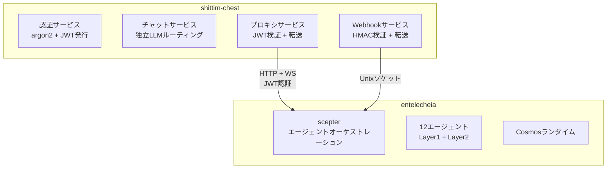

+++
title = "entelecheiaとの疎結合"
description = """shittim-chestとentelecheiaの統合は、JWT認証されたHTTP/WebSocketプロキシブリッジに基づいています。この設計により、shittim-chestはentelecheiaなしで完全に独立して実行でき、必要に応じて"""
lang = "ja"
category = "design"
subcategory = "webui"
+++

# entelecheiaとの疎結合

## 概要

shittim-chestとentelecheiaの統合は、JWT認証されたHTTP/WebSocketプロキシブリッジに基づいています。この設計により、shittim-chestはentelecheiaなしで完全に独立して実行でき、必要に応じてオンデマンドでエージェントオーケストレーション機能を有効にできます。

## 境界設計



## データ所有権

| shittim_chest_db | entelecheia_db |
| --- | --- |
| auth_users（パスワードハッシュ） | user_identities（user_id） |
| sessions（アクティブセッション） | groups |
| refresh_tokens | group_memberships |
| oauth_connections | role_assignments |
| api_keys（暗号化プロバイダーキー） | group_permissions（プロバイダー割り当て） |
| conversations | agent_configs |
| messages | cosmos_state |
| llm_providers（プロバイダー設定） | iepl_state |
| remote_devices（デバイスレコード） | |
| device_sessions | |
| channel_configs | |
| webhook_logs（配信ログ） | |

**原則**: shittim-chestは「ユーザー側」データを保持し、entelecheiaは「エージェント側」データを保持します。`user_id`が両側を結ぶリンケージキーです。

## JWT認証プロトコル

### キー共有

shittim-chestとscepterは同じ`JWT_SECRET`環境変数を介してJWT署名キーを共有します。両側は互いが発行したJWTを独立して検証できます。

### トークン構造

```json
{
  "sub": "user-uuid",
  "groups": ["admin", "developer"],
  "exp": 1710000000,
  "iat": 1709996400
}
```

| フィールド | 説明 |
| --- | --- |
| `sub` | ユーザーUUID（両方のデータベースで共有） |
| `groups` | ユーザーが所属するグループのリスト |
| `exp` | 有効期限（デフォルト1時間） |
| `iat` | 発行時刻 |

### ログインフロー

```text
ユーザー → shittim_chest: POST /api/auth/login
shittim_chest: argon2パスワードを検証
shittim_chest → scepter: GET /api/user/{id}/permissions
scepter → entelecheia_db: グループと権限をクエリ
scepter → shittim_chest: { groups, permissions }
shittim_chest: JWTを発行（アクセス + リフレッシュ）
shittim_chest → ユーザー: トークン
```

## プロキシブリッジング

### HTTPプロキシ

```text
ブラウザ → shittim_chest:80/api/proxy/chat（ヘッダーにJWT）
shittim_chest: JWTを検証
shittim_chest → scepter:8424/api/chat（JWTを転送）
scepter → エージェント → LLM → scepter → shittim_chest → ブラウザ
```

### WebSocketプロキシ

```text
ブラウザ → shittim_chest:80/api/proxy/ws（ヘッダーにJWT）
shittim_chest: JWTを検証
shittim_chest ↔ scepter:8424/ws（双方向転送 + JWT）
ブラウザ ↔ scepter: 全二重エージェントインタラクション
```

### レート制限と監視

プロキシレイヤーで、shittim-chestは以下を担当します：

- レート制限（ユーザーごと / IPごと）
- 使用量ログ
- 接続ライフサイクル管理
- 異常切断時の再接続

## Webhookパイプライン

```text
GitHub/GitLab/Gitee → POST /api/webhook/{source} → HMAC検証 → イベント解析 → Unixソケット → scepter
```

shittim-chestはHMAC検証とイベント解析を処理し、scepterはイベントに基づいてエージェントアクションをトリガーします（例：自動コードレビュー）。

## スタンドアロン動作モード

scepter URLが環境変数で設定されていないか、`SHITTIM_CHEST_SCEPTER_PROXY`が`disabled`に設定されている場合：

- `/api/proxy/*`エンドポイントは503（Service Unavailable）を返します
- `/api/devices/*`エンドポイントは503を返します
- チャットは組み込みLlmRouterを完全に使用します
- その他のすべての機能（認証、チャット、プロバイダー管理、Webhook受信）は正常に機能します

これにより、shittim-chestはentelecheiaなしで完全なスタンドアロンLLM WebUIとしてデプロイできます。
