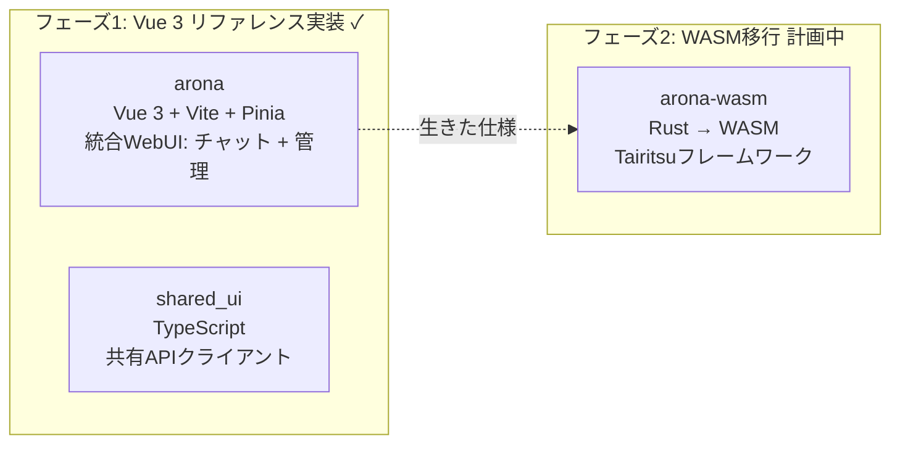
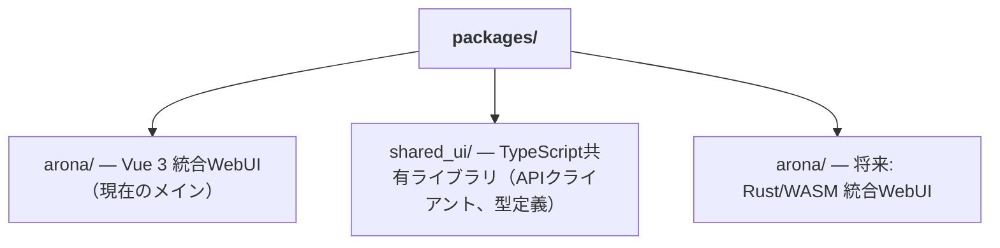

+++
title = "デュアルフロントエンドWASM移行戦略"
description = """shittim-chestは「Vue 3を先に、WASMは後で」という2フェーズのフロントエンド戦略を採用しています。Vue 3バージョンは本番グレードのリファレンス実装として最初に提供され、条件が整った時点でRust/W"""
lang = "ja"
category = "design"
subcategory = "webui"
+++

# デュアルフロントエンドWASM移行戦略

## 概要

shittim-chestは「Vue 3を先に、WASMは後で」という2フェーズのフロントエンド戦略を採用しています。Vue 3バージョンは本番グレードのリファレンス実装として最初に提供され、条件が整った時点でRust/WASMバージョンに移行します。両方のバージョンが並行して動作する期間中、同一のユーザー操作は同一の結果を生成する必要があります。

## フェーズ分割



## 技術スタック比較

| 側面 | フェーズ1（Vue 3） | フェーズ2（WASM） |
| --- | --- | --- |
| 言語 | TypeScript / Vue 3 SFC | Rust |
| フレームワーク | Vite + Pinia + Vue Router | Tairitsu（自社開発） |
| ビルド成果物 | JS/CSSバンドル | WASMバイナリ |
| バンドルサイズ | 大きい | 大幅に小さい |
| 実行時パフォーマンス | 良好 | 優秀（ネイティブに近い速度） |
| 開発者体験 | 即時HMR | コンパイル待ち |
| エコシステムの成熟度 | 成熟 | 初期段階 |

## 「生きた仕様」の原則

Vue 3バージョンは単なる一時的な実装ではなく、WASM移行の**実行可能な仕様**として機能します：

1. **機能の完全性**: WASMバージョンのすべての機能はVue 3バージョンと同一に動作する必要があります
1. **API契約**: 両バージョンは同じREST APIとWebSocketプロトコルを使用します
1. **視覚的一貫性**: 両バージョンは同一の状態で同一のUIをレンダリングします
1. **段階的置き換え**: aronaのチャットと管理機能は独立してWASMに移行できます

## WASM移行の判断基準

条件が整うまでWASMへの移行は開始されません。判断基準：

| 条件 | 説明 |
| --- | --- |
| Tairitsuフレームワークの成熟度 | コンポーネントライブラリ、ルーティング、状態管理、i18nなどのインフラが完了していること |
| WASMエコシステムのカバレッジ | `web-sys` / `wasm-bindgen`が必要なWeb APIをサポートしていること |
| 開発リソース | 両バージョンを維持しながら移行を進めるのに十分な人員 |
| パフォーマンス要件 | Vue 3バージョンが実際のシナリオでパフォーマンスボトルネックに遭遇すること |

## フロントエンドパッケージ構造



`shared_ui/`には共有フロントエンドコードが含まれます：

- APIクライアント（認証、チャット、プロバイダー管理など）
- 認証ユーティリティ（JWT保存、リフレッシュ、インターセプター）
- 型定義（ドメイン列挙型、リクエスト/レスポンス型）

## フロントエンド開発コマンド

```bash
just build-frontend  # 両方のフロントエンドをビルド（pnpm build:all）
dev.py               # ファイル変更を監視 + 自動再ビルド
```

開発モードでは、`dev.py`がソースファイルを監視し、変更時に`pnpm build`を実行します。バックエンドは静的アセットとAPIエンドポイントの両方を同じポートで配信します — 別の開発サーバーやプロキシは不要です。

## 設計原則

1. **Vue 3が機能を先に提供**: WASMを待たない。ユーザーは今日から完全な機能のチャットと管理インターフェースを使用できます。
1. **WASMは強化であり置き換えではない**: 移行は既存のユーザーに影響しません — 両バージョンは同じバックエンドAPIを使用します。
1. **フレームワークに依存しないバックエンド**: shittim_chestバックエンドはフロントエンドの実装を意識しません。任意のHTTP/WSクライアントが統合できます。
1. **Tairitsuは依存関係であり内部開発ではない**: WASM移行の開始は外部のTairitsuフレームワークの成熟度に依存します。
