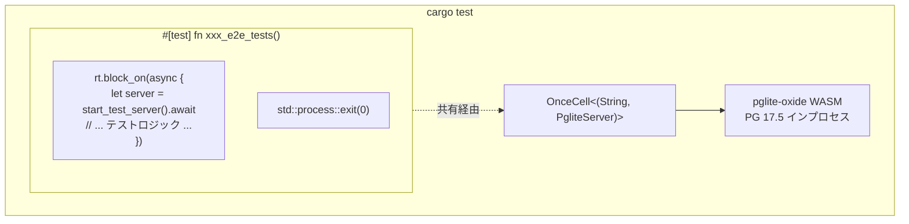

+++
title = "組み込みテストデータベース（pglite-oxide）"
description = """shittim-chestはすべての統合テストとE2Eテストに[pglite-oxide](https://crates.io/crates/pglite-oxide)を組み込みPostgreSQLとして使用します。外部のPostgres、Docker、`testcontainer"""
lang = "ja"
category = "design"
subcategory = "webui"
+++

# 組み込みテストデータベース（pglite-oxide）

## 概要

shittim-chestはすべての統合テストとE2Eテストに[pglite-oxide](https://crates.io/crates/pglite-oxide)を組み込みPostgreSQLとして使用します。外部のPostgres、Docker、`testcontainers`は不要で、`cargo test`コマンド1つで任意のマシン上でテストが実行されます。

## 設計の動機

以前は、統合テストが`postgresql_embedded`に依存しており、実行時に完全なPostgreSQLバイナリ（~100 MB）をダウンロードしていました。これにより起動の遅延、プラットフォーム固有の障害、CIの不安定性が発生していました。pglite-oxideはPostgreSQL 17.5をwasmerランタイム経由でWASMモジュールとしてパッケージ化し、インプロセス、ポータブル、高速（~96 msコールドスタート）です。

## アーキテクチャ



## 主要判断

| 判断 | 理由 |
| --- | --- |
| `pglite-oxide`（WASM）を`postgresql_embedded`（ネイティブバイナリ）より選択 | ~100 MBのダウンロード不要、プラットフォーム固有のPGバイナリ不要、~96 ms起動 |
| `pglite-oxide`を`pglite-rust-bindings`より選択 | crates.ioで公開（v0.5.0）、高速起動、拡張サポート付きの成熟したビルダーAPI |
| `tower::ServiceExt::oneshot`を`reqwest`より選択 | sqlxプールのバックグラウンドタスクとhyper HTTPサーバー間のtokioランタイムデッドロックを回避 |
| `std::process::exit(0)`付きの単一`#[test]`ランナー | sqlx `PgPool`はtokioランタイムを維持する永続的なバックグラウンドタスク（アイドルリーパー、ヘルスチェック）を生成します。`exit(0)`がこのハングを回避します |
| `max_connections=1` | PGliteの基本的な制限 — 単一接続のみ |
| `OnceCell<(String, PgliteServer)>` | 同じバイナリ実行内のサブテスト間で共有PGインスタンス；`PgliteServer`は生存し続ける必要があります（ドロップ不可） |
| `pglite-oxide`を`[dev-dependencies]`のみに | wasmerランタイムは本番ビルドに漏洩してはいけません |

## テストハーネスパターン

```rust
// tests/common/mod.rs
static PG: OnceCell<(String, PgliteServer)> = OnceCell::const_new();

async fn ensure_pg_url() -> String {
    PG.get_or_init(|| async {
        let server = PgliteServer::builder()
            .start()
            .expect("Failed to start pglite-oxide");
        let url = server.database_url();
        // 接続、マイグレーション実行、初期接続を閉じる
        (url, server)
    }).await.0.clone()
}

pub async fn start_test_server() -> TestServer {
    let db_url = ensure_pg_url().await;
    let db = Database::connect(/* max_connections=1 */).await;
    // AppState、Routerを構築、tower oneshotをラップしたTestServerを返す
}
```

```rust
// tests/xxx_tests.rs
# [test]
fn xxx_e2e_tests() {
    let rt = tokio::runtime::Runtime::new().unwrap();
    rt.block_on(async {
        let mut server = common::start_test_server().await;
        // ... server.request()を使用したすべてのサブテスト ...
    });
    std::process::exit(0);
}
```

## 作成されるテーブル

テストセットアップ中にSeaORMマイグレーションを介して13個のテーブルすべてが作成されます：

`auth_users`、`sessions`、`api_keys`、`oauth_connections`、`channel_configs`、`channel_messages`、`channel_pairings`、`conversations`、`messages`、`llm_providers`、`remote_devices`、`device_sessions`、`system_settings`、`workspace_sessions`

## PGliteの制限

1. **単一接続**: `max_connections`は1である必要があります。同じPGliteインスタンスへの複数のプールはハングします。
1. **厳密な型キャスト**: PGliteは標準PostgreSQLよりも厳密です。`uuid_column = text_value`のようなクエリは失敗します — 常に明示的にキャストしてください。
1. **並行テストランナー不可**: 1つのPGliteインスタンスを共有するすべての非同期テストは、単一の`#[test]`関数内で順次実行する必要があります。
1. **プールのドロップ時ハング**: `sqlx::PgPool::close()`は無期限にハングする可能性があります。`std::process::exit(0)`を使用してテストプロセスを終了してください。
