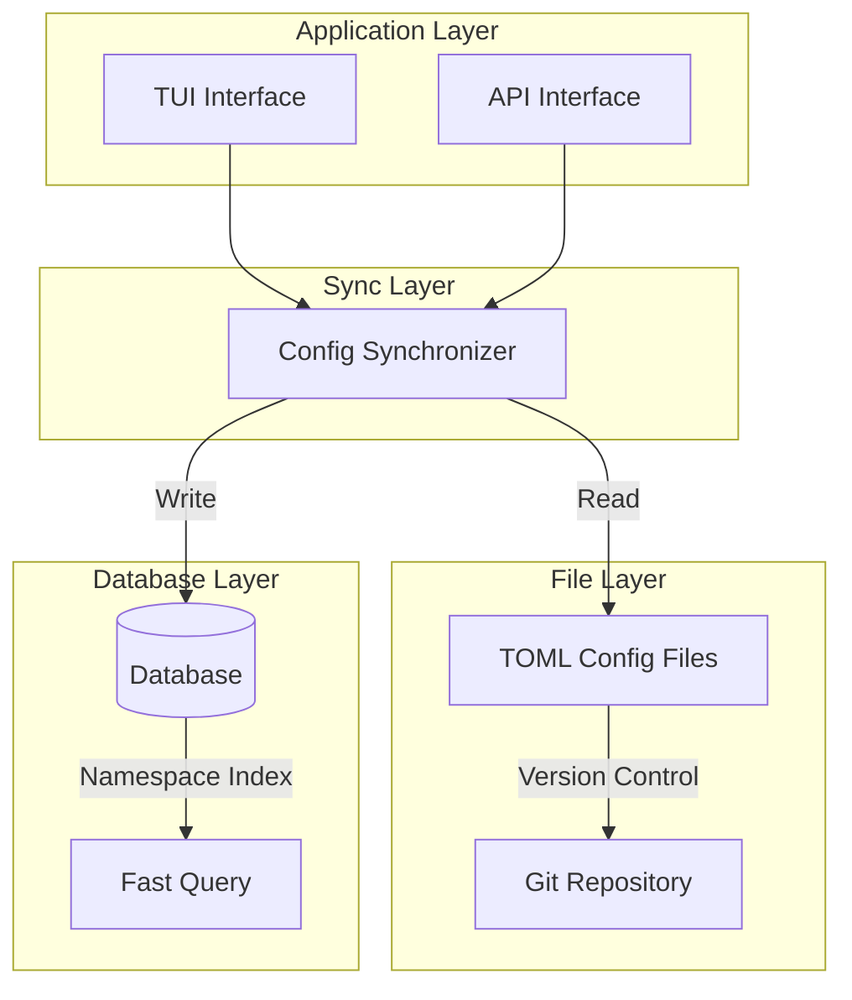
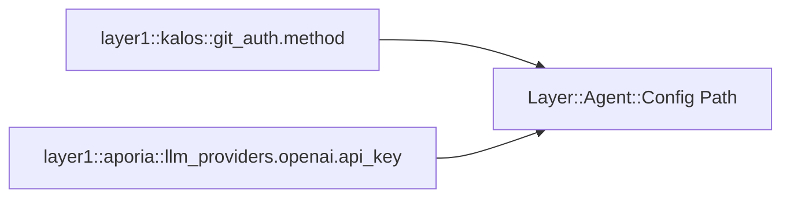
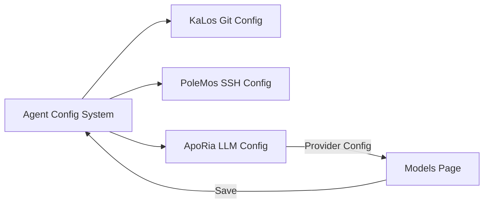

# エージェント設定システム設計

## 概要

エージェント設定システムは、統一された設定管理メカニズムを提供し、TOMLファイルストレージとデータベース永続化をサポートし、設定バージョン管理とホットリロードを実装します。

## 基本原則

### 二層ストレージアーキテクチャ



### 設定名前空間

階層的な名前空間設計を採用：



## アーキテクチャ設計

### 設定ライフサイクル

```mermaid
stateDiagram-v2
    [*] --> Default: System Defaults
    Default --> FileConfig: Load TOML
    FileConfig --> DbSync: Sync to Database
    DbSync --> Active: Configuration Active

    Active --> Updated: User Modification
    Updated --> Validated: Format Validation
    Validated --> DbSync: Save Changes

    Active --> HotReload: Hot Reload Trigger
    HotReload --> Active: No Restart Required
```

### TUI設定インターフェース

```mermaid
graph TB
    subgraph Agent Document Modal
        Tabs[Overview | Config | MCP | Skills]
        Tabs --> Content[Content Area]
    end

    subgraph Configuration Page
        Groups[Configuration Group List]
        Groups --> Group1[Git Auth Config]
        Groups --> Group2[Source Management Config]
        Groups --> AddGroup[Add New Config Group]
    end

    Content --> Groups
```

## 他モジュールとの関係



## 設計上の考慮事項

### セキュリティ

- 機密設定の暗号化保存
- アクセス権限制御
- 設定変更監査

### 拡張性

- カスタム設定タイプのサポート
- 柔軟な検証ルール
- プラグイン可能な設定ハンドラ

### 一貫性

- ファイルとデータベースの同期
- 設定バージョン管理
- 競合検出と解決
