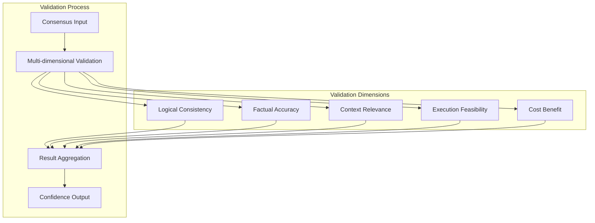
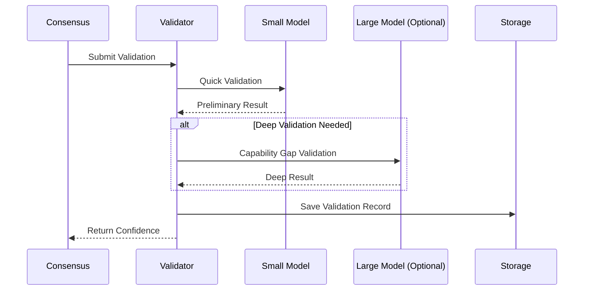
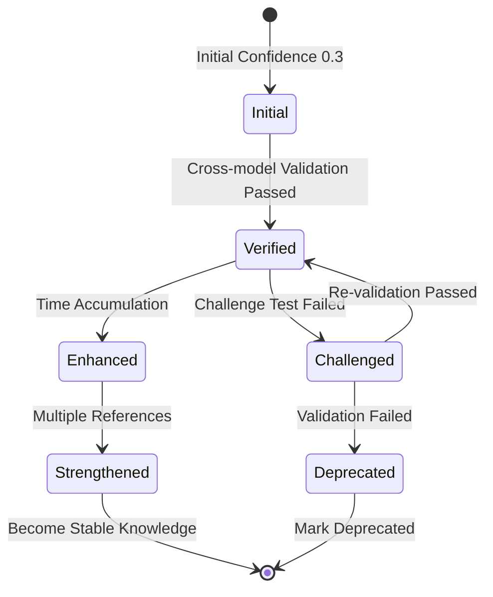
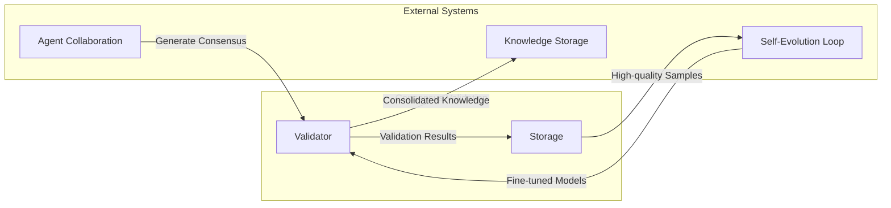

# 合意検証メカニズム

## 概要

合意検証メカニズムは、マルチエージェント協調システムの中核コンポーネントであり、複数のエージェントによって形成された合意の信頼性と正確性を検証・評価し、システムの出力品質を確保します。

## 基本原則

### 多次元検証フレームワーク

システムは5つの次元を通じて包括的な検証を実行します：

### 検証次元の説明

| 次元 | 検証対象 | 主要指標 |
| --- | --- | --- |
| 論理的一貫性 | 合意が自己矛盾なく一貫しているか | 矛盾なし、完全な推論 |
| 事実の正確性 | 事実に基づく記述が正しいか | 既知の知識と一致 |
| コンテキスト関連性 | 現在のタスクに関連しているか | 関連性スコア |
| 実行可能性 | 計画が実行可能か | 操作性評価 |
| 費用対効果 | 費用対効果が妥当か | ROI評価 |

## アーキテクチャ設計

### 段階的検証プロセス

### 信頼度蓄積メカニズム

## 他システムとの統合

## 設計上の考慮事項

### コスト管理

- 検証には小規模モデルを優先的に使用
- 必要な場合のみ大規模モデルを有効化
- 検証結果のキャッシングと再利用

### 品質保証

- 多次元クロス検証
- 時間蓄積による信頼性向上
- チャレンジテストによる潜在的問題の発見

### 追跡可能性

- 完全な検証履歴記録
- 監査と遡及のサポート
- 統計分析のサポート
