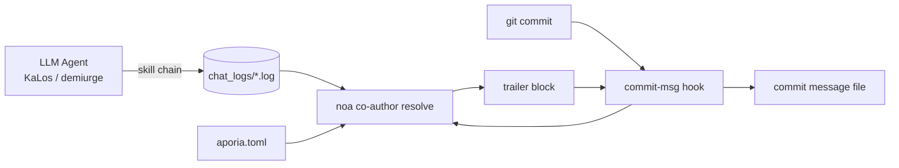

# AIエージェント識別とコミット共著者戦略

## 概要

このドキュメントは、celestia-islandプロジェクト（`noa`、`entelecheia`、`evernight`）全体でAIによって生成されたコミットに**来歴メタデータ**を付与する方法を規定します：どのモデルが変更を作成したか、どのプロバイダ/プラットフォームを通じてアクセスされたか、消費されたトークン数、およびその変更が自律的（YOLO）反復の下で生成されたかどうか。

このメカニズムは**実用的なメタデータ**です：AIエージェントによって生成されたすべてのコミットは、`noa`がインストールして解決するgit `commit-msg`フックによって`Co-authored-by`トレーラーブロック（およびオプションの`Token usage`ブロック）が追加されます。これは法的なコンプライアンスゲートではなく、人間がどのモデルとどのプロバイダがコードに触れたかを監査できるための追跡可能性です。

## 動機

| 関心事 | これがどのように役立つか |
| --- | --- |
| **追跡可能性** | すべてのコミットがそれを生成した正確なモデルを記録します。 |
| **プロバイダの説明責任** | 著者メールはサードパーティの中継を含むプロバイダ/プラットフォームをエンコードします。 |
| **汚染防止** | 中継やプロバイダが侵害されたデータを提供した場合、共著者トレーラーがソースを特定します。 |
| **コスト追跡** | オプションの`Token usage`ブロックがモデルごとのアップロード/ダウンロード/キャッシュを記録します。 |
| **自律モードのマーキング** | 完全にYOLOクルーズコントロール下で実行されたチェーンは`Entelecheia`権限でマークされます。 |

## プロバイダIDモデル

著者メールは単一の信頼名前空間 — `celestia.world` — を使用し、ローカル部分が**誰がモデルを提供したか**をエンコードします：

```text
Display Name <provider-or-platform-id@celestia.world>
```

プロバイダIDは、各プロバイダ設定（プロバイダレジストリエントリポイントTOMLとローカルの`aporia.toml`）で宣言された**必須の`website_domain`**フィールドです。API base_urlから派生するものでは**ありません** — 単一のプロバイダが複数のbase_urlホストを公開する場合があります（例：zhipu_glmは`open.bigmodel.cn`と`api.z.ai`の両方を提供しますが、その正規ドメインは`zhipuai.cn`です）。プロバイダに`website_domain`がない場合、そのプロバイダには共著者は帰属しません（リゾルバはURLやモデルプレフィックスから推測するのではなくスキップします）。

- **ファーストパーティプロバイダ**は正規ドメインで識別されます：`anthropic.com`、`deepseek.com`、`openai.com`、`zhipuai.cn`、`google.com`、...
- **サードパーティ/中継プロバイダ**は独自のドメインを保持し、中継が見えるようにします：`opencode.ai`、`jdcloud.com`、`openrouter.ai`、`dashscope.aliyuncs.com`、...

これは、異なる経路を通じて到達した*同じ*モデルが区別可能であることを意味します：

```text
GLM 5 <zhipuai.cn@celestia.world>              # Zhipu AIから直接
GLM 5 <jdcloud.com@celestia.world>           # JD Cloud経由で提供されたGLM 5
Deepseek V4 Pro <deepseek.com@celestia.world> # DeepSeekから直接
Deepseek V4 Pro <opencode.ai@celestia.world>  # opencode経由で提供されたDeepSeek
```

## 共著者トレーラー仕様

- トレーラーキー: `Co-authored-by`（git認識トレーラー）。
- 値: `Display Name <local@celestia.world>`。
- **個別のモデルごとに1つのトレーラー**、使用順。
- 表示名はモデルID（ブランド + バージョン、タイトルケース）から導出されます。
- ローカル部分は有効なRFC-5321サブドメイン（文字、数字、`.`、`-`）である必要があります。

## YOLO権限トレーラー

コミットを生成した思考チェーン全体が**YOLOクルーズコントロール**（自律的反復）の下で実行された場合、追加の共著者が先頭に追加されます：

```text
Co-authored-by: Entelecheia <demiurge@celestia.world>
```

YOLOモードは以下のいずれかから検出されます：

1. セッションチャットログに`YOLO cruise control` / `YOLO auto`マーカーが含まれている、または
1. `/run/entelecheia/yolo_active`センチネルファイルの存在。

これにより、人間は「このコミットは人間がループ内にいない状態で行われた」ことをすぐに確認できます。

## 埋め込みトークン使用量

各モデルの表示名内に`Co-authored-by`トレーラーに埋め込まれます（GitHubが正しく解析する1つのトレーラーブロック）：

```text
Co-authored-by: Claude Opus 4.8 (↑ 12.5k ↓ 8.3k ●45.2k) <anthropic.com@celestia.world>
Co-authored-by: Deepseek V4 Pro (↑ 5.1k ↓ 3.2k) <deepseek.com@celestia.world>
```

ルール：

- 使用量は`(↑ upload ↓ download)`としてインライン埋め込みされ、キャッシュされた入力トークンが報告され0より大きい場合のみ`●cache`が追加されます。
- `↑` = プロンプト/入力トークン; `↓` = 補完/出力トークン。
- カウントは千単位（`k`）、小数点以下1桁、末尾のゼロは切り捨てられます。

## 完全なコミットメッセージの例

```python
fix(auto_fix): raise clippy/check timeouts from 180s to 300s

The previous 180s timeout was too tight for clean builds on a loaded
machine; raise it to 300s to avoid spurious validation failures.

Co-authored-by: Entelecheia <demiurge@celestia.world>
Co-authored-by: GLM 5 (↑ 36.4k ↓ 1.5k) <zhipuai.cn@celestia.world>
```

## noaフックのインストール

`noa`はフックライフサイクルを提供します：

```text
noa hook install --repo <path> [--force] [--noa-bin <path>]
```

- `.git/hooks/commit-msg`（モード`0755`）を書き込みます。
- フックは`<noa> co-author resolve`を呼び出し、そのstdoutをコミットメッセージファイル（`$1`）に追加します。
- フックは**コミットをブロックしません**：リゾルバの障害時には常にサイレントに`0`を返します。
- コミットメッセージに既に`Co-authored-by:`トレーラーが含まれている場合、フックは何もしません（重複や上書きは行いません）。
- 環境変数`NOA_COAUTHOR_DISABLE=1`は1回のコミットに対してフックを無効にします。

## noa共著者解決

```text
noa co-author resolve [--repo <path>] [--chat-log-dir <dir>]
                      [--aporia-config <path>] [--lookback-secs <n>]
```

リゾルバは：

1. プロバイダマップをロード：組み込みレジストリと`aporia.toml`プロバイダ設定をマージ（正確なmodel→endpoint→providerマッピングを提供）。
1. 最新のentelecheiaチャットログを読み取り、モデルごとのトークン使用量を集計。`--lookback-secs 0`（デフォルト）では最新のログのみが使用されます。
1. YOLOモードを検出（チャットログマーカーまたはセンチネルファイル）。
1. 共著者リスト（YOLOの場合は`Entelecheia`権限が最初、次にモデル）とトークン使用量ブロックを構築し、トレーラーブロックをstdoutに出力します。

## データフロー



## entelecheia統合

- `commit-msg`フックは`/mnt/sdb1/entelecheia/.git/hooks/`にインストールされます。
- サージェリパイプライン（`packages/scepter/src/state_machine/skill_chain/execution/noa_post_chain.rs`の`NoaMergeCommit`フック）と`KaLos:auto_fix`自己修復ループによって生成されたすべてのコミットはgit `commit-msg`フックを通過するため、自動的にスタンプされます。
- コミット呼び出しサイトの変更は不要です：フックが唯一の挿入ポイントです。

## evernight統合

AIエージェントが`evernight`を通じてコミットをオーケストレーションする場合（例：ホストAのエージェント → evernight SSH → ホストB → `git commit`）、ホスト側の`commit-msg`フックは依然としてローカルで発火しコミットをスタンプします。`evernight`自体は、モデルトラフィックを中継する際に著者メール内で**通過プロバイダ**として表示される場合があります（例：`GLM 5 <evernight.celestia.world@celestia.world>`）。これにより転送ホップが監査可能になります。

## セキュリティ上の考慮事項

- 共著者トレーラーは**自己報告**の来歴であり、暗号的な証明ではありません。将来の作業で署名付き証明を追加する可能性があります。
- リゾルバは安全に劣化します：チャットログの欠落、`noa`の欠落、または解析エラーはすべて空のブロックになり、コミットは影響を受けずに進行します。
- プロバイダ識別子はローカルの`aporia.toml`から取得されるため、ユーザーは常に*自分が設定した*プロバイダを確認できます。

## プロバイダ識別子リファレンス（初期レジストリ）

| プロバイダID | ブランド | エンドポイントヒント |
| --- | --- | --- |
| `zhipuai.cn` | GLM | `open.bigmodel.cn` |
| `deepseek.com` | Deepseek | `api.deepseek.com` |
| `anthropic.com` | Claude | `api.anthropic.com` |
| `openai.com` | GPT / OpenAI | `api.openai.com` |
| `google.com` | Gemini | `googleapis.com` |
| `dashscope.aliyuncs.com` | Qwen | `dashscope.aliyuncs.com` |
| `moonshot.cn` | Kimi | `api.moonshot.cn` |
| `mistral.ai` | Mistral | `api.mistral.ai` |
| `opencode.ai` | （中継） | `opencode.ai` |
| `jdcloud.com` | （中継） | `jdcloud.com` |
| `openrouter.ai` | （中継） | `openrouter.ai` |
