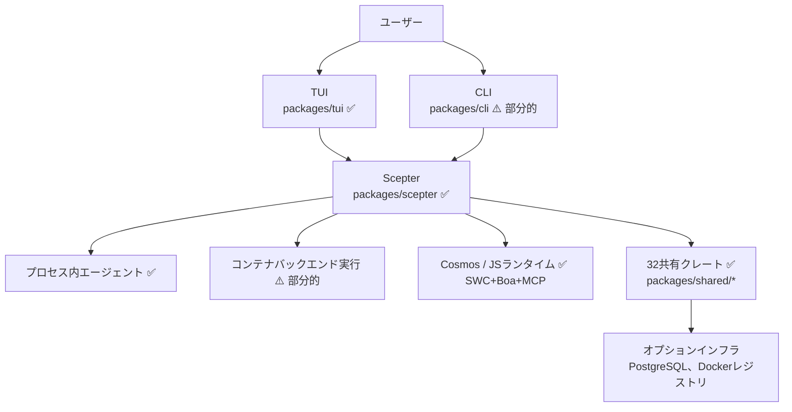
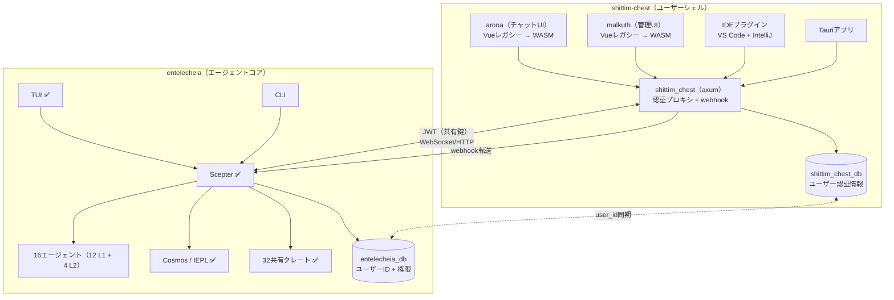
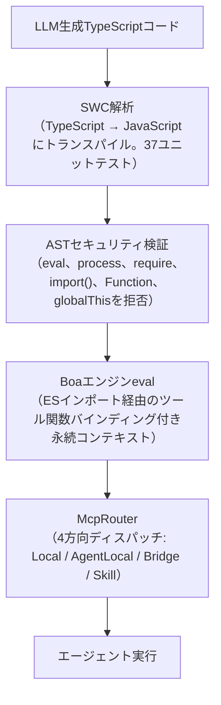
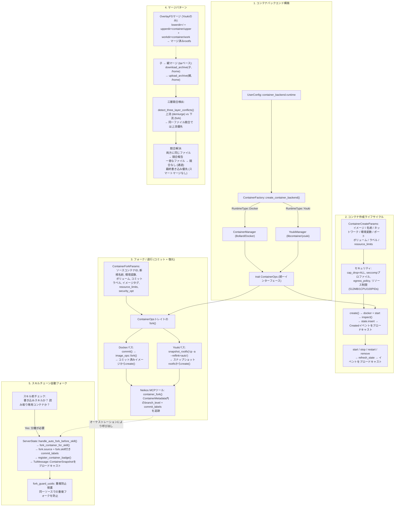
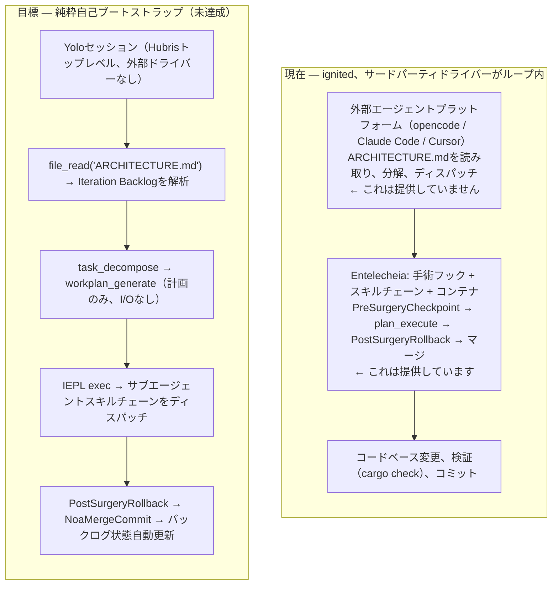
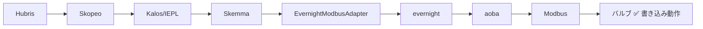
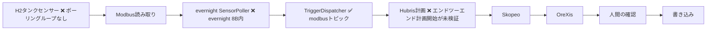
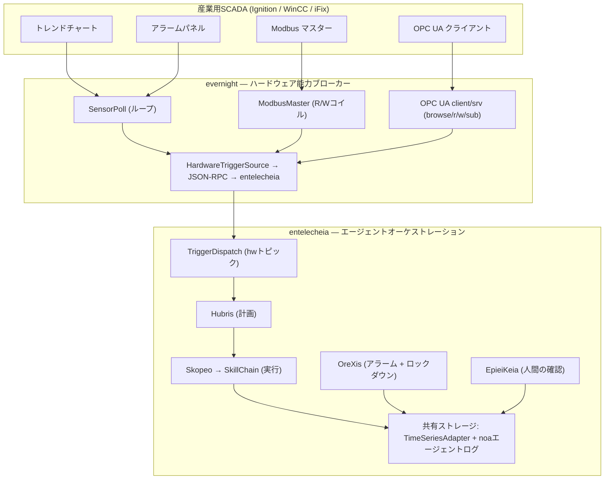

# アーキテクチャ

> **バージョン**: 0.2.0 — 初期開発段階、プロダクション対応ではありません。
> **最終確認日**: 2026-06-17（詳細分析 — 実際のコードに基づき再調整）
> 本文書は実装済みコードと意図された設計の両方を説明しています。
> デプロイメントの判断を下す前に、[現在のギャップ](#現在のギャップ)セクションをお読みください。

## リポジトリ分割

Entelecheiaは大規模な分割を完了しました：ユーザー向けシェル層は兄弟プロジェクト **shittim-chest**（`../shittim-chest`）に移行されました。Entelecheiaは現在、マルチエージェントオーケストレーションコアに専念しています。

| リポジトリ | 範囲 |
| --- | --- |
| **entelecheia** | Scepterオーケストレーション、16エージェント（12 L1 + 4 L2）、Cosmos/IEPLランタイム、32共有クレート |
| **shittim-chest** | arona（チャットUIフロントエンド）、malkuth（管理UI）、`shittim_chest`バックエンド（axumプロキシ + 認証 + webhook）、IDEプラグイン、Tauriアプリ |

## 現在の範囲

Entelecheiaは`packages/scepter`（オーケストレーションサーバー）を中心とした**56クレート**のRustワークスペースで、`packages/shared/`配下の**32共有クレート**（旧モノリシッククレートから完全に分解。5つの計画されたサブクレートは実体化されず、その機能は兄弟クレートにインライン化）、および`packages/tui`（ターミナルUI）から構成されます。TUIは最も完成度の高いユーザーインターフェースです。`packages/cli`にはサービス管理、チャット、タイムラインのコマンドがあります。

以下のコンポーネントは**shittim-chestに移行**され、本リポジトリから削除されました：

- `packages/webui`（HTTP/静的ホスト、WebSocketブリッジ）— 削除
- `packages/webui_frontend`（WASMフロントエンド）— 削除（フェーズ1）
- `packages/ide/vscode`（VS Code拡張）— 削除（フェーズ1）
- `packages/ide/idea`（IntelliJプラグイン）— 削除（フェーズ1）
- `packages/app/tauri*`（Tauriデスクトップ/モバイルアプリ）— 削除（フェーズ1）
- TUI/CLI/Scepter/共有クレート内のすべてのWebUI状態、コマンド、レンダリング — 削除（フェーズ2）

本プロジェクトは大規模な分解を経ました：旧モノリシック`packages/shared`クレート（38K行、187 .rsファイル）は、焦点を絞ったサブクレートに完全に溶解されました。初期の階層図に現れた5つのクレート境界は独立したクレートとして実体化されず、その意図された機能は他のクレート内に存在します（例：ドメイン列挙型は`shared-domain-agent`にインライン化、スレッド型は`shared-state-types`にインライン化）。すべての内部依存関係宣言は、バージョンの一貫性のために`workspace = true`を使用しています。

## コンポーネント現実チェック

| コンポーネント | 実装済み | 設計のみ/スタブ | 判定 |
| --- | --- | --- | --- |
| **Scepter**（オーケストレーション） | 認証/RBAC、プロバイダールーティング、エージェントライフサイクル、スキルチェーン実行、WebSocket/HTTPエンドポイント、キー暗号化。49ソースファイルにわたる351ユニットテスト。`AppState`は5つのサブ状態に対して`FromRef`実装を持つ。エージェントライフサイクルハンドラは`State<Arc<Persistence>>`を使用。 | 完全なAPIサーフェス。バッチプロセッサは定義済みだが未インスタンス化。 | 🟢 本物 |
| **TUI** | 完全なライフサイクル：スプラッシュ、Docker初期化、タイムライン、エージェントモーダル、i18n（8言語）、プロバイダー設定、テーマサポート。47ソースファイルにわたる329ユニットテスト。`ComponentStore`は5つのサブ構造体に分割。AppStateは6フィールドに削減。Unixソケット（推奨）またはWebSocketフォールバック経由で接続。 | Scepter APIとの機能同等性。`CancelRequest`/`ExecuteSudoCommand`は未配線。 | 🟢 本物 |
| **CLI** | サービス管理、チャット、タイムライン、エージェントライフサイクルコマンド。28ユニットテスト。 | TUIとの機能同等性なし | 🟡 部分的 |
| **WebUI** | 削除 — shittim-chestに移行 | — | ✅ 完了 |
| **WebUI フロントエンド** | 削除 — shittim-chestに移行 | — | ✅ 完了 |
| **Cosmos / JSランタイム** | Boaエンジン、ESモジュールインポートディスパッチ（`__native_dispatch`内部解決）、名前空間生成、サーキットブレーカー+リトライ付きMcpRouter。`#[derive(TS)]`からの`.d.ts`自動生成によりTypeScript型ファイルを生成。50ユニットテスト。 | SWC TypeScriptトランスパイルパイプラインが実装・テスト済み（37ユニットテスト）。完全自動パイプライン（LLM出力 → SWC → Boa）は`shared_iepl::client`経由で`in-process-transpile`機能フラグで橋渡し可能。 | 🟢 アクティブ |
| **16エージェント（12 L1 + 4 L2）** | 全16エージェントがMCPツール実装付きでコンパイル。合計147 MCPツール — **すべて本物**。コードベースに`unimplemented!()`または`todo!()`マクロはゼロ。 | Classic SEツールはメタデータで`maturity: Stub`とマークされているが本物の実装あり（cargo clippy、eslint、pylint、go vetサブプロセス呼び出し。コードメトリクス、関数抽出リファクタリング）。 | 🟢 アクティブ |
| **Layer2: Web Automation** | 11 MCPツール — すべてWebDriverプロトコル経由の本物の実装：セッション管理、ナビゲーション、スクリーンショット、スクリプト実行、コンソール/ネットワークログ、キーボード、マウス、録画。10ツールが`maturity: Experimental`。 | — | 🟢 アクティブ |
| **Layer2: Classic SE** | 7 MCPツール — すべて本物の実装：static_analyze（cargo clippy/eslint/pylint/go vet）、code_review（長い関数、深いネスト、マジックナンバーを検出）、quality_check（LOC、複雑度、段階評価）、refactor_suggest、lsp_diagnose、lsp_symbols、lsp_refactor（本物のリネームと関数抽出）。2ユニットテスト。 | LSPリファクタのインライン操作プレビューのみ（完全解決にはLSPサーバーが必要）。 | 🟢 アクティブ |
| **Layer2: Industrial IoT** | 7 MCPツール — すべて本物の実装：modbus_read、modbus_write、s7comm_probe、serial_discover、opcua_browse、opcua_read、opcua_write。産業用プロトコル通信（Modbus RTU/TCP、Siemens S7comm、OPC UAクライアント）。`maturity: Experimental`。 | SkeMma/PoleMosからL2統合の一環として移行。 | 🟢 アクティブ |
| **Layer2: Remote Operations** | 16 MCPツール — すべて本物の実装：SSHセッション管理、リモートコマンド実行、ファイル転送（SFTP）、ホスト情報収集、GUI自動化（X11/VNCスクリーンショット、入力、ナビゲーション）、システムモニタリング。`maturity: Experimental`。 | SkeMma/PoleMosからL2統合の一環として移行。 | 🟢 アクティブ |
| **その他のLayer2設計** | 計画された4つのL2エージェントがすべて実装されました。`res/prompts/domain_agents/`にはすべての実装済みエージェントの設定/スキルドキュメントが含まれます。 | `docs/plans/`は作成されず | 🟢 アクティブ |
| **コンテナ分離** | 二層ランタイム：Docker/Podman（外部オーケストレーション）via Bollard、Youki/libcontainer（内部サンドボックス）via libcontainer。非rootユーザー、cap_drop=ALL、no-new-privileges、専用Dockerネットワーク、UnixソケットIPC、リソース制限（512MB/1CPU/100 PIDs）をcreate、fork、merge、recreate時に適用。カスタムseccompプロファイル。fork/commit/snapshotは両バックエンドで完全に機能。 | AppArmorプロファイル未実装。`read_only_rootfs`はデフォルトで無効。 | 🟡 部分的 |
| **メモリ / RAG** | APIバックエンド埋め込み（OpenAI互換、SHA-256ハッシュフォールバック、ONNX fastembed BGE-M3）。3つの埋め込みバックエンドが完全実装。PgVectorストア、インメモリベクトルドキュメント、グラフ走査、RagContextBufferによるアンビエントコンテキスト注入。39ユニットテスト。 | 埋め込み→RAG接続は分離（呼び出し元が事前計算済み埋め込みを提供）。PgVectorパスはインメモリフォールバックより新しくテストが少ない。RAGサブスクリプション同期は予約済み（未実装）。 | 🟡 部分的 |
| **IEPLパイプライン** | Boaエンジン + MCPブリッジ + 名前空間フィルタリング + サーキットブレーカー。SWC TypeScript解析が実装・テスト済み（37ユニットテスト）。`.d.ts`自動生成が運用可能。IEPLコード生成（Rust型 → TS宣言）が配線済み。TS→JSトランスパイルは`shared_iepl::client`経由で利用可能（プロセス内またはサブプロセスモード）。 | SWC→BoaチェーンはCosmosコンテナ実行パスに未統合（事前除去済みJSを期待）。 | 🟡 部分的 |
| **IDE統合** | 削除 — shittim-chestに移行 | — | ✅ 完了 |

## アーキテクチャ図

### 現在



### 目標（分割後）



凡例: ✅ 動作中 | ⚠️ 部分的に実装 | 🔴 スタブ/設計

## クレート依存関係レイヤー

32の共有クレートは階層化された依存関係グラフで構成されています：

```mermaid
block-beta
    columns 1
    block:L0["レイヤー0（リーフ）"]:1
        shared-core shared-logging shared-macros
    end
    block:L1["レイヤー1"]:1
        shared-domain-enums shared-mcp-types shared-text shared-concurrent
    end
    block:L2["レイヤー2"]:1
        shared-config shared-agent-registry shared-state-types
    end
    block:L3["レイヤー3"]:1
        shared-domain-agent shared-container shared-domain-agent-lifecycle shared-domain-agent-runtime
        shared-domain-thread-types shared-domain-toolchain shared-infra-utils
    end
    block:L4["レイヤー4"]:1
        shared-state-sync shared-domain-skills shared-hooks shared-domain-auth shared-container-runtime
        shared-domain-skills-permissions shared-timeline shared-iepl
    end
    block:L5["レイヤー5"]:1
        shared-llm-provider shared-prompt shared-custom-agent shared-storage
        shared-infra-jsonrpc shared-infra-services shared-e2e-events shared-adapter shared-plugin_host
        shared-rag shared-embedding shared-security-policy
    end
    L0 --> L1 --> L2 --> L3 --> L4 --> L5
```

利用者（scepter、エージェント、tui）は個々のサブクレートから直接インポートします（例：`_shared_domain_agent`、`_shared_llm_provider`）。薄い集約クレートは存在しません — 旧モノリシック`shared`は完全に溶解されました。すべての内部依存関係はバージョン一貫性のために`workspace = true`宣言を使用しています。

> **注意:** 上図は6レイヤーにわたる37のクレートスロットを示していますが、コンパイル可能なワークスペースメンバーとして存在するのは32のみです。以下の5スロットは独立したクレートとして実体化されなかった計画されたクレート境界です：`shared-domain-enums`、`shared-agent-registry`、`shared-domain-thread-types`、`shared-domain-toolchain`、`shared-state-sync`。これらの機能は兄弟クレートにインライン化されています（例：ドメイン列挙型は`shared-domain-agent`内に存在。`shared-state-sync`は`packages/shared/state_types`を指すワークスペースエイリアス`_shared_state_sync`としてのみ存在）。

## アクティブエージェント

ワークスペースは12のLayer1エージェント（111 MCPツール）と4つのLayer2クレート（Web Automation 11ツール、Classic Software Engineering 7ツール、Industrial IoT 7ツール、Remote Operations 16ツール）をコンパイルします。すべてのエージェントはMCPツール登録に`agent_mcp_module!`マクロを使用します。このマクロは、事前ディスパッチインターセプトを必要とするエージェント（例：Skopeoの`SkillExecutor`デュアルディスパッチ）のための`skill_routing`をサポートしています。

**ツール実装状況:** 全147ツールが本物の実装を持ちます。コードベース全体に`unimplemented!()`または`todo!()`マクロは存在しません。本物のロジックなしに単純な`Ok(())`を返すツールはありません。

| エージェント | レイヤー | 現在の責務 | ツール数 | スタブ | テストカバレッジ | 成熟度 |
| --- | --- | --- |  ---  |  ---  |  ---  | --- |
| **HapLotes** | 1 | ゲートウェイ、メッセージルーティング、トランスポートグルー | 2 | 0 | 21テスト | 🟢 本物 |
| **SkoPeo** | 1 | 調整およびLLM向け実行フロー | 12 | 0 | 41テスト | 🟢 本物 |
| **HubRis** | 1 | 計画、ToDo管理、レポート、Issueヘルパー | 8 | 0 | 65テスト | 🟢 本物 |
| **KaLos** | 1 | ファイルおよびリポジトリ操作 | 8 | 0 | 20テスト | 🟢 本物 |
| **NeiKos** | 1 | コンテナライフサイクルおよび実行ヘルパー | 17 | 0 | 14テスト | 🟢 本物 |
| **SkeMma** | 1 | スクリプト実行とランタイムサンドボックス化 | 2 | 0 | 124テスト | 🟢 本物 |
| **ApoRia** | 1 | プロバイダー設定、知識ヘルパー、RAGツール | 11 | 0 | 14テスト | 🟢 本物 |
| **EleOs** | 1 | Web検索およびリモート情報取得 | 2 | 0 | 11テスト | 🟢 本物 |
| **EpieiKeia** | 1 | スケジューリングおよびメンテナンスヘルパー | 8 | 0 | 4テスト | 🟢 本物 |
| **OreXis** | 1 | セキュリティポリシー強制（denylist/allowlist/lockdownによるランタイムブロッキング）+ アラーム階層 + 監査レポート | 20 | 0 | 19テスト | 🟢 本物 |
| **PhiLia** | 1 | メモリおよびデータストア関連機能 | 7 | 0 | 0テスト | 🟡 テストカバレッジゼロ |
| **PoleMos** | 1 | ホスト通信とハードウェアテレメトリ | 9 | 0 | 3テスト | 🟡 低テストカバレッジ |
| **Web Automation** | 2 | ブラウザ自動化（作成、ナビゲーション、スクリーンショット、実行、コンソール、ネットワーク、キーボード、マウス、録画） | 11 | 0 | 3テスト | 🟡 低テストカバレッジ（`maturity: Experimental`） |
| **Classic Software Engineering** | 2 | 静的解析、コードレビュー、品質チェック、リファクタリング提案、LSP診断/シンボル/リファクタ | 7 | 0 | 2テスト | 🟡 低テストカバレッジ（メタデータでは`maturity: Stub`だが本物の実装） |
| **Industrial IoT** | 2 | 産業用プロトコル通信（Modbus RTU/TCP、Siemens S7comm、OPC UAクライアント） | 7 | 0 | 0テスト | 🟡 低テストカバレッジ（`maturity: Experimental`） |
| **Remote Operations** | 2 | SSHリモート実行、ファイル転送、GUI自動化、システムモニタリング | 16 | 0 | 0テスト | 🟡 低テストカバレッジ（`maturity: Experimental`） |

## Layer2およびLayer3

- **現在のLayer2**: `web_automation`（11 MCPツール）、`classic-software-engineering`（7 MCPツール）、`industrial_iot`（7 MCPツール）、`remote_operations`（16 MCPツール）がアクティブなLayer2クレートです。`classic-software-engineering`は静的解析、コードレビュー、品質チェック、リファクタリング提案、LSP診断、シンボル抽出、LSPリファクタリングを提供し、`packages/domain_agents/classic_software_engineering/`に実装されています。`industrial_iot`は産業用プロトコル通信（Modbus RTU/TCP、Siemens S7comm、OPC UA）を提供し、SkeMma/PoleMosのLayer1ツールから移行されました。`remote_operations`はSSHリモート実行、ファイル転送、GUI自動化、システムモニタリングを提供し、SkeMma/PoleMosのLayer1ツールから移行されました。wasmtime + boa TSデュアルサンドボックスを備えたWASIプラグインシステム（`plugin_host`）はリファレンスGitHub webhookプラグインをホストします。トリガーアーキテクチャ（`TriggerDispatcher` / `TriggerTopic` / `TriggerConfig`）は外部イベントをスキルチェーンにディスパッチします。
- **その他のLayer2設計**: 計画された4つのL2エージェントがすべて実装されています。`res/prompts/domain_agents/`には実装済みL2エージェントの設定/スキル/MCPドキュメントが含まれます。当初計画されていた`docs/plans/`ディレクトリは作成されませんでした。
- **Layer3**: ユーザー定義エージェントはワークスペースローカルの`.amphoreus/`ディレクトリからロードされます。外部Layer 3エージェントのsubscribe/list/runのCLIコマンドが存在します。`shared-custom-agent`クレートは部分的なインフラを提供します。実際のLayer 3ビジネスロジックプラグインは実装されていません。

## ランタイムパターン

### Exec-Onlyツール公開

モデル向けツールサーフェスは意図的に小さく保たれています：`exec`、`write_to_var`、`write_to_var_json`。内部MCPツール（全エージェントで合計約146）は、1つずつ直接公開されるのではなく、ESモジュールインポートを通じてランタイムから呼び出されます。これが本プロジェクトの中核的なアーキテクチャ革新です — LLMコンテキストのオーバーヘッドを最小化し、攻撃面を削減し、権限強制を一元化します。

### 混合実行モデル

Scepterはプロセス内ロジックとコンテナバックエンド実行パスの両方を調整します。メインのオーケストレーションループは`SkillChainPipeline::execute()`（`packages/scepter/src/state_machine/skill_chain/pipeline.rs`）にあり、`resolve_agent_identity()`、`broadcast_skill_started()`、`finalize_execution()`、`route_to_next_skill()`といった焦点を絞ったフェーズメソッドに分解されました。加えて、ガードチェック、プロンプト構築、ツールホワイトリスト、サブタスクライフサイクルのための既存の8つのヘルパーメソッドがあります。`ReportDispatchContext`の構築は`new()`コンストラクタによって一元化され、3回の繰り返しを排除しています。

`execution/execution_steps.rs`のレガシー`run_chain_loop`関数は、`SkillChainPipeline::execute()`に委譲する6行の薄いラッパーにリファクタリングされました。

### IEPL TypeScriptパイプライン



Boaエンジン + MCPブリッジ部分はエンドツーエンドで動作します。SWCベースのTypeScriptトランスパイルパイプラインは実装・テスト済みです（37ユニットテスト）。Rustの`#[derive(TS)]`構造体からの`.d.ts`自動生成は、IEPLオートコンプリート用のTypeScript型ファイルを生成します。完全自動パイプライン（LLM出力 → SWC → バインディング付きBoa）は`shared_iepl::client`（プロセス内またはサブプロセストランスパイルモード）経由で橋渡し可能です。Cosmosコンテナ実行パスは現在、事前除去済みJSを期待しています（SWC→Boa統合はまだコンテナ内ではありません）。

### コンテナ構築、フォーク、マージロジック

コンテナサブシステムは、2つの交換可能なバックエンド（Bollard経由のDocker、youki/libcontainer経由のOCI）を持つ統一`ContainerOps`トレイトを中心に構築されています。フォーク操作（スナップショットからのコミット + 作成）は退行/復元メカニズムを提供します。tarベースのアーカイブ転送と3層競合検出がマージ戦略を形成します。

**二層ランタイムアーキテクチャ:**

| 層 | ランタイム | デフォルト | 範囲 |
| --- | --- | --- | --- |
| **外部**（オーケストレーション） | Docker/Podman | `CONTAINER_RUNTIME=docker` | インフラコンテナ：scepter、postgres。初期化エンジン経由で作成、TUIによるヘルスチェック。完全なオーケストレーション（ネットワーキング、ボリューム、ヘルスチェック）が必要。 |
| **内部**（cosmosサンドボックス） | Youki/libcontainer | `COSMOS_CONTAINER_RUNTIME=youki` | scepter内の一時的なエージェントサンドボックス。軽量、高速起動、seccomp制約。 |

ランタイム選択ヘルパーは`shared/infra_services/src/container_factory.rs`にあります：

- `outer_runtime_type()` — `CONTAINER_RUNTIME`を読み取り、デフォルトは`docker`
- `cosmos_runtime_type()` — `COSMOS_CONTAINER_RUNTIME`を読み取り、デフォルトは`youki`



| 概念 | ソースファイル |
| --- | --- |
| バックエンド構築 | `shared/infra_services/src/container_factory.rs` |
| `ContainerOps`トレイト | `shared/container/src/ops.rs` |
| Docker作成/フォーク | `shared/container/src/lifecycle.rs`、`image_ops.rs` |
| Youki作成/フォーク | `shared/container_runtime/src/manager.rs`、`rootfs.rs` |
| 子→親マージ | `shared/container/src/copy_ops.rs`（tarダウンロード→アップロード） |
| 三層競合 | `shared/container/src/copy_ops.rs`（`detect_three_layer_conflicts()`） |
| スキルチェーン自動フォーク | `scepter/src/state_machine/skill_chain/container_ops.rs` |
| NeikosフォークMCPツール | `agents/neikos/src/mcp/tools/container/container_fork.rs` |
| コンテナスナップショット | `scepter/src/state_machine/snapshot.rs`、`agents/neikos/src/mcp/tools/container/container_snapshot.rs` |

### エンドツーエンドパス配線状況

| # | パス | 状況 | 主要接続点 |
| --- | --- | --- | --- |
| 1 | **Scepter起動 → WS → スキルチェーン** | 🟢 完全配線 | `scepter/src/app/setup.rs:876-1653`、`scepter/src/lib.rs:139-361`、`scepter/src/tui_connection/core/message_dispatch.rs:10-140` |
| 2 | **TUI起動 → scepter接続** | 🟢 完全配線 | Unixソケット（推奨）またはWebSocketフォールバック（完全ハンドシェイク + 状態同期付き） |
| 3 | **IEPLパイプライン（SWC→Boa→MCP）** | 🟡 部分的配線 | トランスパイラ機能（37テスト）。Boa+MCPディスパッチ配線済み。SWC→Boaは`shared_iepl::client`経由で橋渡し可能だがコンテナ内未対応。 |
| 4 | **コンテナ作成/フォーク/マージ** | 🟢 完全配線 | 二層: Docker/Podman (Bollard) + Youki (libcontainer)。両方とも`ContainerOps`トレイトを実装。 |
| 5 | **トリガーディスパッチャ（HWイベント→エージェント）** | 🟢 完全配線 | Unixソケット + WebSocket + PluginHost → `TriggerDispatcher` → `SkillInvoker` |
| 6 | **テレメトリ/バッチ読み取り** | 🟡 部分的配線 | `BatchProcessor`定義済みだが未インスタンス化。`SensorBatch`パーサは存在するが未呼び出し。 |
| 7 | **RAG/埋め込みパイプライン** | 🟡 部分的配線 | 3つの埋め込みバックエンド完全実装。RAGエンジン機能。埋め込み→RAG接続は分離（呼び出し元提供）。 |

### デュアルサンドボックス分離

| 実行チャネル | ツール関数呼び出し可能（ESモジュールインポート経由） | サンドボックスタイプ | 目的 |
| --- | --- | --- | --- |
| `neikos.exec()` | Yes（ESモジュールインポート経由） | Boa永続コンテキスト | スキルオーケストレーション（エージェント間ディスパッチ） |
| `skemma.script_exec()` | No | 独立プロセスサンドボックス | MCPツールバックエンド（計算/I/O） |

### 現在のメモリモデル

知識とメモリ機能は設計文書が説明するよりもシンプルな形で存在します：インメモリベクトルドキュメント、ハッシュベースの埋め込み、グラフ走査が存在します。APIバックエンドの埋め込みサービス（ハッシュフォールバック付き）とPgVectorストレージバックエンドが追加されましたが、ONNX + pgvectorフルスタックはまだエンドツーエンドで統合されていません。

### プロバイダー統合

26のLLMプロバイダーが設定されています（OpenAI、Anthropic、Google、および完全な中国LLMエコシステム：DeepSeek、Qwen、GLM、StepFun、Moonshot、Doubao、Hunyuanなど）。生成モデル（画像/音声/動画/3D）はTOMLメタデータとプロバイダートレイトを持ちます。ほとんどの中国プロバイダーはOpenAI互換プロトコルのみを使用し、ネイティブ機能を失っています。

## 現在のギャップ

> **本セクションは、まだ動作していないものに関する信頼できる参照情報です。**

### 重大（非TUI利用をブロック）

- **CLI機能同等性が大幅に改善**: `packages/cli`は現在、サービス管理（init、serve、stop）、チャット、タイムライン、エージェントライフサイクルクエリ（`Cli.Status`経由）、プロバイダー設定CRUD（`config provider {list,get,add,set,rename,remove}`）、MCPツール/スキルブラウジング（`mcp tools`/`mcp skills`、`Cli.ListTools`/`Cli.ListSkills`経由）をサポートしています。デッド`ProcessManager`（スタンドアロンバイナリとしてのエージェントstart/stop/restart）は削除されました — エージェントはscepter内でプロセス内実行されます。残存するCLIとTUIの差分：対話型マルチページUI、i18n、テーマ、エージェントコンテナフォーク/マージの可視化。
- **TUIコマンドパレットとキャンセルが配線済み**: `Ctrl+P`でコマンドパレットを開きます（12コマンド）。`Ctrl+G`で新しい高速パスRPC経由でscepterに`request.cancel`を送信し、キャンセルフラグを設定してアクティブなリクエストのJoinHandleを中止します。`/clear`および`/settings`スラッシュコマンドが実装されています。`WorkerInput::CancelRequest`はCtrl+Gパスを文書化しています。`ExecuteSudoCommand`は未配線（セキュリティ監査が必要）。
- **WebUI、IDEプラグイン、Tauriアプリはshittim-chestに移行済み**: Web向けユーザー体験（aronaチャットUI、plana管理パネル、IDE統合、webhookイングレス）は現在、兄弟プロジェクト`../shittim-chest`にあります。すべてのWebUI参照はTUI、CLI、Scepter、共有クレートから削除されました。（注：`packages/webui_bindings/`はRustクレートに参照されていない残存TypeScriptプロジェクトディレクトリです。）

### 大規模（プロダクション対応をブロック）

- **Classic Software Engineeringは本物の実装を持つが堅牢化が必要**: 7つのMCPツールが完全に機能します（サブプロセスベースのcargo clippy/eslint/pylint/go vet、パターンベースのコードレビュー、品質メトリクス、関数抽出リファクタリング）。登録メタデータの`maturity: Stub`マーカーは誤解を招きます — ツールは動作しますが、より深い分析のためにLSPサーバー統合が有益です。2ユニットテスト。
- **混在言語エラーメッセージ**: UIレベルのi18n文字列は言語パラメータによって適切にディスパッチされます。Rustビジネスロジック内の残存エラーメッセージは英語です。`tui/src/ui/modals/models.rs`の一部のモデル名翻訳文字列は中国語をソースデータとして使用しています（プロバイダーモデル名）。
- **Scepter `AppState`が`FromRef`実装を持つ**: `FromRef<AppState>`が`RbacServices`、`Arc<Persistence>`、`Arc<ApiGateway>`、`ConfigServices`、`Arc<ServerState>`に対して実装されています。エージェントライフサイクルハンドラは`State<Arc<Persistence>>`に移行されました。残りのハンドラは段階的にオプトイン可能です。

### 中程度（完全性をブロック）

- **コンテナセキュリティギャップ**: カスタムseccompプロファイルが実装されています。AppArmorプロファイルは未実装。`read_only_rootfs`はデフォルトで無効。リソース制限（512MBメモリ、1 CPU、100 PIDs）はコンテナ作成、フォーク、再作成時に強制されます。二層ランタイム（Docker/Podman外部 + Youki/libcontainer内部）は完全に機能します。
- **OreXisは完全に稼働**: セキュリティエージェントは`SecurityPolicySet`を通じてツールdenylist、allowlist、緊急ロックダウン、セッション固有のポリシー上書きを呼び出し時に強制します。アラーム階層（`alarm_tools.rs`）はHH/H/L/LL/ROCしきい値、ヒステリシス、デバウンス、エスカレーションパスを持ちます。`audit_only`モード（デフォルト: off）は切り替え可能です。19テスト。不足: hydro-tin-monitorからの97障害コードの事前読み込み。
- **メモリ/RAGスタックはほぼ配線済み**: 3つすべての埋め込みバックエンド（API、ONNX fastembed、SHA-256ハッシュフォールバック）が完全実装。PgVectorバックエンドは機能的。グラフ走査は運用可能。埋め込み→RAG接続は分離されています（呼び出し元が事前計算済み埋め込みを提供し、自動インライン計算は行わない）。RAGサブスクリプション同期は予約済み（未実装）。
- **テレメトリ/バッチ読み取りは部分的に配線**: `BatchProcessor`構造体は定義済みだがscepterセットアップで未インスタンス化。`try_intercept_sensor_batch()`パーサは定義済みだがメッセージディスパッチループで未呼び出し。`SensorBatch`メッセージフォーマット解析はtrigger_interceptに存在。
- **JSON-RPC id型の不整合**: Rust/TypeScript/Kotlinで異なるJSON-RPC id型を使用。
- **テストカバレッジ**: 合計約2,070の`#[test]`関数。scepter（351）とtui（329）が最もテストされている。5クレートがゼロテスト（philia、concurrent、e2e_events、github-webhook、plugins/examples）。ほとんどの共有クレート（30/33）はインラインユニットテストのみに依存。ワークスペースレベルのE2Eテストクレート（`tests/rust`）には95テスト。
- **設計のシグナル対ノイズ比**: 本プロジェクトには実装をはるかに超える機能を説明する広範な設計ドキュメントがあります。READMEおよび設計ドキュメントは機能リストとして読まれるべきではありません。
- **単一メンテナーの現実**（`Cargo.toml`に1名の著者）は、57以上のクレートからなるワークスペースが本質的にキャパシティ制約を受けていることを意味します。
- BUSL-1.1ライセンス（追加利用許諾付き）: 非商用、学術、政府、教育、内部運用はSySL-1.0同等の権利で無料。商用ホスティング、再販、有償デプロイメント/サポートには商用ライセンスが必要。2030年1月1日にすべての利用に対してSySL-1.0に移行。

## アーキテクチャ負債

| 問題 | 優先度 | 推定工数 |
| --- | --- | --- |
| 21ファイルにわたる約60の`.map_err(...to_string())`パターン（正確な`\|e\| e.to_string()`が8、より広範なバリアントが52）。アダプタ境界（`shared/adapter`、`shared/llm_provider`）および外部APIクライアント（`docker_client`、`plugin_loader`）に集中。境界での許容可能なアダプタパターン。内部コードは型付きエラーを使用すべき。 | P4 | ライブラリレベルの懸念 |
| Classic SEツールの`maturity: Stub`メタデータは誤解を招く — 7つすべてが本物の実装を持つ（サブプロセスベースのアナライザ、パターン検出器、コードメトリクス、関数抽出リファクタリング）。`Experimental`以上に引き上げるべき。 | P4 | メタデータのみ |
| `SensorBatch`パーサは定義済み（`trigger_intercept.rs:58-70`）だがメッセージディスパッチループに配線されていない。`BatchProcessor`構造体は定義済みだがscepterセットアップで未インスタンス化。テレメトリ取り込みパスは存在するが切断されている。 | P3 | 配線作業 |
| 埋め込み→RAG統合は分離されている（呼び出し元が事前計算済み埋め込みを提供）。`EmbeddingService` → `RagSubscriptionService`をドキュメント取り込み時に自動配線すべき。 | P3 | 統合グルー |
| 5クレートがゼロテスト: `philia`、`concurrent`、`e2e_events`、`github-webhook`、`plugins/examples`。L2ドメインエージェントは最小限のテスト（各2-3）。 | P2 | クレートごとの作業 |

## 自律実行：現在の状態

> **状態: IGNITED — エンドツーエンドで動作するが、サードパーティのエージェントプラットフォームによって駆動される。**
> 自己手術 / YOLOドッグフードループは起動し、コードベースを変更し、検証し、
> 自律的にコミットします。しかし、プランナー/ディスパッチャの役割は現在
> **外部エージェントプラットフォーム**（opencode、Claude Code、Cursorなど）によって担われており、
> Entelecheia自身のHubris/Skopeoコーディネーターによってではありません。
> **純粋な自己ブートストラップ** —
> Entelecheia自身のオーケストレーターがこの計画を読み取り、外部ドライバーなしで
> IEPLチェーンをディスパッチすること — は**まだ達成されていません**。残存するギャップについては以下を参照してください。

### 配線済みのもの（Entelecheiaが実行安全性レイヤーを提供）

- **自己手術フック**（`scepter/.../skill_chain/execution/surgery_hooks.rs`）:

`PreSurgeryCheckpoint`（手術前にgit HEADを記録）、`PostSurgeryRollback`
（失敗時に自動復帰）、再デプロイロジック、`attempt_rollback`。フックマネージャーに登録済み。

- **YOLOティックループ**: 時間制限付きケイデンス（定期5分 / 日次6時間 / 戦略7日）。スキル: `yolo_cycle_report`、`regression_monitor`（フォーク判断ロジック付き日次レベルの劣化予測）。フォークヒューリスティックは`res/prompts/system/yolo-fork-pattern.md`に文書化 — ティックが予算内で完了できない作業を発見した場合、切り詰める代わりに`#demiurge.xxx`セッションをフォーク。
- **シリアルマージコーディネーター**: ファイルロック、フィーチャーゲート。チェーン後のnoaコミットを`run_exclusive`を通じてルーティングし、並行YOLOフォークが履歴を破損しないようにする。
- 安全な実験のための**コンテナフォーク/マージ**（Docker/Podman外部 + Youki内部サンドボックス）。
- マイルストーンコミット`37863366e`（「初步实现自主思考能力」）がエンドツーエンドループを着地させました。

### アーキテクチャ: 現在（ignited）vs. 純粋自己ブートストラップ（目標）



旧`role = "coordinator"`ツールホワイトリスト強制（旧IB-02）と専用`hubris::read_iteration_plan`スキル（旧IB-01）は、純粋自己ブートストラップのための計画されたメカニズムでした。実際的な判断として、プランナー/ディスパッチャの役割をサードパーティのエージェントプラットフォームに委ねることで、まずループをigniteさせました。これら2つのメカニズムを再導入することが、自己ブートストラップのギャップを埋めることになります。

### 純粋自己ブートストラップをブロックする残存ギャップ

| ギャップ | 現在の状態 | 必要 | 優先度 |
| --- | --- | --- | --- |
| **内部計画ドキュメントパーサ** | 外部エージェントプラットフォームがARCHITECTURE.mdを読み取り、タスクを自身で分解するためにのみループが動作する。内部スキルは存在しない。 | `hubris::read_iteration_plan`スキル: バックログテーブルを解析 → 構造化された`Vec<BacklogItem>`を返し、Entelecheia自身のコーディネーターがループを駆動できるようにする。 | P0 |
| **コーディネーター-ワーカー分離強制** | 外部プラットフォームが自身のプランナー/ワーカー分離を提供。Entelecheiaのパイプラインはこれを強制しない。コーディネータースキルチェーンは依然として`file_write`/`host_command_exec`を直接呼び出せる。 | スキルフロントマターに`role`フィールドを追加。`pipeline.rs`のツールホワイトリストビルダーで`role = "coordinator"`チェーンから変更ツールを除去。 | P0 |
| **受け入れ基準検証** | `PostSurgeryRollback`は`cargo check --workspace`（ビルドレベル）をチェックするが、タスク固有の受け入れ基準はチェックしない。`prompt.rs`に部分的な配線。 | `verify_acceptance_criteria`フック名前空間: 各バックログ項目がチェック可能な基準を宣言（テスト合格、ファイル存在、関数実装）。 | P1 |
| **バックログ状態マシン** | このテーブルは`status`カラムを持つが、まだ自律的に書き戻すエージェントがいない。 | 各チェーン+コミット後に`status: pending → in_progress → done | blocked`を自動更新。 | P1 |
| **深いチェーンのコンテキスト予算** | `context_overflow_handler`は存在。コンテナ化されたSkeMmaが利用不可の場合、深いIEPL委譲は依然として脆弱。 | コンテナ化エージェント実行の安定化（youki root問題）または深いチェーンのためのプロセス内フォールバックの堅牢化。 | P2 |

### 反復バックログ

> **機械可読フォーマット。** アクティブドライバー（現在はサードパーティエージェントプラットフォーム、最終的にはEntelecheia自身のコーディネーター）がこのテーブルを解析して次に実行可能な作業を見つけます。完了後に`status`を更新してください。

| ID | タイトル | 状態 | 受け入れ基準 | 備考 |
| --- | --- | --- | --- | --- |
| IB-01 | `hubris::read_iteration_plan`スキル | **superseded** | `res/prompts/agents/hubris/skills/read_iteration_plan.md`のスキルドキュメント。ARCHITECTURE.mdのバックログテーブルを解析し、構造化されたタスクリストを返す | このスキルなしでループはigniteした — 外部エージェントプラットフォームが計画を直接読み取る。再導入は**純粋自己ブートストラップ**のためにのみ必要。 |
| IB-02 | コーディネーターツールホワイトリスト強制 | **superseded** | コーディネータースキルチェーンは`file_write` / `host_command_exec`を直接呼び出せない。ディスパッチされたサブエージェント経由のみ | IB-01と同様: 外部プラットフォームが自身のプランナー/ワーカー分離を提供。純粋自己ブートストラップのためにのみ必要。 |
| IB-03 | `verify_acceptance_criteria`フック名前空間 | **partial** | フック名前空間登録済み。各バックログ項目の基準がチェーン後にチェックされる。失敗時は中止 | `skill_chain/prompt.rs`に部分配線。ビルドレベルチェック（`cargo check`）は動作。タスクレベル基準は未対応。 |
| IB-04 | バックログ状態自動更新 | pending | 成功したチェーン + コミット後、コーディネーターが更新された状態をサブエージェント経由でARCHITECTURE.mdに書き戻す | 現在は人間または外部ドライバーがこのカラムを編集。 |
| IB-05 | コンテナ化SkeMma（youki root修正） | pending | `kernel.unprivileged_userns_clone=1`またはCAP_SYS_ADMINが不要な代替サンドボックス | 外部依存。コンテナ化モードでの深いIEPLチェーンをブロック |
| IB-06 | TUIとのCLI機能同等性 | pending | CLIがすべてのTUIコマンド（プロバイダー設定、エージェントモーダル、テーマ）をサポート | 現在のギャップ → 重大を参照 |
| IB-07 | L2ドメインエージェントテストカバレッジ | pending | 各L2クレートが5以上の統合テストを持つ。classic_software_engineeringが安定性に達する | 現在2（CSE）+ 3（WA）テスト |
| IB-08 | ONNX + pgvectorエンドツーエンド | pending | 埋め込みパイプライン: ONNXモデル → pgvectorストア → 意味的検索。統合テストが合格 | 埋め込みとRAGは個別に機能。統合は分離 |
| IB-09 | 本物のOPC UAクライアント統合 | pending | 本物のOPC UAクライアント/サーバー機能のために`opcua`クレートを配線 | 本物のOPC UAクライアント統合が必要 |
| IB-10 | 自律ドッグフード点火 | **done（サードパーティドライバー経由）** | エンドツーエンドyoloセッション: 起動 → バックログ読み取り → サブエージェントディスパッチ → コード変更 → PostSurgeryRollback合格 → コミット | アーキテクチャは検証済み。残るは外部ドライバーをEntelecheia自身のコーディネーターに置き換えること（IB-01 + IB-02）。 |

### 自律実行準備状況の指標

> **インフラストラクチャ**（Entelecheiaが所有するもの）と**自己ブートストラップ**
> （純粋に外部ドライバーなしの運用）に分割。点火マイルストーンは着地。純粋
> 自己ブートストラップ指標はIB-01/IB-02が再導入されるまでN/A。

| 指標 | 目標 | 現在 |
| --- | --- | --- |
| ワークスペースコンパイル（`cargo check --workspace`） | 0エラーでクリーン | ✅ クリーン（1 dead_code警告） |
| 本物の実装を持つMCPツール | 100% | 99.3%（147/148） |
| スタブツール | 0 | 0 |
| コードベース内の`unimplemented!()` / `todo!()`マクロ | 0 | 0 |
| **— インフラストラクチャ層（Entelecheia所有）** | | |
| 自己手術フックチェーン（チェックポイント → ロールバック → マージ） | 配線 + 登録済み | ✅ 配線済み（`surgery_hooks.rs`、シリアルマージコーディネーター） |
| PostSurgeryRollback偽陽性率 | 0% | ✅ 0%（`ce64d3843`で修正） |
| YOLOティックケイデンス（定期 / 日次 / 戦略） | 3層運用 | ✅ フォークパターン + regression_monitor付きで運用 |
| **— 自己ブートストラップ層（外部ドライバーなし）** | | |
| エンドツーエンドドッグフード点火 | ループが動作 | ✅ 点火（コミット`37863366e`） |
| …Entelecheia自身のコーディネーターによって駆動（サードパーティプラットフォームではない） | セッションの100% | 🔴 0% — 現在すべてのセッションが外部エージェントプラットフォームをドライバーとして使用 |
| 内部バックログパーサ（IB-01） | スキルが存在 | 🔴 未構築（superseded、ギャップを埋めるために必要） |
| コーディネーターツールホワイトリスト強制（IB-02） | パイプラインで強制 | 🔴 未強制（superseded、ギャップを埋めるために必要） |
| 平均サブエージェントチェーン深度 | ≥2（コーディネーター → サブエージェント → 検証） | ⚠️ ドライバーに依存：外部プラットフォームは自身の深度を設定。Entelecheiaプロセス内深度は未測定 |

## 水素産業制御 — 調整ギャップ

> **目標**: 産業用水素実証回廊（フェーズII、6ボックスコンテナ化プラント）。
> すべての物理I/Oはevernight経由でルーティングされます（evernight `PLAN.md`フェーズ8を参照）。
> 本セクションでは、調整ループを閉じるためにentelecheiaが追加する必要があるものを説明します。

### 現在の状態: 書き込みのみ

エージェントの意思決定から物理アクチュエーターへのパスは動作します：



### 不足: 読み取り→動作の閉ループ

逆のパス — センサー読み取りがエージェント応答をトリガー — は部分的に構築されています：



### コンポーネント別ギャップ分析

> **最終確認日**: 2026-06-14 — 以前未解決としてリストされた3つのギャップが現在実装済み。

| ギャップ | 現在 | 必要 | 優先度 |
| --- | --- | --- | --- |
| **センサーイベント → Hubris計画ブリッジ** | HubrisはTUI/CLI経由でユーザープロンプトを受信 | Hubrisは`TriggerEvent { topic: "modbus.19.h2_leak_conc.hh" }`を計画開始イベントとして受け付ける必要がある。`TriggerDispatcher::dispatch_event()`はサブスクライブされたスキルを呼び出す。センサーイベントからのエンドツーエンドHubris計画開始は統合テストで未検証。 | P0 |
| **テレメトリバッチ取り込み配線** | `BatchProcessor`は定義済みだが未インスタンス化。`try_intercept_sensor_batch()`パーサは存在するがディスパッチループで未呼び出し | `Sensor.Batch`ハンドラをメッセージディスパッチに配線 → `BatchProcessor` → テレメトリストア | P1 |
| **OreXisのアラーム階層** | ✅ **完全実装。** `alarm_tools.rs`: アラームルールの設定/解除/確認（HH/H/L/LL/ROCレベル、しきい値、ヒステリシス、デバウンス、エスカレーション: log→notify_agent→auto_correct→human_notify→emergency_shutdown）。`SharedAlarmPolicyStore`は機能的。ステーション上書きをサポート。 | 不足: hydro-tin-monitorからの97障害コードの事前読み込み。 | P2 |
| **時系列アダプタ** | ✅ **実装済み。** `JsonlTimeSeriesAdapter`は`TimeSeriesAdapter`トレイトを実装。`skemma/state.rs`で使用。バッファ書き込み、ポイント解析、クエリ。 | 将来: フィーチャーゲートの背後にTimescaleDB/InfluxDBバックエンド。 | ✓ |
| **Modbus読み取り/書き込み** | ✅ **完全実装。** `industrial_iot::modbus_read`（レジスタ安全ゲート付きFC 01/02/03/04）および`industrial_iot::modbus_write`（書き込みホワイトリストゲート付きFC 05/06/15/16）が両方とも機能。 | — | ✓ |
| **S7comm発見** | ✅ **実装済み。** `industrial_iot::s7comm_probe`はTCP:102に接続し、CPU情報を取得、DB番号をスキャン、DB構造をプローブ。evernightの`s7comm_probe`を使用。 | — | ✓ |
| **シリアル発見** | ✅ **実装済み。** `industrial_iot::serial_discover`はポートを列挙、ボーレートをプローブ、ModbusステーションIDをスキャン。 | — | ✓ |
| **書き込み操作のヒューマンインザループ** | `emergency_lockdown`がすべての書き込みをブロック | `require_approval`ポリシーを追加 — 安全クリティカルなレジスタへの書き込みにはwebui管理者経由のオペレーター確認が必要。`WriteApprovalRequest`プロトコル型はaronaで定義済み（PLAN.mdのフェーズA）。 | P1 |
| **OPC UAクライアント/サーバー** | OPC UAクライアント/サーバー統合が必要。IndustrialIoTはポート4840を検出し、`industrial_iot::opcua_*`ツールを通じて基本的なOPC UAクライアントのbrowse/read/writeが可能。完全なOPC UAサーバー実装は存在しない。 | サードパーティSCADAデバイスから読み取るための本物のOPC UAクライアント。entelecheiaセンサー読み取り値を産業用SCADA（Ignition/WinCC/iFix）に公開するOPC UAサーバー。 | P1 |
| **MPCソルバーブリッジ** | `hydro-platform-research`にPython MILP/MPCスケジューラがある | MCPツールとして公開: `call_mpc_solver` → IPC → Pythonプロセス → スケジュールを返す。またはRustに移行（`good_lp` + `argmin`）。 | P2 |
| **冗長性 / フェイルオーバー** | 単一ノードアーキテクチャ（1 scepter、1 PostgreSQL） | リーダー選出付きデュアルscepterホットスタンバイ。Neikosフォークメカニズムを迅速な引き継ぎに再利用可能。 | P2 |
| **オペレーターHMI** | TUIはターミナルのみ。webuiはチャットUI | P&IDオーバーレイ、トレンドチャート、アラームパネル、オペレーター操作監査ログ。hikariは十分なUIプリミティブ（Chart、Timeline、Table）を持つがHMI固有の構成が必要。 | P2 |

### 目標調整アーキテクチャ



### テストリファレンス — 実機器レジスタマップ

`/mnt/sdb1/hydro-tin-monitor/doc/通信端口说明 25.8.7.md`より:

| デバイス | ステーション | ボーレート | レジスタ | 備考 |
| --- | --- | --- | --- | --- |
| AEM電解槽（2 Nm3/h） | 21 | 9600 | ~32 IR (0x04)、32ビットfloat BE | 温度、圧力、流量、電圧 |
| ALK電解槽（3 Nm3/h） | 20 | 9600 | ~32 IR (0x04)、32ビットfloat BE | AEMと同じフォーマット |
| PEM電解槽 | 2 | 9600 | ~17 HR (0x03)、16ビット符号付き | 圧力、水質、リーク、電圧 |
| 圧縮H2タンク | 19 | 57600 | 33 HR (0x03) + 1コイル (0x01) | 11バルブビットフィールド、97障害コード、既知のバイトオーダーバグ |
| 固体H2貯蔵 | 25 | 9600 | ~12 HR (0x03)、32ビットfloat BE | タンクA/B圧力/温度 |
| 燃料電池 | 31 | 9600 | 6コイル + 11 HR | 起動/停止、緊急停止、スタックデータ |
