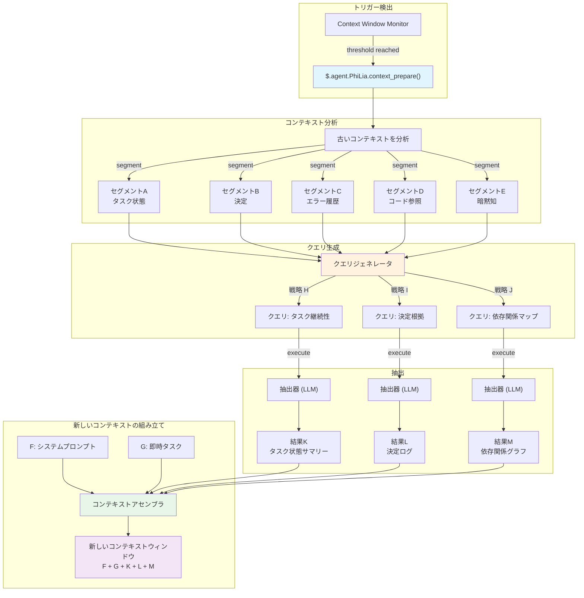
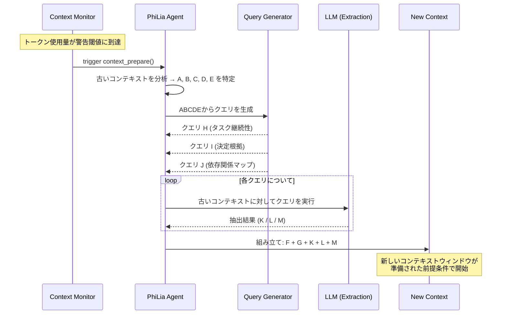

# コンテキスト準備メカニズム

## 概要

コンテキスト準備は、従来のコンテキスト圧縮に代わる能動的な抽出メカニズムです。古い会話履歴を損失的に圧縮する代わりに、既存のコンテキストを分析し、対象を絞ったクエリを生成し、新しいコンテキストウィンドウにシードするために必要な情報を正確に抽出します。このメカニズムはPhiLiaエージェントが所有し、`$.agent.PhiLia.context_prepare()`を通じて公開されます。

## 問題提起

### コンテキストウィンドウの制限

LLMエージェントは有限のコンテキストウィンドウ内で動作します。長時間実行タスク — マルチファイルリファクタリング、数十メッセージにわたるデバッグセッション、複雑なマルチステップワークフロー — は最終的に利用可能なトークン予算を消費します。これが発生すると、システムは何を保持し何を破棄するかを決定しなければなりません。

### 圧縮は詳細を失う

従来のコンテキスト圧縮アプローチ（要約、切り捨て、スライディングウィンドウ）は本質的に損失的です。圧縮器は*次の*コンテキストが何を必要とするかを知らないため、推測しなければなりません。重要な詳細が必然的に破棄されます：

- 変数名とその現在の値
- 中間決定とその根拠
- 発生し部分的に解決されたエラー状態
- タスク間の暗黙的な依存関係

根本的な欠陥：**圧縮は簡潔さのために最適化され、関連性のためではありません**。

### クロスタスク干渉

コンテキストウィンドウに複数のタスクやトピックが含まれる場合、あるタスクの履歴を圧縮すると別のタスクに必要な情報がしばしば破損します。タスクAの状態を保持する要約がタスクBの重要なエラーチェーンを不明瞭にする可能性があります。すべての可能な将来のニーズに役立つ普遍的な圧縮戦略は存在しません。

### 本当の問い

> *次の*コンテキストウィンドウは*現在の*コンテキストから何を知る必要があるか？

これは圧縮の問題ではありません。**情報検索**の問題です — そして答えは、前に何があったかではなく、次に何が来るかに依存します。

## コアコンセプト

### 能動的抽出 vs. 圧縮

| 側面 | 圧縮 | コンテキスト準備 |
| --- | --- | --- |
| 方向 | 過去 → 短い過去 | 過去 → 未来対応抽出 |
| 未来の知識 | なし | クエリが今後のニーズを予測 |
| 情報損失 | 不可避、無対象 | 対象絞り込み、意図的 |
| 類推 | ファイルをZIP | データベースを検索 |
| 品質上限 | 要約品質 | 抽出精度 |

コンテキスト準備は古いコンテキストを**データソース**として扱います — RAGが外部ドキュメントコーパスを扱うのと同様に — ただしコーパスは会話そのものです。すべてを要約に圧縮する代わりに、古いコンテキストに対して対象を絞った質問をし、回答を収集します。

### ABCDE/KLMモデル

このメカニズムは情報フローを記述するために文字ベースの表記を使用します：

```text
古いコンテキスト:  A + B + C + D + E
                     ↓ (分析)
クエリ:       ABCDE+H  ABCDE+I  ABCDE+J
                     ↓ (抽出)
結果:            K        L        M
                     ↓ (組み立て)
新しいコンテキスト:  F + G + K + L + M
```

- **A–E**: 古いコンテキストの個別のセグメント/側面（タスク状態、決定、エラー履歴、コード参照、暗黙知）
- **H, I, J**: A–Eの主要要素の分析から導出されたクエリ戦略。各戦略は異なる情報ニーズを対象とします
- **K, L, M**: 抽出結果 — 各クエリに対する正確な回答
- **F, G**: 新しいウィンドウの新しいシステムプロンプトと即時タスクコンテキスト
- **新しいコンテキスト**は完全なA–E履歴をスキップしてF + G（新規）+ K + L + M（抽出）を受け取ります

### これが圧縮に取って代わる理由

コンテキスト準備が存在すれば、従来の圧縮は不要になります：

1. **推測による情報損失がない** — クエリは新しいコンテキストが実際に必要とするものに基づいて生成されます
1. **抽出は構造的に決定論的** — 同じクエリ戦略は常に同じカテゴリの回答を生成します
1. **複数の角度がカバレッジを確保** — H/I/Jクエリが異なる次元（タスク状態、エラーコンテキスト、決定根拠）をカバーします
1. **古いコンテキストはアクセス可能なまま** — 破棄されるのではなく、準備フェーズ中に*オンデマンドでクエリ*されます

## アーキテクチャ

### 高レベルフロー



### シーケンス図



## API設計

### `$.agent.PhiLia.context_prepare()`

主要なエントリポイント。コンテキストウィンドウモニターがトークン使用量が警告閾値に達したことを検出したときに呼び出されます。

```typescript
interface ContextPrepareRequest {
    old_context: string;
    current_task: string;
    warning_threshold: number;
    current_usage: number;
    max_tokens: number;
}

interface ContextPrepareResult {
    segments: ContextSegment[];
    queries: GeneratedQuery[];
    extractions: ExtractionResult[];
    prepared_context: string;
    metadata: {
        old_context_tokens: number;
        prepared_context_tokens: number;
        compression_ratio: number;
        queries_executed: number;
        extraction_time_ms: number;
    };
}

// PhiLia APIエンドポイント
$.agent.PhiLia.context_prepare(request: ContextPrepareRequest): ContextPrepareResult
```

### `$.agent.PhiLia.context_query()`

コンテキストに対して個別のクエリを実行するための低レベルAPI。`context_prepare()`によって内部的に使用されますが、アドホッククエリにも利用可能です。

```typescript
interface ContextQueryRequest {
    context: string;
    query: string;
    strategy: "task_continuity" | "decision_rationale" | "dependency_map" | "custom";
    max_result_tokens: number;
}

interface ContextQueryResult {
    result: string;
    confidence: number;
    source_segments: string[];
    tokens_used: number;
}

$.agent.PhiLia.context_query(request: ContextQueryRequest): ContextQueryResult
```

### `$.agent.PhiLia.context_segment()`

コンテキストを分析し、ラベル付きセグメント（A–E）に分解します。

```typescript
interface SegmentRequest {
    context: string;
    max_segments: number;
}

interface Segment {
    id: string;           // "A", "B", "C" など
    label: string;        // "タスク状態", "決定" など
    content: string;
    token_count: number;
    importance_rank: number;
}

$.agent.PhiLia.context_segment(request: SegmentRequest): Segment[]
```

## クエリ戦略

### H/I/Jクエリの生成方法

クエリ生成プロセスはセグメント化された古いコンテキスト（A–E）を受け取り、新しいコンテキストが必要とする情報の異なる次元を対象とする3つのカテゴリのクエリを生成します。

### 戦略H: タスク継続性

**目的**: 新しいコンテキストが進捗を失うことなく現在のタスクを再開できることを保証します。

**生成ロジック**:

1. セグメントAとE（タスク状態 + 暗黙知）からアクティブなタスクを特定
1. 現在の進捗指標を抽出（完了したもの、進行中のもの、ブロックされているもの）
1. "*すべてのアクティブなタスクの現在の状態と、次のステップは何か？*"を問うクエリを生成

**クエリ例**:

```text
与えられた会話履歴から、以下を特定してください：
1. 現在進行中のすべてのタスクとその完了状態
2. ブロッカーや未解決のエラー
3. まさに取られようとしていた正確な次のステップ
4. 現在変更中のファイルパスと行番号
```

### 戦略I: 決定根拠

**目的**: 決定の背後にある*理由*を保存し、*何*だけではありません。

**生成ロジック**:

1. セグメントBとC（決定 + エラー履歴）から選択ポイントをスキャン
1. 代替案が検討され拒否された決定を特定
1. "*どのような決定が行われ、どのような代替案が拒否され、その理由は？*"を問うクエリを生成

**クエリ例**:

```text
この会話から以下を抽出してください：
1. 行われたすべてのアーキテクチャ上または実装上の決定
2. 各決定について：検討された代替案
3. 各決定について：選択されたアプローチが好まれた具体的な理由
4. これらの選択に影響を与えた制約や要件
```

### 戦略J: 依存関係マップ

**目的**: コード要素、ファイル、概念間の関係をキャプチャします。

**生成ロジック**:

1. セグメントDとE（コード参照 + 暗黙知）からエンティティ関係をスキャン
1. どのファイルがどれに依存するか、どの関数がどれを呼び出すか、どの概念が関連するかをマッピング
1. "*議論されたエンティティ間の主要な依存関係と関係は何か？*"を問うクエリを生成

**クエリ例**:

```text
会話を分析して以下をマッピングしてください：
1. 言及されたすべてのファイル/モジュールとその関係
2. 議論または変更された関数呼び出しチェーン
3. コンポーネント間のデータフロー
4. 設定値とそれらが使用される場所
5. 直接述べられていないが作業によって暗示される暗黙的な依存関係
```

### 拡張性

3つの戦略（H、I、J）はデフォルトセットです。システムはカスタム戦略をサポートします：

```typescript
interface QueryStrategy {
    id: string;
    name: string;
    description: string;
    source_segments: string[];     // 分析するセグメント
    query_template: string;        // {segment_X}プレースホルダー付きテンプレート
    priority: number;              // 実行優先度
    max_result_tokens: number;
}
```

新しい戦略は設定を通じて登録でき、ドメイン固有の抽出パターンを可能にします。

## 統合ポイント

### コンテキストウィンドウモニター

コンテキスト準備のトリガーはコンテキストウィンドウ監視サブシステムに存在します。トークン使用量が警告閾値（デフォルト：最大の80%）を超えると、モニターは`$.agent.PhiLia.context_prepare()`を呼び出します。

```rust
// コンテキストウィンドウモニター内（概念）
fn check_context_health(&mut self) {
    let usage_ratio = self.current_tokens as f64 / self.max_tokens as f64;
    if usage_ratio >= self.warning_threshold {
        let result = philia.context_prepare(ContextPrepareRequest {
            old_context: self.get_full_context(),
            current_task: self.get_current_task_description(),
            warning_threshold: self.warning_threshold,
            current_usage: self.current_tokens,
            max_tokens: self.max_tokens,
        });
        self.spawn_new_context(result.prepared_context);
    }
}
```

### skill_chain.rs統合

スキルチェーンエグゼキュータはコンテキスト準備を認識している必要があります。スキルチェーンが複数のコンテキストウィンドウにまたがる場合、準備メカニズムは以下を保証します：

1. スキルチェーンの状態がセグメントA（タスク状態）にキャプチャされる
1. 現在のスキルの入力/出力がセグメントD（コード参照）にキャプチャされる
1. チェーンの残りのステップが抽出結果K（タスク継続性）に保存される

```rust
// skill_chain.rs（概念的な統合）
impl SkillChainExecutor {
    fn execute_step(&mut self, step: ChainStep) -> Result<StepResult> {
        // 実行前に、コンテキスト準備が必要かチェック
        if self.context_monitor.should_prepare() {
            let prepared = self.philia.context_prepare(
                self.build_prepare_request()
            )?;
            self.context = prepared.prepared_context;
        }
        // ステップ実行を継続
        self.execute_with_context(step, &self.context)
    }
}
```

### PhiLiaエージェントの所有権

コンテキスト準備はPhiLia所有の機能です。これは以下を意味します：

- `$.agent.PhiLia.context_prepare()` APIはPhiLiaスキルとして登録されます
- PhiLiaはクエリ生成テンプレートと抽出戦略を管理します
- 他のエージェントは標準のスキル呼び出しプロトコルを通じてPhiLia経由でコンテキスト準備を要求します
- PhiLiaは知識ストアを活用して履歴パターンでクエリを強化する場合があります

### コンテキストスポーニング

システムが新しいコンテキストウィンドウをスポーンするとき、準備されたコンテキスト（F + G + K + L + M）が従来の圧縮された要約を置き換えます：

```rust
fn spawn_new_context(&mut self, prepared: ContextPrepareResult) {
    let system_prompt = self.build_system_prompt();      // F
    let immediate_task = self.get_current_task();         // G
    let new_context = format!(
        "{}\n\n{}\n\n---\n## コンテキスト準備結果\n### タスク状態\n{}\n### 決定ログ\n{}\n### 依存関係\n{}\n",
        system_prompt,    // F
        immediate_task,   // G
        prepared.extractions[0].result,  // K
        prepared.extractions[1].result,  // L
        prepared.extractions[2].result,  // M
    );
    self.launch_context(new_context);
}
```

## 実装フェーズ

### フェーズ1: 基盤（MVP）

- `$.agent.PhiLia.context_segment()`の実装 — コンテキスト分析とセグメンテーション
- 3つのデフォルトクエリ戦略の実装（H: タスク継続性、I: 決定根拠、J: 依存関係マップ）
- `$.agent.PhiLia.context_prepare()`の実装 — セグメント → クエリ → 抽出 → 組み立てのオーケストレーション
- コンテキストウィンドウモニタートリガーとの統合
- 単一タスク会話での検証

### フェーズ2: 堅牢性

- 抽出結果への信頼度スコアリングの追加
- 抽出信頼度が低い場合のフォールバック戦略の実装
- 大規模コンテキストのストリーミングサポートの追加
- パフォーマンス最適化: 並列クエリ実行
- アドホッククエリ用の`$.agent.PhiLia.context_query()`の追加

### フェーズ3: 知能

- 過去の準備結果からの最適なクエリ戦略の学習
- タスクタイプに基づく適応的セグメント重み付け
- クロスコンテキスト参照解決（複数のスポーンにわたる準備結果のリンク）
- 長期保持のためのメモリ沈殿との統合

### フェーズ4: 完全置換

- レガシーコンテキスト圧縮コードパスの削除
- コンテキスト準備がコンテキスト遷移の唯一のメカニズムに
- 完全なテレメトリと品質メトリクス
- カスタムエージェント向けのドキュメントと移行ガイド

## 例

### 例1: マルチファイルリファクタリング

**シナリオ**: エージェントがRustクレートをリファクタリングしており、3つのモジュールにわたる15ファイルを変更中。ファイル10を変更した後にコンテキストウィンドウがいっぱいになります。

**古いコンテキスト（A–E）**:

- **A**（タスク状態）: 10/15ファイル変更済み、モジュール`auth`と`storage`完了、`api`進行中
- **B**（決定）: enumディスパッチよりもトレイトベースの抽象化を選択; `#[deprecated]`で後方互換性を維持
- **C**（エラー）: `storage/mod.rs:142`でライフタイム問題に遭遇、`Arc<Mutex<>>`で解決
- **D**（コード参照）: `auth/traits.rs`、`storage/mod.rs:142`、`api/handler.rs:38-56`
- **E**（暗黙）: `User`構造体は下流クレートのために`Clone`を維持する必要がある; テストカバレッジを追跡中

**生成されたクエリ**:

- **H**（タスク継続性）: "変更が残っているファイル、適用中のパターン、次にリファクタリングするファイルは何か？"
- **I**（決定根拠）: "なぜenumディスパッチよりもトレイトベースの抽象化が選ばれたのか、どのような後方互換性の制約が存在するか？"
- **J**（依存関係マップ）: "`auth`、`storage`、`api`モジュール間の依存関係をマッピングし、どの構造体/トレイトがモジュール境界を越えるか記録せよ。"

**抽出結果（K、L、M）**は新しいシステムプロンプト（F）と次のタスク指示（G）と共に組み立てられます。

### 例2: デバッグセッション

**シナリオ**: 複数の仮説とテスト試行にわたるWebSocket接続問題のデバッグ。

**古いコンテキスト（A–E）**:

- **A**（タスク状態）: 問題はハンドシェイクフェーズに絞り込まれた; ハートビートは原因ではない
- **B**（決定）: TLS設定ミスを除外; プロキシ干渉を除外; 現在の仮説はヘッダー順序
- **C**（エラー）: 3秒時点で`ConnectionReset`、curlでは一貫して再現するがブラウザでは再現しない
- **D**（コード参照）: `ws/handshake.rs:67-89`、`headers/mod.rs:23`、テストファイル`tests/ws_test.rs`
- **E**（暗黙）: サーバーはnginxの背後にある; 問題は本番環境でのみ発生し、ローカル開発環境では発生しない

**生成されたクエリ**はデバッグ状態、拒否された仮説、残りの調査パスを新しいコンテキストに抽出します。

### 例3: クロスエージェントスキルチェーン

**シナリオ**: PhiLiaがタスクチェーンをSkemma（スキーマ設計）に委任し、次にLogos（ドキュメント）に委任。Logosの作業中にコンテキストがいっぱいになります。

**古いコンテキスト（A–E）**:

- **A**（タスク状態）: スキーマ設計完了、ドキュメント60%完了
- **B**（決定）: スキーマはPhiLiaのアーキテクチャガイダンスに従いM:N関係にジャンクションテーブルを使用
- **C**（エラー）: Skemmaが`user_roles`のカーディナリティの曖昧さを報告、`UNIQUE`制約の追加で解決
- **D**（コード参照）: `schema.sql:45-67`、`docs/api/endpoints.md:12-34`
- **E**（暗黙）: ドキュメントはプロジェクトの他で使用されているOpenAPI 3.0仕様フォーマットに準拠する必要がある

準備により、Logosの新しいコンテキストは完全なSkemma設計会話を必要とせずに、スキーマ決定とドキュメントフォーマット制約を受け取ることが保証されます。
