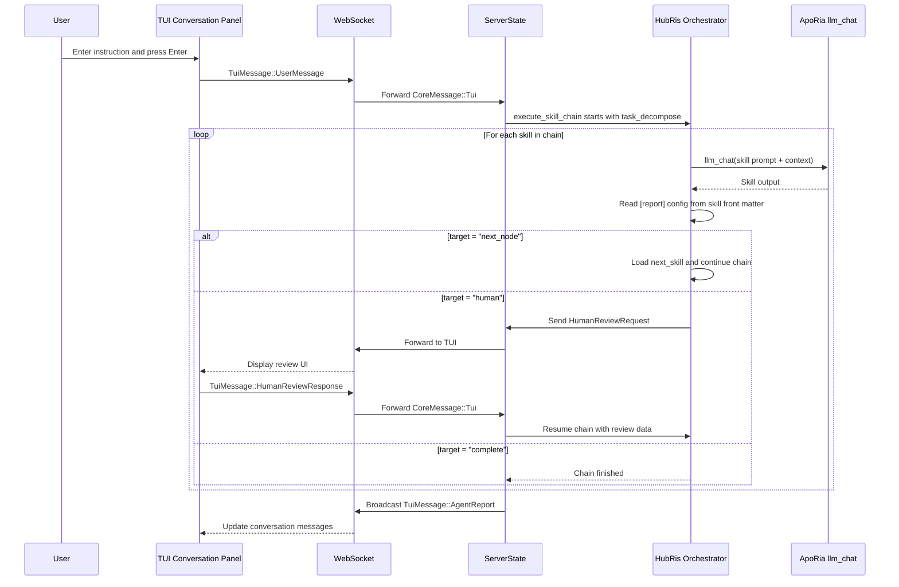

# 会話オーケストレーション設計 (HubRis + ApoRia)

## 背景

HubRisは「純粋スキルエージェント」です — すべての機能はApoRia `llm_chat`を通じて呼び出されるプロンプトのみのスキルです。レポートルーティングレイヤーの実装後、スキルはTOMLフロントマターの`[report]`セクションを通じてルーティング動作を宣言し、ハードコードされたオーケストレーションロジックを置き換えます。

## 目標

1. スキルはフロントマターでルーティング動作を宣言します（ハードコードではない）。
1. 汎用スキルチェーンエグゼキュータがハードコードされた2段階パイプラインを置き換えます。
1. 人間によるレビューが第一級のルーティングターゲットです。
1. プロンプト言語の整理: スキル/MCPフラットファイルは英語のみです。

## スキルレポート設定 (TOMLフロントマター)

```toml
[report]
target = "next_node"              # "next_node" | "parent" | "human" | "complete"
next_skill = "workplan_generate"  # target = "next_node" の場合に必須
```

## HubRisスキルチェーン

```text
task_decompose → workplan_generate → operator → workplan_execute → submit_report → human
```

## エンドツーエンドフロー



## レポートルーティングターゲット

| ターゲット       | 動作                                                        |
| --- | --- |
| `next_node`  | エグゼキュータが`next_skill`で指定されたスキルをロードして実行します。     |
| `parent`     | コントロールを親オーケストレータに返します（ネストされたチェーン用に予約）。 |
| `human`      | チェーンを一時停止し、`HumanReviewRequest`をTUIに送信、`HumanReviewResponse`で再開。 |
| `complete`   | チェーンを終了し、蓄積された`AgentReport`を返します。  |

## ファイル構造 (フェーズ1)

```text
res/prompts/agents/hubris/skills/
  task_decompose.md
  workplan_generate.md
  operator.md
  workplan_execute.md
  submit_report.md
```

各ファイルはフラットなMarkdownドキュメントで、英語のみ、`[report]`セクションとその他のスキルメタデータを含むTOMLフロントマター付きです。

## 人間言語設定

エージェントランタイム設定には、ネイティブ言語名を使用した`human_language`フィールドが含まれます（例：`"中文"`、`"English"`、`"日本語"`）。これにより、英語のみのスキルプロンプトファイルに影響を与えることなく、すべてのユーザー向け出力の言語を制御します。

## デフォルトモデルポリシー

起動時には、正規化された環境のデフォルトモデルとして`glm-4.7-flash`を使用します。ApoRia `llm_chat`はデフォルトでそのモデルを使用し、開発とテストのコストを低く抑えます。

## 障害フォールバックポリシー

1. スキルが失敗した場合: 失敗メッセージを返し、現在のチェーンを終了します。
1. ApoRiaがオフラインの場合: `Agent not ready`メッセージを返します。
1. 人間のレビューがタイムアウトした場合: 後続のチャットをブロックせずにタイムアウト通知を返します。
