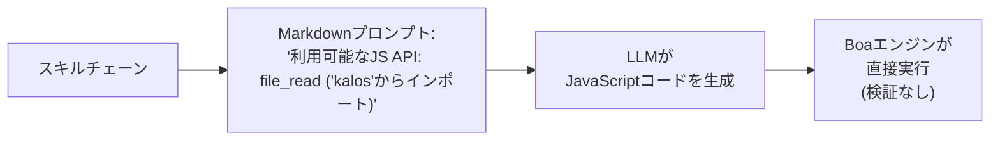
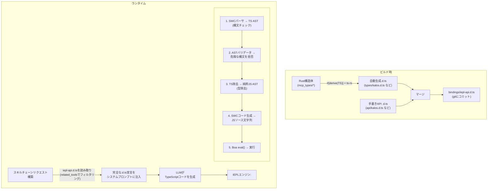
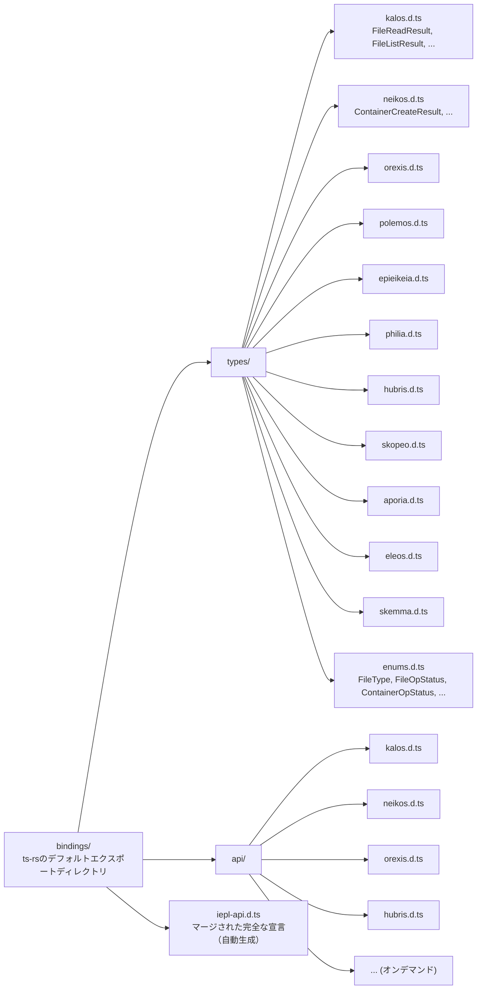
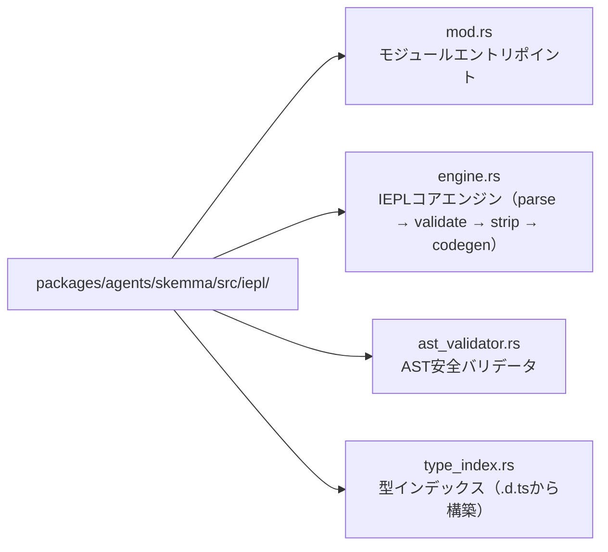

# 22 — IEPL TypeScript実行エンジン設計

## 概要

IEPL（In-Execution Prompt Language）実行エンジンは、既存のCosmos/SkeMma JSランタイムに対するアーキテクチャアップグレードであり、LLM生成実行コードをJavaScriptからTypeScriptにアップグレードします。主な変更点は以下を含みます：

1. **SWCクレートの組み込み**: LLM生成TypeScriptの厳格な構文チェック、型除去、トランスパイル
1. **Rust derive → TypeScript型生成**: `ts-rs`を通じてRust構造体を`.d.ts`宣言ファイルに自動エクスポート
1. **型安全なスキルプロンプト**: ハードコードされた関数リストの代わりに完全な`.d.ts`宣言を注入し、堅牢性を大幅に向上

## 現状と問題点

### 現在の実行フロー



### 既存の問題

| 問題 | 説明 |
| --- | --- |
| **型制約なし** | LLM生成JSコードは静的な型情報がゼロ；パラメータのタイプミスは実行時まで検出されない |
| **脆弱なインターフェース記述** | `build_report_tool_instruction()`が`- file_read ('kalos'からインポート)`のようなテキストリストをハードコード、パラメータ型や戻り値の構造を表現できない |
| **事前検証なし** | LLMコードが直接Boa `eval()`に渡される；構文エラーは実行時まで発見されない |
| **スキーマとプロンプトの分離** | `McpSchemaWriter`がJSONスキーマファイルを生成するが、プロンプト注入には決して使用されない |
| **ツールパラメータが型なし** | 現在のツールパラメータは`serde_json::Value`として渡され、`get("field")`で手動抽出、型安全性の保証なし |

### 関与する主要ファイル

| ファイル | 現在の責任 |
| --- | --- |
| `packages/agents/skemma/src/js_runtime/runtime.rs` | Boa JSランタイム、`exec()`が直接`eval()`を呼び出す |
| `packages/agents/skemma/src/mcp/tools/script_exec.rs` | `"javascript"`言語のみを受け付ける |
| `packages/cosmos/src/bin/cosmos/js_repl/js_commands.rs` | `globalThis.$agent.tool = (...) => ...` を動的に生成 |
| `packages/scepter/src/state_machine/skill_chain/prompt.rs:51` | `build_report_tool_instruction()`がAPIリストをハードコード |
| `packages/shared/src/mcp_types/*.rs` | すべてのMCPツール結果型定義（serdeのみ、TSエクスポートなし） |
| `packages/shared/src/mcp_types/schema.rs` | `McpSchemaWriter`がJSONスキーマを生成（プロンプトで使用されない） |

## ターゲットアーキテクチャ



## 技術選定

### 1. Rust → TypeScript型生成: `ts-rs`

| 属性 | 値 |
| --- | --- |
| クレート | `ts-rs` (Aleph-Alpha/ts-rs) |
| バージョン | ≥ 12.0 |
| スター | 1,772 |
| ダウンロード | ~7.3M |
| ライセンス | MIT |

**根拠:**

- プロジェクトの既存の`serde`エコシステムと深く互換（`serde-compat`機能が`rename`/`rename_all`/`skip`などを自動認識）
- `#[derive(TS)]`は非侵襲的で、既存の構造体定義を変更しない
- `#[ts(export)]`をサポートし、`cargo test`中に`bindings/`ディレクトリに自動エクスポート
- 標準のTypeScript `type`エイリアスを生成し、`.d.ts`で直接使用可能
- クロスファイルインポート、ジェネリクス、ユニオン型をサポート
- 豊富なエコシステム統合: `chrono-impl`、`uuid-impl`、`serde-json-impl`

**除外された代替案:**

| クレート | 除外理由 |
| --- | --- |
| `specta` | Tauri/rspcエコシステムに偏っている；このシナリオでは関数型エクスポートは不要 |
| `typeshare` | CLI駆動、CI統合に不便；`type`の代わりに`interface`を生成（LLMプロンプトには実質的な違いなし） |
| `tsify` | `wasm-bindgen`に結合；このプロジェクトはWASMワークフローではない |

### 2. TypeScript解析とトランスパイル: SWC

| クレート | 目的 |
| --- | --- |
| `swc_core`（機能: `ecma_parser`） | TSソースをASTに解析 |
| `swc_core`（機能: `ecma_ast`） | ASTノード型 |
| `swc_core`（機能: `ecma_visit`） | AST走査/変換 |
| `swc_core`（機能: `ecma_transforms_typescript`） | TS → JS型除去 |
| `swc_core`（機能: `ecma_codegen`） | AST → ソースコード生成 |

**主要機能:**

- 完全なTypeScript構文サポート（ジェネリクス、条件型、マップ型、デコレータなど）
- 高性能Rustネイティブ実装（tscより20〜70倍高速）
- 型除去（`strip`）がTS ASTをJS ASTに変換
- 構文レベルのエラー報告（閉じられていない括弧、無効なトークンなど）

**制限:**

- SWCは**完全な型チェックを実行しない**（`tsc --noEmit`に相当するものはない）。つまり、「存在しないプロパティの呼び出し」のような意味的エラーを捕捉できない
- このシナリオでは許容可能：LLM生成コードは主に構文的な正しさの保証が必要；Boaエンジンがランタイム動的型安全性を提供
- 将来完全な型チェックが必要な場合、ASTレベルのカスタム検証を導入可能（下記「ASTバリデータ」参照）

## 詳細設計

### フェーズ1: ts-rs型エクスポート基盤

#### 1.1 新しいワークスペース依存関係

```toml
# Cargo.toml (ワークスペース)
[workspace.dependencies]
ts-rs = { version = "12", features = ["serde-compat", "format"] }
```

#### 1.2 MCP型に`#[derive(TS)]`を追加

`packages/shared/src/mcp_types/`以下のすべての構造体が`ts-rs` deriveを取得：

```rust
// packages/shared/src/mcp_types/kalos.rs
use ts_rs::TS;

# [derive(Debug, Clone, Serialize, Deserialize, TS)]
# [ts(export)]
pub struct FileReadResult {
    pub path: String,
    pub size_bytes: u64,
    pub content: String,
}

# [derive(Debug, Clone, Serialize, Deserialize, TS)]
# [ts(export)]
pub struct FileListResult {
    pub path: String,
    pub total_count: usize,
    pub entries: Vec<FileEntry>,
}

// ... 他の型も同様
```

列挙型は`str_enum!`マクロの適応が必要：

```rust
// packages/shared/src/mcp_types/enums.rs
// 既存のstr_enum!マクロ生成列挙型は追加のTS deriveが必要

# [derive(Debug, Clone, Copy, PartialEq, Eq, Serialize, Deserialize, TS)]
pub enum FileType {
    File,
    Directory,
}
// 注意: str_enum!マクロはTS導出も行うように拡張するか、
// または既存のマクロ生成列挙型に個別に#[derive(TS)]を追加する必要がある
```

#### 1.3 `.d.ts`ファイルレイアウト



#### 1.4 手書きAPI `.d.ts`の例

```typescript
// bindings/api/kalos.d.ts

import type {
  FileReadResult,
  FileListResult,
  FileWriteResult,
  FileEditResult,
  FileDeleteResult,
  FileExistsResult,
  MkDirResult,
  FileInfoResult,
} from "../types/kalos";

export interface KalosApi {
  /**
   * ファイル内容を読み取り
   * @param params.path - ファイルパス（絶対パス）
   */
  file_read(params: { path: string }): Promise<FileReadResult>;

  /**
   * ファイルに書き込み
   * @param params.path - ファイルパス
   * @param params.content - ファイル内容
   */
  file_write(params: { path: string; content: string }): Promise<FileWriteResult>;

  /**
   * ファイルを編集（検索と置換）
   * @param params.path - ファイルパス
   * @param params.old_string - 置換する元の文字列
   * @param params.new_string - 置換後の文字列
   */
  file_edit(params: {
    path: string;
    old_string: string;
    new_string: string;
  }): Promise<FileEditResult>;

  file_delete(params: { path: string }): Promise<FileDeleteResult>;
  file_exists(params: { path: string }): Promise<FileExistsResult>;
  file_list(params: { path: string }): Promise<FileListResult>;
  file_get_info(params: { path: string }): Promise<FileInfoResult>;
  file_create_dir(params: { path: string }): Promise<MkDirResult>;
}
```

#### 1.5 ビルド時マージスクリプト

`packages/shared/build.rs`またはスタンドアロン`xtask`内：

```rust
// xtask/src/bin/iepl_codegen.rs
// 1. cargo test を実行してts-rsエクスポートをトリガー
// 2. bindings/types/*.d.ts + bindings/api/*.d.ts を読み取り
// 3. エージェントごとにグループ化してマージし、最終的なiepl-api.d.tsを生成
// 4. bindings/iepl-api.d.ts に出力
```

または、よりシンプルに、テスト中にエクスポートとマージをトリガーする`iepl_codegen`モジュールを`packages/shared/src/mcp_types/`に追加します。

**主要原則: 生成後、`.d.ts`ファイルはgitにコミットされ、ソースツリーの恒久的な一部となります。** 後続のRust型変更は再生成され、更新がコミットされます。

### フェーズ2: IEPL実行エンジン

#### 2.1 新しいSWC依存関係

```toml
# Cargo.toml (ワークスペース)
[workspace.dependencies]
swc_core = { version = "65", features = [
    "ecma_parser",
    "ecma_ast",
    "ecma_visit",
    "ecma_transforms_base",
    "ecma_transforms_typescript",
    "ecma_codegen",
    "common",
] }
```

#### 2.2 IEPLエンジンコア

`packages/agents/skemma/src/`の下に新しい`iepl/`モジュール：



##### engine.rs — コアトランスパイルフロー

```rust
use anyhow::{anyhow, Result};
use swc_core::{
    common::{errors::ColorConfig, SourceFile, SourceMap, GLOBALS},
    ecma::{
        ast::Program,
        codegen::{text_writer::JsWriter, Emitter},
        parser::{lexer::Lexer, Parser, StringInput, Syntax, TsSyntax},
        transforms::{
            base::fixer::fixer,
            typescript::strip,
        },
        visit::FoldWith,
    },
};

pub struct IeplEngine {
    cm: Arc<SourceMap>,
}

pub struct TranspileResult {
    pub js_code: String,
    pub parse_errors: Vec<String>,
}

impl IeplEngine {
    pub fn new() -> Self {
        Self {
            cm: Arc::new(SourceMap::default()),
        }
    }

    /// TypeScriptコードをJavaScriptにトランスパイル
    pub fn transpile(&self, ts_code: &str) -> Result<TranspileResult> {
        let fm = self.cm.new_source_file(
            swc_core::common::FileName::Custom("iepl-input".into()),
            ts_code.into(),
        );

        // 1. TSを解析 → AST
        let mut parse_errors = Vec::new();
        let module = self.parse_ts(&fm, &mut parse_errors)?;

        if !parse_errors.is_empty() {
            return Err(anyhow!("TypeScript parse errors:\n{}", parse_errors.join("\n")));
        }

        // 2. AST安全検証
        let validator = AstValidator::new();
        validator.validate(&module)?;

        // 3. 型除去 TS → JS
        let mut transforms = swc_core::common::pass::Optional::new(
            strip::strip_typescript(swc_core::common::comments::NoComments),
            true,
        );
        let program = module.fold_with(&mut transforms);

        // 4. AST → JSソース
        let js_code = self.emit(program)?;

        Ok(TranspileResult {
            js_code,
            parse_errors,
        })
    }

    fn parse_ts(
        &self,
        fm: &SourceFile,
        errors: &mut Vec<String>,
    ) -> Result<Program> {
        let lexer = Lexer::new(
            Syntax::Typescript(TsSyntax {
                tsx: false,
                decorators: true,
                dts: false,
                no_early_errors: false,
                disallowAmbiguousJSXLike: true,
            }),
            Default::default(),
            StringInput::from(fm),
            None,
        );
        let mut parser = Parser::new_from(lexer);
        match parser.parse_program() {
            Ok(program) => Ok(program),
            Err(e) => {
                errors.push(format!("{:?}", e));
                Err(anyhow!("Failed to parse TypeScript"))
            }
        }
    }

    fn emit(&self, program: Program) -> Result<String> {
        let mut buf = Vec::new();
        let writer = JsWriter::new(self.cm.clone(), "\n", &mut buf, None);
        let mut emitter = Emitter {
            cfg: Default::default(),
            cm: self.cm.clone(),
            comments: None,
            wr: writer,
        };
        emitter.emit_program(&program)?;
        Ok(String::from_utf8(buf)?)
    }
}
```

##### ast_validator.rs — 安全バリデータ

```rust
use anyhow::{anyhow, Result};
use swc_core::ecma::ast::{Module, Program};
use swc_core::ecma::visit::{Visit, VisitWith};

/// ASTに危険なパターンが含まれていないことを検証
pub struct AstValidator {
    violations: Vec<String>,
}

impl AstValidator {
    pub fn new() -> Self {
        Self {
            violations: Vec::new(),
        }
    }

    pub fn validate(&self, program: &Program) -> Result<()> {
        // 危険なパターン検出を実装
        // - eval() / Function()呼び出しを禁止
        // - 動的import()を禁止
        // - __proto__ / constructorへのアクセスを禁止
        // - with文を禁止
        // - オプション: 許可リストにないグローバル変数へのアクセスを禁止
        if self.violations.is_empty() {
            Ok(())
        } else {
            Err(anyhow!("AST validation violations:\n{}", self.violations.join("\n")))
        }
    }
}
```

#### 2.3 script_execへの統合

`packages/agents/skemma/src/mcp/tools/script_exec.rs`を変更：

```rust
// 変更前（53行目）:
if !matches!(language.as_str(), "javascript" | "js" | "node") {
    return McpToolResult::failure(format!(
        "Unsupported language: '{}'. Only JavaScript is supported.", language
    ));
}

// 変更後:
let executable_code = match language.as_str() {
    "typescript" | "ts" => {
        let engine = crate::iepl::IeplEngine::new();
        match engine.transpile(code) {
            Ok(result) => result.js_code,
            Err(e) => return McpToolResult::failure(format!("TS transpile error: {}", e)),
        }
    }
    "javascript" | "js" | "node" => code.to_string(),
    _ => {
        return McpToolResult::failure(format!(
            "サポートされていない言語: '{}'。TypeScriptとJavaScriptのみサポートされています。",
            language
        ));
    }
};
```

#### 2.4 Cosmos JS REPLへの統合

`packages/cosmos/src/bin/cosmos/js_repl/mod.rs`の実行パスを変更し、`runtime.exec()`を呼び出す前にIEPLトランスパイルステップを追加します。

### フェーズ3: スキルプロンプト型注入

#### 3.1 現在のプロンプト構築

`prompt.rs:51`の`build_report_tool_instruction()`:

```rust
// 現在: ハードコードされたAPIリスト
let items: Vec<String> = available_apis
    .iter()
    .map(|a| format!("- ${}", a))
    .collect();
parts.push(format!("\n利用可能なJS API:\n{}", items.join("\n")));
```

これは以下を生成します：

```text
利用可能なJS API:
- file_read ('kalos'からインポート)
- file_write ('kalos'からインポート)
- report()
```

#### 3.2 新しいプロンプト構築

```rust
pub(super) fn build_report_tool_instruction(
    next_targets: &[String],
    related_tools: &[RelatedTool],  // 完全なRelatedTool情報を受け入れるように変更
) -> String {
    let mut parts = Vec::new();

    // bindings/からエージェントグループ化された.d.tsをロード
    let type_declarations = load_iepl_type_declarations(related_tools);
    if !type_declarations.is_empty() {
        parts.push(format!(
            "あなたはTypeScriptコードを書いています。利用可能なAPI型宣言:\n\n\
             ```typescript\n{}\n```",
            type_declarations
        ));
    }

    // ... next_targets と mcp_conv は変更なし
}
```

プロンプトに注入されるコンテンツの例：

```typescript
あなたはTypeScriptコードを書いています。利用可能なAPI型宣言:

```

// === 型（Rustから自動生成） ===
type `FileReadResult` = { path: string; `size_bytes`: number; content: string };
type `FileListResult` = { path: string; `total_count`: number; entries: Array<{ name: string; `file_type`: "file" | "directory" }> };
type `FileWriteResult` = { path: string; `size_bytes`: number; status: "created" | "deleted" | "edited" | "written" };

// === API（手書き） ===
interface KalosApi {
`file_read`(params: { path: string }): Promise<`FileReadResult`>;
`file_write`(params: { path: string; content: string }): Promise<`FileWriteResult`>;
`file_list`(params: { path: string }): Promise<`FileListResult`>;
// ...
}

declare const $kalos: KalosApi;

```text

#### 3.3 .d.tsローダー

```

// packages/shared/src/iepl/decl_loader.rs

use `include_dir`::{Dir, `include_dir`};

static IEPL_BINDINGS: Dir = `include_dir`!("$CARGO_MANIFEST_DIR/../../../bindings");

pub struct `IeplDeclLoader`;

impl `IeplDeclLoader` {
/// related_toolsでフィルタリングされた必要な.d.ts宣言をロード
pub fn `load_for_tools`(`related_tools`: &[`RelatedTool`]) -> String {
let mut declarations = Vec::new();

// 関与するエージェントのセットを収集
let agents: std::collections::HashSet<&str> = `related_tools`
.iter()
.map(|t| t.agent_name.as_str())
.collect();

for agent in &agents {
// 自動生成された型宣言をロード
if let Some(`types_file`) = IEPL_BINDINGS.get_file(format!("types/{}.d.ts", agent)) {
if let Ok(content) = std::str::`from_utf8`(types_file.contents()) {
declarations.push(content.to_string());
}
}

// 手書きAPI宣言をロード
if let Some(`api_file`) = IEPL_BINDINGS.get_file(format!("api/{}.d.ts", agent)) {
if let Ok(content) = std::str::`from_utf8`(api_file.contents()) {
declarations.push(content.to_string());
}
}
}

declarations.join("\n\n")
}
}

```text

#### 3.4 JS名前空間ビルダーのアップグレード

`js_commands.rs`の`build_tool_namespace_js()`はJavaScript関数ラッパーの生成を変更せずに維持します（BoaエンジンはJSのみを実行します）が、プロンプト側のインターフェース記述はハードコードではなく`.d.ts`によって提供されます。

## データフロー比較

### 現在（JavaScript）

```

flowchart TD
Meta["スキルメタデータ\`nrelated_tools`:\n- kalos.file_read\n- kalos.file_write"]
Meta --> Build["`build_report_tool_instruction`\n→ '- `file_read` (インポート)'\n→ '- `file_write` (インポート)'\n(ハードコードテキスト)"]
Build -->|"システムプロンプトに\n注入"| LLM1["LLMがJavaScriptを生成\`nfile_read`({path:'x'})\n(型チェックなし)"]
LLM1 --> Boa1["Boa eval() 直接実行\n(事前検証なし)"]

```text

### ターゲット（TypeScript + IEPL）

```

flowchart TD
Meta2["スキルメタデータ\`nrelated_tools`:\n- kalos.file_read\n- kalos.file_write"]
Meta2 --> Loader["`IeplDeclLoader`\n→ types/kalos.d.ts\n→ api/kalos.d.ts\n(完全な型宣言)"]
Loader -->|"システムプロンプトに\n注入"| LLM2["LLMがTypeScriptを生成\nconst r: `FileReadResult` =\n  await `file_read`(\n    {path: 'x'}\n  );\n(型制約付き)"]
LLM2 --> IEPL["IEPLエンジン\n1. SWC parse → AST (構文チェック)\n2. AST validator (安全チェック)\n3. strip types → JS (型除去)\n4. codegen → JS文字列"]
IEPL --> Boa2["Boa eval() 実行"]

```text

## 堅牢性改善分析

### 比較: 現在 vs IEPL

| 次元 | 現在（JS + ハードコードリスト） | IEPL（TS + .d.ts） |
|-----------|------------------------------|-------------------|
| **LLMのインターフェース理解** | `- file_read ('kalos'からインポート')`を見る | 完全な`file_read(params: {path: string}): Promise<FileReadResult>`を見る |
| **パラメータエラー** | LLMがパラメータ名を推測 | LLMが正確なパラメータ型を知っている |
| **戻り値の使用** | どのようなフィールドが返されるか分からない | `FileReadResult`の完全な構造を知っている |
| **構文エラー** | 実行時のみ発見 | トランスパイル前にSWCによって拒否 |
| **インターフェース変更** | ハードコードテキストの手動更新が必要 | Rust構造体を変更 → .d.tsを再生成 → プロンプトに自動反映 |
| **新しいツールのオンボーディング** | prompt.rsロジックを変更 | ts-rs derive + 手書きapi .d.ts を追加 |
| **型エクスポートの保守** | なし | .d.tsがgitで追跡可能な差分付き |

### LLMプロンプト品質の改善

LLMが見る現在のプロンプト断片：

```

利用可能なJS API:

- `file_read` ('kalos'からインポート)
- `file_write` ('kalos'からインポート)
- report()

```text

IEPL下でLLMが見るプロンプト断片：

```

declare const $kalos: {
`file_read`(params: { path: string }): Promise<{ path: string; `size_bytes`: number; content: string }>;
`file_write`(params: { path: string; content: string }): Promise<{ path: string; `size_bytes`: number; status: "created" | "deleted" | "edited" | "written" }>;
`file_list`(params: { path: string }): Promise<{ path: string; `total_count`: number; entries: Array<{ name: string; `file_type`: "file" | "directory" }> }>;
};
// hubrisツールはESモジュールインポートで利用可能: import { report } from 'hubris'
report(params: { summary: string }): Promise<{ summary: string }>;
};

```text

後者は以下を提供します：
- 正確なパラメータ名と型
- 完全な戻り値の構造
- ユニオン型リテラル（例：`"file" | "directory"`）
- 非同期セマンティクスを表現するTypeScriptネイティブの`Promise<>`

## 新しいワークスペース依存関係の要約

```

# 新規

ts-rs = { version = "12", features = ["serde-compat", "format"] }
`swc_core` = { version = "65", features = [
"`ecma_parser`",
"`ecma_ast`",
"`ecma_visit`",
"`ecma_transforms_base`",
"`ecma_transforms_typescript`",
"`ecma_codegen`",
"common",
] }

```text

## 新しいクレート構造

```

flowchart LR
SkemmaIepl["packages/agents/skemma/src/iepl/"] --> SM1["mod.rs\npub mod engine; pub mod `ast_validator`;"]
SkemmaIepl --> SM2["engine.rs\`nIeplEngine`: transpile(`ts_code`) -> Result&lt;`TranspileResult`&gt;"]
SkemmaIepl --> SM3["ast_validator.rs\`nAstValidator`: 安全パターン検出"]
SharedIepl["packages/shared/src/iepl/"] --> SH1["mod.rs\npub mod `decl_loader`;"]
SharedIepl --> SH2["decl_loader.rs\`nIeplDeclLoader`: related_toolsでフィルタリングされた.d.tsをロード"]
Bindings["bindings/\n生成されたアーティファクト、gitで追跡"] --> BTypes["types/\nts-rs自動エクスポート"]
Bindings --> BApi["api/\n手書きで保守"]
Bindings --> BIepl["iepl-api.d.ts\nマージされたアーティファクト（オプション）"]
BTypes --> BT1["kalos.d.ts"]
BTypes --> BT2["neikos.d.ts"]
BTypes --> BT3["..."]
BApi --> BA1["kalos.d.ts"]
BApi --> BA2["neikos.d.ts"]
BApi --> BA3["..."]

```text

## 実装パス

### フェーズ1: ts-rs基盤（〜2〜3日）

1. `ts-rs`ワークスペース依存関係を追加
2. すべての`mcp_types/*.rs`構造体に`#[derive(TS)]`を追加
3. `str_enum!`マクロを`ts-rs` deriveと互換性があるように拡張
4. `cargo test`を実行して`bindings/types/*.d.ts`を生成
5. `bindings/api/*.d.ts`を手書き（エージェントごとに1ファイル）
6. `bindings/iepl-api.d.ts`を生成するマージスクリプトを作成
7. すべての`.d.ts`をgitにコミット

### フェーズ2: IEPL実行エンジン（〜3〜5日）

1. `swc_core`ワークスペース依存関係を追加
2. `iepl/engine.rs`を実装: parse → strip → codegen
3. `iepl/ast_validator.rs`を実装: 危険なパターン検出
4. `script_exec.rs`をTypeScript言語をサポートするように変更
5. Cosmos JS REPL実行パスに統合
6. エンドツーエンドテスト: TSコード → SWC → JS → Boa

### フェーズ3: プロンプト型注入（〜2〜3日）

1. `IeplDeclLoader`を実装
2. `build_report_tool_instruction()`を.d.tsを使用するように変更
3. `execution_steps.rs`のシステムプロンプト構築ロジックを更新
4. LLM生成TSコードの品質向上を検証

### フェーズ4: クリーンアップと最適化（〜1〜2日）

1. `McpSchemaWriter`を削除または非推奨化（.d.tsシステムに置き換え）
2. CIステップを追加: `cargo test`後、`bindings/`のコミットされていない変更をチェック
3. ドキュメント更新

## リスクと軽減策

| リスク | 軽減策 |
|------|-----------|
| SWCコンパイル時間の増加 | `swc_core`オンデマンド機能、インポートを最小化 |
| `str_enum!`マクロと`ts-rs`の競合 | マクロ拡張または列挙型に個別に`TS`トレイトを実装 |
| `.d.ts`が大きすぎてプロンプトトークン制限を超過 | `related_tools`による正確なフィルタリング、現在のスキルに必要な型のみ注入 |
| Boaが`async/await`をサポートしない | SWCをコールバックスタイルにダウングレードするよう設定可能（またはBoa将来バージョンのサポート） |
| ts-rsバージョンがserdeバージョンと互換性がない | ワークスペースバージョンをロック、CI検証 |

## 拡張可能性

1. **ASTレベル型チェック**: SWC AST上の軽量型チェックを実装（ESモジュールインポート呼び出しが宣言されたパラメータを使用することを検証）
2. **.d.tsバージョン管理**: `.d.ts`ファイルヘッダーにバージョン番号を追加、LLMプロンプトにバージョン情報を含める
3. **増分更新**: Rust型が変更された場合、CIが`bindings/`の差分を自動検出し更新を警告
4. **多言語実行**: IEPLフレームワークは他の言語（RustPython経由のPythonなど）をサポートするよう拡張可能
5. **ランタイム型検証**: Boa実行前後にserde検証を追加し、LLMが使用するパラメータと戻り値が型定義に準拠することを保証
