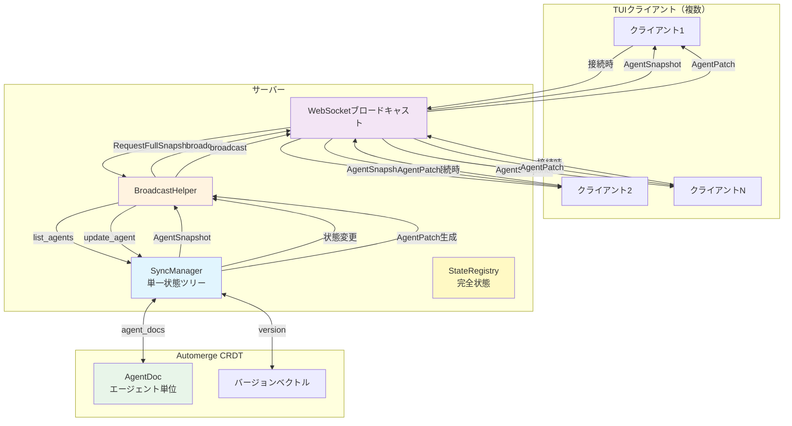
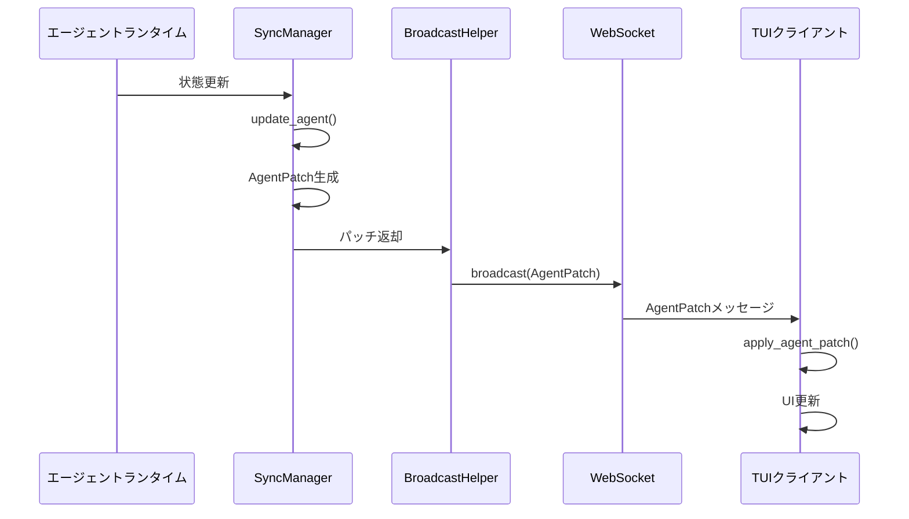
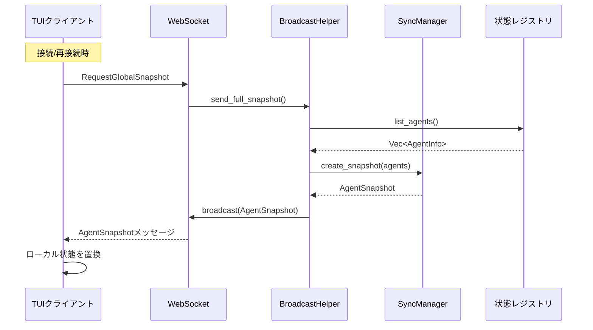
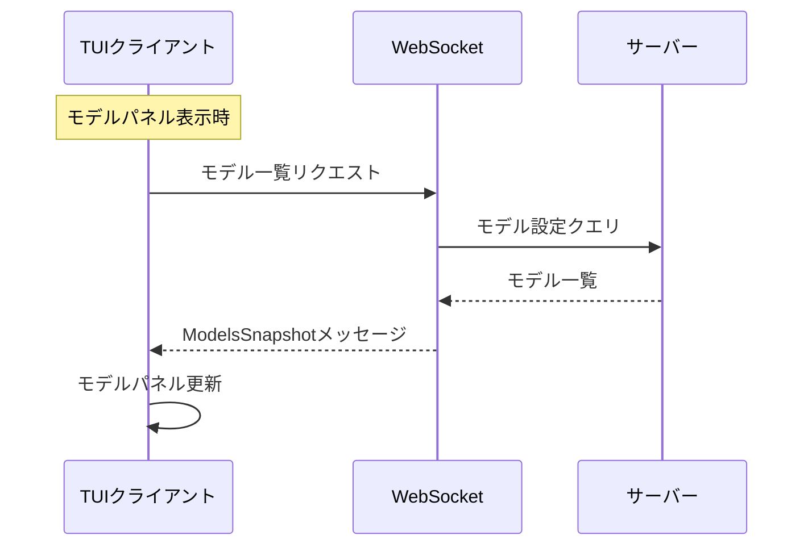
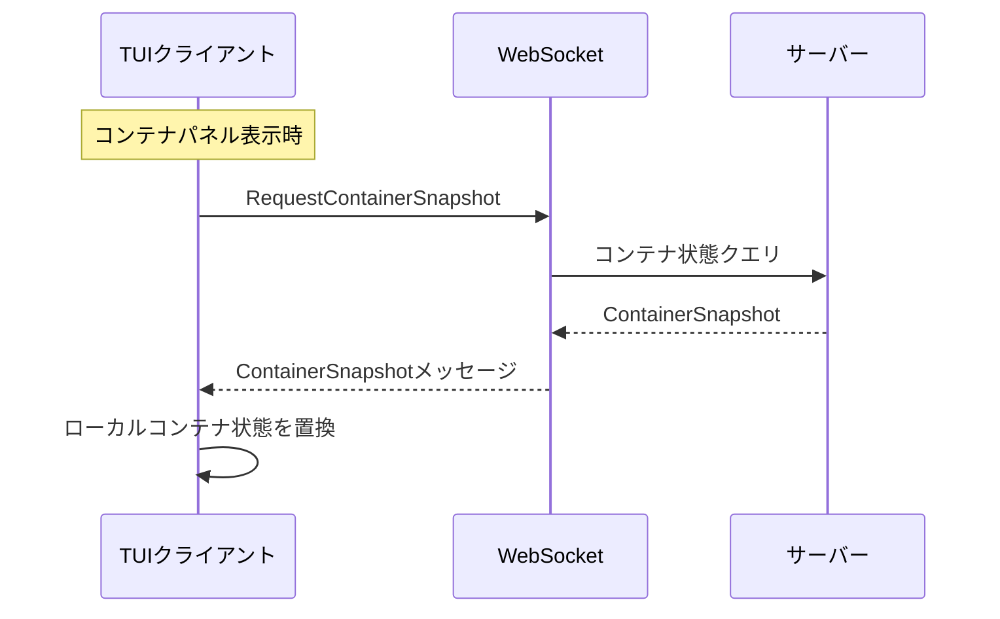
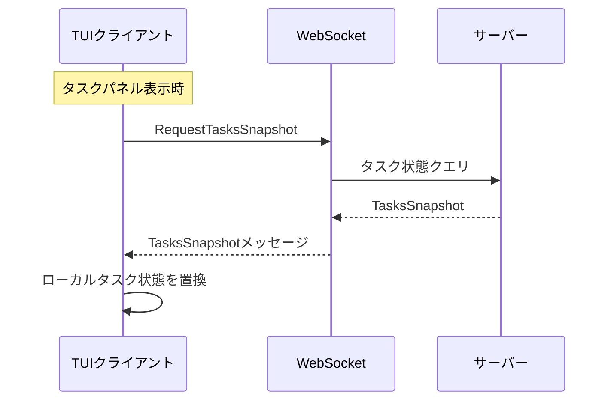

# 増分同期アーキテクチャ

## 概要

Automerge CRDTに基づくマルチクライアント状態増分同期機構。リアルタイム増分更新と接続/再接続時の完全同期をサポートし、全TUIパネルをカバーする。

## アーキテクチャ図



## 同期戦略マトリックス

| パネル | 同期方式 | トリガー | 頻度 | メッセージタイプ |
| --- | --- | --- | --- | --- |
| **エージェントタイムライン** | 増分 + 完全 | 接続時同期 + リアルタイムプッシュ | 接続時 / リアルタイム | `AgentPatch` / `GlobalSnapshot` |
| **コンテナ** | 増分 + 完全 | 接続時同期 + リアルタイムプッシュ | 接続時 / リアルタイム | `ContainerPatch` / `GlobalSnapshot` |
| **タスク** | 増分 + 完全 | 接続時同期 + リアルタイムプッシュ | 接続時 / リアルタイム | `TaskPatch` / `GlobalSnapshot` |
| **モデル一覧** | 完全 | クライアント能動リクエスト | パネル表示時 | `ModelsSnapshot` |
| **プロバイダ設定** | 完全 | クライアント能動リクエスト | パネル表示時 | `ProvidersSnapshot` |

## メッセージフロー

### 増分更新フロー（エージェント）



### 完全同期フロー



### モデル一覧同期フロー



### コンテナ完全同期フロー



### タスク完全同期フロー



## データ構造

### AgentPatch（増分更新）

```rust
pub struct AgentPatch {
    pub agent_id: String,
    pub version: u64,
    pub llm_working_changed: Option<bool>,
    pub work_status: Option<String>,
    pub current_model: Option<String>,
    pub token_usage_delta: Option<(u32, u32)>,
    pub token_usage_absolute: Option<(u32, u32)>,
    pub request_state: Option<RequestState>,
    pub cpu_usage: Option<f64>,
    pub memory_mb: Option<u64>,
}
```

### AgentSnapshot（完全スナップショット）

```rust
pub struct AgentSnapshot {
    pub version: u64,
    pub timestamp: i64,
    pub agents: Vec<TuiAgentInfo>,
}
```

### GlobalSnapshot（グローバルスナップショット）

```rust
pub struct GlobalSnapshot {
    pub version: u64,
    pub timestamp: i64,
    pub agents: Vec<TuiAgentInfo>,
    pub models: Vec<ModelInfo>,
    pub providers: Vec<ProviderInfo>,
    pub active_tasks: Vec<TaskInfo>,
}
```

### ModelsSnapshot（モデル一覧）

```rust
pub struct ModelsSnapshot {
    pub models: Vec<ModelInfo>,
}
```

### ContainerPatch（コンテナ状態増分）

```rust
pub struct ContainerPatch {
    pub container_id: String,
    pub version: u64,
    pub status_changed: Option<String>,
    pub cpu_usage_changed: Option<f64>,
    pub memory_usage_changed: Option<u64>,
}
```

### ContainerSnapshot（コンテナ状態完全）

```rust
pub struct ContainerSnapshot {
    pub version: u64,
    pub timestamp: i64,
    pub containers: Vec<ContainerInfo>,
}
```

### TaskPatch（タスク状態増分）

```rust
pub struct TaskPatch {
    pub task_id: Uuid,
    pub version: u64,
    pub status_changed: Option<String>,
    pub progress_changed: Option<u8>,
}
```

### TasksSnapshot（タスク状態完全）

```rust
pub struct TasksSnapshot {
    pub version: u64,
    pub timestamp: i64,
    pub tasks: Vec<TaskInfo>,
}
```

## 同期戦略

| 種別 | 方向 | トリガー | 頻度 |
| --- | --- | --- | --- |
| エージェント増分更新 | サーバー → クライアント | 状態変更 | リアルタイム |
| エージェント完全同期 | サーバー → クライアント | 接続時 | 接続/再接続時 |
| コンテナ増分 | サーバー → クライアント | 状態変更 | リアルタイム |
| コンテナ完全同期 | サーバー → クライアント | 接続時 | 接続/再接続時 |
| タスク増分 | サーバー → クライアント | 状態変更 | リアルタイム |
| タスク完全同期 | サーバー → クライアント | 接続時 | 接続/再接続時 |
| モデル一覧 | クライアント → サーバー | 能動リクエスト | パネル表示時 |
| プロバイダ設定 | クライアント → サーバー | 能動リクエスト | パネル表示時 |

## 主要機能

- **単一状態ツリー**: サーバーは単一の `SyncManager` を保持し、全クライアントが同一の状態更新を受信する
- **CRDT競合解決**: Automergeに基づく自動競合解決
- **増分更新**: 変更フィールドのみを転送しネットワークトラフィックを削減
- **結果整合性**: 接続時の完全同期が結果整合性を保証
- **オンデマンドプル**: モデルとプロバイダはパネル表示時にオンデマンドでリクエストされ、不要なネットワーク転送を回避
- **ホーム画面同期**: エージェント、コンテナ、タスクはホーム画面に表示されるため接続時に同期

## 実装状況

- ✅ エージェント増分/完全同期
- ✅ モデル一覧同期
- ✅ プロバイダ設定同期
- ✅ コンテナ増分/完全同期
- ✅ タスク増分/完全同期
- ✅ 状態永続化（/tmpストレージ、再起動時リロード）
