# プロバイダTOML設定システム設計

## 概要

プロバイダTOML設定システムは、すべてのLLMプロバイダ設定をハードコード値からTOML設定ファイルに移行し、設定とコードの分離を実現し、保守性と拡張性を向上させる。

## コア目標

| 目標 | 説明 |
| --- | --- |
| 保守性 | 設定がコードから分離され、変更に再コンパイル不要 |
| 拡張性 | 新しいプロバイダの追加はTOMLファイルの追加のみ |
| 可読性 | 設定ファイルが明確で理解しやすい |
| 再利用性 | 設定を異なる環境間で共有可能 |

## アーキテクチャ設計

### 設定読み込みプロセス

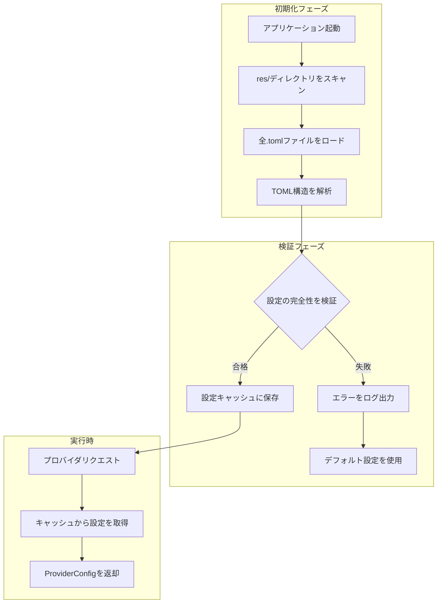
```mermaid
flowchart TB
    subgraph 初期化フェーズ
        A[アプリケーション起動] --> B[res/ディレクトリをスキャン]
        B --> C[全.tomlファイルをロード]
        C --> D[TOML構造を解析]
    end

    subgraph 検証フェーズ
        D --> E{設定の完全性を検証}
        E -->|合格| F[設定キャッシュに保存]
        E -->|失敗| G[エラーをログ出力]
        G --> H[デフォルト設定を使用]
    end

    subgraph 実行時
        F --> I[プロバイダリクエスト]
        I --> J[キャッシュから設定を取得]
        J --> K[ProviderConfigを返却]
    end
```

### 設定階層

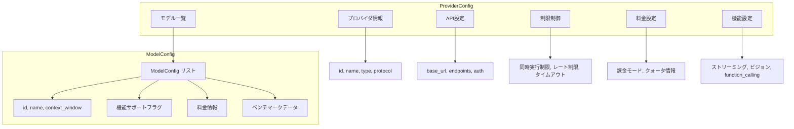
```mermaid
graph TB
    subgraph ProviderConfig
        A[プロバイダ情報]
        B[API設定]
        C[制限制御]
        D[料金設定]
        E[機能設定]
        F[モデル一覧]
    end

    A --> A1[id, name, type, protocol]
    B --> B1[base_url, endpoints, auth]
    C --> C1[同時実行制限, レート制限, タイムアウト]
    D --> D1[課金モード, クォータ情報]
    E --> E1[ストリーミング, ビジョン, function_calling]
    F --> F1[ModelConfig リスト]

    subgraph ModelConfig
        F1 --> M1[id, name, context_window]
        F1 --> M2[機能サポートフラグ]
        F1 --> M3[料金情報]
        F1 --> M4[ベンチマークデータ]
    end
```

## 設定優先度

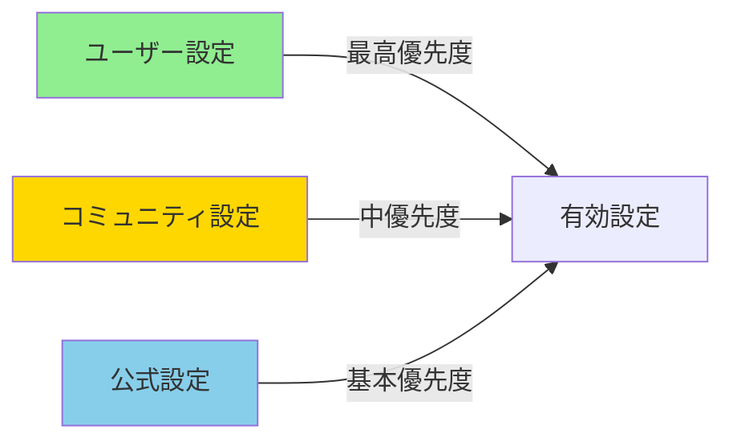
```mermaid
graph LR
    A[ユーザー設定] -->|最高優先度| D[有効設定]
    B[コミュニティ設定] -->|中優先度| D
    C[公式設定] -->|基本優先度| D

    style A fill:#90EE90
    style B fill:#FFD700
    style C fill:#87CEEB
```

### 優先度マージルール

| レイヤー | ソース | 説明 |
| --- | --- | --- |
| 1 | 公式設定 | プロバイダ公式ドキュメントデータ、基本デフォルト |
| 2 | コミュニティ設定 | コミュニティ提供の最適化設定、公式データを上書き |
| 3 | ユーザー設定 | ユーザー定義設定、最高優先度 |

## 料金モデル

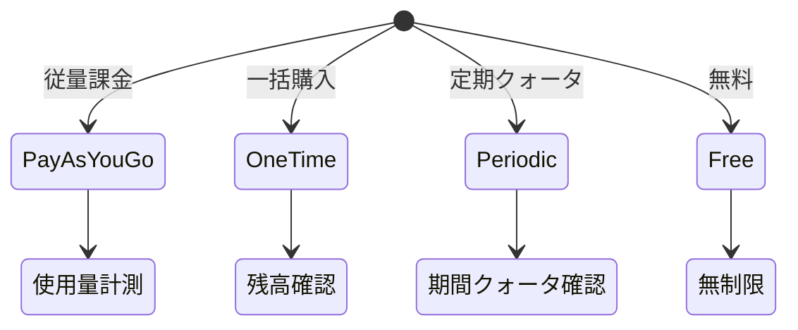
```mermaid
stateDiagram-v2
    [*] --> PayAsYouGo: 従量課金
    [*] --> OneTime: 一括購入
    [*] --> Periodic: 定期クォータ
    [*] --> Free: 無料

    PayAsYouGo --> 使用量計測
    OneTime --> 残高確認
    Periodic --> 期間クォータ確認
    Free --> 無制限
```

### 料金モデル比較

| モデル | 適用シナリオ | 特徴 |
| --- | --- | --- |
| PayAsYouGo | OpenAI, Anthropic | トークン単位課金、リアルタイム控除 |
| OneTime | プリペイドパッケージ | クォータ事前購入、枯渇まで使用 |
| Periodic | GLM中国など | 定期的クォータリセット |
| Free | Ollamaローカルモデル | コスト制限なし |

## プロバイダ型分類

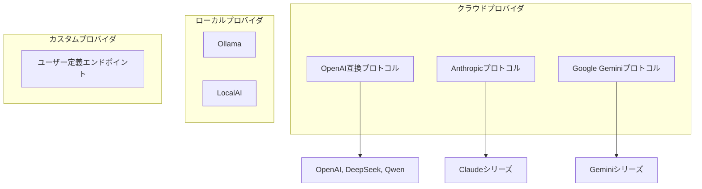
```mermaid
graph TB
    subgraph クラウドプロバイダ
        A[OpenAI互換プロトコル]
        B[Anthropicプロトコル]
        C[Google Geminiプロトコル]
    end

    subgraph ローカルプロバイダ
        D[Ollama]
        E[LocalAI]
    end

    subgraph カスタムプロバイダ
        F[ユーザー定義エンドポイント]
    end

    A --> A1[OpenAI, DeepSeek, Qwen]
    B --> B1[Claudeシリーズ]
    C --> C1[Geminiシリーズ]
```

## ホットリロード機構

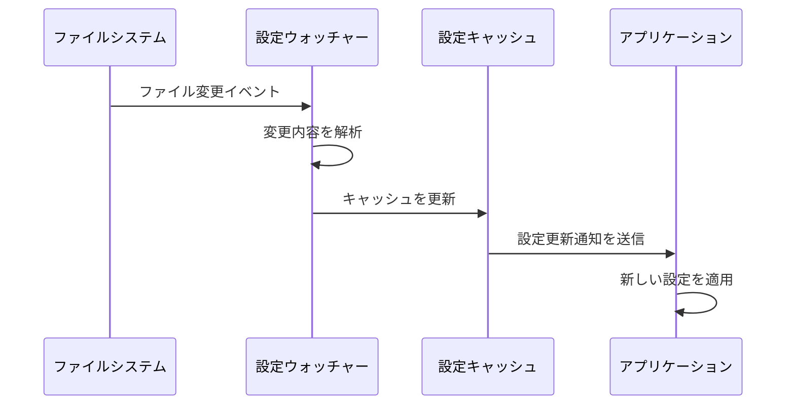
```mermaid
sequenceDiagram
    participant FS as ファイルシステム
    participant Watcher as 設定ウォッチャー
    participant Cache as 設定キャッシュ
    participant App as アプリケーション

    FS->>Watcher: ファイル変更イベント
    Watcher->>Watcher: 変更内容を解析
    Watcher->>Cache: キャッシュを更新
    Cache->>App: 設定更新通知を送信
    App->>App: 新しい設定を適用
```

## エラーハンドリング戦略

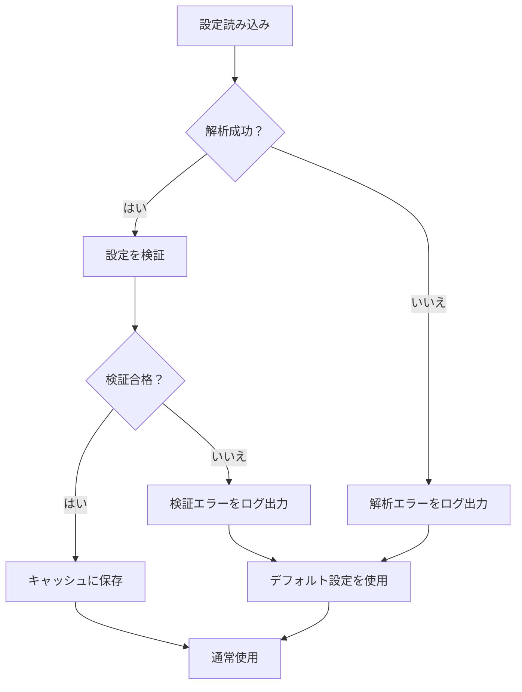
```mermaid
flowchart TB
    A[設定読み込み] --> B{解析成功？}
    B -->|はい| C[設定を検証]
    B -->|いいえ| D[解析エラーをログ出力]

    C --> E{検証合格？}
    E -->|はい| F[キャッシュに保存]
    E -->|いいえ| G[検証エラーをログ出力]

    D --> H[デフォルト設定を使用]
    G --> H

    F --> I[通常使用]
    H --> I
```

## 拡張性設計

### 新規プロバイダの追加

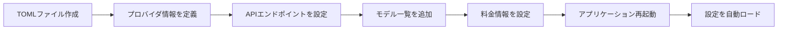
```mermaid
flowchart LR
    A[TOMLファイル作成] --> B[プロバイダ情報を定義]
    B --> C[APIエンドポイントを設定]
    C --> D[モデル一覧を追加]
    D --> E[料金情報を設定]
    E --> F[アプリケーション再起動]
    F --> G[設定を自動ロード]
```

### 設定検証ルール

| フィールド | 検証ルール | エラー処理 |
| --- | --- | --- |
| provider.id | 非空、一意 | ロード拒否、エラーログ |
| api.base_url | 有効なURL形式 | デフォルト値を使用 |
| models[].id | 非空 | 該当モデルをスキップ |
| pricing.model | 列挙値チェック | デフォルト PayAsYouGo |

## セキュリティ考慮事項

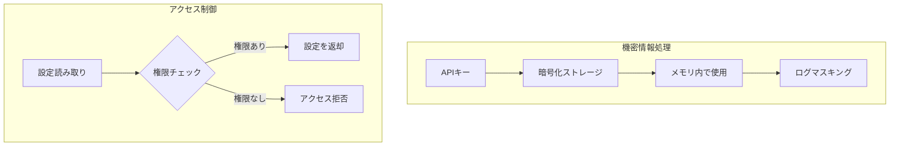
```mermaid
flowchart TB
    subgraph 機密情報処理
        A[APIキー] --> B[暗号化ストレージ]
        B --> C[メモリ内で使用]
        C --> D[ログマスキング]
    end

    subgraph アクセス制御
        E[設定読み取り] --> F{権限チェック}
        F -->|権限あり| G[設定を返却]
        F -->|権限なし| H[アクセス拒否]
    end
```

## 将来の拡張

| 機能 | 説明 | 優先度 |
| --- | --- | --- |
| 設定ホットリロード | 実行時に外部設定ファイルをロード | 高 |
| 設定検証 | 起動時に設定の完全性を検証 | 高 |
| 設定マージ | ユーザー設定がデフォルト設定を上書き | 中 |
| 設定インポート/エクスポート | 設定ファイルのインポート/エクスポート対応 | 中 |
| エージェント更新 | 公式ドキュメントから設定を自動更新 | 低 |

# プロバイダメタデータ管理設計

## 概要

プロバイダメタデータ管理システムは、公式LLMプロバイダドキュメントから設定情報を動的に取得し、設定データの自動更新と検証を可能にする。

## コア問題

現在の実装にはハードコードされた使用統計が含まれており、動的なプロバイダデータサポートが不足している。自動化されたメタデータ取得および管理機構を確立する必要がある。

## アーキテクチャ設計

### データフローアーキテクチャ

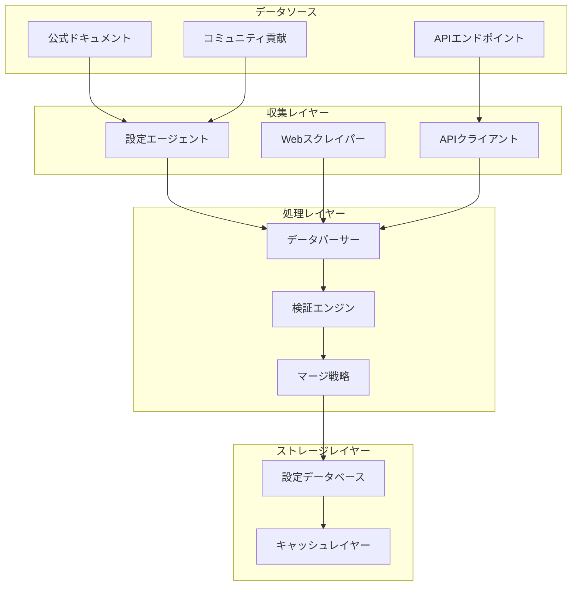
```mermaid
flowchart TB
    subgraph データソース
        A[公式ドキュメント]
        B[APIエンドポイント]
        C[コミュニティ貢献]
    end

    subgraph 収集レイヤー
        D[設定エージェント]
        E[Webスクレイパー]
        F[APIクライアント]
    end

    subgraph 処理レイヤー
        G[データパーサー]
        H[検証エンジン]
        I[マージ戦略]
    end

    subgraph ストレージレイヤー
        J[設定データベース]
        K[キャッシュレイヤー]
    end

    A --> D
    B --> F
    C --> D
    D --> G
    E --> G
    F --> G
    G --> H
    H --> I
    I --> J
    J --> K
```

### 設定優先度モデル

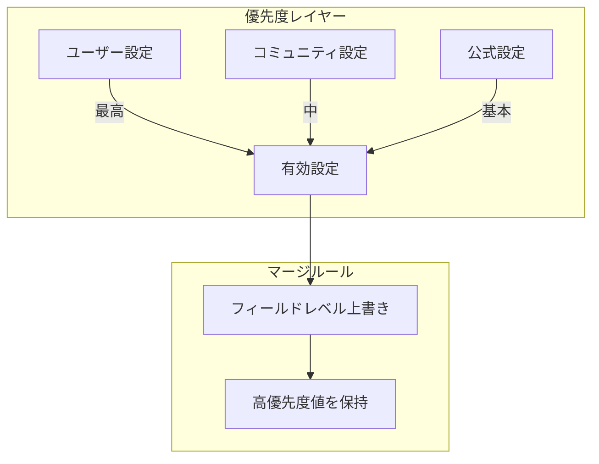
```mermaid
graph TB
    subgraph 優先度レイヤー
        A[ユーザー設定] -->|最高| D[有効設定]
        B[コミュニティ設定] -->|中| D
        C[公式設定] -->|基本| D
    end

    subgraph マージルール
        D --> E[フィールドレベル上書き]
        E --> F[高優先度値を保持]
    end
```

## メタデータ構造

### プロバイダ設定階層

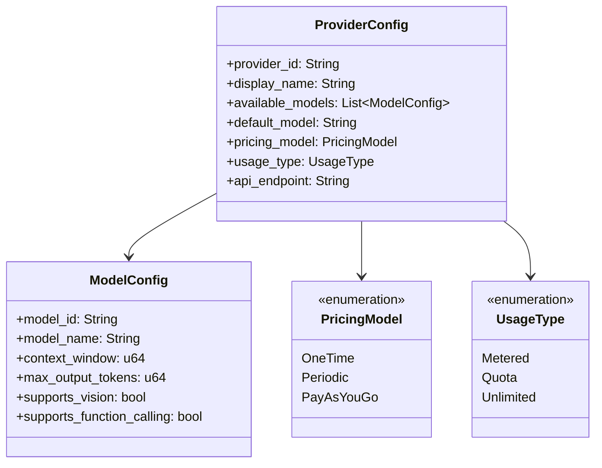
```mermaid
classDiagram
    class ProviderConfig {
        +provider_id: String
        +display_name: String
        +available_models: List~ModelConfig~
        +default_model: String
        +pricing_model: PricingModel
        +usage_type: UsageType
        +api_endpoint: String
    }

    class ModelConfig {
        +model_id: String
        +model_name: String
        +context_window: u64
        +max_output_tokens: u64
        +supports_vision: bool
        +supports_function_calling: bool
    }

    class PricingModel {
        <<enumeration>>
        OneTime
        Periodic
        PayAsYouGo
    }

    class UsageType {
        <<enumeration>>
        Metered
        Quota
        Unlimited
    }

    ProviderConfig --> ModelConfig
    ProviderConfig --> PricingModel
    ProviderConfig --> UsageType
```

### 設定ソース分類

| ソースタイプ | 説明 | 信頼性 | 更新頻度 |
| --- | --- | --- | --- |
| 公式 | プロバイダ公式ドキュメント | 高 | 自動定期 |
| コミュニティ | コミュニティ提供データ | 中 | 手動更新 |
| ユーザー上書き | ユーザーカスタマイズ | 最高 | リアルタイム |

## エージェント収集システム

### 収集プロセス

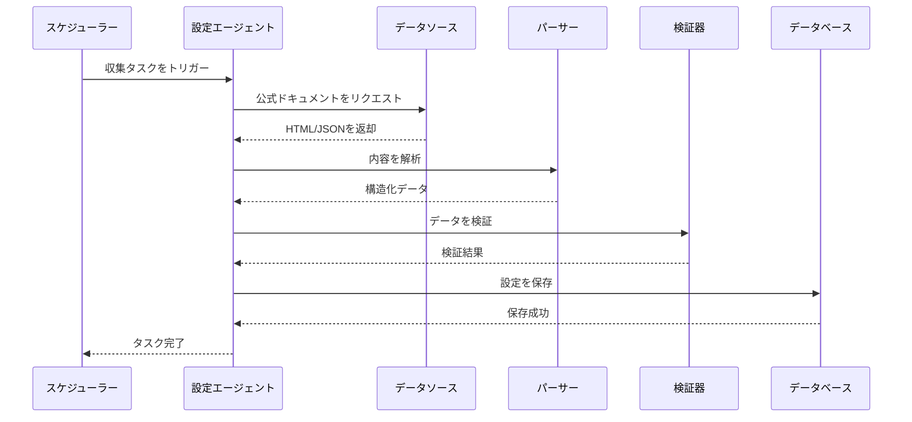
```mermaid
sequenceDiagram
    participant Scheduler as スケジューラー
    participant Agent as 設定エージェント
    participant Source as データソース
    participant Parser as パーサー
    participant Validator as 検証器
    participant DB as データベース

    Scheduler->>Agent: 収集タスクをトリガー
    Agent->>Source: 公式ドキュメントをリクエスト
    Source-->>Agent: HTML/JSONを返却
    Agent->>Parser: 内容を解析
    Parser-->>Agent: 構造化データ
    Agent->>Validator: データを検証
    Validator-->>Agent: 検証結果
    Agent->>DB: 設定を保存
    DB-->>Agent: 保存成功
    Agent-->>Scheduler: タスク完了
```

### プロバイダエージェントの責務

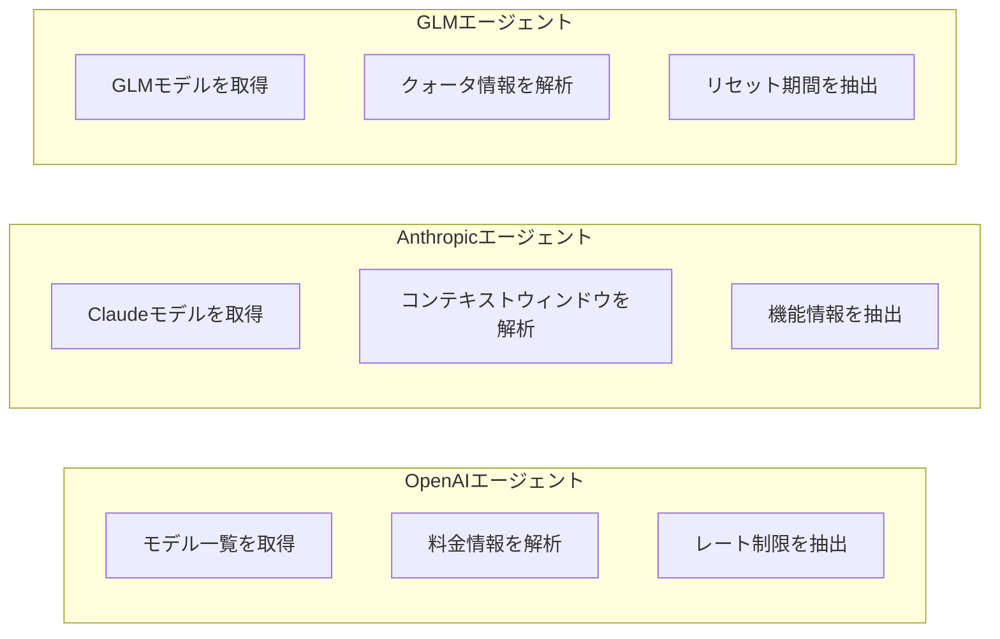
```mermaid
flowchart LR
    subgraph OpenAIエージェント
        A1[モデル一覧を取得]
        A2[料金情報を解析]
        A3[レート制限を抽出]
    end

    subgraph Anthropicエージェント
        B1[Claudeモデルを取得]
        B2[コンテキストウィンドウを解析]
        B3[機能情報を抽出]
    end

    subgraph GLMエージェント
        C1[GLMモデルを取得]
        C2[クォータ情報を解析]
        C3[リセット期間を抽出]
    end
```

## データ検証機構

### 検証プロセス

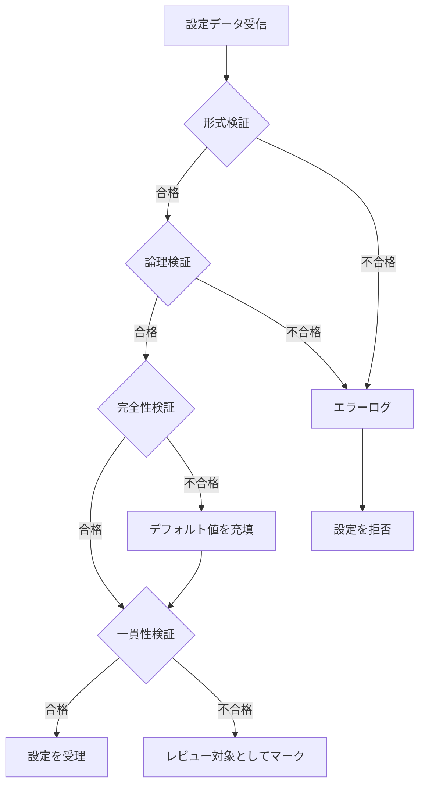
```mermaid
flowchart TB
    A[設定データ受信] --> B{形式検証}
    B -->|合格| C{論理検証}
    B -->|不合格| D[エラーログ]

    C -->|合格| E{完全性検証}
    C -->|不合格| D

    E -->|合格| F{一貫性検証}
    E -->|不合格| G[デフォルト値を充填]

    F -->|合格| H[設定を受理]
    F -->|不合格| I[レビュー対象としてマーク]

    G --> F
    D --> J[設定を拒否]
```

### 検証ルール

| 検証タイプ | チェック内容 | 失敗時処理 |
| --- | --- | --- |
| 形式検証 | データ型、フィールド形式 | 拒否してログ出力 |
| 論理検証 | 値の範囲、列挙値 | デフォルト値を使用 |
| 完全性検証 | 必須フィールドの存在 | デフォルト値を充填 |
| 一貫性検証 | クロスフィールド関係の正確性 | レビュー対象としてマーク |

## 設定マージ戦略

### フィールドレベルマージ

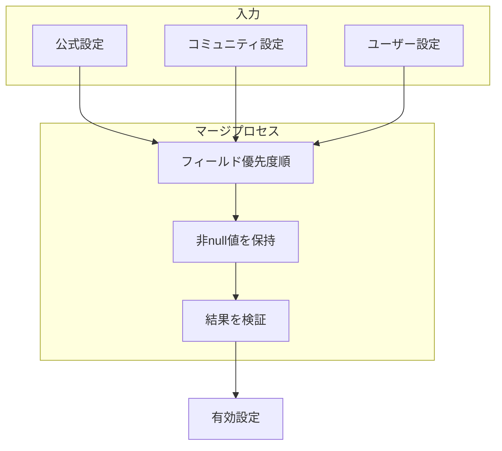
```mermaid
flowchart TB
    subgraph 入力
        A[公式設定]
        B[コミュニティ設定]
        C[ユーザー設定]
    end

    subgraph マージプロセス
        D[フィールド優先度順]
        E[非null値を保持]
        F[結果を検証]
    end

    A --> D
    B --> D
    C --> D
    D --> E
    E --> F
    F --> G[有効設定]
```

### マージ例

| フィールド | 公式値 | コミュニティ値 | ユーザー値 | 最終値 |
| --- | --- | --- | --- | --- |
| context_window | 128000 | - | 64000 | 64000 |
| max_concurrent | 100 | 50 | - | 50 |
| pricing_model | PayAsYouGo | - | - | PayAsYouGo |

## ユーザー設定インターフェース

### 設定ファイル構造

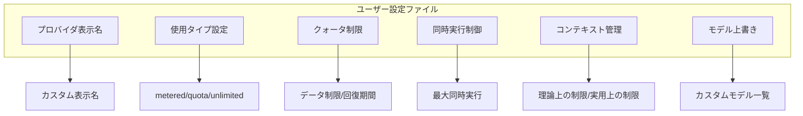
```mermaid
graph TB
    subgraph ユーザー設定ファイル
        A[プロバイダ表示名]
        B[使用タイプ設定]
        C[クォータ制限]
        D[同時実行制御]
        E[コンテキスト管理]
        F[モデル上書き]
    end

    A --> A1[カスタム表示名]
    B --> B1[metered/quota/unlimited]
    C --> C1[データ制限/回復期間]
    D --> D1[最大同時実行]
    E --> E1[理論上の制限/実用上の制限]
    F --> F1[カスタムモデル一覧]
```

## 定期更新機構

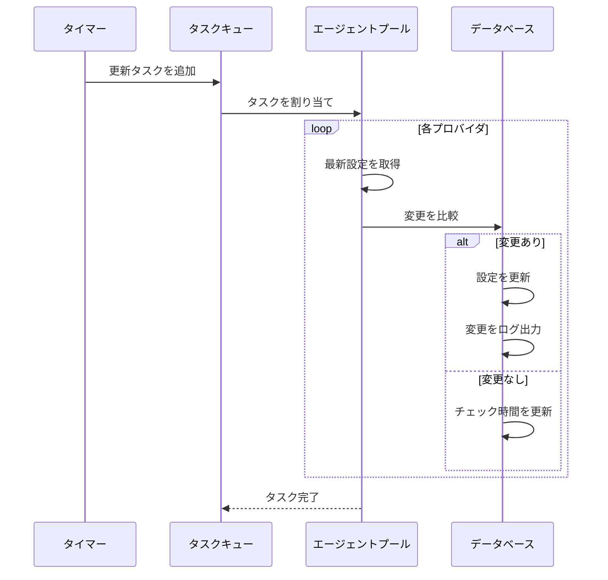
```mermaid
sequenceDiagram
    participant Timer as タイマー
    participant Queue as タスクキュー
    participant Agent as エージェントプール
    participant DB as データベース

    Timer->>Queue: 更新タスクを追加
    Queue->>Agent: タスクを割り当て

    loop 各プロバイダ
        Agent->>Agent: 最新設定を取得
        Agent->>DB: 変更を比較
        alt 変更あり
            DB->>DB: 設定を更新
            DB->>DB: 変更をログ出力
        else 変更なし
            DB->>DB: チェック時間を更新
        end
    end

    Agent-->>Queue: タスク完了
```

## エラーハンドリング

### 収集失敗時の処理

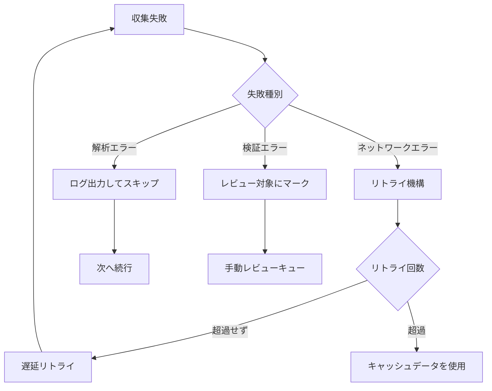
```mermaid
flowchart TB
    A[収集失敗] --> B{失敗種別}
    B -->|ネットワークエラー| C[リトライ機構]
    B -->|解析エラー| D[ログ出力してスキップ]
    B -->|検証エラー| E[レビュー対象にマーク]

    C --> F{リトライ回数}
    F -->|超過せず| G[遅延リトライ]
    F -->|超過| H[キャッシュデータを使用]

    G --> A
    D --> I[次へ続行]
    E --> J[手動レビューキュー]
```

## 拡張性設計

### 新規プロバイダの追加

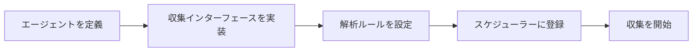
```mermaid
flowchart LR
    A[エージェントを定義] --> B[収集インターフェースを実装]
    B --> C[解析ルールを設定]
    C --> D[スケジューラーに登録]
    D --> E[収集を開始]
```

### 拡張ポイント

| 拡張タイプ | 説明 | 実装 |
| --- | --- | --- |
| 新規プロバイダ | 新しい設定ソースを追加 | プロバイダエージェントインターフェースを実装 |
| 新規フィールド | 設定構造を拡張 | データモデルと検証ルールを更新 |
| 新規検証ルール | 検証ロジックを追加 | バリデータ実装を追加 |

## レイヤー3エージェント実装

### ProviderScratchエージェント

`ProviderScratch` は最初のレイヤー3公式エージェントであり、スクレイピング機能の実装例として機能する。

```mermaid
flowchart TB
    subgraph ProviderScratchエージェント
        A[エージェントエントリ] --> B{実行モード}
        B -->|TUIモード| C[対話型インターフェース]
        B -->|CIモード| D[自動実行]

        C --> E[プロバイダを選択]
        D --> F[環境変数を読み取り]

        E --> G[スキルを呼び出し]
        F --> G

        G --> H[ドキュメントをスクレイピング]
        H --> I[データを解析]
        I --> J[TOMLを生成]

        J --> K{コミット確認？}
        K -->|はい| L[ワークスペースに書き込み]
        K -->|いいえ| M[変更を破棄]

        L --> N[ユーザーコミットを要求]
    end
```

### スキルアーキテクチャ

各プロバイダは独立したスキルに対応する：

```mermaid
graph LR
    subgraph スキル
        A[openai]
        B[anthropic]
        C[glm]
        D[deepseek]
        E[qwen]
        F[gemini]
    end

    subgraph 共有コンポーネント
        G[ドキュメントスクレイパー]
        H[データパーサー]
        I[TOMLジェネレーター]
    end

    A --> G
    B --> G
    C --> G
    D --> G
    E --> G
    F --> G

    G --> H
    H --> I
```

### ディレクトリ構造

```mermaid
flowchart LR
    Root[".amphoreus/provider_scratch/"]
    AT["agent.toml"]
    OV["overview/"]
    SK["skills/"]
    Root --> AT
    Root --> OV
    Root --> SK
    OV --> ZH["zhs.md"]
    SK --> OA["openai/"]
    SK --> AN["anthropic/"]
    SK --> GL["glm/"]
    SK --> DS["deepseek/"]
    SK --> QW["qwen/"]
    SK --> GE["gemini/"]
    OA --> OAP["prompt.md"]
    AN --> ANP["prompt.md"]
    GL --> GLP["prompt.md"]
    DS --> DSP["prompt.md"]
    QW --> QWP["prompt.md"]
    GE --> GEP["prompt.md"]
```

### CI自動化

```mermaid
flowchart LR
    A[スケジュールトリガー] --> B[コードをチェックアウト]
    B --> C[ProviderScratchを実行]
    C --> D{変更を検出}
    D -->|変更あり| E[ブランチを作成]
    E --> F[変更をコミット]
    F --> G[PRを作成]
    G --> H[レビュー待ち]
    D -->|変更なし| I[完了]
```

### 環境変数

| 変数名 | 説明 |
| --- | --- |
| `AMPHOREUS_PROVIDER_SCRATCH_PROVIDERS` | スクレイピング対象のプロバイダ一覧 |
| `AMPHOREUS_PROVIDER_SCRATCH_OUTPUT_DIR` | 出力ディレクトリパス |
| `AMPHOREUS_PROVIDER_SCRATCH_GIT_BRANCH` | 対象Gitブランチ |
| `AMPHOREUS_PROVIDER_SCRATCH_DRY_RUN` | ドライランのみ |

## 将来計画

| 機能 | 説明 | 優先度 |
| --- | --- | --- |
| 設定バージョン管理 | 設定変更履歴を追跡 | 高 |
| 変更通知 | 設定更新時にユーザーに通知 | 中 |
| 設定ロールバック | 履歴バージョンへのロールバック対応 | 中 |
| スマート推奨 | 利用パターンに基づく設定推奨 | 低 |
| GitHub巡回エージェント | 設定更新のPRを自動作成 | 高 |
